# RGB 和灰度图像如何在 NumPy 数组中表示

> 原文：<https://towardsdatascience.com/exploring-the-mnist-digits-dataset-7ff62631766a?source=collection_archive---------4----------------------->

## 让我们从图像基础开始

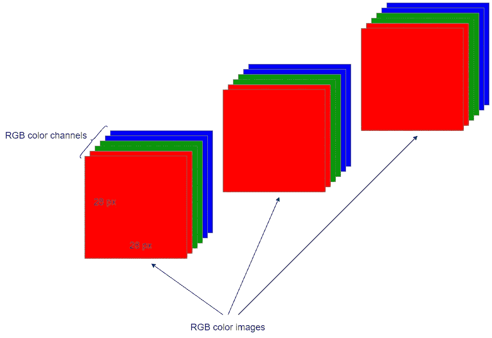

(图片由作者提供，用 draw.io 制作)

今天，你将学习机器学习和深度学习中一些最重要和最基本的主题。我保证今天的内容将提供一些对开始学习深度学习(机器学习的一个子集)至关重要的基本概念。

首先，我们将开始描述图像基础知识，如像素、像素值、图像属性以及 RGB 和灰度图像之间的差异。然后我们将讨论如何在 NumPy 数组中表示这些图像。

作为奖励部分，我们将探索包含数千幅手写数字灰度图像的 [MNIST 数字数据集](http://yann.lecun.com/exdb/mnist/)(见底部引文)。这将有助于你进一步澄清你在图像的数字表示中学到的东西。

因此，今天的内容将分为两个主要部分:

*   图像基础——关键组件和表示
*   近距离观察 MNIST 数据集(可选)

我们从图像的基础开始。

# 图像基础

## 像素

图像由微小的方形元素组成，这些元素被称为*像素*。即使是一个小图像也可能包含数百万个不同颜色的像素。

## 图像属性

每个图像都有三个主要属性:

*   **尺寸** —这是一幅图像的高度和宽度。它可以用厘米、英寸甚至像素来表示。
*   **色彩空间** —例如 **RGB** 和 **HSV** 色彩空间。
*   **通道** —这是色彩空间的一个属性。例如，RGB 颜色空间有三种类型的颜色或属性，称为***R****ed****G****reen*和***B****lue*(因此得名 RGB)。

## RGB 图像与灰度图像

区分 RGB 图像和灰度图像非常重要。RGB 图像有三个颜色通道:红色通道、绿色通道和蓝色通道。但是，灰度图像只有一个通道。

## 像素值

图像的颜色由其像素值表示。一个像素只能有一种颜色，但可以合并以创建多种颜色。

在只有一个通道的灰度图像中，像素值只有一个从 0 到 255(包括 0 和 255)的数字。像素值 0 表示黑色，像素值 255 表示白色。灰度图像中的像素值可以表示如下:

```
[40]
```

由于值 40 接近 0 而不是 255，所以像素的颜色也接近黑色！

在有三个颜色通道的 RGB 图像中，像素值有三个数字，每个数字的范围从 0 到 255(包括 0 和 255)。例如，红色通道中像素的数字 0 表示该像素中没有红色，而数字 255 表示该像素中有 100%的红色。这种解释也适用于其他两个通道中的像素。RGB 图像中的像素值可以表示如下:

```
[255, 255, 0]
```

这个像素值代表黄色。看下图。

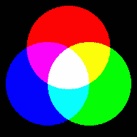

图片来自 [Pixabay](https://pixabay.com/?utm_source=link-attribution&utm_medium=referral&utm_campaign=image&utm_content=154782) 的

黄色由绿色和红色组成。不涉及蓝色。这就是为什么像素值`[255, 255, 0]`代表黄色像素——红色 100% (255)，绿色 100% (255)，没有蓝色(0)！

# 深度学习中的图像表示

在机器学习和深度学习中，图像被表示为 NumPy 数组。在深度学习的上下文中，那些 NumPy 数组在技术上叫做 ***张量*** ( [学习创建类似 NumPy 数组的张量](https://medium.com/geekculture/lets-create-tensors-like-numpy-arrays-90a4cf32144))。

当在 NumPy 数组中表示图像时，大多数人可能会感到困惑，因为涉及到多个维度。基本上，维度的数量由以下因素决定。

*   **图像尺寸** —总是需要两个尺寸来表示图像的高度和宽度。
*   **颜色通道**
*   **图像数量**

## 作为 NumPy 阵列的灰度图像表示

一个*单个*灰度图像可以用一个二维(2D)数字阵列或一个张量来表示。因为在灰度图像中只有一个通道，所以我们不需要额外的维度来表示颜色通道。这两个维度代表图像的高度和宽度。

一批*3 幅灰度图像可以使用三维(3D)数字阵列或张量来表示。这里，我们需要一个额外的维度来表示图像的数量。*

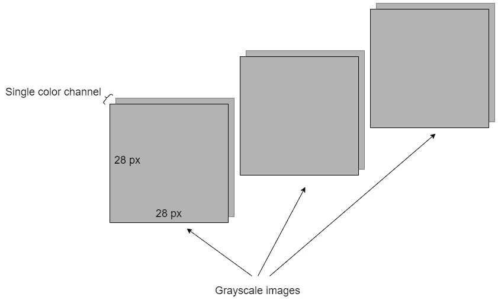

(图片由作者提供，用 draw.io 制作)

上面三幅灰度图像的*批次*的形状可以表示为:

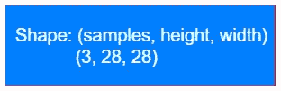

(图片由作者提供，用 draw.io 制作)

## 作为 NumPy 数组的 RGB 图像表示

一个*单个* RGB 图像可以使用三维(3D)数字阵列或张量来表示。由于 RGB 图像中有三个颜色通道，我们需要一个额外的颜色通道维度。

三幅 RGB 图像的*批次*可以使用四维(4D) NumPy 数组或张量来表示。这里，我们需要一个额外的维度来表示图像的数量。


(图片由作者提供，用 draw.io 制作)

上述 3 幅 RGB 图像的*批次*的形状可以用两种不同的方式表示:

*   **通道-最后:**这将把*颜色通道*轴放在最后。这是 TensorFlow (Keras)和 OpenCV 中的标准。
*   **通道优先:**将*颜色通道*轴放置在*采样*轴之后。

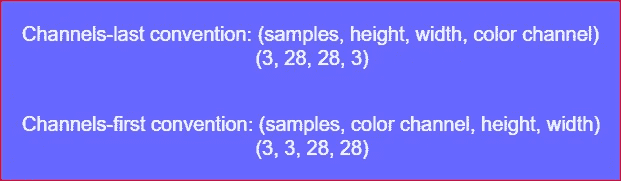

(图片由作者提供，用 draw.io 制作)

> **要点:**通道-最后符号是将 RGB 图像表示为 NumPy 数组的标准符号。

图像基础及其数值表示的足够理论。让我们开始探索 MNIST 数字数据集。

# 近距离观察 MNIST 数据集(可选)

由 [NIST](https://www.nist.gov/) (美国国家标准与技术研究院)构建的 [MNIST 数字数据集](http://yann.lecun.com/exdb/mnist/)(见底部引文)，是学习深度学习的经典数据集，也是通用机器学习的经典数据集。它已经被机器学习和深度学习社区过度使用了。然而，仍然值得探索和使用这个数据集，特别是如果你打算第一次接触深度学习的话。

MNIST 数据集包含 10 个类别(0 到 9)下的 70，000 幅手写数字的灰度图像。我们将使用两个流行的 API 来加载数据集: **Keras API** 和 **Scikit-learn API** 。两者都提供了用于轻松加载 MNIST 数据集的实用函数。我们还将讨论 MNIST 数据集的两个 API 之间的差异。

## 使用 Keras API 加载 MNIST 数据集

```
from tensorflow.keras.datasets import mnist(train_images, train_labels), (test_images, test_labels) = mnist.load_data()
```

**获取数据的形状**

```
print("Train images shape:", train_images.shape)
print("Train labels shape:", train_labels.shape)
print("Test images shape: ", test_images.shape)
print("Test labels shape: ", test_labels.shape)
```

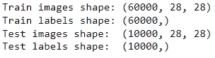

(图片由作者提供)

成批的训练和测试图像是三维的。这是因为 MNIST 数据集包含灰度图像，而不是 RGB 图像。(60000，28，28)表示训练图像集包含 60，000 张 28 x 28 像素的图像。换句话说，它是一个包含 60，000 个 28 x 28 整数值的矩阵的数组。

训练和测试标签是一维的。它们包含 10 个类别(0 到 9)的相应标签。

```
import numpy as npnp.unique(test_labels)
#OR
np.unique(train_labels)
```

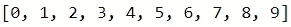

(图片由作者提供)

**获取数组类型**

```
print("Train images type:", type(train_images))
print("Train labels type:", type(train_labels))
print("Test images type: ", type(test_images))
print("Test labels type: ", type(test_labels))
```

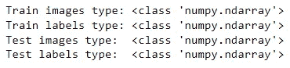

(图片由作者提供)

都是 NumPy 数组。

**获取数据类型**

```
print("Train images data type:", train_images.dtype)
print("Train labels data type:", train_labels.dtype)
print("Test images data type: ", test_images.dtype)
print("Test labels data type: ", test_labels.dtype)
```

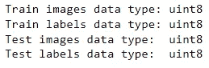

(图片由作者提供)

像素值的数据类型为**“uint 8”**，表示 8 位整数。

**从列车图像集中获取单张图像**

可以使用以下符号访问训练集中的单个图像:

```
train_images[i]
```

该索引从 0 开始。为了得到第 10 幅图像，我们应该使用 i=9。

```
train_images[9]
```

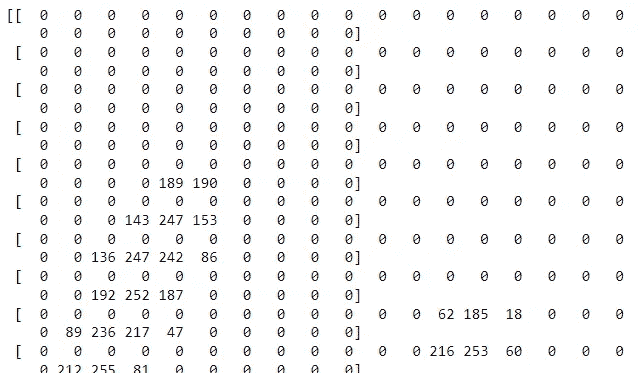

数组的一部分(图片由作者提供)

```
train_images[9].shape
```

这是一个 28 x 28 的灰度图像矩阵。

**可视化单幅图像**

我们将可视化训练数据集的第 10 幅图像。

```
import matplotlib.pyplot as plttenth_digit = train_images[9]
plt.imshow(tenth_digit, cmap="binary")
plt.axis("off")
```

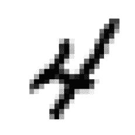

(图片由作者提供)

训练集的第 10 个图像代表数字 4。通过看其对应的标签来看是否正确。

```
train_labels[9]
```

这也返回 4。因此，图像与其标签是对应的。

## 使用 Scikit-learn API 加载 MNIST 数据集

```
from sklearn.datasets import fetch_openmlmnist = fetch_openml('mnist_784', version=1)X, y = mnist['data'], mnist['target']
```

**获取数据的形状**

```
print("X shape:", X.shape)
print("y shape:", y.shape)
```

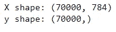

(图片由作者提供)

单个图像的像素值排列在大小为 784 的一维向量中，该向量等于 28×28。这意味着我们仍然可以像在 Keras API 中一样对矢量进行整形，以获得图像所需的格式。

**获取数组类型**

```
print("X type:", type(X))
print("y type:", type(y))
```

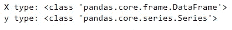

(图片由作者提供)

**获取数据类型**

```
print("X data type:", X.dtypes)
```

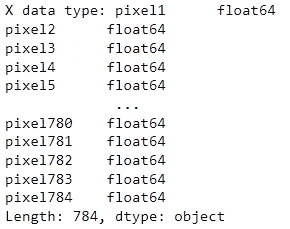

(图片由作者提供)

```
print("y data type:", y.dtypes)
```

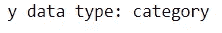

(图片由作者提供)

## MNIST 数据集的两个 API 之间的差异

*   **训练和测试集:**在 Kears 中，MNIST 数据集可以加载训练和测试集。但是在 Scikit-learn 中，我们需要手动创建训练和测试部件。
*   **Shape:** 在 Keras 中，单个 MNIST 数字由大小为 28 x 28 的二维 NumPy 数组表示。在 Scikit-learn 中，单个 MNIST 数字由大小为 784 的一维 NumPy 数组表示。我们需要明确地将数组重新整形为 28 x 28 的数组。
*   **数组类型:**在 Kears 中，图像和标签由 NumPy 数组重复。在 Scikit-learn 中，图像由熊猫数据帧重复，而标签由熊猫系列表示。
*   **数据类型:**在 Kears 中，像素值和标签的数据类型为**“uint 8”**，表示 8 位整数。在 Scikit-learn 中，像素值的数据类型为 **"float64"** ，标签的数据类型为" category "，在用于以下算法之前，应将其转换为 **"uint8"** 。

```
y = y.astype(np.uint8)
```

> **重要提示:**如果你使用 MNIST 数据集进行深度学习，我建议你使用 Keras API 加载数据。

## 阅读下一篇(强烈推荐)

学习创建类似 NumPy 数组的张量。

[](https://medium.com/geekculture/lets-create-tensors-like-numpy-arrays-90a4cf32144) [## 让我们创建类似 NumPy 数组的张量

### 张量只不过是多维数组的矩阵表示

medium.com](https://medium.com/geekculture/lets-create-tensors-like-numpy-arrays-90a4cf32144) 

学习 NumPy 基础知识和数组创建。

[](/numpy-for-data-science-part-1-21e2c5ddbbd3) [## 数据科学的 NumPy:第 1 部分

### NumPy 基础和数组创建

towardsdatascience.com](/numpy-for-data-science-part-1-21e2c5ddbbd3) 

像专家一样分割 NumPy 数组。

[](https://rukshanpramoditha.medium.com/numpy-for-data-science-part-2-7399ffc605e5) [## NumPy 数组索引和切片的完整分步指南

### 数据科学的数字——第二部分

rukshanpramoditha.medium.com](https://rukshanpramoditha.medium.com/numpy-for-data-science-part-2-7399ffc605e5) 

## 阅读下一页(可选)

使用 PCA 压缩图像！

[](/image-compression-using-principal-component-analysis-pca-253f26740a9f) [## 使用主成分分析(PCA)的图像压缩

### 行动中的维度缩减

towardsdatascience.com](/image-compression-using-principal-component-analysis-pca-253f26740a9f) 

今天的帖子到此结束。

如果您有任何反馈，请告诉我。

同时，你可以 [**注册成为会员**](https://rukshanpramoditha.medium.com/membership) 来获得我写的每一个故事，我会收到你的一部分会员费。

非常感谢你一直以来的支持！下一个故事再见。祝大家学习愉快！

**MNIST 数字数据集引用:**

邓，2012 年。用于机器学习研究的手写数字图像 mnist 数据库。 **IEEE 信号处理杂志**，29(6)，第 141–142 页。

**MNIST 数字数据集来源:**

[http://yann.lecun.com/exdb/mnist/](http://yann.lecun.com/exdb/mnist/)

**MNIST 数字数据集许可证:**

***Yann le Cun***(NYU 库朗研究所)和***Corinna Cortes***(纽约谷歌实验室)持有 MNIST 数据集的版权，该数据集根据[知识共享署名-同样分享 3.0 许可证](https://creativecommons.org/licenses/by-sa/3.0/)的条款提供。

[鲁克山普拉莫迪塔](https://medium.com/u/f90a3bb1d400?source=post_page-----7ff62631766a--------------------------------)
**2021–12–04**