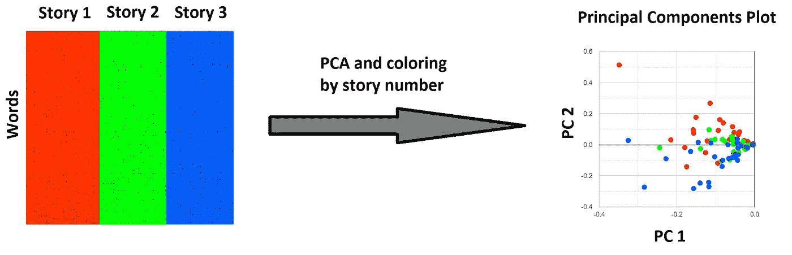
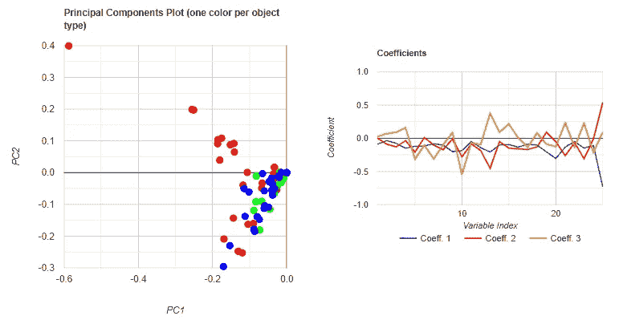

# 通过单词袋的 2D 投影探索 YouTube 视频的脚本

> 原文：<https://towardsdatascience.com/exploring-the-script-of-a-youtube-video-through-2d-projections-of-its-bags-of-words-6502bce920d8?source=collection_archive---------42----------------------->

我在本文中探索的主要管道。作者 Luciano Abriata 图。

## 视频脚本的自然语言处理

## 对从脚本中计算出的单词包应用 PCA，以在 2D 视图上传播视频信息。

最近，我开始玩 YouTube 视频的脚本，这些脚本由创作者随视频一起上传，或者由网站通过语音识别系统自动转录。目前，我正在寻找以图形方式显示视频内容的方法，这种方式允许我快速浏览其内容，而不必观看全部内容。从长远来看，我的目标是建立一个完整的“视频脚本浏览器”,你可以在线使用它来快速浏览视频的不同部分——请继续关注，因为这将是一个有趣的项目，而且可能也很有用！

目前，我已经取得了一些有趣的进展，我将在这里分享。这都是手动步骤，所以目前没有代码。简单地说，在这里我向你展示(1)如何获得 YouTube 视频的脚本，(2)通过删除停用词、符号等来清理句子的内容。(3)重新格式化数据，使句子的大小适合分析，(4)将句子转换成数字，以及(5)最后对这些数字应用 PCA，以显示结果。这是一个非常简单的方法，但结果至少在一个 50 分钟长的视频脚本上是有意义的，该视频呈现了关于一个相关主题的 3 个不同的故事。

我希望这篇文章将教会你一些基本的东西，并作为我进行更高级分析和我自己未来的视频脚本浏览工具的垫脚石。

# 1.检索 YouTube 视频的脚本

并非所有的 YouTube 视频都有可用的脚本。如果是这样，当你点击视频右下角的三个点时，你会看到“打开记录”:

如何检索 YouTube 视频的脚本(如果它可用的话)(这是指内容创建者上传它或系统可以自动转录它的时候)。作者 Luciano Abriata 图。

您可以选择所有的脚本文本，并将其粘贴到您最喜爱的程序。当你粘贴文本的时候，你会看到这导致了一个时间索引和文本的交替行的单列，并且有相当多的垃圾在那里。因此，你当然需要进行一些清理。

注意:有几种编程方法可以获得 YouTube 视频的脚本，但我发现没有一种方法能在所有视频上一致地工作。

# 2.通过删除停用词、符号等清理脚本内容。

你可以看到剧本被剥离成非常小的“句子”。在我分析的视频中(不是上图中显示的那个)，我得到了 2032 行，这实际上意味着 1016 行原始文本。这是来自我国一个常规电视节目的 50 龙敏视频。

很多句子其实根本没有任何内容，只是表示视频的一段话是“[音乐]”之类的标签。我删除了这些行以及所有的符号、数字和 3 个或更少字符的单词，它们主要是自动脚本生成过程中的连接和噪声，内容不多。

# 3.重新格式化一个脚本，以获得大小适合分析的句子

至此，我从脚本中提取了 996 行文本。你可以看到每一行都很小，包含 1 到 10 个单词。(我怀疑真正的限制是由字符数给出的，因为系统希望确保整个文本适合屏幕，但沉默或音乐的间隙也会产生较短的句子)。

事实上，这些原始文本行太短，无法进行分析。因此，我重新排列了我的 996 行，将每 12 行合并成一个句子。这意味着我现在有 83 行，每行包含 30 到 40 个单词。

这 83 行涉及 847 个单词(记得我已经清理了所有的停用词、短词、符号、数字等。).其中 75%在整袋单词中只出现一次，15%出现一次，4%出现三次，6%出现在 4 到 11 次之间。

# 4.将句子转换成数字

在这一点上，我从文字转移到数字。为此，我收集了这些单词，并计算它们在 83 个句子中出现的次数。这意味着我得到了每个句子的[袋单词](https://en.wikipedia.org/wiki/Bag-of-words_model)。在接下来的内容中，我坚持只包含那些出现 2 次或更多次的单词，这意味着 847 个单词的 25%(即 214 个单词)。

当然，大多数单词不会出现在任何一个句子中；然而，我准备单词和句子的方式暗示了每个单词将在至少一个句子中至少出现一次。因此，我得到了一个看起来由零支配的矩阵，但实际上在其所有行和列中至少有一个大于 0 的数。

过滤了总数为 2 或更多的单词，有 83 个句子，此时我得到了一个 214 行(单词)和 83 列(句子)的矩阵。下面是该矩阵的表示，其中所有 0 都被删除，任何大于 0 的数字都被视为黑点:

每个句子(列)中每个单词(行，仅包括总计数为 2 或更多的单词)的计数矩阵的非零元素。作者 Luciano Abriata 图。

你可以看到点的密度随着你的下降而增加。这是因为行(词)是按总出现次数递增排序的。

现在我们有了数据的数字表示(是的，我知道这很简单，肯定有很多问题，但这只是一个开始)，我们可以开始处理它的有趣部分了。

# 5.对数据应用 PCA 并解释结果

## **第一次 PCA 尝试**

对上面的矩阵应用简单的 PCA 过程已经给出了一些有意义的结果。为了有助于理解，我利用了这个事实，即视频呈现了关于一个共同主题的 3 个不同的故事:这 3 个故事都是关于绘画的，但每个故事都专注于不同的画家，他们分别接受了采访。在下一张图中，您可以看到上面准备的输入矩阵，但它是按故事编号着色的，然后是 PCA 图，其中每个点(句子)都是根据从中提取的故事的颜色着色的。

左图:与上图相同的矩阵，但是用类型(故事)给物体(句子)着色。右图:PCA 过程的结果，用与每个点所属的故事相对应的颜色给每个点着色。我[用我](https://lucianoabriata.altervista.org/jsinscience/pca/pca3.html)[在这篇 TDS 文章](/websites-for-statistics-and-data-analysis-on-every-device-ebf92bec3e53#f4e8)中解释的在线工具运行了 PCA。作者 Luciano Abriata 图。

你可以看到故事 1 和故事 3 是如何分开的，尤其是在 PC2 部分。相反，故事 2 大致处于中间位置。

## **玩不同的 PCA 运行**

选择频率较高或较低的单词有什么影响？在我的测试中，只考虑在整个文本中出现两次的单词的 PCA 不会产生任何清晰的数据分布。同时，仅对总共出现 5 次或更多次的单词(26 个单词)运行 PCA 产生红点与绿+蓝点的更好的分离(故事 1 对故事 2 + 3):

根据矩阵计算出的主要成分图，只包含故事中出现 5 次或更多次的单词的数据。我[用我](https://lucianoabriata.altervista.org/jsinscience/pca/pca3.html)[在这篇 TDS 文章](/websites-for-statistics-and-data-analysis-on-every-device-ebf92bec3e53#f4e8)中解释的这个在线工具运行了 PCA。作者 Luciano Abriata 图。

最有趣的是，负载图解释了在 PC 图中，哪些词在点的分离中的权重更大:

沿着主成分 1、2 和 3 的 26 个单词中的每一个的系数(“负载”)。我[用我](https://lucianoabriata.altervista.org/jsinscience/pca/pca3.html)[在这篇 TDS 文章](/websites-for-statistics-and-data-analysis-on-every-device-ebf92bec3e53#f4e8)中解释的这个在线工具运行了 PCA。作者 Luciano Abriata 图

在这样的图中，每个主成分(这里显示了前三个)的每个输入变量(这里是单词)有一个数字，正值和负值都很重要。最后一个变量中的正负峰值对应于单词“hotel ”,该单词总共出现了 11 次，但都出现在故事 1 中。通过观看视频，人们可以理解，整个故事 1 围绕着目前在酒店中展出的艺术品，采访本身就发生在酒店中，甚至涵盖了酒店是如何从废墟中再生的。

位置 6 处的负峰值对应于单词“黄色”。这个词一共被提到了 5 次，都是在故事 1 的一个句子里，讲的是故事拍摄时秋天的颜色。对一个句子如此强烈的敏感可能会被软化。特别是，这个故事并没有特别围绕秋天和它的颜色。

去掉“黄”字提高了一点传播范围，仍然以“酒店”为主:

与上面的分析相同，但省略了“黄色”一词。我[用我](https://lucianoabriata.altervista.org/jsinscience/pca/pca3.html)[在这篇 TDS 文章](/websites-for-statistics-and-data-analysis-on-every-device-ebf92bec3e53#f4e8)中解释的在线工具运行了 PCA。作者 Luciano Abriata 图

最后，删除“hotel”以将 PCA 过程的焦点转移到其他单词，这导致句子的传播减少，并且强调单词“look”、“painting”和“art”:

与上面的分析相同，但省略了“酒店”一词。我[用我](https://lucianoabriata.altervista.org/jsinscience/pca/pca3.html)[在这篇 TDS 文章](/websites-for-statistics-and-data-analysis-on-every-device-ebf92bec3e53#f4e8)中解释的这个在线工具运行了 PCA。作者 Luciano Abriata 图

# 结论

这个过程可能不是最好的，但是非常简单，而且它确实有传播剧本内容的能力，对只在一个故事中非常频繁出现的词特别敏感。如果做成一个交互式的 web 应用程序，用户可以动态地看到当单词被删除或包含时更新的结果，并且当他悬停在数据点上时可能会看到完整的句子，我认为这可能是一个非常强大的工具。

**你怎么看？你对一个用来帮助检查视频脚本(或任何文本)内容的工具有什么期望？**

所有的 PCA 运行都是使用我在本文中描述的工具进行的:

</websites-for-statistics-and-data-analysis-on-every-device-ebf92bec3e53>  

我是一个自然、科学、技术、编程和 DIY 爱好者。生物技术专家和化学家，在潮湿的实验室和电脑前。我写我广泛兴趣范围内的一切。查看我的 [*列表*](https://lucianosphere.medium.com/lists) *了解更多故事。* [***成为中等会员***](https://lucianosphere.medium.com/membership) *访问其所有故事和* [***订阅获取我的新故事***](https://lucianosphere.medium.com/subscribe) ***通过电子邮件*** *(我为其获得小额收入的平台的原始附属链接，无需向您支付特殊费用)。* [***通过各种方式在这里捐赠***](https://lucianoabriata.altervista.org/office/donations.html)**。* [*这里联系我*](https://lucianoabriata.altervista.org/office/contact.html) *。**

**到* ***咨询关于小工作*** *(关于编程、biotech+bio info 项目评估、科学推广+交流、分子数据分析与设计、分子图形、摄影、分子网络教程、科学教学与辅导等。)查看我的* [***服务页面这里***](https://lucianoabriata.altervista.org/services/index.html) *。**