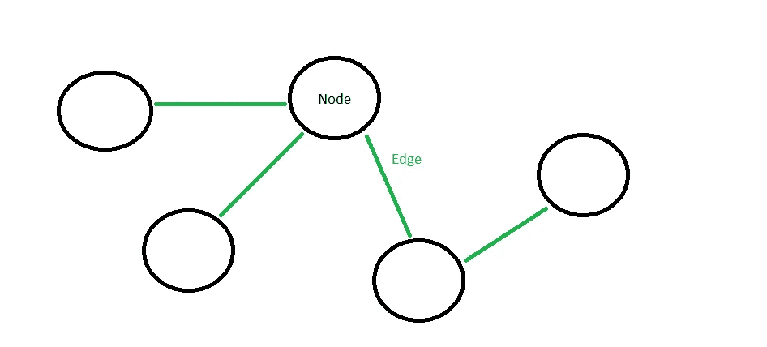
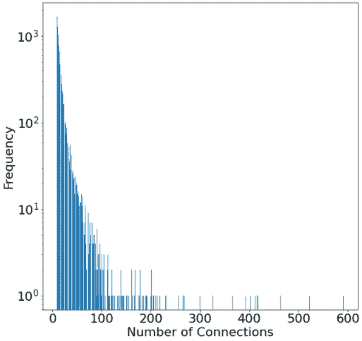
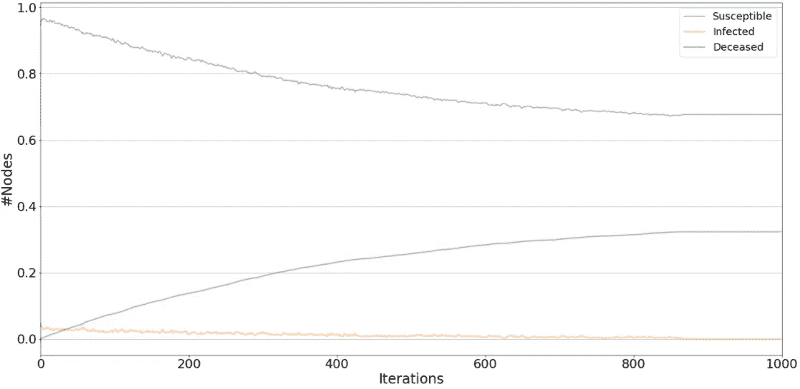
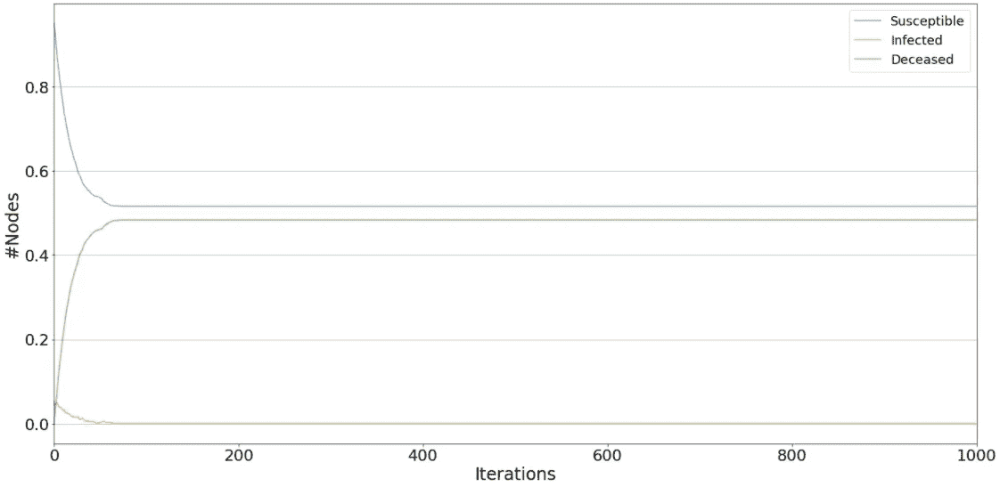
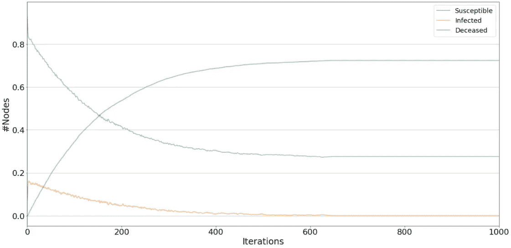
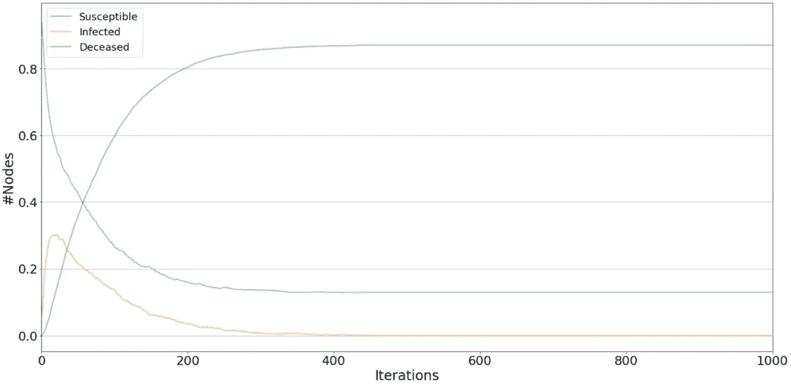
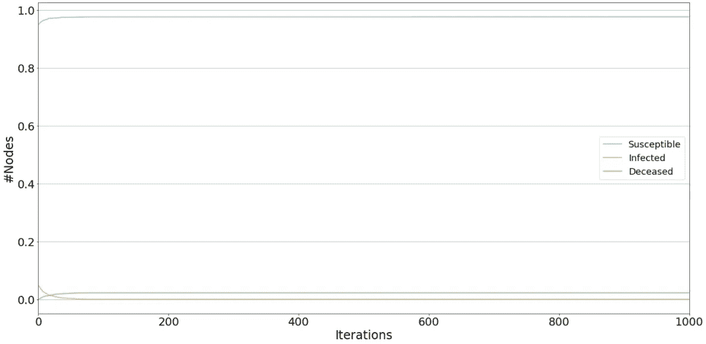

# 达塔维尔的疫情:5 个让你惊讶的见解

> 原文：<https://towardsdatascience.com/exploring-the-spread-of-covid-19-five-simulations-that-will-surprise-you-952d9e3ef752?source=collection_archive---------47----------------------->

## 模拟复杂网络中的流行病

## 数据科学家如何使用模拟来揭示不直观和有趣的见解

埃德温·胡珀在 [Unsplash](https://unsplash.com?utm_source=medium&utm_medium=referral) 上的照片

## **简介**

更令人兴奋和有益的练习之一(在我看来)是探索。它通常会带来令人惊叹的非直觉见解，并告知您的受众，这是您作为数据科学家肯定想做的事情。

在本文中，我们将通过模拟探索一个虚构城镇中的疫情。继续阅读，揭示不那么明显的见解。

但是在进一步深入之前，重要的是读者要记住，模型是对现实的简化，并带有假设。

> “所有的模型都是错误的，但有些是有用的”——乔治·博克斯

## 欢迎来到数据镇

达塔维尔是一个有一万人的小镇。这是一个紧密团结的社区，邻里之间的隔阂相对较少。最近有些居民染上了一种神秘的病毒。

这种病毒似乎通过密切接触在人与人之间传播。达塔维尔的人们很担心，新闻媒体警告说可能会有疫情。

Dataville 的顶级科学家分析了这种病毒，发现它对现有的抗体有抵抗力；没有人有豁免权。到目前为止，5%的 Dataville 居民已经被感染。

Dataville 的政府已经雇佣了数据科学家来模拟病毒的传播以帮助控制病毒。

## **工具**

该模拟是使用 Jupyter 笔记本在 Python 中端到端构建的。我将把你链接到我的 GitHub 页面，在那里你可以抓取代码并自己使用它(见文章结尾)。

我已经在网络扩散库( [NDlib](https://ndlib.readthedocs.io/en/latest/) )上建立了模拟——一个用于模拟、描述和研究复杂网络上扩散过程的框架。它非常直观，易于设置。我强烈推荐它。

## **建模方法**

建模方法学不是最令人兴奋的东西，但是它很重要。我要你挑战这个模型，看看你能在哪里改进它。阅读时请记住这一点。

我对病毒及其传播网络做了几个简化的假设。

***社交网络模型:*** 我曾经用一个数学图来表示 Dataville，它是市民和他们的关系。Dataville 的公民由图中的节点表示，他们与其他公民的联系/关系由边表示。

作者的图像:一个基本的数学图形

该病毒的传播是在一个由 10，000 人组成的复杂网络上模拟的，该网络被建模为 Barbassi-Albert 图。Barbassi-Albert 图是一种特殊的数学图，用于模拟优先连接。

优先连接意味着网络中的节点比具有更多边的节点更有可能具有边。这是社交网络中经常观察到的现象。简单来说，受欢迎的人有更多的朋友，但受欢迎的人不多。

为了使网络形象化，这里是每个节点的连接分布。你可能已经注意到了，它大致是一个幂律分布。

作者图片:节点边的分布

**注意**:如果你不熟悉图论，这里有一篇关于[图的友好文章](/generating-simple-graphs-to-chaotic-real-world-networks-with-python-79ab2b5e8994)。

我假设网络是静态的，这意味着它的拓扑结构没有变化。事实上，社交网络是动态的。

最后，我假设在日常生活中，网络中的每个人至少与 10 个人有互动。

换句话说，Dataville 是一个小而繁忙的城镇。

***状态和行为:*** 人可以存在三种状态之一:易感、感染或死亡。允许以下状态变化:

*1。易感- >感染*

*2。感染- >易感*

*3。感染- >死亡*

一个节点必须有一条边连接到一个被感染的节点才能触发状态改变一；一个明智的规则是，我们知道病毒通过密切接触传播。

***病毒假设*** *:* 病毒不会随着时间的推移而变异，传染性减弱或增强，人也不会产生免疫反应。

初始条件:初始感染率为 5%。

死亡率:一个人一旦被感染，有 2.86%的几率死于该病毒。

*恢复率:假设为 1-死亡率。*

*传播率:一旦感染，传播病毒的概率为 6.4%。*

## **模拟**

现在，所有的假设都已经准备好了，我们可以模拟一些病毒的场景了。

**重要提示** —所有模拟都运行 1000 次以上。这是一个任意的时间单位，不应假设为天、月、秒等。

## 场景 1:如果我们让病毒自生自灭会怎样？

Dataville 的许多人认为我们应该让病毒自生自灭。毕竟，与埃博拉相比，死亡率相对较低。

他们指出，社会限制对经济的影响会对精神健康、身体健康产生负面影响，并且会比病毒更具毁灭性。

让我们模拟一下，看看我们能收集到什么信息。

场景 1:作者的图像

经过 1000 次迭代后，感染病毒的人的比例降至零。然而，这种病毒已经摧毁了我们的人口，大约 35%的人死亡。

因此，在没有免疫力的人群中不受限制地传播病毒似乎不是最佳解决方案，即使死亡风险似乎很低。

## 场景 2:如果病毒像埃博拉病毒一样致命会怎样？

Dataville 的科学家警告说，这是一种死亡率类似于埃博拉病毒的新病毒株。

据估计，埃博拉病毒的致死率约为 50% ( [世卫组织](https://www.who.int/news-room/fact-sheets/detail/ebola-virus-disease))。让我们把死亡率调整到 50%，重新运行模拟。

场景 2:作者的图像

正如你可能预料的那样，这种更致命的形式杀死了我们人口中相当高的比例(大约 50%)。有趣的是，受感染的人数很快变平为零(在不到 50 次迭代之后)。因为死亡率很高，这种病毒不会传播很远。别忘了我们的模拟不允许死者传播病毒。

这种致命的病毒将是毁灭性的，但很可能会在消灭我们的人口之前自行消失。

## **情景 3:如果病毒传播性更强，会发生什么？**

Dataville 的科学家推测，病毒在夏天变得更容易传播，因为热气流将它带得更远。

让我们通过将传输速率增加到 20%来对此建模。我们将把死亡率降低到基线值。

场景 3:作者的图像

增加的传输速率在较早的情况下导致尖峰，然后在大约 600 次迭代时变平为零。这种影响是毁灭性的，超过 70%的人口死于这种病毒。

## 场景 4:如果人们从病毒中恢复得更慢，会发生什么？

Dataville 的科学家发现，人们的恢复速度比最初想象的要慢得多。让我们把回收率降低到 10%。像往常一样，我们会将其他参数重置为基线。

场景 4:作者的图像

到目前为止，这是我们最具破坏性的场景，在模拟结束时，90%的人口死亡。

降低恢复率会导致感染的累积，在大约 30%的人口中达到峰值。这只是被高死亡率所抑制，在第 400 次迭代时感染的数量变为零。不好！

## **场景 5:疫苗的有效性如何？**

Dataville 的政府正计划推出一种疫苗。据说它的有效率在 95%左右。

疫苗的工作原理是让接受者对病毒有一定的免疫力。有免疫力的人不太可能传播病毒。因此，在我们的模拟中，我们可以通过降低传播率来计算疫苗。我们将在场景 4 中这样做，这是我们最糟糕的情况，看看会有什么影响。

场景 5:作者的图像

结果令人难以置信。我们的人口死亡率从 90%下降到不到 3%。这种病毒在我们接种疫苗的人群中实际上不是问题。

## **最后的想法**

这不是疫苗接种的宣传，这项活动的结果不应该太认真。毕竟这些模型过于简单，而且 Dataville 并不存在。

然而，我想你会同意模拟揭示了一些相当不直观的结果。例如，我们中有谁会想到较低的恢复率会产生如此毁灭性的影响——甚至比死亡率还要严重？

最终模拟复杂的现象可以帮助指导我们的决策。

我最希望你能看到模拟对探索这些现象的用处。

在下面的 GitHub 链接中，您可以自由地自己使用代码。

<https://github.com/john-adeojo/Pandemic_Simulation>  <https://www.linkedin.com/in/john-adeojo/> 