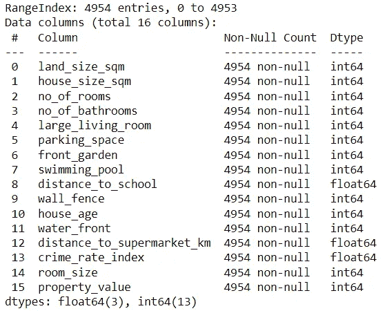
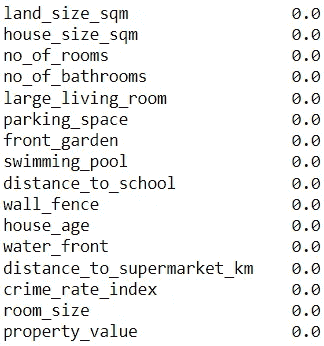
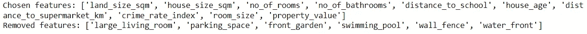
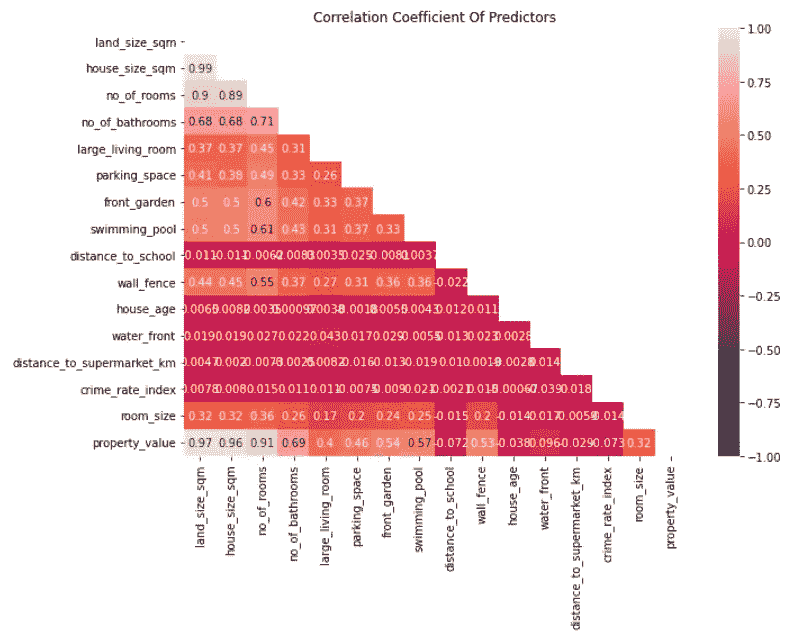
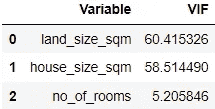
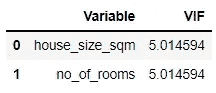
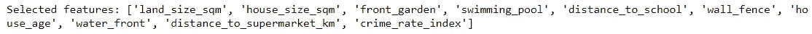
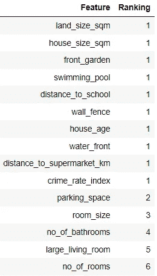

# 探索评估特征的各种方法以进行特征选择

> 原文：<https://towardsdatascience.com/exploring-the-various-ways-to-evaluate-features-for-feature-selection-1142f7788aeb?source=collection_archive---------25----------------------->

## 概述用于为机器学习模型过滤掉不想要的特征的常用方法

照片由[像素](https://www.pexels.com/photo/architecture-black-and-white-challenge-chance-277593/?utm_content=attributionCopyText&utm_medium=referral&utm_source=pexels)的[皮克斯拜](https://www.pexels.com/@pixabay?utm_content=attributionCopyText&utm_medium=referral&utm_source=pexels)拍摄

特征选择是许多机器学习任务中的常见组成部分。

这是用于降低维数的方法之一，从而确保高模型性能，同时减少过拟合和计算需求。

无论您是在构建推理模型还是预测模型，通过首先验证您已经选择了用于训练模型的最佳功能集，您将获得更好的结果。

在这里，我将快速概述一些常见的方法，以确定最适合构建机器学习模型的特征。

# 特征选择的例子

有许多标准可用于决定保留或省略哪些功能。

将使用存储房价信息的数据集(无版权)演示每种类型的特征选择。数据集可在此访问[。](https://www.kaggle.com/elakiricoder/jiffs-house-price-prediction-dataset)

代码输出(由作者创建)

此数据集中的目标标签是“property_value”。在功能选择过程中不会考虑此功能。

## 1.基于缺失值选择要素

有许多方法可以处理数据集中的缺失值。虽然删除没有数据的记录是一种选择，但不鼓励这样做，因为这意味着放弃有价值的信息。

也就是说，在某些情况下，如果大多数记录没有为某个要素赋值，则完全移除该要素可能是唯一的选择。

在 python 中，您可以轻松识别是否有要素缺少太多值。

代码输出(由作者创建)

如输出中所示，所有要素都没有任何缺失值，不需要消除任何要素。

## 2.基于方差选择要素

为了具有预测能力，要素的值需要显示某种程度的差异。

因此，评估特性的一个标准是特性值的方差。

方便的是，sklearn 模块提供了 [VarianceThreshold](https://scikit-learn.org/stable/modules/generated/sklearn.feature_selection.VarianceThhttps://scikit-learn.org/stable/modules/generated/sklearn.feature_selection.VarianceThreshold.htmlreshold.html) ，这是一个基于给定方差阈值选择特性的特性选择器。

下面是如何实现 VarianceThreshold 的简单示例:

VarianceThreshold 在数据集中选择满足所需方差的 9 个预测特征，同时忽略不满足方差的 6 个特征。

## 3.基于与其他特征的相关性选择特征

对于构建推理模型，特征之间没有关系是理想的。强相关的预测特征只会产生更多的噪声，导致特征系数估计的更高的方差。

这将使得从基于这种模型的分析中获得洞察力变得更加困难。

预测要素与其他要素有很强相关性的现象称为多重共线性。我在这里给主题[一个概述。](/targeting-multicollinearity-with-python-3bd3b4088d0b)

多重共线性可以通过首先识别表现出强相关性的要素来检测。

查找此类要素的一种方法是构建一个显示所有要素对的相关系数值的热图。

代码输出(由作者创建)

对于该数据集，很明显，以下各项之间存在很强的相关性:

*   “房屋面积平方米”和“土地面积平方米”
*   土地面积平方米和房间数量
*   “房屋面积平方米”和“房间数量”

直觉上，这些观察是有意义的。例如，“房子大小平方米”和“土地大小平方米”实际上给了我们相同的信息。包括这两个特征将降低用该数据训练的任何因果模型的可靠性。

要确定应消除哪些要素，我们可以找到具有高方差膨胀因子(VIF)值的要素并将其移除。

注:通常，10 或更大的 VIF 值被认为太高。

代码输出(由作者创建)

要素“land_size_sqm”具有最高的 VIF 值。移除此特征后，让我们再次计算 VIF 值。

代码输出(由作者创建)

很明显，“land_size_sqm”是唯一必须移除的要素，以解决数据集中的多重共线性问题。

## 4.基于模型性能选择特征

也可以让机器学习模型选择特征。

一种众所周知的利用模型的特征选择算法被称为递归特征消除(RFE)。

RFE 不同于其他特征选择方法，因为它特别要求应该选择的特征的数量。

令人欣慰的是，sklearn 模块带着它自己的 [RFE 估计器](https://scikit-learn.org/stable/modules/generated/sklearn.feature_selection.RFE.html)再次前来救援。

在使用 RFE 进行特征选择之前，需要将数据分成训练集和测试集，并进行归一化处理。

让我们使用 RFE 来确定应该选择的 10 个特征。RFE 将使用线性回归模型来选择其要素。

RFE 的一个有价值的特征是，它可以显示从考虑因素中移除已消除要素的顺序。这可以通过。排名 _ '法。

注意:等级为 1 的特征是选定的特征。任何其他排名都代表被淘汰的功能。

代码输出(由作者创建)

如表中所示，RFE 删除了“无房间”、“大客厅”、“无浴室”、“房间大小”和“停车位”功能(按此顺序)。

# 结论

照片由 [Unsplash](https://unsplash.com?utm_source=medium&utm_medium=referral) 上的 [Prateek Katyal](https://unsplash.com/@prateekkatyal?utm_source=medium&utm_medium=referral) 拍摄

现在，您已经更加熟悉了用于特征选择的各种方法。

请记住，特性选择的最佳方法因项目而异。

不要不分青红皂白地应用每一种特性选择方法，而要考虑哪一种最适合您的项目。

我祝你在机器学习的努力中好运！

# 参考

J.伊萨丁。(2020).Jiffs 房价预测数据集，第 3 版。2021 年 12 月 12 日检索自[https://www . ka ggle . com/elakiricoder/jiffs-house-price-prediction-dataset](https://www.kaggle.com/elakiricoder/jiffs-house-price-prediction-dataset)。