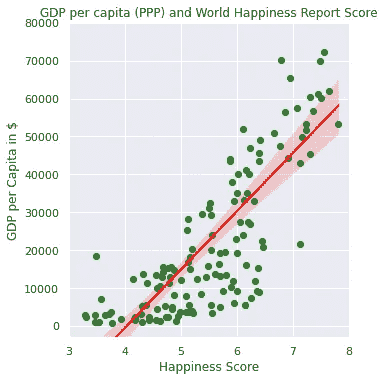
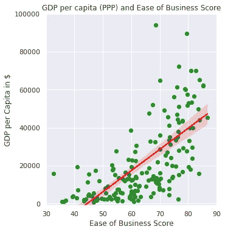
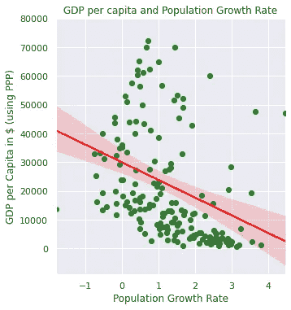
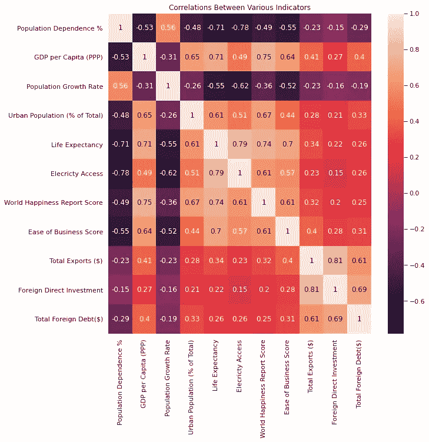

# 探索国家的财富

> 原文：<https://towardsdatascience.com/exploring-the-wealth-of-nations-22b33575cec9?source=collection_archive---------31----------------------->

## 强调国家财富和各种社会经济指标之间的关系

自亚当·斯密 1776 年出版《国富论》以来，解释《国富论》一直是讨论和研究的话题。美国国会于 1937 年引入了国内生产总值这一指标来衡量国家财富，自那以来，它已成为这方面的最终衡量标准。简单地说，国内生产总值(GDP)是一个国家在特定年份生产的所有商品和服务的总价值。这一衡量标准虽然详尽，但确实存在一些缺陷，一些经济学家将强调收入不平等等缺陷。尽管如此，GDP 仍然是量化和比较国家财富最常用的指标。为了使人口效应标准化，使用了人均国内生产总值指标，即国内生产总值除以国家总人口。为了进一步抵消不同货币汇率的影响，使用了购买力平价的概念。用购买力平价计算的人均 GDP 是比较各国财富的标准尺度。

国家的财富和个人的财富一样，与不同的因素有着非常复杂的关系。让我们先来研究这个反问句，即“金钱能买到幸福吗？”在国家的背景下。从国家层面来看，数据确实给出了明确的“是”的答案。我从纽约可持续发展解决方案网络发布的《2020 年世界幸福报告》中选取数据进行分析。这份报告使用盖洛普世界民意测验和劳埃德船级社基金会的世界风险民意测验来直接计算各国的幸福指数。该报告本身使用购买力平价将人均 GDP 确定为可以解释国民幸福指数差异的最大因素。为了进一步探索这一点，我用购买力平价绘制了幸福指数和人均 GDP 的图表。这两个变量有很强的相关性(皮尔逊相关系数为 0.75)。事实上，在我为这项分析考虑的所有变量中，国家财富与国家幸福指数的相关性最强。富裕国家的民众更幸福，或者可能更幸福。相关性不能预测因果关系，所以我们有一些食物(数据)供进一步思考。

作者图片

我还研究了与国家财富密切相关的其他变量。世界银行最近推出的一项综合指标是“营商便利度得分”[2]。该分数考虑了各种法律、监管和经济指标，根据各国创办和经营企业的难易程度进行排名。下图显示了这种关系。“人均 GDP”和“商业便利度”也有很强的相关性，相关系数为 0.64。在较富裕的国家创业更容易。低收入国家需要对此给予特别考虑。国家财富主要来自蓬勃发展的私营企业。商业改革促进了私营企业的发展，从而增加了国民财富。

作者图片

还有其他指标，如城市人口百分比，也与人均国内生产总值有很强的正相关关系(皮尔逊系数为 0.65)。在现代经济中，城市是经济增长的引擎，因此应促进并妥善管理城市化。有一些指标与国家财富有显著的负相关关系。其中一个是全国人口增长率，从下面的情节可以看出。

作者图片

这一分析绝非详尽无遗。指标的选择是任意的，未来的研究可以选择新的指标。地图下方的热图显示了各种国家社会经济指标之间的相互关系。除了与国家财富的相关性，在这张热图中还可以看到其他有趣的关系。

作者图片

例如，一个国家的平均预期寿命与电力供应高度相关。它还与全国人口抚养比(定义为每 100 名活跃劳动力中的被抚养者人数)呈高度负相关。这种影响很可能是由于每个家庭有大量的孩子和较高的婴儿死亡率。同样，人口增长率和人口抚养比与大多数经济发展指标呈负相关。这突出了低收入国家适当开发人力资源的必要性。总之，在公共部门领域有大量数据可供探索。这方面最好的资源是世界银行开放数据 API [3]。

注:这项分析的代码可在以下网址公开使用:
[https://github . com/janjuatest/Public-Sector/blob/main/GDP . ipynb](https://github.com/janjuatest/Public-Sector/blob/main/GDP.ipynb)

1.  Helliwell，John F .，Richard Layard，Jeffrey Sachs 和 Jan-Emmanuel 德·内维编辑。2021.2021 年世界幸福报告。纽约:可持续发展解决方案网络。
2.  做生意，[https://www.doingbusiness.org/en/rankings](https://www.doingbusiness.org/en/rankings)
3.  指标数据来自世界银行公开数据 API:
    [https://Data help desk . World Bank . org/knowledge base/topics/125589](https://datahelpdesk.worldbank.org/knowledgebase/topics/125589)