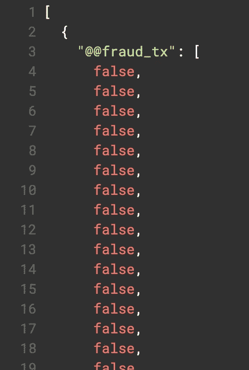
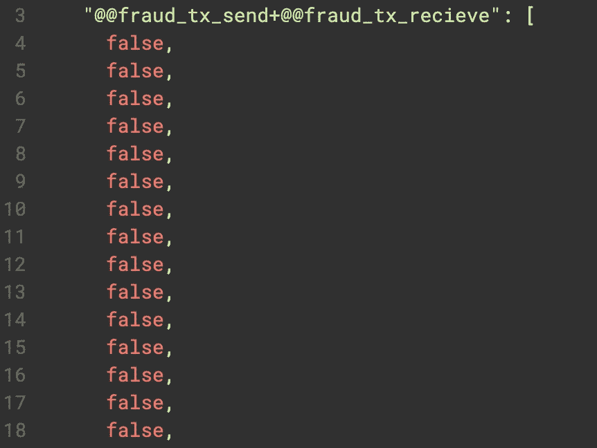
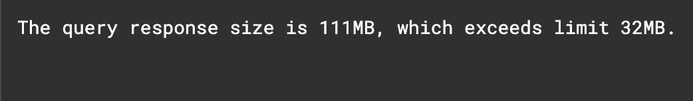
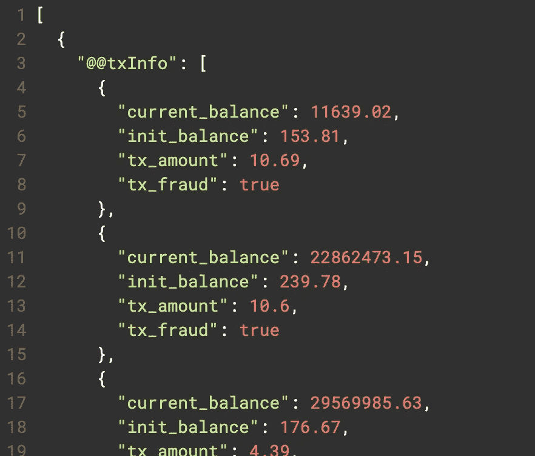
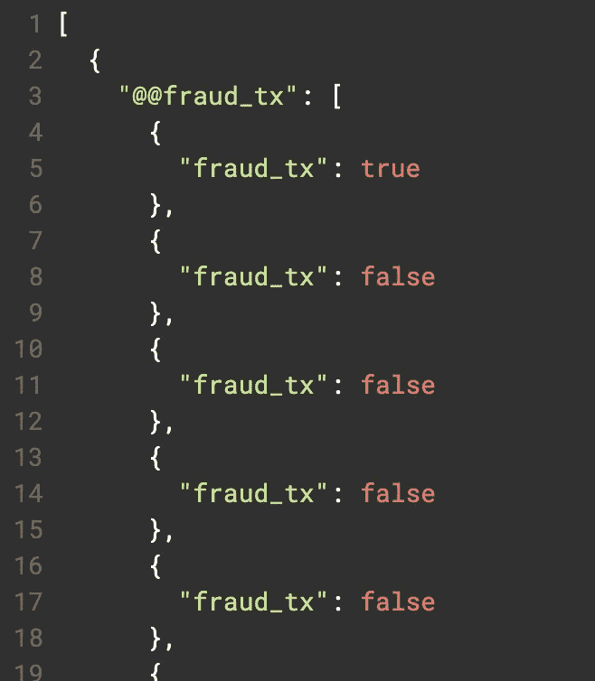

# 使用欺诈检测数据集探索 TigerGraph 的 GSQL ListAccum 和 HeapAccum

> 原文：<https://towardsdatascience.com/exploring-tigergraphs-gsql-listaccum-and-heapaccum-with-a-fraud-detection-dataset-cf2bc2b0bb16?source=collection_archive---------42----------------------->

## 使用 AML Sim 欺诈数据库探索 TigerGraph 的 ListAccum 和 HeapAccum 的使用案例和差异

# 介绍

欢迎光临！在这篇博客中，我们将介绍两种类型的累加器:ListAccum 和 HeapAccum。这是 TigerGraph 的查询语言 GSQL 的几种不同类型的累加器中的两种。您可以在此处看到 TigerGraph [提供的所有累加器。本博客将使用 AML Sim 欺诈检测数据集介绍 ListAccum 和 HeapAccum 的一些用途。我们将了解每种方法的优势和使用案例，所以让我们开始吧！](https://docs.tigergraph.com/dev/gsql-ref/querying/accumulators#accumulator-types)

# 列表累积

## 概观

一个 [ListAccum](https://docs.tigergraph.com/dev/gsql-ref/querying/accumulators#listaccum) 类似于 Python 中的一个列表。可以有重复，当一个项目被添加的顺序将是结果的顺序。总而言之，它是“元素的顺序集合”，再次类似于 Python 中的列表。让我们来看看它的一个用例。

## 查询一

让我们从简单的开始。比方说我想抓取某个用户的所有交易，看看是不是欺诈。为此，我们可以编写一个查询，该查询将从帐户顶点开始，经过 Send_Transaction 边，并在事务顶点结束。WHERE 子句将过滤结果，因此我们只查看某个帐户的交易(它将作为参数传递)。

```
CREATE QUERY listQueryOne(STRING account_id) FOR GRAPH AMLSim { 

  ListAccum<BOOL> @@fraud_tx;

  Seed = {Account.*};

  Res = SELECT t FROM Seed:a -(Send_Transaction:e)->Transaction:t 
        WHERE a.id == account_id
        ACCUM @@fraud_tx += t.is_fraud; 

  PRINT @@fraud_tx;}
```

当传递 id 9755 时，结果将是一个包含几个真和假的列表。



查询的结果

## 查询二

列表的一个很酷的地方是它们可以很容易地添加到一起。比方说，我们想知道发送和接收的交易是否是欺诈性的。为此，我们可以创建另一个列表，然后将这两个列表“添加”在一起。

```
CREATE QUERY grabAllTransactionResults(STRING account_id) FOR GRAPH AMLSim { 

  ListAccum<BOOL> @@fraud_tx_send;
  ListAccum<BOOL> @@fraud_tx_recieve; 

  Seed = {Account.*};
  Seed2 = {Transaction.*};

  Res = SELECT t FROM Seed:a -(Send_Transaction:e)->Transaction:t 
        WHERE a.id == account_id
        ACCUM @@fraud_tx_send += t.is_fraud; 

  Res2 = SELECT t FROM Seed2:t -(Recieve_Transaction:e)->Account:a 
        WHERE a.id == account_id
        ACCUM @@fraud_tx_recieve += t.is_fraud; 

  PRINT @@fraud_tx_send + @@fraud_tx_recieve;
  PRINT @@fraud_tx_send;
  PRINT @@fraud_tx_recieve;}
```

这样，我们可以看到与用户相关联的所有交易的列表，以及它们是否是欺诈性的，以及仅发送的交易和仅接收的交易的交易结果。

下面是第一个 PRINT 语句的结果:



查询 II 的第一个打印语句的部分结果。

## 查询三

现在，比方说，我们想要获取所有的帐户顶点，并保存一个哪个帐户有什么交易的列表。为此，我们首先需要声明一个 TYPEDEF 元组(这是我们想要的列表类型的元组)，然后我们可以从 Account 开始迭代，遍历 Send_Transaction，并转到 Transaction 以获得我们想要的信息。

```
CREATE QUERY getAccountsInfo() FOR GRAPH AMLSim { 

  TYPEDEF TUPLE <BOOL tx_fraud, DOUBLE init_balance, DOUBLE current_balance, DOUBLE tx_amount> TX_INFO;

  ListAccum<TX_INFO> @@txInfo;

  Seed = {Account.*};

  Res = SELECT t FROM Seed:a -(Send_Transaction:e)->Transaction:t
        ACCUM @@txInfo+=TX_INFO(t.is_fraud, a.init_balance, a.current_balance, t.amount);

  PRINT @@txInfo;

}
```

现在，如果我们在 GraphStudio 中运行它，我们会得到这个错误。



尝试在 GraphStudio 中运行查询时出错。

AMLSim 数据库非常大，这也是我们出现这个错误的部分原因。有时，这甚至会导致超时错误。是的，我们可以增加 TigerGraph 中的查询响应时间，但我只是想获取一个事务样本。有一种类型的累加器可以简化对其大小的限制，那就是… HeapAccum！接下来让我们来探索一下！

# HeapAccum

## 概观

HeapAccum 类似于 ListAccum，因此它们都可以有重复项。它们也是排序的，但是对于 HeapAccum，它的顺序是它接受的一个参数。此外，HeapAccum 将容量作为一个参数。此外，HeapAccum 要求类型是元组。在查询 I 和 II 中，我们的类型是 boolean，但是 HeapAccum 不允许这样。HeapAccum 的语法是:

```
HeapAccum<typedefTupleName> (capacity, var1 ASC/DESC, var2 ASC/DEC, ...)
```

首先，我们需要创建一个 TYPEDEF 元组。那么，容量是累加器可以容纳多少元组的整数。最后，接下来的变量是 TYPEDEF 元组中的字段，后跟 ASC 或 DESC。这实质上是说，HeapAccum 的顺序应该基于某个字段的升序或降序。如果第一个字段中有两个或更多的项目具有相同的值，那么任何后续字段和升序/降序都是次要顺序(有点像决胜局)。

因此，从一开始，HeapAccum 的设置就比较复杂。如果你追求简单，那就选择 ListAccum。但它确实提供了一些有用的参数，如容量和订购内容。让我们看看这个蓄电池的运行情况！

## 查询四

让我们使用与查询 III 完全相同的查询，但是使用一个 HeapAccum。我们可以生产 10000 件，并基于 tx_fraud DESC 订购。(这样，欺诈性交易就会在最上面。)

```
CREATE QUERY getAccountsInfo() FOR GRAPH AMLSim { 

  TYPEDEF TUPLE <BOOL tx_fraud, DOUBLE init_balance, DOUBLE current_balance, DOUBLE tx_amount> TX_INFO;

  HeapAccum<TX_INFO> (10000, tx_fraud DESC) @@txInfo;

  Seed = {Account.*};

  Res = SELECT t FROM Seed:a -(Send_Transaction:e)->Transaction:t
        ACCUM @@txInfo+=TX_INFO(t.is_fraud, a.init_balance, a.current_balance, t.amount);

  PRINT @@txInfo;

}
```

我们可以执行它…瞧！没有错误信息！



查询 IV 返回的值

## 质疑五

最后，让我们看看 HeapAccum 在哪里可能不是最佳选择。如前所述，它比 ListAccum 复杂得多。所以…让我们试着用一个 HeapAccum 重新发明查询 I。

```
CREATE QUERY heapQueryFive(STRING account_id) FOR GRAPH AMLSim { 

  TYPEDEF TUPLE<BOOL fraud_tx> BoolTuple;

  HeapAccum<BoolTuple> (1000, fraud_tx DESC) @@fraud_tx;

  Seed = {Account.*};

  Res = SELECT t FROM Seed:a -(Send_Transaction:e)->Transaction:t 
        WHERE a.id == account_id
        ACCUM @@fraud_tx += BoolTuple(t.is_fraud); 

  PRINT @@fraud_tx;
}
```

首先，顺序不同于查询 I；该查询将只在顶部显示欺诈性交易，随后显示非欺诈性交易。为了模拟查询 I，我们可以添加一个计数器。但是，让它自动订购的一个很酷的事情是，现在我们可以很容易地看到帐户 id 9755 是否有任何欺诈交易。运行查询，这是我们的部分结果:



查询 V 的结果

因此，首先，我们可以很容易地看到，我们的帐户 9755 有一个欺诈交易。但是您会注意到，每个返回(每个元组)的结果都在字典中。根据不同的用例，这可能没有只有列表有用。然而，总的来说，这归结于查询的目的是确定是使用 ListAccum 还是 HeapAccum。

# 结论+参考文献

恭喜你。您已经创建了总共五个查询，了解并使用了 ListAccum 和 HeapAccum！总之，HeapAccum 比 ListAccum 更复杂，需要一个 Tuple 作为其类型，并返回字典。然而，HeapAccum 可以很容易地限制结果(通过它的 capacity 参数),也可以很容易地对结果进行排序。总的来说，两者各有利弊，选择“最好”的要视情况而定。

这篇博客使用了来自 GitHub 知识库的数据集:

<https://github.com/TigerGraph-DevLabs/AMLSim_Python_Lab>  

该博客使用了来自 TigerGraph 在 ListAccum 和 HeapAccum 上的文档的信息:

<https://docs.tigergraph.com/dev/gsql-ref/querying/accumulators#listaccum>  <https://docs.tigergraph.com/dev/gsql-ref/querying/accumulators#heapaccum>  

最后，如果您有任何问题或想要了解更多信息，请随时加入 TigerGraph Discord:

<https://discord.gg/gRHWBZNpxW>  

非常感谢您阅读这篇博客，希望您以后继续使用 TigerGraph！