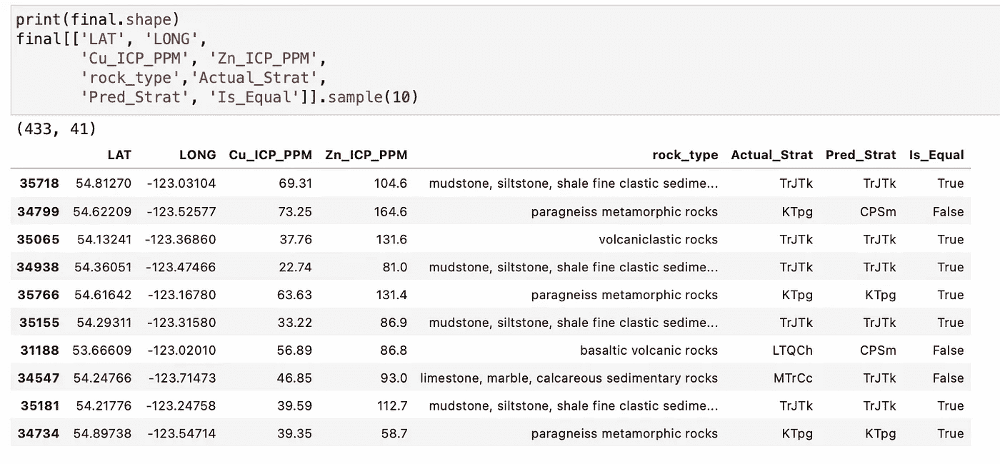
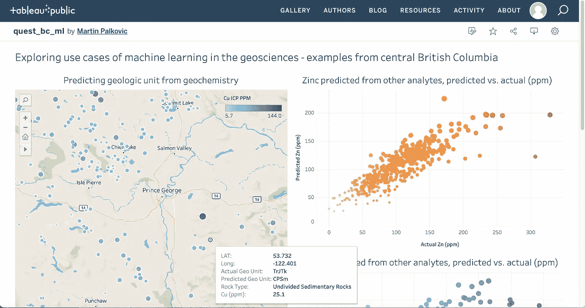

# 探索机器学习在地球科学中的用例

> 原文：<https://towardsdatascience.com/exploring-use-cases-of-machine-learning-in-the-geosciences-b72ea7aafe2?source=collection_archive---------17----------------------->

## [行业笔记](https://towardsdatascience.com/tagged/notes-from-industry)

## 根据地球化学预测地层，并根据不列颠哥伦比亚中部的其他地球化学分析物预测铜和锌

由[特雷弗·麦金农](https://unsplash.com/@bigmck56?utm_source=medium&utm_medium=referral)在 [Unsplash](https://unsplash.com?utm_source=medium&utm_medium=referral) 上拍摄

[伴随项目的 Tableau 仪表盘](https://public.tableau.com/views/quest_bc_ml/Exploringusecasesofmachinelearninginthegeosciences-examplesfromcentralBritishColumbia?:language=en-US&:display_count=n&:origin=viz_share_link)

[Github 库](https://github.com/SpinelLherzolite/geoscience_ml)

我将探索的数据集是[区域地球化学调查数据集](https://open.canada.ca/data/en/dataset/49a73c36-4a25-4be5-b6d1-abd020fb031a)，这是一个自 1976 年以来在加拿大不列颠哥伦比亚省开展的项目，旨在“帮助矿产资源的勘探和开发”[1]。地球化学数据集是一种化学数据集，如从岩石或沉积物等地质介质中获得的选定元素的化学性质。该数据集包括“河流沉积物”，即从河流或水体中收集的沉积物样本，用于地球化学分析。河流沉积物取样被认为是矿产勘探的一级近似法，因为集水区岩性(或者，通俗地说，排水区的岩石类型)被认为是河流沉积物地球化学的主要控制因素[2，3]，因此可以指示样品位置上游的矿床。虽然我更喜欢岩石地球化学的数据集，但我选择使用公开可用的数据进行分析，我希望您将这些发现作为地质数据其他用例的灵感。

**我从两个假设开始分析:**

*   地球化学可以用来准确预测数据集中河流沉积物样品的主要集水区岩性吗？
*   许多分析物的地球化学可以用来准确预测一种分析物(如铜)的浓度吗？

我选择查看数据集中的“Quest”区域，因为它拥有数据集中所有区域中最多的数据。Quest 地区位于不列颠哥伦比亚省中部/北部广阔的内陆高原，靠近乔治王子镇。该地区的地质特征是内恰科盆地的白垩纪至渐新世沉积物，其西面以海岸山脉为界，东面以落基山脉为界。一层厚厚的喷出火山岩和/或第四纪沉积物覆盖在内恰科盆地的沉积岩上[4]。考虑到大部分感兴趣的地质被覆盖，我认为这个区域是数据驱动勘探方法的主要候选区域。

## 从地球化学预测地质单元

为了开始这个项目，我通过将某些分析物的百分比值转换为百万分之一来准备和清理数据，用 Quest 区域的铅平均值填充 72 个缺失的铅值，并删除数据集中出现次数少于 30 次的基础地质单元行(稍后将详细介绍)。然后，我将地层学转换为数值(即，如果一行的地质单位值为“KTpg ”,则显示 1 来表示该单位，如果不是该单位，则显示 0)，因为机器学习分类不能处理文本值。这是排序的中间步骤，因为我们将把结果转换回最终输出数据的文本值。

我使用 Python 中的 Scikit-Learn 库执行了一个标准的“训练-测试分割”。机器学习项目中的惯例是使用一部分数据来“训练”模型，并使用数据集的一小部分剩余部分(称为测试集)来测试数据。这里的想法是，模型以前从未见过测试数据，因此它被认为是模型在新数据上表现如何的准确度量。我使用了“训练-测试分离”函数的默认参数，该函数随机打乱数据，选择 80%的数据进行训练，20%的数据进行测试。然后，我对六个不同模型的测试数据测量了模型的准确性:

*   决策树分类器，准确率 61.4%
*   随机森林分类器，准确率 66.3%
*   额外树分类器，准确率 64.2%
*   k 最近邻分类器，52%的准确率
*   XG Boost 分类器，准确率 71.1%

图片作者。

XG Boost 模型的准确率最高，为 71.1%。我做了大量的数据处理，最终得到了这么高的精度。我对偏斜的变量进行了对数转换，通过分析变量的相关性小心翼翼地去除了异常值，尝试了不列颠哥伦比亚省的不同地区，去除了沉积单元，基于对模型的重要性去除了某些分析物，并减少了模型必须分类的单元数量。我发现这些努力大部分都是徒劳的，但是对模型性能有很大影响的一点是减少了要分类的地质单元的数量。事实证明，如果有 30 多个地质单元要对数据进行分类，机器学习模型在这种规模和性质的数据集上表现不佳。下面是最终输出的一个片段:

图片作者。

这些指标显示模型性能:

该模型在“tr jtk”(Takla 集团)单位中表现极佳。如果你回头看第一个程序(geo_unit_predictions.py)，TrJTk 有 1096 个值。我将把这归因于拥有如此多数据进行训练的模型——如果你花任何时间学习如何改善机器学习模型，更多数据是你可以改善模型的最佳方式之一。按照这种逻辑，将来自其他单元的更多数据添加到该数据集中以帮助模型学习也可能会提高这些单元的准确性分数。

## 从其他分析物预测铜和锌

让我们继续预测铜和锌。我选择铜和锌是因为它们在加拿大被列为[重要矿产](https://www.nrcan.gc.ca/our-natural-resources/minerals-mining/critical-minerals/23414)。这不是机器学习组件的一部分，但我也编写了一个程序来识别您的数据集是否包含关键矿物:

在“geo_unit_predictions.py”的第 41 行，我保存了一个已清理的数据集“analytes.csv”，这是我们执行此任务的起点。因为这是一个回归问题，而不是像前一个任务那样的分类，所以我使用了所有的行，而不是删除具有深奥地质单元的行。这是预测铜的代码，但通过修改第 6 行和第 8 行，同样的代码也适用于任何其他分析物。我使用了一种类似的方法，通过同时运行 9 个不同的模型来撒下一张大网，以确定哪个模型效果最好。然后我更进一步，混合了四个最高精度模型的结果。这将准确度提高了几个百分点！请注意，由于前面示例中分类模型的输出数据，将您的模型混合在一起是行不通的(混合仅适用于回归问题)。

我们到了。预测 Quest 地区铜的准确率为 72.6%，预测锌的准确率为 71.8%。这些结果很有希望——我能想到的一个有希望的用例是为手持 x 射线荧光(XRF)数据开发一个机器学习模型。手持式 XRF 是一种通常用于地质野外工作的工具，它将 x 射线投射到样本上，并测量从样本发出的 x 射线的荧光。这些次级 x 射线具有特定元素的独特荧光特征。在我作为一名地质学家的时间里，我遇到过很少有人非常信任手持 XRF 数据——然而，鉴于这些结果，我假设可以在包含手持和实验室地球化学数据的数据集上训练一个模型，该模型将准确预测手持 XRF 数据的实验室测量结果。基本上，我认为机器学习有潜力极大地改善手持 XRF 数据。我也很想研究包含岩石物理特性的钻孔数据，以预测岩性、岩相，甚至矿物浓度。

我将所有的最终数据都放入 QGIS，但最终还是用 Tableau 进行了最终的可视化，因为我真的很喜欢工具提示提供的交互性。这里是 [Tableau 仪表盘](https://public.tableau.com/app/profile/martin.palkovic/viz/quest_bc_ml/Exploringusecasesofmachinelearninginthegeosciences-examplesfromcentralBritishColumbia?publish=yes):

希望你喜欢这个项目。干杯！

马丁

## **参考文献**

1.  *区域地球化学调查数据，*不列颠哥伦比亚省地质调查局，2020 年。[https://open . Canada . ca/data/en/dataset/49 a73c 36-4a 25-4be 5-B6 D1-Abd 020 FB 031 a](https://open.canada.ca/data/en/dataset/49a73c36-4a25-4be5-b6d1-abd020fb031a)
2.  阿恩，华盛顿特区和布鲁梅尔，2011 年。不列颠哥伦比亚省 QUEST South 河流-沉积物数据的集水分析和解释。地球科学 BC 报告 2011–5，24，[http://www.geosciencebc.com/reports/gbcr-2011-05/](http://www.geosciencebc.com/reports/gbcr-2011-05/)
3.  Bonham-Carter，G.F .和 Goodfellow，w . d ,, 1986 年,《使用数字化水系和地质图对河流地球化学数据进行背景校正:在育空地区和西北地区塞尔温盆地的应用:地球化学勘探杂志》,第 25 卷，第 139-155 页。
4.  Hayward，n .和 Calvert，A.J .，2009,《不列颠哥伦比亚省内恰科盆地东南部始新世和新近纪火山岩:使用初至断层成像解释加拿大亨特地震反射测量》。加拿大地球科学杂志。**46**(10):707–720。【https://doi.org/10.1139/E09-041 

## 承认

特别感谢怀俄明州地质调查局的第二地质学家 Derek Lichtner，他提供了诚实的反馈和对本项目的出色的同行评审。