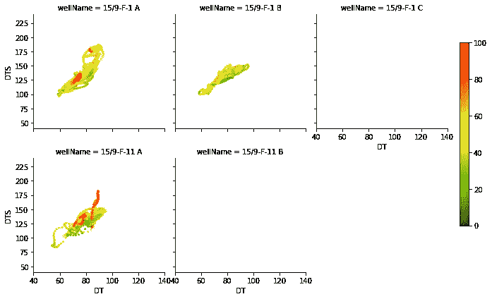

# 使用 Pandas、Matplotlib 和 Seaborn 探索测井数据

> 原文：<https://towardsdatascience.com/exploring-well-log-data-using-pandas-matplotlib-and-seaborn-712779a39ac2?source=collection_archive---------15----------------------->

## 使用来自 Seaborn 和 Matplotlib 的多个图探索岩石物理和测井测量的示例


马库斯·斯皮斯克在 [Unsplash](https://unsplash.com?utm_source=medium&utm_medium=referral) 上的照片

机器学习和人工智能在地球科学和岩石物理领域越来越受欢迎。尤其是在过去的十年里。机器学习是人工智能的一个分支，是计算机可以学习并根据数据进行预测的过程，而无需显式编程。我们可以在岩石物理学中以多种方式使用机器学习，包括自动化异常值检测、属性预测、相分类等。

这一系列文章将着眼于从基本测井测量到岩石物理性质预测的数据集。这些文章最初是在 SPWLA 2021 大会的一个机器学习和人工智能研讨会上发表的。它们后来被扩展和更新以形成这些文章。该系列将包括以下内容，链接将包括一旦他们被释放。

1.Volve 油田数据集
2 中选定油井的初始数据勘探。缺失数据的识别
3。使用手动和自动方法检测异常值/异常数据点
4。使用机器学习预测关键储层性质

# 数据

2018 年，Equinor 向公共领域发布了 Volve 领域的全部内容，以促进研究和学习。发布的数据包括:

*   测井记录
*   岩石物理解释
*   报告(地质、完井、岩石物理、岩心等)
*   核心测量
*   地震数据
*   地质模型
*   还有更多…

Volve 油田位于北海挪威部分斯塔万格以西约 200 公里处。1993 年在侏罗纪时代的胡金地层中发现了碳氢化合物。石油生产始于 2008 年，持续了 8 年(是计划时间的两倍)，直到 2016 年停止生产。在油田寿命期内，总共生产了 63 个 MMBO，达到了 56000 桶/天的稳定产量

有关 Volve 字段和整个数据集的更多详细信息，请访问:[https://www . equinor . com/en/what-we-do/Norwegian-continental-shelf-platforms/Volve . html](https://www.equinor.com/en/what-we-do/norwegian-continental-shelf-platforms/volve.html)

这些数据在 Equinor 开放数据许可证下获得许可。

# **选择分析数据**

Volve 数据集由 24 口井组成，包含各种测井数据和其他相关测量数据。对于这个小教程系列，我们将选择五口井。这些是:

*   9 月 15 日-F-1 A
*   9 月 15 日-F-1 B
*   9 月 15 日-F-1 C
*   2011 年 9 月 15 日至 11 日
*   15/9-F-11 B

从这些井中，选择了一套标准的测井测量(特征)。它们的名称、单位和描述详见下表。


Volve 油田选定井的标准测井测量和岩石物理推导曲线。

该系列笔记本的目标是预测三种常见的岩石物理测量值:孔隙度(PHIF)、含水饱和度(西南)和页岩体积(VSH)。传统上，这些是通过一些经验公式计算出来的。

# 数据探索

探索性数据分析(EDA)是数据科学工作流程中的一个重要步骤。它允许您熟悉您的数据并理解其内容、范围、质量和变化。在这个阶段，您可以识别数据中的模式以及特征(测井记录)之间的关系。

我在以前的媒体文章中已经介绍了一些 ed a 过程和情节:

*   利用测井数据进行探索性数据分析
*   使用 Matplotlib 可视化油井数据覆盖范围
*   如何使用 Python 使用无监督学习对测井数据进行聚类

作为岩石物理学家/地球科学家，我们通常使用测井曲线(数据与深度的线图)、直方图和交会图(散点图)来分析和探索测井数据。Python 提供了一个很好的工具集，可以快速简单地从不同的角度可视化数据。

在本教程中，我们将涵盖:

*   从 CSV 文件读入数据
*   查看对数图上的数据
*   查看交会图/散点图上的数据
*   查看直方图上的数据
*   使用对绘图在交会图和直方图上显示所有测井曲线

# 导入库和数据

第一步是导入我们需要的库。这两个工具分别是用于加载和存储数据的 pandas、用于可视化数据的 matplotlib 和 seaborn。

```
import pandas as pd
import matplotlib.pyplot as plt
import matplotlib
import seaborn as sns
```

导入库之后，我们将使用 pandas `read_csv`函数加载数据，并将其赋给变量`df`。

```
df = pd.read_csv('data/spwla_volve_data.csv')
```

## 熊猫。描述功能

一旦数据被加载，它将被存储在一个结构化的对象中，类似于一个表，称为 dataframe。我们可以用多种方法检查数据帧的内容。首先，我们可以使用`.describe()`函数检查数字列的汇总统计数据。由此，我们能够找到关于每个特征的数据点数、平均值、标准偏差、最小值、最大值和百分位值的信息。

为了使表格更容易阅读，我们将添加`.transpose()`函数。这会将列名放在行中，将统计测量值放在列中。

```
df.describe().transpose()
```


转置的 pandas 数据帧，包含每次测井测量的汇总统计数据。使用 df.describe()方法创建。

## 熊猫。信息功能

我们可以调用的下一个方法是`.info()`。这提供了数据帧中所有列的列表，以及它们的数据类型(例如，浮点、整数、字符串等)。)，以及每列中包含的非空值的数量。我们可以在下面看到，我们有一个名为 wellName 的列，它不包含在上面显示的数据帧中。

```
df.info() RangeIndex: 27845 entries, 0 to 27844
Data columns (total 16 columns):
 #   Column    Non-Null Count  Dtype  
---  ------    --------------  -----  
 0   wellName  27845 non-null  object 
 1   MD        27845 non-null  float64
 2   BS        27845 non-null  float64
 3   CALI      27845 non-null  float64
 4   DT        5493 non-null   float64
 5   DTS       5420 non-null   float64
 6   GR        27845 non-null  float64
 7   NPHI      27845 non-null  float64
 8   RACEHM    27845 non-null  float64
 9   RACELM    27845 non-null  float64
 10  RHOB      27845 non-null  float64
 11  RPCEHM    27845 non-null  float64
 12  RPCELM    27600 non-null  float64
 13  PHIF      27736 non-null  float64
 14  SW        27736 non-null  float64
 15  VSH       27844 non-null  float64
dtypes: float64(15), object(1)
memory usage: 3.4+ MB
```

## 熊猫。头和。尾部函数

下一组有用的方法是`head()`和`.tail()`函数。这些函数返回数据帧的前/后五行

```
df.head()
```


测井测量数据帧的前五行。单击以放大。图片由作者提供。

```
df.tail()
```


测井测量数据帧的最后五行。单击以放大。图片由作者提供。

## 使用查找井的名称。独特功能

从介绍中我们知道，在这个数据集中应该有 5 口井。我们可以通过调用 wellName 列并使用方法`.unique()`来检查这一点。这将返回一个数组，列出该列中所有的唯一值。

```
df['wellName'].unique()array(['15/9-F-1 A', '15/9-F-1 B', '15/9-F-1 C', '15/9-F-11 A',
       '15/9-F-11 B'], dtype=object)
```

如上所述，我们可以通过名称调用数据帧中的特定列。如果我们对一个数字列(比如 CALI)执行此操作，我们将返回一个 pandas 系列，其中包含前 5 个值、后 5 个值以及该列的详细信息。

```
df['CALI']0        8.6718
1        8.6250
2        8.6250
3        8.6250
4        8.6250
          ...  
27840    8.8750
27841    8.8510
27842    8.8040
27843    8.7260
27844    8.6720
Name: CALI, Length: 27845, dtype: float64
```

# 数据可视化

## 测井曲线

[测井图是我们用来分析测井数据的基本工具之一](/creating-simple-well-log-plots-using-the-matplotlib-library-in-python-670325462f9e)。它们由几列轨道组成。每一列中可以有一条或多条测井曲线，相对于深度绘制。它们帮助我们可视化地下，并允许我们识别潜在的油气层段。

因为我们将创建多个对数图，所以我们可以创建一个可以多次调用的简单函数。函数允许我们将代码分解成可管理的块，并省去多次重复代码的需要。

这个`create_plot`函数有许多参数(输入):

*   **井名**:字符串形式的井名
*   **数据帧**:所选井的数据帧
*   **curves_to_plot** :我们想要绘制的测井曲线/数据帧列的列表
*   **深度曲线**:我们想要绘制的深度曲线
*   **log_curves** :需要以对数刻度显示的曲线列表

由于数据框中有 5 口井，如果我们试图一次性绘制所有数据，我们将得到所有井的混合测量值。为了解决这个问题，我们可以创建一个按井名分组的新数据帧。

```
grouped =df.groupby('wellName')
```

当我们调用这个新分组数据帧的`head()`函数时，我们将获得每个井的前 5 行。

```
grouped.head()
```


熊猫数据帧按井名分组。图片由作者提供。

为了更好地控制我们想要绘制的井，我们可以将分组的数据帧分割成单个数据帧，并将它们存储在一个列表中。这将允许我们通过传入一个列表索引值来访问特定的井。

此外，它将允许我们在数据上使用所有可用的 pandas 数据框架函数，这是有限的，并且在使用分组数据框架时会发生变化。

```
# Create empty lists
dfs_wells = []
wellnames = []

#Split up the data by well
for well, data in grouped:
    dfs_wells.append(data)
    wellnames.append(well)
```

如果我们循环遍历井名列表，我们可以得到索引号和相关的井名。

```
for i, well in enumerate(wellnames):
    print(f'Index: {i} - {well}')Index: 0 - 15/9-F-1 A
Index: 1 - 15/9-F-1 B
Index: 2 - 15/9-F-1 C
Index: 3 - 15/9-F-11 A
Index: 4 - 15/9-F-11 B
```

在我们绘制数据之前，我们需要指定我们想要绘制的曲线，并指定哪些曲线是对数标度的。

```
curves_to_plot = ['BS', 'CALI', 'DT', 'DTS', 'GR', 
                  'NPHI', 'RACEHM', 'RACELM', 'RHOB', 
                  'RPCEHM', 'RPCELM', 'PHIF', 'SW', 'VSH']

logarithmic_curves = ['RACEHM', 'RACELM', 'RPCEHM', 'RPCELM']
```

让我们拜访第一口井，画一个图。

*注意，Python 列表是从 0 开始索引的，因此列表中的第一口井将位于位置 0。*

```
well = 0
create_plot(wellnames[well], dfs_wells[well],
            curves_to_plot, dfs_wells[well]['MD'], 
            logarithmic_curves)
```

当我们执行此代码时，我们为 15/9-F-1 A 生成了以下曲线图。我们在一个曲线图上获得了所有测井测量结果，电阻率曲线以对数形式显示，正如我们所预期的那样。


来自 Volve 油田数据集的 15/9 井-F-1 A 井的测井曲线。使用熊猫生成。由作者创作。

我们可以对第二口井进行同样的操作:

```
well = 1
create_plot(wellnames[well], dfs_wells[well], 
            curves_to_plot, dfs_wells[well]['MD'], 
            logarithmic_curves)
```


来自 Volve 油田数据集的 15/9 井-F-1 B 井的测井曲线。使用熊猫生成。由作者创作。

## 使用 Seaborn 的标准交会图(散点图)

交会图(也称为散点图)是我们在岩石物理分析中使用的另一种常用数据可视化工具。关于使用交会图(散点图)和测井数据的更多信息可在此处找到:

*   [使用 Python 中的 Matplotlib 创建测井数据的散点图(交会图)](/scatterplot-creation-and-visualisation-with-matplotlib-in-python-7bca2a4fa7cf)

类似于上面的对数图部分，我们将创建一个简单的函数，其中我们可以使用一个简单的函数生成多个交会图。这个函数利用了 Seaborn 的 FacetGrid 函数，允许我们直接在网格上绘制地图。与 matplotlib 中的 [subplot2grid 相比，这是一种更容易绘制数据的方式。](https://matplotlib.org/3.1.1/api/_as_gen/matplotlib.pyplot.subplot2grid.html)

该函数的参数(输入)为:

*   **x** —字符串形式的 X 轴变量，例如“NPHI”
*   **y** —字符串形式的 Y 轴变量，例如“RHOB”
*   **c** —用于将颜色应用于交会图的第三个变量，例如“GR”
*   **数据帧** —使用`.groupby('wellName')`创建的分组数据帧
*   **列** —显示在图上的列数
*   **xscale**—X 轴刻度
*   **Y 轴刻度**—Y 轴刻度
*   **vmin** —颜色阴影的最小值
*   **vmax** —颜色阴影的最大值

**使用井径仪评估中子孔隙度&体积密度数据质量**

我们现在可以使用我们的函数来创建用卡尺着色的密度-中子交会图。井径仪提供了钻孔尺寸的指示。在钻孔的过程中，钻孔壁会坍塌，导致钻孔变大。


使用 seaborn 创建的测井数据交会图，用于识别井眼冲蚀。作者创建的图像。

从上图中，我们可以看到，尽管 15/9-F11 B 号井有一些扩大的井眼，用较红的颜色表示，但大多数井眼状况良好，没有被太大程度的冲刷。

**声波压缩与剪切交会图，伽马射线着色**

我们要看的下一个交会图是声波压缩(DTC)与声波剪切(DTS)的对比。



使用 seaborn 创建的声波压缩和剪切测井数据交会图。颜色范围表示数据的伽马射线值。空白图表表示潜在的缺失数据。作者创建的图像。

当我们查看这些数据时，我们可以看到其中两个图表是空白的。这让我们马上知道我们的数据集中可能有缺失的数据。我们将在本系列的下一篇文章中探讨这个问题。

## 直方图

## matplotlib 直方图

直方图是探索性数据分析和数据科学中常用的工具。它们是优秀的数据可视化工具，看起来类似于条形图。然而，直方图使我们能够深入了解一组数据中的值的分布，并使我们能够在一个简洁的图中显示大量数据。在岩石物理学和地球科学领域，我们可以使用直方图来识别异常值，也可以挑选关键的解释参数。例如，来自伽马射线的粘土体积或页岩体积端点。

直方图允许我们查看数字数据的分布、形状和范围。数据被分成许多条柱，由图上的单个条柱表示。

您可以在本文中找到有关使用直方图和测井数据的更多信息:

[使用](/using-histograms-to-visualise-well-log-data-16142e2c7f81) [Python](/using-histograms-to-visualise-well-log-data-16142e2c7f81) 中的 Matplotlib 创建测井数据直方图

我们可以从主数据帧中调用一个简单的直方图，只需将`.hist(column-name)`追加到数据帧对象的末尾。

```
df.hist('GR')
```


使用熊猫创建的简单伽马射线直方图。图片作者。

马上我们可以看到我们有一些问题。首先是所有的井都分组在一起，面元的数量太少，情节看起来不太好。因此，我们可以改变它一点，首先增加箱的数量，并删除网格线。

```
df.hist('GR', bins=40)
plt.grid(False)
```


使用 pandas 创建的简单伽马射线直方图，增加了分区/箱的数量。图片作者。

以上产生了对情节的即时改进。我们现在可以更清楚地看到数据的分布，但是所有的数据仍然是组合在一起的。

## Seaborn 直方图

我们还可以调用 Seaborn 绘图库，它让我们可以更好地控制绘图的美感。在第一个例子中，我们可以添加一个核密度估计(KDE)。


测井数据的 Seaborn 直方图。图片由作者提供。

从上面的图中，我们可以看到标签是自动生成的，我们还绘制了 KDE 线。

为了将数据拆分到不同的井中，我们可以提供另一个参数:`hue`，这将允许我们使用第三个变量来拆分数据。

如果我们为色调传递井名，我们可以为每个井生成单独的直方图。


Seaborn 直方图显示了每口井的伽马射线。图片由作者提供。

我们可以对体积密度(RHOB)做同样的处理。我们还可以添加想要显示的箱子数量。


Seaborn 直方图显示了每口井的体积密度数据。图片由作者提供。

## FacetGrid

如果我们想要将数据分割成每个孔的单独直方图，我们需要使用 FacetGrid 并将所需的直方图映射到它。

对于 FacetGrid，我们指定数据帧和要将数据分割成的列。如交会图部分所述，`hue`控制每一列中数据的颜色，`col_wrap`指定图形换行到新行之前的最大列数


使用 Seaborn 创建的伽马射线数据直方图。图片由作者提供。

## KDEPlot

如果我们想以直线的形式查看数据的分布，我们可以使用核密度估计图(`kdeplot`)。如果我们想看看数据是否需要标准化，这是很有用的。


使用 seaborn 的伽马射线数据的核密度估计图。图片由作者提供。

## Seaborn 配对图

我们可以使用 seaborn 库中的一行简单代码，快速创建一个包含交会图和直方图的网格，而不是每次只查看有限数量的变量。这就是所谓的配对图。

我们传入数据帧，以及我们想要分析的变量。沿着配对图的对角线，我们可以有一个直方图，但在本例中，我们将使用 KDE 图。此外，我们可以使用 plot_kws 参数指定颜色、形状等。


Volve 油田测井数据的 Seaborn pairplot。这说明了测井测量值之间的关系。图片作者。

我们现在可以很容易地看到每个测井测量值之间的关系，而不是创建单独的图。这可以通过使用色调参数将数据分割到每个孔中来进一步增强。


来自 Volve 油田的测井数据的 Seaborn pairplot，用井名着色。这说明了测井测量值之间的关系。图片作者。

# 摘要

在本教程中，我们使用了许多工具来探索数据集，并对其有了一些初步的了解。这是通过测井曲线、交会图(散点图)、直方图和配对图实现的。这些工具让我们对数据及其内容有了初步的了解。

下一步是确定数据集中是否存在任何缺失的数据。这篇文章即将发表。

这本笔记本最初是为 2021 年 SPWLA 大会的 SPWLA 机器学习研讨会发布的。

*感谢阅读！*

*如果你觉得这篇文章有用，请随时查看我的其他文章，这些文章从不同的角度研究了 Python 和测井数据。你也可以在* [*GitHub*](https://github.com/andymcdgeo) *找到我在这篇文章和其他文章中使用的代码。*

*如果你想联系我，你可以在*[*LinkedIn*](https://www.linkedin.com/in/andymcdonaldgeo/)*或者我的* [*网站*](http://andymcdonald.scot/) *找到我。*

*有兴趣了解更多关于 python 和测井数据或岩石物理学的知识吗？跟我上* [*中*](https://andymcdonaldgeo.medium.com/subscribe) *。*

如果你喜欢阅读这些教程，并想支持我作为一名作家和创作者，那么请考虑报名成为一名媒体成员。一个月 5 美元，你就可以无限制地阅读数千篇各种主题的文章。如果您使用 [**我的链接**](https://andymcdonaldgeo.medium.com/membership) **，**注册，我将为您赚取一小笔佣金，无需额外费用！