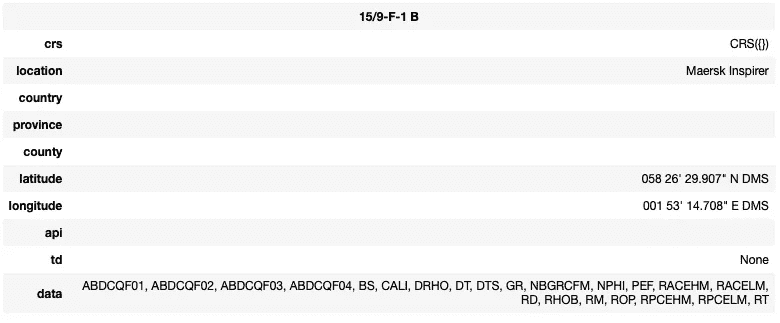
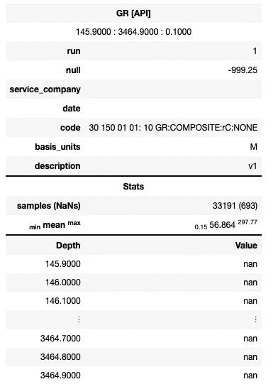
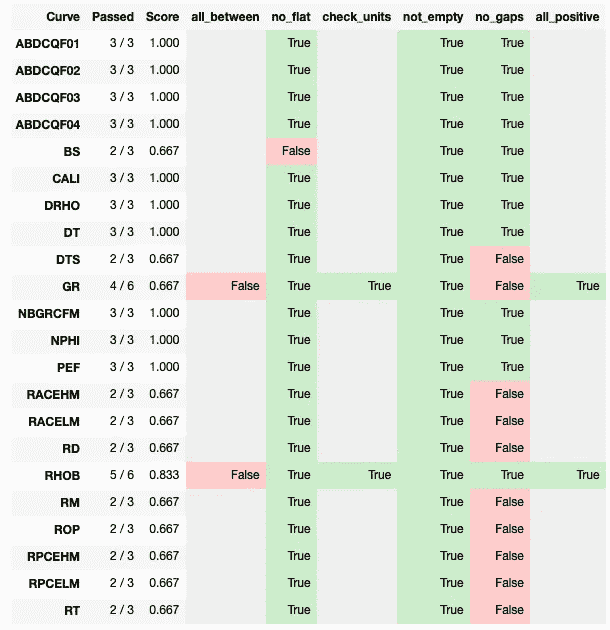
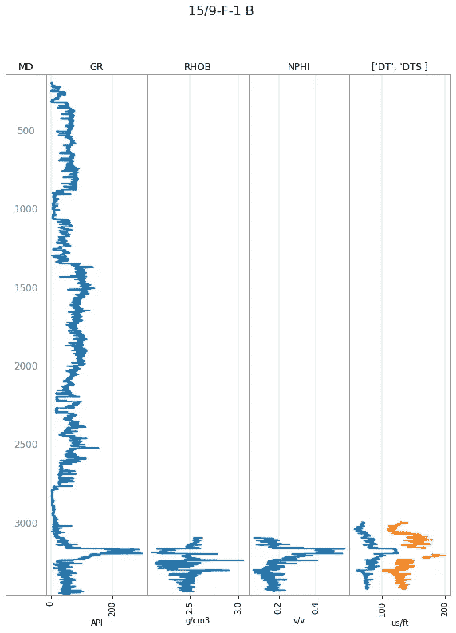
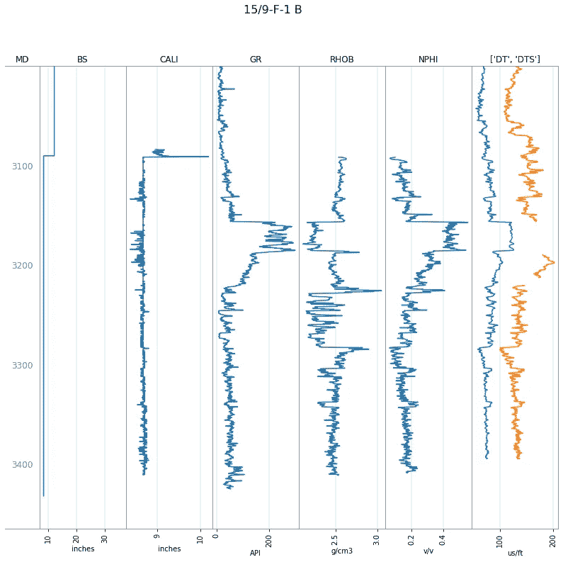
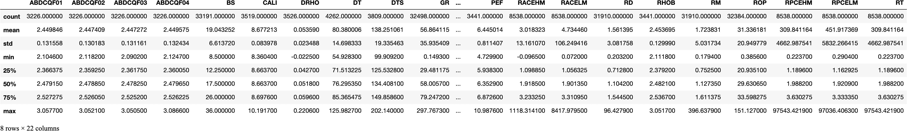

# 使用 Welly Python 库探索测井数据

> 原文：<https://towardsdatascience.com/exploring-well-log-data-using-the-welly-python-library-5e808cd3137b?source=collection_archive---------23----------------------->

## 专门用于加载和探索测井 LAS 文件的 Python 库


照片由[阿里·埃利奥特](https://unsplash.com/@hello_ali?utm_source=medium&utm_medium=referral)在 [Unsplash](https://unsplash.com?utm_source=medium&utm_medium=referral) 上拍摄

welly 库由 Agile Geoscience 开发，用于加载、处理和分析单井或多口井的测井数据。该库允许探索 las 文件头中的元数据，还包含显示典型测井记录的绘图功能。此外，welly 库包含用于识别和处理数据质量问题的工具。

Welly 库可以在 https://github.com/agile-geoscience/welly[的敏捷地球科学 GitHub 上找到](https://github.com/agile-geoscience/welly)

在这个简短的教程中，我们将看到如何从 Volve 字段加载一个井，并探索这个库中可用的一些功能。

使用不同数据的这篇文章的视频版本可以在下面找到。

## 数据集

我们正在使用的数据集来自于 2018 年发布的公开发布的 Equinor Volve Field 数据集。本教程中使用的文件来自 15/19-F1B 井。Volve 数据集的详细信息可以在[这里](https://www.equinor.com/en/what-we-do/norwegian-continental-shelf-platforms/volve.html)找到。

本教程是我的 Python 和岩石物理学系列的一部分。之前文章的链接可以在[这里](https://www.andymcdonald.scot/portfolio/proj_python_petrophysics/)找到。

本文附带的笔记本可以在 GitHub 资源库中找到:[https://github.com/andymcdgeo/Petrophysics-Python-Series](https://github.com/andymcdgeo/Petrophysics-Python-Series)

## 导入库和数据

本教程的第一步是从 Welly 库中加载所需的模块，Well 和 Curve。这些模块用于处理测井数据和单独的曲线。

```
from welly import Well
from welly import Curve

import matplotlib.pyplot as plt
```

我们的 LAS 文件可以使用`Well.from_las()`方法加载。这将创建一个新的井对象。

```
well = Well.from_las('Data/15_19_F1B_WLC_PETRO_COMPUTED_INPUT_1.LAS')
```

# 数据探索

## 文件和油井信息

现在我们的数据已经加载完毕，我们可以开始研究所选井的内容和元数据。如果我们调用我们的`well`对象，我们将看到一个包含井名、位置、坐标和曲线助记符列表的汇总表。

```
well
```



我们还可以调用特定的函数来访问所需的信息。

第一个是`header`，它将返回关键的标题信息，包括井名、唯一的井标识符(UWI)、字段名称和公司名称。

```
well.header
```

这将返回:

```
{'name': '15/9-F-1 B', 'uwi': '', 'field': 'VOLVE', 'company': 'Statoil Petroleum'}
```

现在让我们来看看这口井的位置信息。为此，我们可以为我们的数据对象调用`.location`方法。

```
well.location
```

这会以字典的形式返回一个位置对象。

```
Location({'position': None, 'crs': CRS({}), 'location': 'Maersk Inspirer', 'country': '', 'province': '', 'county': '', 'latitude': '058 26\' 29.907" N    DMS', 'longitude': '001 53\' 14.708" E    DMS', 'api': '', 'td': None, 'deviation': None})
```

我们正在使用的文件不包含太多关于井的位置的信息，但是我们有关于纬度和经度的信息。这些可以通过在定位方法中添加`.latitude`和`.longitude`来提取，并转换成更容易阅读的格式。

```
lati = well.location.latitude
long = well.location.longitude

print(lati)
print(long)
```

对这些方法使用 print 函数可以提供更好的输出。

```
058 26' 29.907" N    DMS
001 53' 14.708" E    DMS
```

## 探索数据

我们在上一节中看到，在查看井口时，我们有许多曲线。通过调用`count_curves()`函数，我们可以知道有多少。

```
well.count_curves()
```

这将返回总共 22 条曲线。

我们还可以使用方法`_get_curve_menmonics()`获得 las 文件中的曲线助记符列表。

```
well._get_curve_mnemonics()
```

这将返回 las 文件中所有助记符的列表。

```
['ABDCQF01',
 'ABDCQF02',
 'ABDCQF03',
 'ABDCQF04',
 'BS',
 'CALI',
 'DRHO',
 'DT',
 'DTS',
 'GR',
 'NBGRCFM',
 'NPHI',
 'PEF',
 'RACEHM',
 'RACELM',
 'RD',
 'RHOB',
 'RM',
 'ROP',
 'RPCEHM',
 'RPCELM',
 'RT']
```

查看所有曲线的另一种方法是调用`.data`。这将返回一个包含井名的 dictionary 对象，以及该曲线的前 3 个和后 3 个值。

```
well.data
```

如下例所示，许多第一个和最后一个值被列为 nan，它代表非数字。

```
{'ABDCQF01': Curve([nan, nan, nan, ..., nan, nan, nan]),
 'ABDCQF02': Curve([nan, nan, nan, ..., nan, nan, nan]),
 'ABDCQF03': Curve([nan, nan, nan, ..., nan, nan, nan]),
 'ABDCQF04': Curve([nan, nan, nan, ..., nan, nan, nan]),
 'BS': Curve([36\. , 36\. , 36\. , ...,  8.5,  8.5,  8.5]),
 'CALI': Curve([nan, nan, nan, ..., nan, nan, nan]),
 'DRHO': Curve([nan, nan, nan, ..., nan, nan, nan]),
 'DT': Curve([nan, nan, nan, ..., nan, nan, nan]),
 'DTS': Curve([nan, nan, nan, ..., nan, nan, nan]),
 'GR': Curve([nan, nan, nan, ..., nan, nan, nan]),
 'NBGRCFM': Curve([nan, nan, nan, ..., nan, nan, nan]),
 'NPHI': Curve([nan, nan, nan, ..., nan, nan, nan]),
 'PEF': Curve([nan, nan, nan, ..., nan, nan, nan]),
 'RACEHM': Curve([nan, nan, nan, ..., nan, nan, nan]),
 'RACELM': Curve([nan, nan, nan, ..., nan, nan, nan]),
 'RD': Curve([nan, nan, nan, ..., nan, nan, nan]),
 'RHOB': Curve([nan, nan, nan, ..., nan, nan, nan]),
 'RM': Curve([nan, nan, nan, ..., nan, nan, nan]),
 'ROP': Curve([    nan,     nan,     nan, ..., 29.9699, 29.9903,     nan]),
 'RPCEHM': Curve([nan, nan, nan, ..., nan, nan, nan]),
 'RPCELM': Curve([nan, nan, nan, ..., nan, nan, nan]),
 'RT': Curve([nan, nan, nan, ..., nan, nan, nan])}
```

我们可以更深入地研究 las 文件中的每条曲线，方法是传递曲线的名称，如下所示:

```
well.data['GR']
```



这为我们提供了一些曲线的汇总统计数据，例如:

*   空值是什么
*   曲线单位
*   曲线数据范围
*   数据的步长值
*   样本总数
*   缺失值的总数(nan)
*   曲线的最小值、最大值和平均值
*   曲线描述
*   前 3 个和后 3 个值的列表

# 数据质量控制

检查测井数据的质量是岩石物理工作流程的重要组成部分。

井眼环境可能是一个恶劣的环境，具有高温、高压、不规则的井眼形状等，所有这些都会对测井测量产生影响。这可能会导致许多问题，如缺失值、异常值、常量值和错误值。

welly library 附带了许多质量控制检查，允许我们检查所有数据或特定曲线的问题。

质量控制检查包括:

*   检查间隙/缺失值:`.no_nans(curve)`
*   检查整条曲线是否为空:`.not_empty(curve)`
*   检查曲线是否包含常数值:`.no_flat(curve)`
*   检查单位:`check_units(list_of_units)`
*   检查值是否都为正:`all_positive(curve)`
*   检查曲线是否在范围内:`all_between(min_value, max_value)`

方法的完整列表可在 Welly 帮助文档中找到:[https://Welly . readthedocs . io](https://welly.readthedocs.io)

开始之前，我们需要导入质量模块，如下所示:

```
import welly.quality as wq
```

在我们运行任何质量检查之前，我们首先需要创建一个列表，列出我们想要运行的测试以及我们想要运行这些测试的数据。

要做到这一点，我们可以建立一个字典，关键字是我们想要运行检查的曲线。如果想在所有的曲线上运行它，我们需要使用键`Each`。

对于每条曲线，我们将检查是否有任何平线值，任何差距，并确保曲线不是空的。对于伽马射线(GR)和体积密度(RHOB)曲线，我们将检查所有值是否为正值，它们是否在标准范围内，以及单位是否是我们期望的。

```
tests = {'Each': [wq.no_flat,
                 wq.no_gaps,
                 wq.not_empty],
        'GR': [
                wq.all_positive,
                wq.all_between(0, 250),
                wq.check_units(['API', 'GAPI']),
        ],
        'RHOB': [
                wq.all_positive,
                wq.all_between(1.5, 3),
                wq.check_units(['G/CC', 'g/cm3']),
        ]}
```

我们可以按原样运行测试，但是，输出不容易阅读。为了更容易和更好，我们将使用 IPython.display 的 HTML 函数来制作一个漂亮的表格。

一旦模块被导入，我们可以创建一个名为`data_qc_table`的变量来存储信息。分配给这个变量的是`data.qc_table_html(tests)`，它从我们上面创建的`tests`字典中生成表格。

```
from IPython.display import HTML
data_qc_table = well.qc_table_html(tests)
HTML(data_qc_table)
```



运行测试后，我们可以看到返回了一个彩色的 HTML 表。任何用绿色突出显示的都是真的，任何用红色突出显示的都是假的。

从表中我们可以看出，BS(位大小)曲线在三次测试中有一次失败。在`no_flat`栏下，我们标记了一个错误值，表明该曲线包含常量/平坦值。当钻头尺寸曲线测量钻头直径时，这已被正确标记，钻头直径对于给定的一次运行或一系列运行是恒定的。

我们还可以看到许多曲线被标记为包含间隙。

表中还可以看到只针对 GR 和 RHOB 运行的测试。当我们在特定的曲线上运行特定的测试时，结果的剩余部分将变灰。

我们可以运行另一个测试来识别不是 nan 的数据部分。为此，我们设置了一个新的测试，并使用`Each`应用于所有曲线。

```
tests_nans = {'Each': [wq.fraction_not_nans]}

data_nans_qc_table = well.qc_table_html(tests_nans)
HTML(data_nans_qc_table)
```


一旦我们运行这些测试，我们就会看到一个类似于上面的表格。在最后一列中，我们有每条曲线值的总分数，这不是一个 nan。这些值是十进制的，值 1.0 表示 100%完整。分数列包含该数字的四舍五入形式。

我们可以写一个短循环，并打印出每条曲线的百分比值。这提供了一个更清晰的表格来了解每条曲线的缺失数据百分比。

```
print((f'Curve \t % Complete').expandtabs(10))
print((f'----- \t ----------').expandtabs(10))

for k,v in well.qc_data(tests_nans).items():

    for i,j in v.items():
        values = round(j*100, 2)
    print((f'{k} \t {values}%').expandtabs(10))
```

这将返回一个漂亮的

```
Curve      % Complete
-----      ----------
ABDCQF01   9.72%
ABDCQF02   9.72%
ABDCQF03   9.72%
ABDCQF04   9.72%
BS         100.0%
CALI       10.6%
DRHO       10.62%
DT         12.84%
DTS        11.48%
GR         97.91%
NBGRCFM    39.73%
NPHI       10.28%
PEF        10.37%
RACEHM     25.72%
RACELM     25.72%
RD         96.14%
RHOB       10.37%
RM         96.14%
ROP        97.57%
RPCEHM     25.72%
RPCELM     25.72%
RT         25.72%
```

从结果中我们可以看出，许多曲线的缺失值百分比很高。这可能是由于一些测量直到井更深时才开始。我们将能够在下一节用图来确定这一点。

# 数据绘图

可视化测井数据是岩石物理学的核心，测井曲线是最常见的显示格式之一。welly 库允许快速、轻松地生成测井曲线。

首先，我们生成一个我们希望在每个轨道中显示的数据列表。如果我们想在一个轨迹中显示多条曲线，我们可以嵌入另一个列表，例如`['MD', ['DT', 'DTS']]`。内部列表中的曲线将绘制在相同的轨迹上，并且比例相同。

接下来，我们可以调用 plot 函数并传入曲目列表。

```
tracks = ['MD', 'GR', 'RHOB', 'NPHI', ['DT', 'DTS']]
well.plot(tracks=tracks)
```



正如在“数据质量”一节中所讨论的，我们假设一些测井曲线没有一直延伸到油井顶部。这是非常常见的做法，避免了从油井顶部到底部运行工具的需要和成本。

让我们把较低的音程放大一点。为此，我们可以使用常规的 matplotlib 函数来设置 y 轴限制。请注意，我们确实需要颠倒数字，以便首先是较深的值，然后是较浅的一秒。

```
tracks = ['MD', 'BS', 'CALI', 'GR', 'RHOB', 'NPHI', ['DT', 'DTS']]
well.plot(tracks=tracks)
plt.ylim(3500, 3000)(3500.0, 3000.0)
```



从结果中我们可以看到，我们现在只需很少的努力就可以得到一个漂亮的图。

但是，对绘图外观的控制受到当前实施的限制，不允许对绘图进行粒度控制，如颜色、比例和显示反比例曲线(如中子和密度曲线)。

# 测井数据到熊猫数据框

在最后一节中，我们将看看如何将测井数据从 welly 导出到 pandas。Pandas 是最受欢迎的存储、分析和操作数据的图书馆之一。

转换是一个简单的过程，可以通过调用我们的 well 对象上的`.df()`来实现。

```
df = well.df()
```

我们可以通过从 pandas 调用`.describe()`方法来查看数据的汇总统计来确认数据已经被转换。

```
df.describe()
```



# 摘要

由 Agile-Geoscience 开发的 welly library 是一个处理和探索测井记录文件的强大工具。在本例中，我们已经了解了如何加载单个 las 文件，探索关于油井和曲线内容的元信息，并在测井图上显示测井数据。

Welly 有更多的功能，可以处理多个测井记录，并根据钻井数据创建合成地震图。

你可以在这里找到并探索 welly 知识库[。](https://github.com/agile-geoscience/welly)

***感谢阅读！***

如果您觉得这篇文章有用，请随时查看我的其他文章，这些文章介绍了 Python 和测井数据的各个方面。你也可以在[*GitHub*](https://github.com/andymcdgeo)*找到我在这篇文章和其他文章中使用的代码。*

*如果你想联系我，你可以在*[*LinkedIn*](https://www.linkedin.com/in/andymcdonaldgeo/)*或者我的* [*网站*](http://andymcdonald.scot/) *找到我。*

有兴趣了解更多关于 python 和测井数据或岩石物理学的知识吗？跟我上 [*中*](https://medium.com/@andymcdonaldgeo) *。*