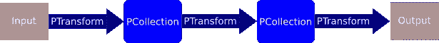
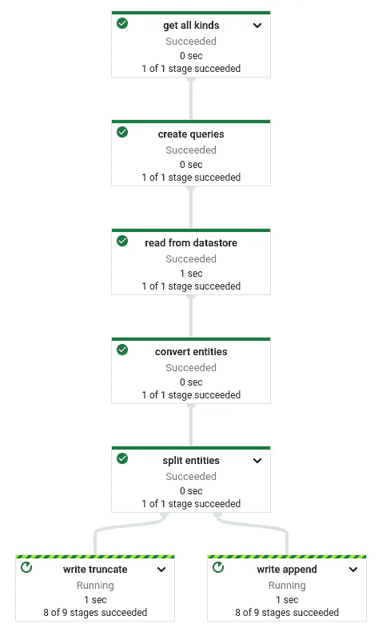
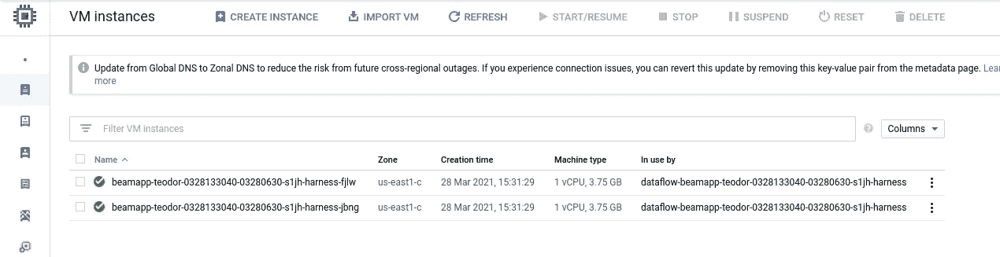
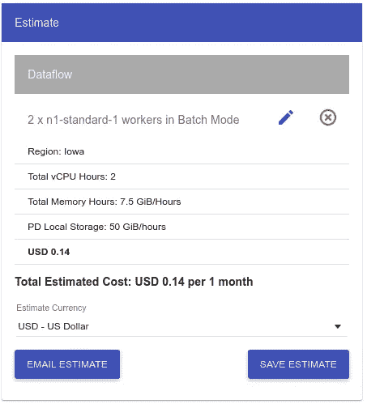

# 使用 Google 数据流将数据存储导出到 BigQuery

> 原文：<https://towardsdatascience.com/export-datastore-to-bigquery-using-google-dataflow-1801c25ae482?source=collection_archive---------14----------------------->


波多黎各德拉克鲁斯(作者)

## 如何使用 Google Dataflow 将数据存储导出到 BigQuery，并对实体进行额外过滤

在上一篇文章中，我展示了如何构建一个无服务器的解决方案，将各种数据从 Datastore 导出到 BigQuery。该文章中介绍的方法完全有效，甚至适用于大型数据存储。然而，主要的缺点是每次我们将所有行从数据存储导出到 BigQuery。对于大型数据存储来说，这可能会产生不必要的成本，消耗不必要的时间。

</serverless-approach-to-export-datastore-to-bigquery-4156fadb8509>  

解决这个问题的方法之一是对数据库进行一系列更新。例如， [AWS DynamoDB](https://aws.amazon.com/dynamodb/) 提供了[流](https://docs.aws.amazon.com/amazondynamodb/latest/developerguide/Streams.html)，可以很容易地与 AWS Lambdas 链接。在[谷歌 Firestore](https://cloud.google.com/firestore) (被命名为数据存储的下一代[)中可以找到非常相似的功能，其中对文档的更改会触发云功能—](https://cloud.google.com/datastore/docs/firestore-or-datastore) [参见文档。](https://cloud.google.com/functions/docs/calling/cloud-firestore)

尽管 datastore 不提供任何流功能，但我们仍然可以尝试通过使用查询来解决这个问题。数据存储库[导入/导出](https://cloud.google.com/datastore/docs/export-import-entities)不支持实体的本地过滤。因此，我们必须手动操作*。*程序如下:

1.  过滤实体，导出到 JSON，存储到云存储中
2.  将 JSONs 从云存储加载到 BigQuery

让我用谷歌数据流来完成这个任务。

Google Dataflow 是一个托管解决方案，用于执行不同的数据处理模式，如 ETL、批处理和流处理。但是谷歌数据流是[数据流模型](http://www.vldb.org/pvldb/vol8/p1792-Akidau.pdf)的可能实现之一。用于描述处理的 SDK 是在框架 [Apache Beam](https://beam.apache.org/) 下实现的。

# 数据流管道

数据流模型是围绕管道组织的，管道是你从头到尾的数据处理工作流程。在管道内部，有两个对象很重要。PCollection 表示分布式数据集，PTransform 表示对 PCollection 的处理操作。



p 收集/p 转换概述(按作者)

我将使用 Python 作为编程语言。但是，管道也可以在 Java 和 Golang 中构建。完整的工作示例可在 GitHub 项目中获得([https://GitHub . com/jkrajniak/demo-datastore-export-filtering](https://github.com/jkrajniak/demo-datastore-export-filtering))。在这里，我将只对重要的代码块进行评论。

<https://github.com/jkrajniak/demo-datastore-export-filtering>  

## 管道

让我们开始构建管道:

```
with beam.Pipeline(options=pipeline_options) as p:
    # Create a query and filter
```

这将创建一个管道`p`，选项存储在`pipeline_options`中。接下来，操作符`|`将被用于连接每个*p 转换块*

```
rows = p | 'get all kinds' >> GetAllKinds(project_id, to_ignore)
```

这是第一阶段，它将从给定项目的数据存储中读取所有类型，并从该列表中产生一个 PCollection。该块在内部实现了`expand`方法(如下)。此外，过滤是为了去除一些我们不希望被导出的种类。最后，`[Create](https://github.com/apache/beam/blob/master/sdks/python/apache_beam/transforms/core.py#L2906)` [转换](https://github.com/apache/beam/blob/master/sdks/python/apache_beam/transforms/core.py#L2906)用于从种类列表中构建一个 p 集合。

接下来，对于每一种类型，我们必须构建一个查询——这是通过下一个 PTransform 块`'create queries'`实现的

```
rows = (p 
        | 'get all kinds' >> GetAllKinds(project_id, to_ignore)
        | 'create queries' >> beam.ParDo(CreateQuery(project_id, param))
       )
```

我们使用`[ParDo](https://beam.apache.org/documentation/programming-guide/#pardo)`，它是一个通用的并行处理转换模块。它接受一个从`beam.DoFn`类派生的对象，该对象必须实现方法`process(self, *args, **kwargs)`。下面是`CreateQuery`类的`process`方法的实现。

```
def process(self, kind_name, **kwargs):
    *"""* ***:param*** ***kwargs:* ***:param*** *kind_name: a kind name* ***:return****: Query
    """* logging.info(f'CreateQuery.process {kind_name} {kwargs}')

    q = Query(kind=kind_name, project=self.project_id)
    if kind_name in self.entity_filtering:
        q.filters = self.entity_filtering[kind_name].get_filter()

    logging.info(f'Query for kind {kind_name}: {q}')

    yield q
```

上面的方法负责根据过滤参数生成获取元素的查询。一个简单的 YAML 配置文件用于定义过滤选项

这个解决方案的一个重要注意事项。数据存储中的实体需要有一些可用于获取记录子集的字段。在这个例子中，我们设置字段`timestamp`将用于获取记录的子集。如果管道每天执行一次，那么记录匹配查询`(endTime-24h)<= timestamp < endTime`将被选择。您可以想象任何其他类型的查询，而不仅仅是基于时间戳。例如，您可以将上次获取的记录的 id 存储在某个地方，下次只获取比存储的 id 大的记录。

接下来，我们向管道添加另外三个元素:

*   应用查询和提取实体
*   将实体转换为 JSON
*   将 JSONs 保存到 BigQuery

管道中的最后两个阶段非常明显:

*从数据存储中读取*使用上一步中创建的查询从数据存储中获取实体。结果，创建了来自数据存储的实体的 p 集合。接下来，在`beam.Map(entity_to_json)`中，每个实体都被转换成 JSON 表示。`beam.Map`是`beam.ParDo`的特例。它从 PCollection 中获取一个元素并生成一个元素。

管道的最后一个元素是输出 PTransform。没有经过过滤的实体被定向到一个空表中。另一个是从过滤中获得的，被附加到现有的表中。为了将元素导入这两个输出，我们使用了一个[标记特性](https://beam.apache.org/documentation/programming-guide/#additional-outputs)，它允许生成多个 PCollections。

如果种类名称在要过滤的选项中，那么我们用`write_append`标记元素，否则，我们将`write_truncate`标记附加到元素上。

接下来，我们将这两个拆分的集合写入 BigQuery:

在每种写方法中，我们使用`SCHEMA_AUTODETECT`选项。输出表名称是从种类名称动态派生的，如果需要的话。

如果您在 Google Dataflow 中运行管道，那么整个作业将如下所示:



数据管道(按作者)

所以当你调用运行管道的命令时，实际上会发生什么呢？基本上，如果你用 runner `direct`来做，工作流将会在你的本地机器上运行。

有了 runner `dataflow`，工作流将在 GCP 执行。首先，你的管道代码被打包成一个 PyPi 包(你可以在日志中看到命令`python setup.py sdist`被执行)，然后`zip`文件被复制到 Google 云存储桶。下一个工人准备好了。工人无非是[谷歌云计算](https://cloud.google.com/compute)的实例。您甚至可以在云控制台中看到它们:



而且，如果你需要的话，你可以进入它们。请注意，启动 workers、下载并在 workers 上安装您的管道需要时间。

> [事实上，Dataflow 中的最新特性提供了一个定制的 Docker 容器映像。](https://cloud.google.com/dataflow/docs/guides/using-custom-containers)这使您可以减少工作人员的启动时间(所有依赖项都已经打包到映像中)，您可以使用不公开的第三方库，或者您可以在后台运行一些软件——没有限制。

当代码被安装在工人身上时，管道被执行。

## 为什么不是纯云功能？

让我来讨论一下为什么谷歌数据流而不是纯云功能。云功能可能是一个完全有效的解决方案，但最终，架构和维护会非常困难。首先，与满载模式相反，这里我们必须物理地获取记录，并将它们存储在云存储中。一个函数的内存限制是 4096 MB，最大运行时间是 9 分钟。因此，为了拥有一个健壮的、可伸缩的解决方案，我们必须对一批记录运行多个函数。您可以想象并行执行的树，对于每个页面结果，执行一个函数来获取记录的子集。然后并行的记录将被转换成 JSON 并加载到 BigQuery

为了跟踪并行执行的进度，可以使用与我在之前的[文章中展示的类似的解决方案](https://medium.com/nordcloud-engineering/keep-track-on-your-cloud-computations-67dd8f172479)

<https://medium.com/nordcloud-engineering/keep-track-on-your-cloud-computations-67dd8f172479>  

或者[谷歌工作流](https://cloud.google.com/workflows)。虽然组织起来是可行的，但我认为这种努力不值得可能的成本降低。

## 定价

嗯，您需要为执行时间(按每秒的增量计费)和资源付费。管道至少有一个工作线程，它消耗 vCPU、内存、存储和可选的 GPU。如果您的任务不是计算和存储密集型的，那么您可以通过调整工作选项来更改默认设置。默认情况下，用于批处理的 worker 的磁盘大小设置为 250 GB，用于流处理的 worker 的磁盘大小设置为 400 GB。如果你的处理可以适应内存，那么这是一个相当大的数字。在上面的例子中，我使用了每个工作人员 25 GB 的磁盘大小——这已经足够了。



价格估算，两个工人，每个工人 25GB，每月 vCPU 1 小时(由作者提供)

Google Dataflow 和 Apache Beam model 是一个强大的数据工程工具，允许构建复杂的数据管道。它可以用于批处理和流处理，具有不同的输入源和输出目的地。此外，工作被有效地无缝地分配给工人，没有任何调整。

我希望你喜欢这个故事，它会对你的日常工作有所帮助。如果您有任何问题或建议，请随时通过 [Twitter](https://twitter.com/MrTheodor) 或 [Linkedin](https://www.linkedin.com/in/jkrajniak/) 联系我。