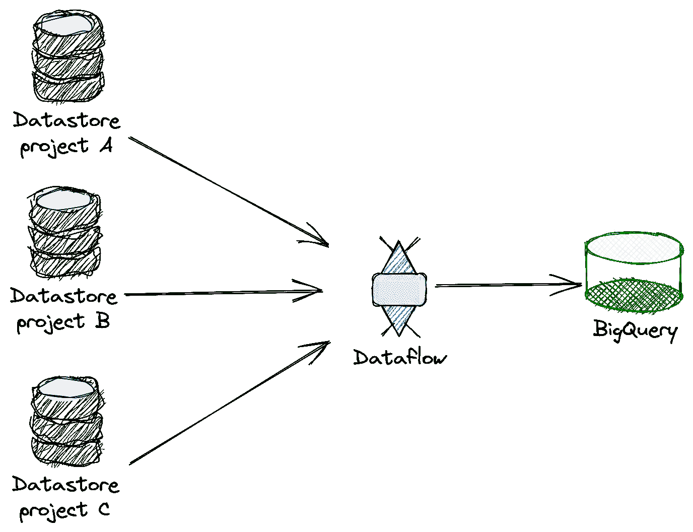
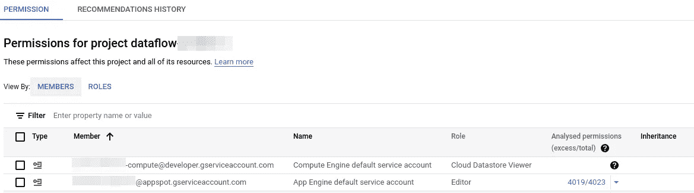
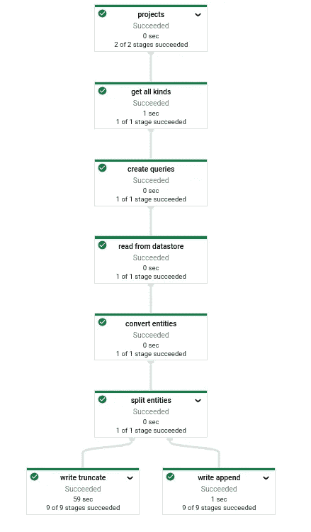

# 将多个项目中的数据存储导出到 BigQuery

> 原文：<https://towardsdatascience.com/export-datastores-from-multiple-projects-to-bigquery-3da9c92a4b8f?source=collection_archive---------20----------------------->


Nieuwpoort(作者)

## 如何使用 Google Dataflow 从多个项目中导出数据存储——对实体进行额外过滤。

这是对我之前的[故事](/export-datastore-to-bigquery-using-google-dataflow-1801c25ae482)的一个简短扩展，在那里我描述了如何将数据从 Datastore 增量导出到 BigQuery。在这里，我将讨论如何将前面的解决方案扩展到在多个项目中拥有数据存储的情况。目标保持不变，我们希望在 BigQuery 中获得数据。

[](/export-datastore-to-bigquery-using-google-dataflow-1801c25ae482) [## 使用 Google 数据流将数据存储导出到 BigQuery

### 如何使用 Google Dataflow 将数据存储导出到 BigQuery，并对实体进行额外过滤。

towardsdatascience.com](/export-datastore-to-bigquery-using-google-dataflow-1801c25ae482) 

总的来说，这个问题可以用下图来表示



建筑草图(作者)

数据流过程可以存在于一个源项目中，也可以放在一个单独的项目中——我将把数据流过程放在一个单独的项目中。结果可以存储在 BigQuery 中，该 big query 可以位于与数据流流程相同的项目中，也可以位于另一个项目中。

# 一般化

让我们从概括开始。首先，我用两个新字段扩展了配置文件:`SourceProjectIDs`它只不过是源 GCP 项目的列表，而`Destination`定义了输出 BigQuery 数据集的位置。

```
SourceProjectIDs:
  - project-a
  - project-b
  - project-c
Destination:
  ProjectID: dataflow-streaming
  Dataset: datastore_dev
```

扩展数据流管道定义如下:

```
rows = (
    p
    | **'projects'** >> beam.Create(project_ids)
    | **'get all kinds'** >> beam.ParDo(GetAllKinds(prefix_of_kinds_to_ignore))
    | **'create queries'** >> beam.ParDo(CreateQuery(entity_filtering))
    | **'read from datastore'** >> beam.ParDo(ReadFromDatastore._QueryFn())
    | **'convert entities'** >> beam.Map(entity_to_json)
)
```

它被扩展了一个额外的步骤`projects`，这个步骤产生了带有一个源项目列表的`PCollection`(来自配置文件)。需要对`get all kinds`步骤做一点小小的改动。`GetAllKinds`被改为 PTransform 步骤，为每个项目创建一个元组列表`(project_id, kind_name)`。

DoFn 的`process`方法接受元组作为任何其他可序列化的对象。至此，下一步`create queries`创建查询，从特定的`kind_name`获取记录，这些记录保存在`project_id`的数据存储中。

```
def process(self, project_kind_name, **kwargs):
    *"""
    :param **kwargs:
    :param project_kind_name: a tuple with project_id, kind_name
    :return: [Query]
    """* project_id, kind_name = project_kind_name
```

这个步骤产生的查询已经包含了`project_id`，所以我们不再需要传递项目 id。

存储在 BigQuery 中的 JSON 对象的模式在`__key__`字段中还包含一个属性`project`。BigQuery 中输出表的名称是通过在`kind_name`前面加上`project_id`来构造的。

# 都是权限的问题

所提出的解决方案的线索在于权限。数据流使用两个服务帐户(SA)，一个在作业创建期间使用，另一个由工作实例用来访问资源。

我们对工人使用的 SA 感兴趣。默认情况下，当为您的项目启用计算引擎 API 时，会自动创建此服务帐户，并有一个标准名称`<project-number>-compute@developer.gserviceaccount.com`

因此，让您的数据流管道访问不同项目中的数据存储。因此，在每个源项目中，将帐户`<project-number>-compute@developer.gserviceaccount.com`添加到角色为`role/datastore.viewer`的项目中。



源项目之一中的 IAM 权限(按作者)

仅此而已——管道按预期工作:



具有项目步骤的扩展管道(作者)

数据流是自动化 ETL 过程的强大工具。正如你所看到的，它可以很容易地推广到与不需要与数据流过程存在于同一个项目中的源一起工作。

这个故事的灵感来自于安德鲁·弗莱舍提出的问题——谢谢！

我希望你喜欢这个故事，它会对你的日常工作有所帮助。如果您有任何问题或建议，请随时通过 [Twitter](https://twitter.com/MrTheodor) 或 [Linkedin](https://www.linkedin.com/in/jkrajniak/) 联系我。