# 从/向 Google 云平台导出数据

> 原文：<https://towardsdatascience.com/exporting-data-from-google-cloud-platform-72cbe69de695?source=collection_archive---------6----------------------->

## GCP 数据流管理指南

我已经在另一篇文章的[中讨论了 GCP 的一些功能，这将指导你自动执行简单的代码块。](https://juls-dotcom.github.io/google%20cloud.html)

可能会派上用场的一件事是，不仅在 GCP 上执行代码，而且将代码的结果导出为一个文件，您可以在某个地方访问它。

注意，这里表达的观点是我自己的。我不是 GCP 认证用户，下面描述的过程是我自己做的，灵感来自网上的许多来源和花在云上的时间……可能有更好的方法来实现下面陈述的目标。

在这篇文章中，我将讨论两种不同的方法，它们将允许您将代码执行的结果导出到:

*   **1)云桶(带有大查询表的选项):**如果您需要对 GCP 执行额外的操作，例如对某些数据表执行常规的 ML 预测，大查询表将非常有用。如果您想获取可视化数据，也可以通过 Tableau 或 Power BI 等第三方软件访问它们。
*   **2)Google Drive:**Google Drive export 将允许您为许多用户提供简单可读的访问，如果数据要定期共享以供进一步*个人*使用的话。
*   **3) FTP 服务器:**您的组织可能正在使用 FTP 服务器来交换和/或存储数据。

# 1.导出到 GCP 存储桶

## 1)创建 GCP 存储桶

要在大型查询表上导出文件，您应该首先在 GCP [存储桶](https://cloud.google.com/storage/docs/json_api/v1/buckets)上导出数据。存储页面将显示当前存在的所有存储桶，并为您提供创建存储桶的机会。

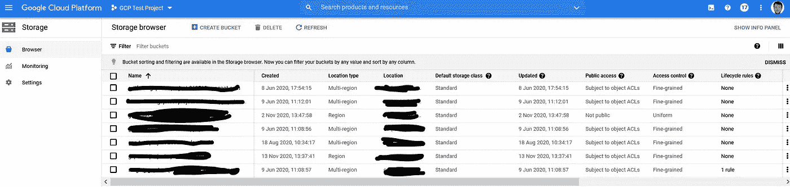

进入云存储页面，点击`Create a Bucket`。参见[文档](https://cloud.google.com/storage/docs/creating-buckets)配置铲斗的不同参数。

创建后，您存储桶将可以使用给定的名称`my_test_bucket`进行访问。

## 2)创建服务帐户密钥

我建议你使用一个`service account key`来监视和控制对你的桶的访问。您可以在这里创建一个服务帐户密钥[，这将允许您将该密钥链接到您的存储桶。将文件下载和上传到存储桶时，需要使用密钥进行预先识别](https://cloud.google.com/iam/docs/creating-managing-service-account-keys#iam-service-account-keys-create-console)

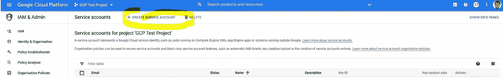

密钥将是一个具有以下结构的`.json`:

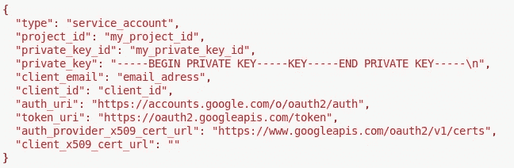

## 3)在代码文件中输入 python 代码片段

创建目标存储桶和服务帐户密钥后，您可以使用 python 代码继续复制存储桶中的文件。

1.  首先，我们导入所需的库。我使用了以下版本

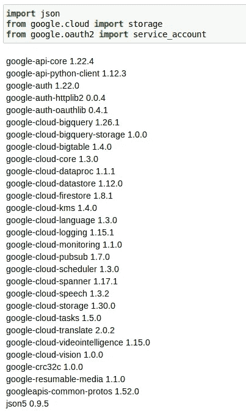

2.然后，我们定义您正在使用的项目 ID，以及您之前生成的服务帐户令牌的路径。

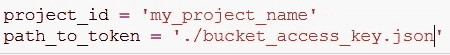

3.我们现在可以使用令牌进行身份验证:

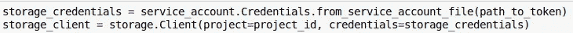

4.现在我们已经确定了，我们需要(I)定义目标存储桶(您在本教程开始时创建的)和(ii)定义放置区，即存储桶中文件将被复制到的位置。在我的例子中，我将文件复制到一个子文件夹/tmp 中(bucket 中没有真正的子文件夹，但它是这样显示的):

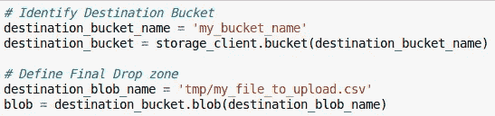

5.将文件上传到存储桶

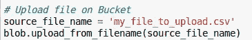

如果您现在访问您的 bucket，您应该看到文件被复制到子文件夹/tmp 中。根据您的帐户被授予的权限，如果该文件夹不存在，您可能无法在存储桶中创建子文件夹。同样，您可能无法创建文件，而只能编辑它。如果您在上述步骤中遇到问题，请尝试复制 bucket 的根目录和/或手动上传一个具有相同文件名的文件。不过，我不能 100%肯定这些担忧是正确的。

## 4)可选:导出 BigQuery 表上的文件

我们只是将数据导出为云桶上的. csv 文件。但是，您可能希望在云中以表格格式保存数据。如果您想在表上启动 ML 管道，或者将第三方软件(例如 Tableau)连接到数据，这可能会很有用。

由于这些步骤在[谷歌文档](https://cloud.google.com/bigquery/docs/loading-data-cloud-storage-csv)中有很好的描述，我就不在这里赘述了。然而，鉴于在 GCP 上存储数据的成本较低，我建议对你的数据进行云存储，这样你就可以随时访问它并自动使用它。

# 2.在 Google Drive 上导出

在 Google Drive 上导出文件有很多好处，特别是如果您组织中的用户不熟悉云技术和界面，并且喜欢使用旧的电子表格导航。然后，您可以将数据保存在`.xlsx`或`.csv`中，并将文件导出到用户可以访问的驱动器上。

我们将使用 [PyDrive](https://pypi.org/project/PyDrive/) 来控制上传和下载文件到 Google Drive。您需要获得一个`client_secrets.json`文件，将您的代码链接到您想要复制文件的帐户。您可以按照此处描述的[步骤轻松创建该文件。](https://developers.google.com/adwords/api/docs/guides/authentication?authuser=3)

我按照这些步骤[在这里](https://stackoverflow.com/questions/24419188/automating-pydrive-verification-process)复制一个文件到 GDrive 上。这个解决方案的好处是只需要对 Google 帐户进行一次认证，这就创建了一个文件`mycreds.txt`。然后，在进一步的身份验证过程中使用该文件来绕过手动身份验证。

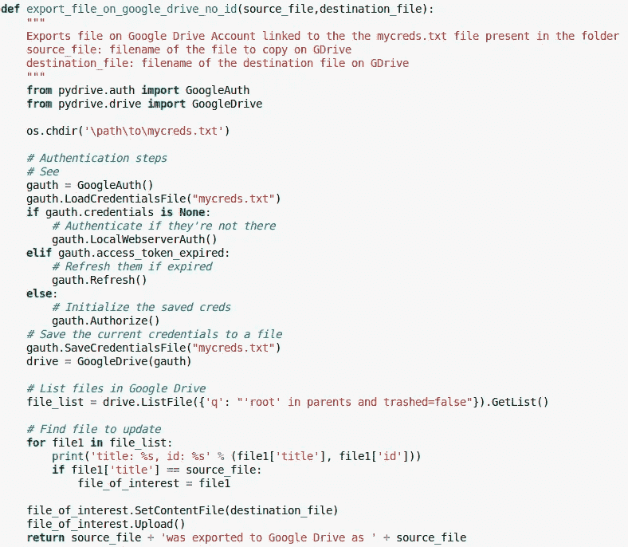

第一次执行此功能将会触发在您的浏览器中打开一个 Google 身份验证步骤。认证成功后，进一步执行导出将使用`mycreds.txt`文件直接访问驱动器并复制数据。

正如你可能已经注意到的，这个解决方案也可以用在 GCP 的其他平台上，或者只是本地的。要在 GCP 使用它，只需认证一次，生成一个`mycreds.txt`文件。如果您手动执行代码，那么请确保该文件存在于您的代码库中。如果您使用 Docker 定期自动执行您的代码，那么请确保将该文件复制到您的`Dockerfile`中。

就是这样！

哦，顺便说一下，使用相同的逻辑，从 GCP 的 Google Drive 获取数据也同样简单。参见下面的功能

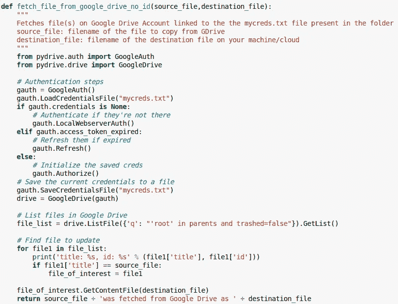

# 3.在 FTP 服务器上导出

如前所述，您可能希望在 FTP 服务器上导出一些数据，以便进一步共享。例如，我必须为一个数据分析师团队设置一个每日数据导出，该导出应该在他们可以访问的 FTP 服务器上交付。数据将通过 API 调用获取，每天在 FTP 上进行管理和导出。

我用的是`[pysftp](https://pypi.org/project/pysftp/)`，0.2.9 版本。

您只需要 FTP 服务器的`hostname`、`username`、`password`，这些应该由您的组织提供。您可以使用下面的函数将位于`localpath`的文件`filename`发送到 FTP 服务器。

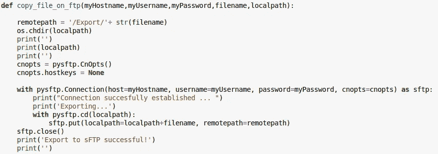

与 GDrive 的情况类似，您可以使用同一个库将文件从 FTP 服务器获取到 GCP 供进一步使用。

下面的函数有一个额外的参数,`ftp_subfolder`参数，它提供了感兴趣的文件所在的子文件夹。

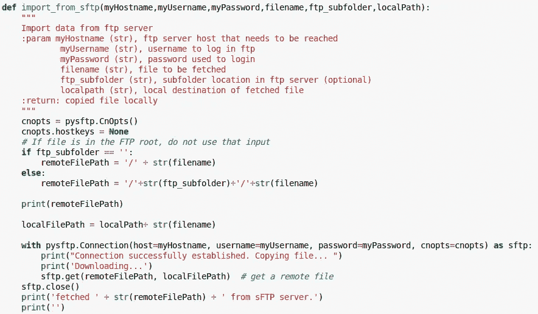

# 4.最后的话

就是这样！这三种方法将允许您实现从&到可能在您的组织中使用的几个数据中心的一些数据流。请记住，这些程序是我自己做的，可能还有改进的余地！:)

将这些方法与[自动代码执行](https://juls-dotcom.github.io/google%20cloud.html)结合起来，应该可以让你部署简单的数据处理，让你的生活更轻松，工作更干净；)

一如既往，我期待评论&建设性的批评！