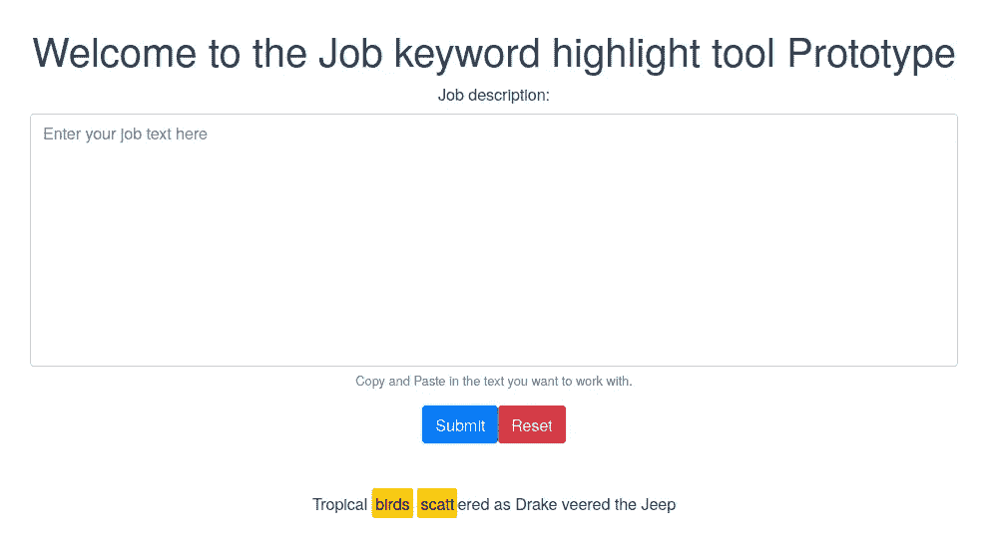
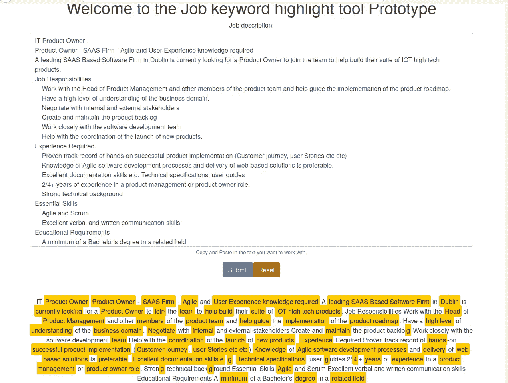

# 为求职者展示 NLP 程序

> 原文：<https://towardsdatascience.com/exposing-nlp-routines-for-job-hunters-90e6aed661a3?source=collection_archive---------42----------------------->

## [从零开始逐个任务地进行数据科学](https://towardsdatascience.com/tagged/dofromscratch)

## 为求职者提供资源来检查关键字匹配


由[汉娜·莱特](https://unsplash.com/@hannahwrightdesigner?utm_source=medium&utm_medium=referral)在 [Unsplash](https://unsplash.com?utm_source=medium&utm_medium=referral) 上拍摄的照片

我正在写一个关于创建 NLP 应用程序来帮助人们改进简历的迷你系列文章。我在我的[初始帖子](/ai-is-working-against-your-job-application-bec65d496d22)中介绍了核心思想，然后我展示了如何[将一个标记应用于特定的关键字](/semantic-highlighting-d2fba3da2822)，最近，我使用 [Python 和 Vue.js](/using-a-python-back-end-b9e4f9ac5d) 创建了一个 shell 应用程序。在这篇为求职者展示 NLP 程序的文章中，我们将关注于构建服务。这一系列为求职者提供了检查关键字匹配的资源，击败了招聘人员的关键字匹配筛选过程。在下一集加入我，修改代码库，全栈风格，并记录我们的进展。

# 用户情景和任务

在敏捷世界中，这相当于一个新的[用户故事](https://www.visual-paradigm.com/guide/agile-software-development/what-is-user-story/)，这个故事有如下一些任务。

**故事:**作为求职者，我希望能够复制&粘贴一份职位描述，并看到突出显示的关键词/短语。

**任务:**

*   后端:将 NLP 类添加到 web 服务器
*   后端:添加一个接收文本、调用 NLP 类并返回关键字的 web 服务路由
*   前端:增加了一个文本区域、表单和提交按钮，允许用户复制和粘贴文本。
*   前端:添加一个 API 调用，将文本段传递给后端，收集响应，重绘 UI。

用[投资框架](https://www.visual-paradigm.com/guide/agile-software-development/what-is-user-story/)测试我们的故事

*   独立的:我们的故事应该是独立的，不依赖于其他功能。我们将不得不修改几个脚本文件，但故事是独立的。
*   可协商的:我们的故事紧紧围绕谁、什么和为什么，但我们避免任何实施细节。UX 的设计者和开发者可以自由设计和制造产品。
*   **有价值的**:一旦我们发布了故事，一个简单的复制&粘贴练习将突出工作描述中的关键词和短语。这样的服务对大多数人来说是很看重的，也是很手工的。
*   **可估计**:如果在最早的阶段，我已经可以看到最多有五个源文件需要修改，那么调整大小就很简单了。
*   **小**:如果你关注我的工作，你会知道我练习极度敏捷，使用 3-4 小时的时间盒。我会说，在我通常的时间范围内，这是一个很好的故事。
*   **Testable** :我们已经知道结果应该是什么——文本应该带有文本标记，显示由后端的自然语言处理算法识别的关键词。

接下来，我们需要定义我们的验收测试来帮助我们

## 验收测试

*   用户可以导航到允许用户输入工作文本的表单
*   用户可以复制并粘贴作业文本，然后按提交按钮来执行分析
*   一旦按钮被按下，文本段落通过 NLP 例程被发送进行处理，并且从管道有一个很好的响应时间
*   用户得到结果，并在屏幕上看到突出显示的关键词。

也许，作为一名数据科学专业人员，你还没有接触过作为敏捷团队的一部分编写特性、故事、史诗或任务级分解。如果您有经验，您可能知道我们正在处理 backlog，整理它，与我们的开发人员进行对话，并在迭代计划之前进行我们的规模估算。作为一名作家，我很容易走捷径，因为我是一个只有我的 scrum 团队。这一部分描述了一个典型的 backlog 整理和迭代计划讨论。通常一个故事点相当于一个人-天的工作量。因此，让我们假设这是一个故事点，但是该特性对我们的服务消费者有价值，因此我们正在优先考虑，它将在 sprint 结束时发布。因为我是一个团队，只有我一个人，所以这是全栈开发的一个例子。

# 后端任务

作为后端开发人员，有两项任务分配给我

*   后端:将 NLP 类添加到 web 服务器
*   后端:添加一个接收文本、调用 NLP 类并返回关键字的 web 服务路由

添加 NLP 类可能是最简单的，因为我已经定义了自己的 Python 类。

```
from nlp import nlp
LangServices = nlp()
```

添加 web 服务路由有点复杂

展示 Python Flask web 路由和相关服务功能的作者工作的图示

所以我创建了一个名为 keywords 的 web route，它允许 HTML post 或 get 操作，并期望以 json 对象的形式获取数据。具体来说，json 对象需要

```
{'text': 'the text given by the user as part of the job definition they are reviewing'}
```

文本值被传递给 NLP 类，该类用一个关键字列表进行响应，这些关键字被包装在一个 JSON objected 中，并被传输到浏览器(前端)。

# 前端任务

作为前端开发人员，有两项任务分配给我

*   前端:增加了一个文本区域、表单和提交按钮，允许用户复制和粘贴文本。
*   前端:添加一个 API 调用，将文本段传递给后端，收集响应，重绘 UI。

构建**用户界面**需要一些设计和 HTML 编码。首先，让我们看看我做的设计，然后我们需要讨论 HTML。



项目 UI 更改的初始模型的作者图片

由于我们处于原型模式，UI 设计保持简单。我们有一个大的文本区域，用户可以复制和粘贴文本。他们可以使用提交按钮来处理文本，或者使用重置按钮来清除文本。Vue.js 组件使用一个叫做模板和脚本的概念。你可以在下面的要点中看到代码。

作者作品中的 HTML 代码示例

我们使用 bootstrap 作为设计系统，模板主要用于绘制表单。<text-highlight>在我的文章中讨论过[语义高亮](/semantic-highlighting-d2fba3da2822)提供标记服务，将关键字涂成黄色。模板还必须有一个附带的<脚本>，你可以在我下面的要点中看到代码。</text-highlight>

有两种方法来维护表单。“OnReset”用于重置按钮按下，而“getKeywords”用于提交按钮功能。如果您需要查看链接，下面是将事件处理程序链接到事件的 HTML 代码行。

```
<b-form @submit="getKeywords" @reset="onReset" v-if="show">
```

“onReset”方法仅用于擦除表单文本并恢复默认值。“getKeywords”稍微复杂一点，但是概括起来就是它对/keywords 路径进行 API 调用，将文本作为 JSON 对象传递。然后，该方法注册承诺的响应，节点事件循环设法从后端收集响应并处理它。返回的关键字列表将替换“查询”变量中存储的默认关键字列表。你可以在下面看到所有的默认值。Vue.js 是动态的，数据变化会强制“dom 更新”。

```
return {
 queries: ['birds','scatt'],
 description: 'Tropical birds scattered as Drake veered the Jeep',
 form: {
  text: ''
 },
 show: true,
 payload: {'text': ""}
}
```

至此，我已经完成了作为这个故事的开发者分配给我的四项任务。我应该担心编写测试用例以及更新任何自动化测试，但是这并不在本文的范围之内。我需要我的测试作为任何开发-运营工作流中的发布条件，导致自动化的 bug 发布和/或代码库更新。现在剩下的就是测试了。

# 测试

有四个测试条件被定义为故事的验收标准

*   用户可以导航到允许该**用户输入工作文本**的表单。这个测试通过了，因为我们有一个基本的布局，有一个文本区和几个按钮来操作它。
*   用户可以复制并粘贴作业文本，然后按下**提交按钮**进行分析。是的，复制&粘贴功能可用，并且我们有提交按钮。
*   一旦按钮被按下，文本段落将通过 NLP 例程进行处理，并且从管道中有一个**良好的响应时间**。你可能会笑，但是 ***的响应时间在我的开发机器上是完美的*** ，但是 ***在 dev 中一切都正常！***
*   **用户得到结果**并看到在他们的屏幕上高亮显示的关键词。是的，我的用户获得了他们的工作；对他们来说，这几乎是实时的，他们可以看到关键词和短语被突出显示。

作为一个更详细的测试，我去找了一份工作描述并试了一下。



作者展示了一个张贴职位描述并查看突出显示的关键词的测试的图片。

测试表明这个故事已经完成，并且会被产品负责人接受，他也是我！

# 关闭

在这篇文章中，我继续我的概念，通过使用自然语言处理例程来帮助求职者加快任何工作申请的关键字分析部分。多年来，我与同事和朋友讨论过机器学习和人工智能从业者如何需要多学科技能，使他们能够快速构建原型并从经验中学习。许多人表示并同意这一需要，因此这是我的贡献。我希望你喜欢这个完整的系列，但是如果你有问题或者对这个系列感兴趣，请随时联系我。