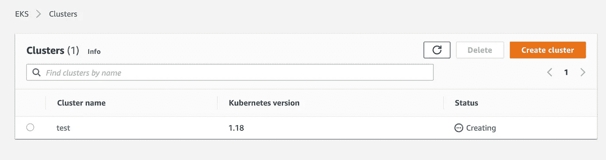
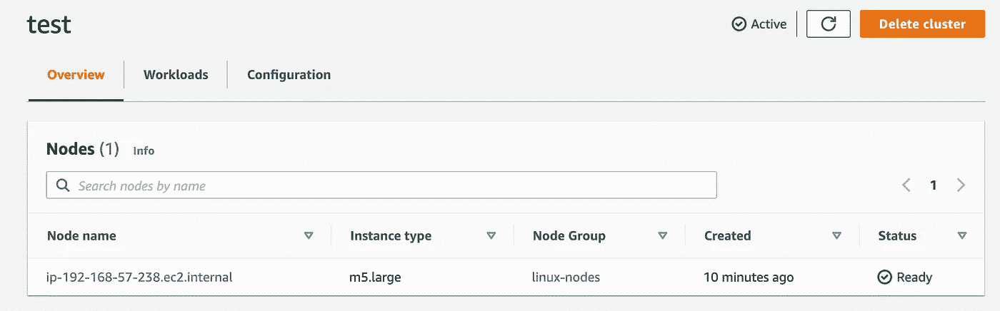

# 在亚马逊 EKS 上公开 Tensorflow Serving 的 gRPC 端点

> 原文：<https://towardsdatascience.com/exposing-tensorflow-servings-grpc-endpoints-on-amazon-eks-e6877d3a51bd?source=collection_archive---------22----------------------->

## gRPC，带 kubernetes、nginx 和 tensorflow 服务

[Tensorflow serving](https://www.tensorflow.org/tfx/guide/serving) 是一种流行的方式，用于打包和部署在 Tensorflow 框架中训练的模型，以进行实时推理。使用官方的 docker 映像和经过训练的模型，您几乎可以瞬间启动一个容器，公开 REST 和 gRPC 端点来进行预测。

关于 tensorflow 服务的大多数示例和文档都集中在流行的 REST 端点使用上。很少有人关注如何适应和使用 gRPC 端点用于他们自己的用例——更少有人提到当您扩展到 kubernetes 时这是如何工作的。


真实活码头鲸的罕见镜头——由[托德·克雷文](https://unsplash.com/@toddcravens?utm_source=medium&utm_medium=referral)在 [Unsplash](https://unsplash.com?utm_source=medium&utm_medium=referral) 上拍摄

在这篇文章中，我将简单介绍 gRPC、kubernetes/EKS、nginx，以及我们如何将它们与 tensorflow 服务结合使用。

# 为什么 gRPC 超过 REST？

有很多原因。首先，gRPC 使用高效的 HTTP 2 协议，而不是传统的 HTTP 1。它还使用语言中立的序列化协议缓冲区，而不是 JSON，这减少了序列化和反序列化大型 JSON 有效负载的开销。

有些人谈论 [API 定义和设计](https://cloud.google.com/blog/products/api-management/understanding-grpc-openapi-and-rest-and-when-to-use-them)的好处，其他人谈论 HTTP 2 的[效率](https://stackoverflow.com/questions/44877606/is-grpchttp-2-faster-than-rest-with-http-2)——但这里是我在机器学习部署方面使用 gRPC 的经验:

*   gRPC 非常高效。通过使用 protobufs，它可以显著减少推理时间和大型 JSON 负载的开销
*   生产中的 gRPC 有一个相当大的学习曲线，要弄清楚它是一件非常痛苦的事情

简而言之，gRPC 可以提供巨大的性能优势。但是作为一个比较随便的 API 开发者，我可以肯定地说不——它并不比 REST“更容易”。对于一个刚接触 gRPC、HTTP 2 和 nginx、TLS/SSL 以及 tensorflow 服务的人来说，有很多问题需要解决。

不过好处还是值得的。我看到在进行初始负载测试时，大批量的推理时间减少了 80%。对于在推理时间方面有严格服务水平协议(SLA)的团队，gRPC 可以成为救命稻草。虽然我不会在这里更深入地解释 gRPC，但是互联网上有很多[帮助你入门的教程](https://www.semantics3.com/blog/a-simplified-guide-to-grpc-in-python-6c4e25f0c506/#:~:text=Google's%20gRPC%20provides%20a%20framework,over%20conventional%20REST%2BJSON%20APIs.)。

# 在 AWS 上设置 Kubernetes 集群

让我们开始设置一个 kubernetes 集群。我们将使用 AWS EKS 和`eksctl`命令行实用程序。在很大程度上，如果你没有 AWS 账户，你也可以在 Docker Desktop 上关注 kubernetes。

如果你还没有安装`eksctl`或`aws-cli`，你可以使用这个库中的 [docker 镜像。它还附带了用于与我们的集群交互的`kubectl`。首先，构建并运行容器。](https://github.com/kylegallatin/eks-demos)

```
docker build -t eksctl-cli .
docker run -it eksctl-cli
```

在新容器中启动 bash 会话后，使用首选用户和 AWS 访问键 id 登录 AWS:

```
aws configure
```

你需要一个密钥、秘密密钥、默认区域名(我用的是`us-east-1`)和类似 json 的输出格式。现在，我们可以检查集群的状态。

```
eksctl get clusters
```

如果你没有像我一样的活跃集群，你会得到`No clusters found`。这样的话，让我们创建一个。

```
eksctl create cluster \
--name test \
--version 1.18 \
--region us-east-1 \
--nodegroup-name linux-nodes \
--nodes 1 \
--nodes-min 1 \
--nodes-max 2 \
--with-oidc \
--managed
```

如果你愿意，你可以改变参数，但是因为这只是一个例子，所以我把集群的大小留得很小。这可能需要一点时间。如果您转到控制台，您将看到您的群集正在创建。



确保您使用正确的用户登录，并查看正确的区域

现在我们的集群已经完成，我们可以安装 nginx 来实现入口和负载平衡。让我们测试一下`kubectl`是否按预期工作。以下是一些命令示例。

```
kubectl config get-contexts
kubectl get nodes
```

您应该看到当前的集群上下文类似于`eksctl@test.us-east-1.eksctl.io`，还可以看到由我们的命令创建的节点。如果您以适当的权限登录(即创建群集时使用的用户)，您可以在控制台中查看类似的内容。



集群很好，所以让我们安装 nginx。回到 docker 容器中的命令行:

```
kubectl apply -f https://raw.githubusercontent.com/kubernetes/ingress-nginx/controller-v0.43.0/deploy/static/provider/aws/deploy.yaml
```

如果你使用的是除 AWS 之外的 kubernetes 提供者，查看 [nginx 安装说明](https://kubernetes.github.io/ingress-nginx/deploy/#aws)(Docker Desktop k8s 有一个)。这个命令将为 nginx 创建所有必要的资源。您可以通过查看新名称空间中的窗格来检查它是否已经启动并正在运行。

```
kubectl get po -n ingress-nginx
```

我们最感兴趣的是，我们是否为我们的集群创建了一个具有外部可达 IP 地址的负载平衡器。如果您运行此命令:

```
kubectl get svc -n ingress-nginx
```

你应该看到`nginx-ingress-controller`有一个类似`something.elb.us-east-1.amazonaws.com`的外部 IP。如果您将它复制并粘贴到浏览器中，您应该会看到这个。


从没这么开心得过 404 分

太好了。我知道这看起来不太好，但我们实际上所做的是创建进入我们集群的适当入口，我们可以将事情暴露给~web~。

# 在 Kubernetes 上部署 Tensorflow 服务

Tensorflow 有一些关于将模型部署到 kubernetes 的[可接受的文档](https://www.tensorflow.org/tfx/serving/serving_kubernetes)，并且很容易创建您自己的映像来为定制模型服务。为了方便起见，我将经典的`half_plus_two`模型推送到 [dockerhub](https://hub.docker.com/repository/docker/kylegallatin/tfserving-example) 上，这样任何人都可以在这个演示中使用它。

下面的 YAML 为一个简单的 k8s 应用程序定义了部署和服务，该应用程序公开了 tfserving grpc 端点。

要在我们的集群中部署它，只需从命令行应用原始 YAML。

```
kubectl apply -f [https://gist.githubusercontent.com/kylegallatin/734176736b0358c7dfe57b8e62591931/raw/ffebc1be625709b9912c3a5713698b80dc7925df/tfserving-deployment-svc.yaml](https://gist.githubusercontent.com/kylegallatin/734176736b0358c7dfe57b8e62591931/raw/ffebc1be625709b9912c3a5713698b80dc7925df/tfserving-deployment-svc.yaml)
```

另一个`kubectl get po`将显示我们的 pod 是否创建成功。要确保服务器已启动，请检查日志。你应该看到像`Running gRPC ModelServer at 0.0.0.0:8500`和`Exporting HTTP/REST API`这样的东西。gRPC 是我们通过 pod/服务提供的唯一产品。

```
kubectl logs $POD_NAME 
```

在通过 nginx 公开之前，让我们确保服务能够工作。将 tensorflow 服务转发到您的本地主机。

```
kubectl port-forward service/tfserving-service 8500:8500 &
```

那么我们有多种方法可以检查服务是否在运行。最简单的就是与`grpc` Python 客户端建立一个不安全的连接。

如果您在 docker 容器中输入 Python shell 并运行上面的代码，您应该能够不安全地连接到 grpc 服务。

```
>>> grpc_server_on(channel)
Handling connection for 8500
True
```

这意味着服务正在按预期工作。让我们看看我们可以调用的更多 tensorflow 特定方法。在你的 docker 容器中应该有一个名为`get_model_metadata.py`的文件(如果跟随其他地方[这里是链接](https://github.com/kylegallatin/eks-demos/blob/main/get_model_metadata.py))。让我们运行它并检查输出。

```
python get_model_metadata.py
```

抱歉，太长了

哇，一大堆难以处理又不方便的信息。最能提供信息的部分是`{'inputs': 'x'...`部分。这有助于我们制定适当的预测请求。注意—我们在这些 Python 脚本中实际做的是使用 tensorflow 提供的库来生成预测 protobufs，并通过我们不安全的 gRPC 通道发送它们。

让我们利用这些信息对 gRPC 进行预测。在您当前的目录中，您还应该有一个`get_model_prediction.py`文件。

运行并检查输出。您将看到一个类似 json 的响应(它实际上是一个 tensorflow 对象)。

```
outputs {
  key: "y"
  value {
    dtype: DT_FLOAT
    tensor_shape {
      dim {
        size: 3
      }
    }
    float_val: 2.5
    float_val: 3.0
    float_val: 4.5
  }
}
model_spec {
  name: "model"
  version {
    value: 1
  }
  signature_name: "serving_default"
}
```

我们已经在 gRPC 上做了第一次预测！太神奇了。在我看来，所有这些在 tensorflow 服务器端都没有得到很好的记录，这使得开始变得很困难。

在下一节中，我们将通过 nginx 和我们的公共 URL 实际公开我们的 gRPC 服务。

# 通过 Nginx 公开 gRPC 服务

走 nginx 路线的关键不同之处在于，我们不再能够建立不安全的连接。nginx 将要求我们通过端口 443 为我们的域提供 TLS 加密，以便访问我们的服务。

由于 nginx 默认启用 443 端口上的`http2`协议，我们不应该在那里做任何改变。但是，如果您在端口 80 上有现有的 REST 服务，您可能希望在 nginx 配置中禁用 ssl 重定向。

```
kubectl edit configmap -n ingress-nginx ingress-nginx-controller
```

然后补充:

```
data:
  "ssl-redirect": "false"
```

并保存。

## 创建 TLS 机密

要为您的域创建 TLS，您可以做一些类似于这个的事情[。正确的 TLS/SSL 涉及一个认证机构(CA ),但这超出了本文的范围。](http://www.inanzzz.com/index.php/post/jo4y/using-tls-ssl-certificates-for-grpc-client-and-server-communications-in-golang-updated)

首先创建一个`cert`目录，然后创建一个 conf 文件。

**编辑** `DNS.1` **，使其反映您的 ELB** 的实际主机名(我们之前在浏览器中看到 nginx 时使用的 URL)。不需要编辑`CN`。

使用这个，创建一个密钥和证书。

```
openssl genrsa -out cert/server.key 2048
openssl req -nodes -new -x509 -sha256 -days 1825 -config cert/cert.conf -extensions 'req_ext' -key cert/server.key -out cert/server.crt
```

然后使用它们在默认名称空间中创建新的 kubernetes secret。我们将在入口对象中使用这个秘密。

```
CERT_NAME=tls-secret
KEY_FILE=cert/server.key
CERT_FILE=cert/server.crt
kubectl create secret tls ${CERT_NAME} --key ${KEY_FILE} --cert ${CERT_FILE}
```

最后，我们为 grpc 创建带有必要注释的入口对象。注意，我们在入口中指定了`tls-secret`。我们还在进行路径重写，并在`/service1`上公开我们的服务。通过按路径划分我们的服务，我们可以通过 nginx 公开不止一个 gRPC 服务。

用你的网址替换`— host:`。您可以应用上面的 yaml，然后编辑结果对象，反之亦然。这种方法非常简单:

```
kubectl apply -f [https://gist.githubusercontent.com/kylegallatin/75523d2d2ce2c463c653e791726b2ba1/raw/4dc91989d8bdfbc87ca8b5192f60c9c066801235/tfserving-ingress.yaml](https://gist.githubusercontent.com/kylegallatin/75523d2d2ce2c463c653e791726b2ba1/raw/4dc91989d8bdfbc87ca8b5192f60c9c066801235/tfserving-ingress.yaml)
kubectl edit tfserving-ingress
```

现在，在默认名称空间中有了一个入口。我们不能像以前那样使用不安全的连接进行连接，因为此端点指定了 TLS。我们必须使用刚刚创建的证书建立一个安全的连接。

好的方面是，如果我们有这个证书，我们现在可以从任何地方连接——我们不再需要`kubectl`将服务转发到我们的容器或本地机器。它是公开的。

用您生成的证书替换`crt_path`，用您的 URL 替换`host`。

请注意我们公开服务的定制路线。默认情况下，Tensorflow 服务在`/tensorflow.serving.PredictionService`上是可用的，但是如果我们将它们都暴露在同一个域上，这就很难添加新的服务。

gRPC 仅连接到主机和端口，但是我们可以使用任何我们想要的服务路由。上面我使用了我们在 k8s 入口对象中配置的`path`:`/service1`，[覆盖了 tensorflow serving](https://github.com/tensorflow/serving/blob/master/tensorflow_serving/apis/prediction_service_pb2_grpc.py) 提供的基本配置。当我们调用上面的`tfserving_metadata`函数时，我们指定`/service1`作为参数。

这也适用于进行预测，我们可以很容易地建立一个安全的通道，并通过它使用正确的主机、路由和证书对我们的服务进行预测。

同样，我们用自定义路径覆盖路线，将我们的数据转换成张量原型并进行预测！简单得要命…哈哈不尽然。你不会在 tensorflow 文档中找到这些(或者至少我没有)，而 nginx 中 TLS/gRPC/HTTP 2 等不熟悉的工具的加入让这变得更加困难。

当你完成后，删除你的集群，这样你就不会被收费。

```
eksctl delete cluster test
```

# 唉，我们完了

希望这对您有所帮助，从各种文章、源代码、堆栈溢出问题和 github 问题中拼凑起来确实很困难。

可能值得注意的是，我们在这里没有做任何实际的 CI/CD，我不推荐在产品中使用`kubectl edit`——但是这些是其他文章的主题。如果我使用了任何不恰当的术语，或者有你认为可以解释得更好的东西，请联系我！很乐意在 [LinkedIn](https://www.linkedin.com/in/kylegallatin/) 或 [twitter](https://twitter.com/kylegallatin) 上联系，或者直接在媒体评论区查看。

✌🏼