# 说明性数据分析:工具包

> 原文：<https://towardsdatascience.com/expository-data-analysis-1-40d47acb057c?source=collection_archive---------43----------------------->

## 计算笔记本以及如何设置它们

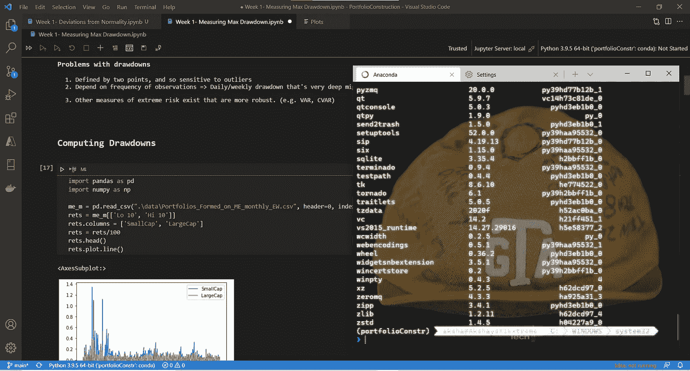

增强了 Windows 终端的 Visual Studio 代码。(图片由作者提供)

看看你能不能认出这个。这是星期天早上。你刚刚给出了一个庞大的数据集，比如说你的一个产品在过去 6 个月的大量使用数据。数据集每天有一个 Excel 文件，每个 XLSX 的大小约为 4MB。你被告知有…四天时间向首席执行官提交你的初步调查结果。你看，不仅仅是数据科学家处理大量数据。有时候，产品经理也会这样做。

你将如何着手执行这项任务？你需要三种资源:合适的人、合适的技能和合适的工具。先说工具。

# 疯狂中的方法——说明性数据分析

事实是，数据科学项目有一定的节奏，如果你愿意，可以称之为*生命周期*。虽然存在其他更复杂的方法，但现在，请观察来自哈佛大学[数据科学入门课程](http://cs109.github.io/2015/)的这个相当简单的流程:

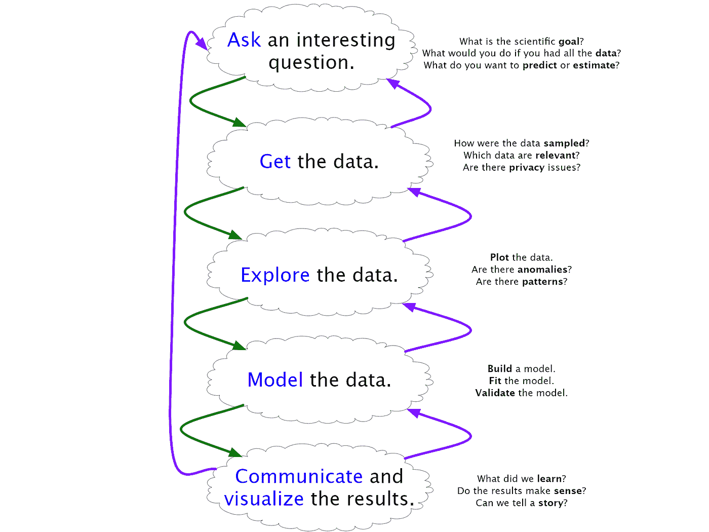

每个人都知道思想泡泡捕捉你的真实想法。(图片来自[模块的课堂笔记](https://github.com/cs109/2015/blob/master/Lectures/01-Introduction.pdf))

考虑一下这里的箭头。考虑一下他们如何像一个数据驱动的游戏[蛇和梯子](https://en.wikipedia.org/wiki/Snakes_and_ladders#History)(或者 *వైకుంఠపాళి* ，我们小时候习惯这么叫它)。还要考虑图中最后的勒索:*能讲个故事吗？*

数据科学方法有时可能是不确定的。你将需要迭代，直到你得到你想要的结果。你需要快速叙述一下。正因为如此，快速执行基本任务，同时能够连贯地解释这些步骤是有好处的。我认为，在许多现实世界的案例中，探索性数据分析实际上是说明性的数据分析:你不仅仅是探索数据集，而且还要解释数据中的可能性/异常等。这通常会很困难，尤其是当您在版本控制或者没有合适的工具时。

# 计算笔记本

大多数数据科学家通常使用*计算笔记本*进行数据探索/展示。正如《自然》 的这篇[文章所说，你需要相当于实验室笔记本的东西来进行科学计算。就像基因科学家(例如)将 DNA 凝胶与实验室协议一起粘贴一样，数据科学家“粘贴”数据，编写代码，编写解释，生成图表和其他形式的可视化，以记录他们的计算方法。](https://www.nature.com/articles/d41586-018-07196-1)

这是一个驱动编码、探索*和*文档的范例。使用计算笔记本，数据科学家执行代码，看看发生了什么，反复修改和重复，同时记录他们的想法，与他们(和他们的产品经理)的对话！)和数据。这在团队内部以及主题、理论、数据和结果之间建立了更强大的联系。

# 工具

对于那些喜欢使用 r 的人来说，计算笔记本可以是那些在 [RStudio](https://www.rstudio.com) 中的笔记本。一些团队也使用 [Databricks workspaces](https://azure.microsoft.com/en-us/services/databricks/#features) 利用云集群和直接与 SQL 等语言中的数据湖对话的能力。

然而，最受欢迎的计算笔记本是 Jupyter，其在 GitHub repos 中的使用量从 2015 年的 20 万台笔记本飙升至 2018 年的 250 万台([来源](https://www.nature.com/articles/d41586-018-07196-1))在这一点上，可以说 Jupyter 是数据探索的事实上的标准工具。Jupyter 笔记本将阐述与计算结合在一起，具有大量文章的功能，如标题格式、项目符号列表等，同时还具有在文本中嵌入代码的能力(或者反之亦然，如果你愿意)。然而，最明显的优势是您可以将代码的执行(“内核”)与代码本身分开。所以你可以在网络浏览器中输入你的代码，但是把它链接到在某个超级计算机集群上执行的内核。

# 朱庇特的问题

Jupyter 笔记本可能是自切片面包以来最受欢迎的计算笔记本，但它们也有批评者。其中最突出的是 Joel Grus，他在 2018 年的 JupyterCon 上展示了 144 张幻灯片。

他讲话的摘要:

*   **状态**:要让笔记本正常工作，你*必须*按顺序执行计算单元。如果你不这样做，事情就坏了。这对于用户来说并不是显而易见的。
*   **非模块化代码** : Jupyter 笔记本不强迫用户写模块化代码。
*   **不写单元测试**:大多数数据科学家跳过写单元测试或者忽略测试驱动开发的原则。使用 Jupyter 笔记本鼓励这一点。
*   **没有智能感知/自动完成**:大多数成熟的软件工具都有帮助你写代码的功能，通过(过去被称为)智能感知。Jupyter 笔记本没有那个。
*   不兼容的内核:你可以很容易地在一个特定的内核上写一个笔记本，但是在另一个内核上执行。这可能会导致严重的混乱。
*   阅读其他笔记本:阅读其他人制作的笔记本通常是一种痛苦，因为你不确定他们使用的是什么版本的库。

除此之外，我还要补充一点:

*   **Jupyter 内核与 Jupyter 外壳断开**:这意味着:您安装的库可能不是特定 Jupyter 外壳正在使用的库。最坏的情况是，在安装正确版本的库之前，您可能必须关闭本地 Jupyter 内核。

简而言之，许多 Jupyter 笔记本用户有一种忽视软件工程的既定原则的趋势，如分解、状态管理或测试。因此，这会影响数据科学团队快速重现或复制结果的能力。

# 解决方案

作为一名前世的软件架构师，我忍不住点头同意 Grus 的批评。同时，作为一名产品经理，我看到了说明性数据分析的价值，快速迭代和解释结果的需要，而不总是依赖于数据科学家。或者即使我读了，我也希望能够快速阅读他们的作品。

幸运的是，有一个解决方案。

## 步骤 0:安装 conda

如果你已经涉足 Python，你会想跳过这一个。一般的方法是为大多数 Python 相关的任务安装 [conda](https://docs.conda.io/projects/conda/en/latest/user-guide/install/index.html#regular-installation) 。Conda 的常规安装在一个单独的设置中安装所有的东西——最新的 Python 库、Jupyter 笔记本服务器、VS Code、Spyder 等等。这里面有细微差别，32 位和 64 位 conda 之间，Python 2.7 和 Python 3.x 之间，甚至 Anaconda 和 Miniconda 之间。[本文](https://www.freecodecamp.org/news/why-you-need-python-environments-and-how-to-manage-them-with-conda-85f155f4353c/)(及其他)深入探讨。确保您已经安装了 Visual Studio 代码。

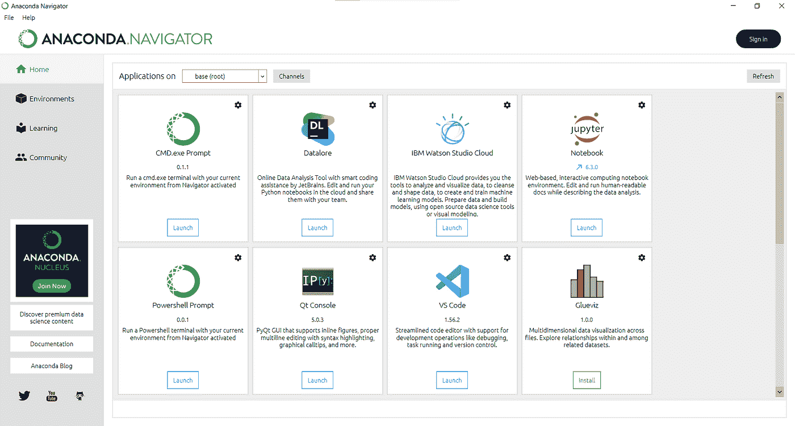

嘿，JetBrains 和 IBM Watson 在 Anaconda 做什么？我应该用迷你康达，可能。(作者截图)

但是等等。先不要推出 Jupyter 笔记本！小心第一步。

## 步骤 1:创建一个环境

取决于你在哪里，这里是开始变得沉重的地方。这被称为[非常具有挑战性的话题](https://www.freecodecamp.org/news/why-you-need-python-environments-and-how-to-manage-them-with-conda-85f155f4353c/)，但是用 Python 处理的正确方法是建立一个虚拟环境。事实上，让我强调一下:*所有*好的 Python 代码库**必须必须**有一个虚拟环境设置。许多人忽视这一点，后果自负。

为什么？Python 是关于同时使用多个库的。这给我们带来了三个非常具体的挑战:

1.  **知道使用什么*库***:即使是一个简单的分析也可能需要使用多个库。没有一个详尽的列表，您将会错过一些东西，从而破坏代码。
2.  **知道使用什么版本的库*使用什么版本的库*:**Python 世界的发展速度确实非常快，所以最新版本的库可能无法与您使用的版本兼容。

当你打算分享你的笔记本电脑时尤其如此。这些是我和我的团队留下的战斗伤疤:打开 Jupyter 笔记本，意识到团队在过去几个月里煞费苦心开发的精心制作的代码片段无法在你的笔记本上运行，这些伤疤就形成了。现在已经是周日下午了。

正确的方法是(不，不要惊慌)从一开始就创建虚拟环境。*在*启动 Jupyter 笔记本之前，您应该为项目创建一个文件夹，然后在其中创建一个虚拟环境。

你可以这样做:

1.  (*强烈推荐，不过可以随意跳过*)如果你在 Windows 上，

*   通过 Windows Store 安装全新的 [Windows 终端](https://www.freecodecamp.org/news/why-you-need-python-environments-and-how-to-manage-them-with-conda-85f155f4353c/)。
*   将 [Anaconda PowerShell](https://dev.to/azure/easily-add-anaconda-prompt-in-windows-terminal-to-make-life-better-3p6j) 添加到 Windows 终端。
*   (*奖金* : [美化它](https://www.hanselman.com/blog/how-to-make-a-pretty-prompt-in-windows-terminal-with-powerline-nerd-fonts-cascadia-code-wsl-and-ohmyposh)使用电力线，书呆子字体，卡斯卡迪亚代码等。)

2.如果您不在 Windows 上或者跳过了步骤 1，请打开 Anaconda 的提示符。如果没有，请在 Windows 终端中打开 Anaconda PowerShell。导航到您创建的文件夹。

强烈建议在特定的文件夹位置创建一个[环境。如果`RainInStraits`是您想要的文件夹名称(嗯，对我来说是这样)，您会想要执行以下操作(不用补充，您不必键入以#开头的注释):](https://conda.io/projects/conda/en/latest/user-guide/tasks/manage-environments.html#specifying-a-location-for-an-environment)

```
❯ mkdir RainInStraits 
#This generates the folder❯ cd RainInStraits 
#Navigate to the newly created folder❯ conda create --prefix ./envs jupyter matplotlib numpy
```

最后一个命令做了一些非常有趣的事情:它将创建一个环境作为子文件夹，并将我在那里提到的所有库安装在该环境中。这很好。现在，您可以开始使用 Jupyter 笔记本了。

## 步骤 2:用 Visual Studio 代码创建一个 Jupyter 笔记本

是的，你没看错。您想要启动 Visual Studio 代码(您已经在前面的步骤中安装了它，不是吗？)首先。

1.  打开您之前创建的文件夹:


我能说什么呢，我是守旧派。我更喜欢黑暗模式下的文本编辑器。就像过去 CGA 显示器的美好时光一样。(作者截图)

2.然后，点击`Control + Shift + P`(或 Mac 中的等效键)这将打开命令面板。选择`Jupyter: Create New Blank Notebook`

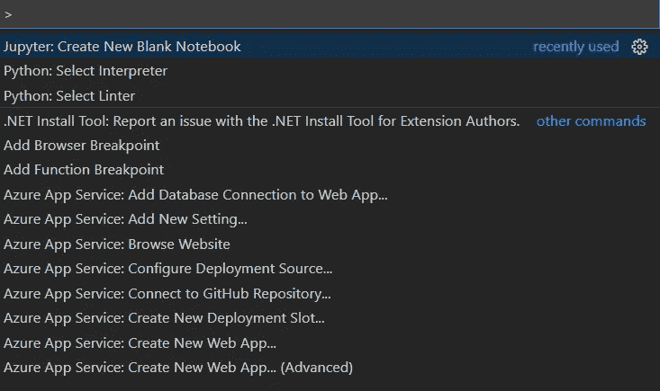

是的，我最近一直在创作许多 Jupyter 笔记本。为什么这么问？(作者截图)

3.快到了！点击屏幕右侧的内核部分:


眨眼就错过了。(作者截图)

4.选择您刚刚创建的虚拟环境。您将能够根据它的路径选择它。

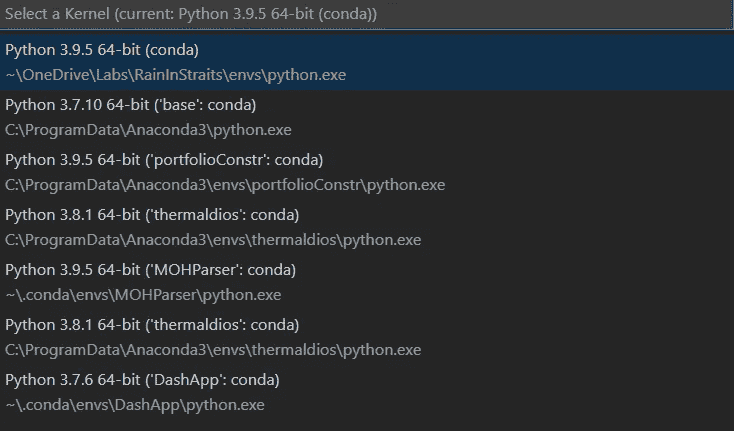

请注意，我们刚刚创建的环境没有名称。你必须通过文件夹来识别它。(作者截图)

5.为了卫生起见，对屏幕左下方的解释器进行同样的操作，并再次选择正确的环境:

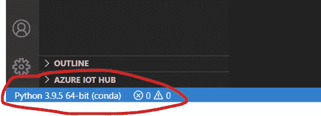

虚拟环境在上面。底层是相同的虚拟环境。(作者截图)

6.你准备好了！

**第三步:使用 Jupyter 笔记本进行阐述性数据分析**

这可能是数据科学家强烈反对我的地方。因此，我认为 Jupyter 笔记本的关键在于它是一个*笔记本—* 它是一段文字，应该如此对待。换句话说，它有一个标题，一个执行摘要，解释和文字内容，应该让非数据科学家或编码人员容易阅读。

Jupyter 笔记本能够在单元格中嵌入降价文本，但当你从文本切换到*图形时，它们才真正大放异彩。*他们必须通过代码完成的事情是偶然的——我们不应该忘记这一点。

这是我的一个笔记本的例子，我在探索收益的波动性等等。很多笔记——还有一些数学——最后是一些 Python 代码。

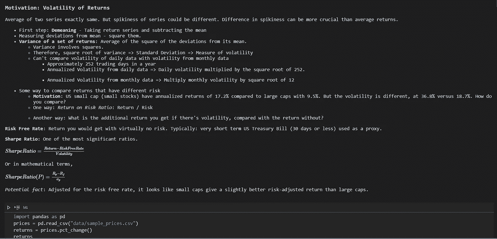

乳胶并不难。只是需要习惯。呃，还有，这是拼写乳胶。(作者截图)

我已经选择了这个虚拟环境，并执行了这段代码以获得:


编译错误在黑暗模式下不那么可怕。真实的事实。(作者截图)

哦！我忘记在虚拟环境中安装熊猫包了。在“常规”Jupyter 设置中，我必须停止本地服务器，安装软件包，然后重启服务器。但是有了虚拟环境和 Visual Studio 代码，我切换到打开的 Windows 终端窗口，安装 pandas，然后切换回来。

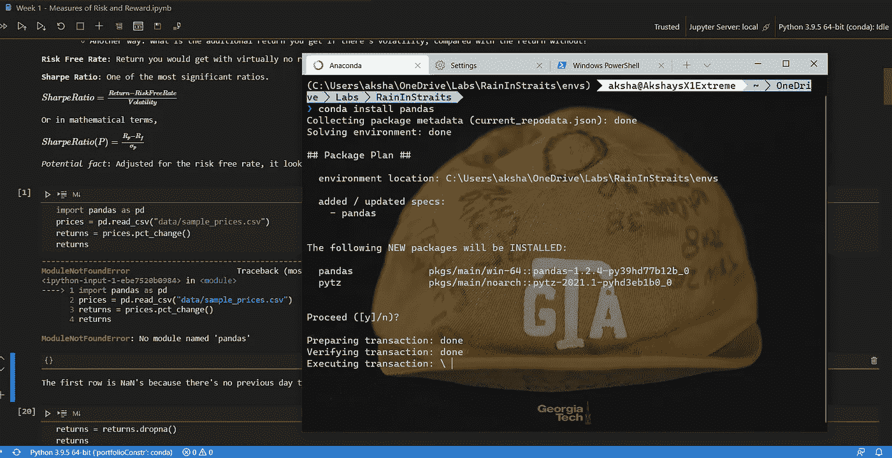

并行 windows ftw！(作者截图)

代码执行完美！

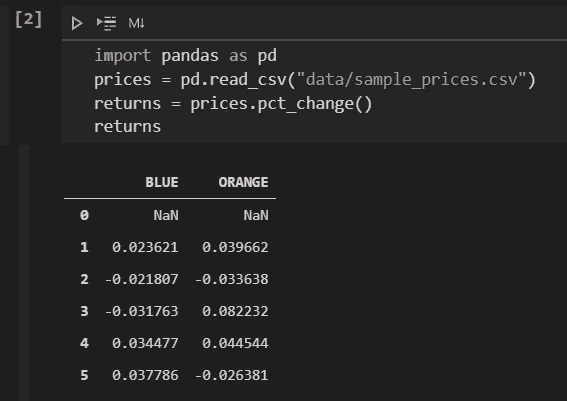

南更聪明。(作者截图)

# 功能丰富


按一个点(。)还有……魔法！(作者截图)

1.  但是等等，我没提到最精彩的部分。你现在有…自动完成。

2.当您甚至通过 Matplotlib 生成图形时，您可以轻松地进行滚动。


1.点击展开图片(作者截图)

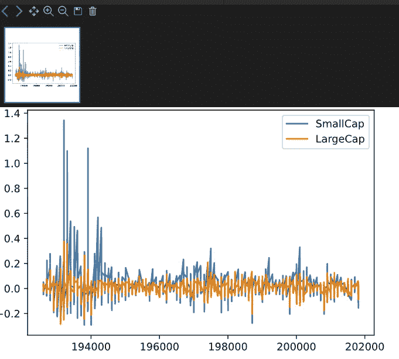

2.在单独的选项卡中滚动到您的核心内容(作者截图)

3.使用正确的扩展，您可以高效地浏览数据:

1.  [Excel Viewer](https://marketplace.visualstudio.com/items?itemName=GrapeCity.gc-excelviewer#review-details) :读取 VS 代码中的 CSV 和 Excel，就像在 Excel 中一样:


来源:[分机的网页](https://marketplace.visualstudio.com/items?itemName=GrapeCity.gc-excelviewer)

[2。sand dance](https://marketplace.visualstudio.com/items?itemName=msrvida.vscode-sanddance):CSV 数据的可视化:

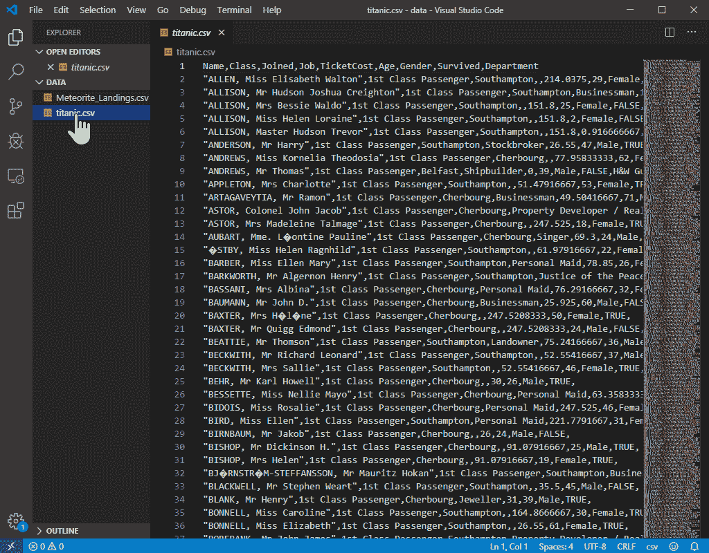

来源:[扩展的网页](https://marketplace.visualstudio.com/items?itemName=msrvida.vscode-sanddance)

4.还有一件事。(总有多一件事吧？)调试。

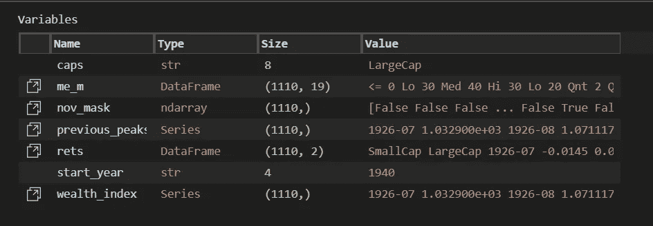

还有人会对调试器感到兴奋吗？(作者截图)

您可以在一个弹出窗口中查看内核中的所有活动变量。您不仅可以检查单个变量，还可以扩展数据框架。过滤，分类，玩他们。WUT。


比 Excel 好，不是吗？(作者截图)

是的，你可以在一个单元格中点击 F10，然后逐行执行代码。


逐行调试就像对代码进行逐行注释一样。(作者截图)

俏皮！年轻的学徒，这就是我们的方式。

# 导出环境

既然您已经设置了环境和工具，那么您可能希望与其他人共享您的工作。这就是拥有专用虚拟环境的真正优势所在。在你分享你的*。ipynb 文件，您需要导航回您打开的 Windows 终端窗口，导航到您之前创建的 envs 文件夹，并键入以下内容(随意将文件名从`environment.yml`更改为更合适的名称):

```
❯ conda env export --from-history > environment.yml
```

当您分享您的*。ipynb 文件，一定要共享这个 yml 文件。这样，您的收件人也能够在他们结束时恢复您的环境。他们需要在命令行中输入以下内容:

```
❯ conda env create -f environment.yml
```

**注意**:理论上，也许可以点击`conda env export > environment.yml`，但是，这将列出所有作为你选择的依赖项安装的库。这些依赖关系可能依赖于操作系统，并且可能无法在所有平台上正常运行。添加一个`--from-history`将库限制为您自己安装的库。这使得 conda 可以选择特定于接收方平台的依赖关系。

好了，各位。通过这种设置，您可以:

*   **监控状态**:逐行调试监控变量，哟。
*   智能感知/自动完成:它就是工作(tm)。
*   **“已知的”内核**:你清楚该使用什么内核以及如何使用。
*   **阅读其他笔记本**:阅读其他人制作的笔记本通常是一种痛苦，因为你不确定他们使用的是什么版本的库。
*   **依赖控制**:始终将正确的库集更新到正确的版本，包括在您共享笔记本电脑时。

引用 Edgar Dijikstra 的话来说，如果你不遵循软件工程的既定原则，Jupyter 笔记本*[可能会被认为是有害的](https://en.wikipedia.org/wiki/Considered_harmful#:~:text=Considered%20harmful%20was%20popularized%20among,the%20day%20and%20advocated%20structured)。但是有了正确的工具和正确的原则，它们实际上可以帮助你进行探索性的数据分析。*

*在接下来的几篇文章中，我将进一步解释一种更有效的共享包含 Docker 容器的笔记本的方式，并且将简要地涉及数据分析的*说明性*方面。现在，尽情享受这是一个全面的工具包来执行说明性数据分析。*