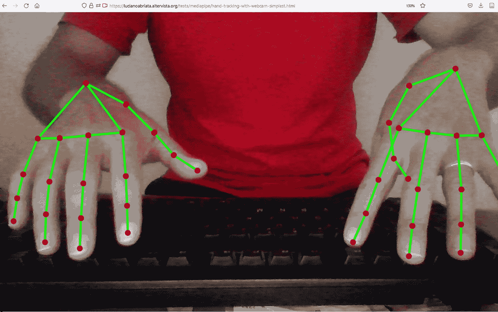
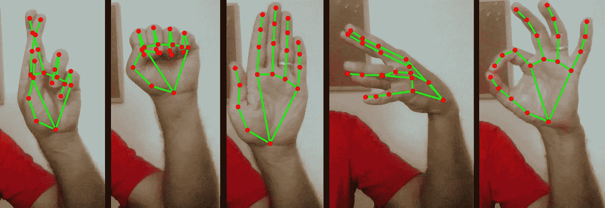
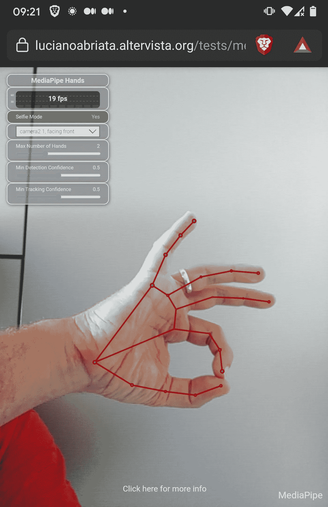

# 借助 MediaPipe 的机器学习模型，在网络浏览器中实现精致的手和手指跟踪

> 原文：<https://towardsdatascience.com/exquisite-hand-and-finger-tracking-in-web-browsers-with-mediapipes-machine-learning-models-2c4c2beee5df?source=collection_archive---------13----------------------->

## 了解这个精通 JavaScript 风格的计算机视觉库，这里重点介绍它的手部跟踪工具。有了这个，你的网络应用程序可以检测和跟踪每只手的 21 个点，实时获得每个点的流体 x，y，z 坐标。好几个手！也可以看看他们的其他基于 ML 的计算机视觉工具。

# 快速链接

*   [简介](#b33f)
*   [动手测试](#47d2)
*   [在 MediaPipe 的 CodePen 示例中测试更多高级功能](#2a7b)
*   [手跟踪工具的性能](#19dc)
*   [media pipe 的所有跟踪工具](#4369)
*   [想象潜在应用的范围](#61d6)

# 介绍

MediaPipe 只使用设备的常规网络摄像头，为增强现实应用提供基于跨平台机器学习的解决方案。具体来说，它提供了各种(脸、手、身体等。)检测和跟踪算法，允许程序员生成令人惊叹的视觉效果。最棒的是，这些工具中的许多都受 JavaScript 支持，这意味着您可以为您的 web 应用程序和页面添加出色的功能。

在最近发布了在我的电脑和智能手机上运行良好的文档和示例之后，我在这里重点介绍 MediaPipe 的 JavaScript 手部跟踪库。该工具可以检测和跟踪视频馈送中的手，并为每只手返回 21 个节点的{x，y，z}坐标(相当于每根手指 4 个关节加上 1 个手掌)。

# 动手测试

通过简单地复制和粘贴 MediaPipe 提供的最少代码，我在 30 秒内就让它在我的网站上运行了。确保通过 https 提供服务，因为它需要访问网络摄像头。这是它在 Firefox 上运行的第一个证据:



首先在浏览器中测试 MediaPipe(这里是 Firefox，但它在 Chrome 中也能完美运行)。在[https://lucianoabriata . alter vista . org/tests/media pipe/hand-tracking-with-web cam-simplest . html](https://lucianoabriata.altervista.org/tests/mediapipe/hand-tracking-with-webcam-simplest.html)播放并查看代码。注意:要查看估计的手部模型，请向下滚动到画布，这可能需要几秒钟才能显示出来！作者 Luciano Abriata 截图。

使用这个网页，我进一步测试了它能多好地检测各种姿势的手…如你所见，它能全部正确！即使是那些手部姿势本质上包含遮挡的姿势。



测试不同的手部姿势，包括一些包含相当多遮挡的姿势。由作者 Luciano Abriata 的截图组成。

您可以在此链接中自己运行此示例:[https://lucianoabriata . alter vista . org/tests/media pipe/hand-tracking-with-web cam-simplest . html](https://lucianoabriata.altervista.org/tests/mediapipe/hand-tracking-with-webcam-simplest.html)

注意:要查看估计的手部模型，请向下滚动到画布，这可能需要几秒钟才能显示出来！

这是代码。看看你需要写的有多少:

```
<!DOCTYPE html>
<html>
<head>
  <meta charset="utf-8">
  <script src="[https://cdn.jsdelivr.net/npm/@mediapipe/camera_utils/camera_utils.js](https://cdn.jsdelivr.net/npm/@mediapipe/camera_utils/camera_utils.js)" crossorigin="anonymous"></script>
  <script src="[https://cdn.jsdelivr.net/npm/@mediapipe/control_utils/control_utils.js](https://cdn.jsdelivr.net/npm/@mediapipe/control_utils/control_utils.js)" crossorigin="anonymous"></script>
  <script src="[https://cdn.jsdelivr.net/npm/@mediapipe/drawing_utils/drawing_utils.js](https://cdn.jsdelivr.net/npm/@mediapipe/drawing_utils/drawing_utils.js)" crossorigin="anonymous"></script>
  <script src="[https://cdn.jsdelivr.net/npm/@mediapipe/hands/hands.js](https://cdn.jsdelivr.net/npm/@mediapipe/hands/hands.js)" crossorigin="anonymous"></script>
</head><body>
  <div class="container">
    <video class="input_video"></video>
    <canvas class="output_canvas" width="1280px" height="720px"></canvas>
  </div>
</body><script type="module">
const videoElement = document.getElementsByClassName('input_video')[0];
const canvasElement = document.getElementsByClassName('output_canvas')[0];
const canvasCtx = canvasElement.getContext('2d');function onResults(results) {
  canvasCtx.save();
  canvasCtx.clearRect(0, 0, canvasElement.width, canvasElement.height);
  canvasCtx.drawImage(
      results.image, 0, 0, canvasElement.width, canvasElement.height);
  if (results.multiHandLandmarks) {
    for (const landmarks of results.multiHandLandmarks) {
      drawConnectors(canvasCtx, landmarks, HAND_CONNECTIONS,
                     {color: '#00FF00', lineWidth: 5});
      drawLandmarks(canvasCtx, landmarks, {color: '#FF0000', lineWidth: 2});
    }
  }
  canvasCtx.restore();
}const hands = new Hands({locateFile: (file) => {
  return `[https://cdn.jsdelivr.net/npm/@mediapipe/hands/${file}`](https://cdn.jsdelivr.net/npm/@mediapipe/hands/${file}`);
}});
hands.setOptions({
  maxNumHands: 2,
  minDetectionConfidence: 0.5,
  minTrackingConfidence: 0.5
});
hands.onResults(onResults);const camera = new Camera(videoElement, {
  onFrame: async () => {
    await hands.send({image: videoElement});
  },
  width: 1280,
  height: 720
});
camera.start();
</script>
</html>
```

您还可以在 MediaPipe 的网站上看到该代码的核心以及一些基本信息:

[](https://google.github.io/mediapipe/solutions/hands#javascript-solution-api) [## 手

### 感知手的形状和动作的能力是改善跨领域用户体验的重要组成部分。

google.github.io](https://google.github.io/mediapipe/solutions/hands#javascript-solution-api) 

# 在 MediaPipe 的 CodePen 示例中测试更多高级功能

MediaPipe 刚刚在 CodePen 上发布了一个示例，展示了各种功能，例如:

*   更换网络摄像头和交换视频(在手机、平板电脑和笔记本电脑等各种设备中处理应用程序的关键)，
*   跟踪 2、3 或 4 手牌(我试过 4 手牌，仍然很好用！)
*   调整检测参数(尽管默认参数在我尝试的所有条件下都工作得很好)。
*   此外，CodePen 示例提供了运行时的刷新率，单位为 fps。

我把这个例子复制到我网站的一个干净的网页上。运行时看起来是这样的:



MediaPipe 的笔，在[https://lucianabriata . alter vista . org/tests/media pipe/hand-tracking-with-web cam . html](https://lucianoabriata.altervista.org/tests/mediapipe/hand-tracking-with-webcam.html)清理过，在我的智能手机上运行。作者 Luciano Abriata 截图。

原笔在 https://codepen.io/mediapipe/pen/RwGWYJw 的但是你可以在这里更容易地尝试:[https://lucianabriata . alter vista . org/tests/media pipe/hand-tracking-with-web cam . html](https://lucianoabriata.altervista.org/tests/mediapipe/hand-tracking-with-webcam.html)

# 手跟踪工具的性能

当我在笔记本电脑上追踪两只手时，我得到了大约 25 fps，在智能手机上大约 20 fps。都不是很新(笔记本电脑是 2017 款东芝，带 i7 和 8GB RAM，没有专门的 GPU 手机是 2019 年的谷歌 Pixel 3)，两者都有很多程序和浏览器标签打开。因此，尽管有改进的地方，我还是要说这个库工作得很好。

使用默认参数，该示例在各种光照条件下运行良好。实际上，我找不到它不能正确检测我的手的情况！

# MediaPipe 的所有跟踪工具

截至 2021 年 9 月 7 日，MediaPipe 不仅提供手和手指跟踪，还提供人脸检测和人脸网格计算、虹膜检测、全身姿势检测、头发分割、一般对象检测和跟踪、特征匹配和自动视频裁剪。并非所有这些工具在 JavaScript 中都可用(至少到目前为止),但它们很可能会变得可用。要了解更多关于 JavaScript 可用的 MediaPipe 工具，请查看:

 [## JavaScript 中的媒体管道

### MediaPipe 目前提供以下解决方案:单击上面的解决方案链接以了解更多信息，包括 API…

google.github.io](https://google.github.io/mediapipe/getting_started/javascript) 

要了解所有编程语言中所有这些工具的更多信息，请访问它们的主要网站:

[](https://github.com/google/mediapipe) [## GitHub——Google/media pipe:用于直播和流媒体的跨平台、可定制的 ML 解决方案。

### MediaPipe 为直播和流媒体提供跨平台、可定制的 ML 解决方案。

github.com](https://github.com/google/mediapipe) 

# 想象潜在的应用范围

在其网站上，MediaPipe 预计将应用于艺术(参见一些惊人的例子:[https://developers . Google blog . com/2021/07/bring-artworks-to-life-with-ar . html](https://developers.googleblog.com/2021/07/bringing-artworks-to-life-with-ar.html))、通信，特别是基于标志的通信(这里有一个项目正在进行:[https://developers . Google blog . com/2021/04/signal 1-SDK-sign-language-interface-using-media pipe-now-available . html](https://developers.googleblog.com/2021/04/signall-sdk-sign-language-interface-using-mediapipe-now-available.html))、假体控制和[https://developers . Google blog . com/2021/05/control-your-mirru-prosthesis-with-media pipe-hand-tracking . html](https://developers.googleblog.com/2021/05/control-your-mirru-prosthesis-with-mediapipe-hand-tracking.html)。

事实上，谷歌的 meet 已经使用了 MediaPipe 的一些工具来控制背景([https://ai . Google blog . com/2020/10/background-features-in-Google-meet . html](https://ai.googleblog.com/2020/10/background-features-in-google-meet.html))。他们还使用这项技术来跟踪全身姿势([https://ai . Google blog . com/2020/08/on-device-real-time-body-pose-tracking . html](https://ai.googleblog.com/2020/08/on-device-real-time-body-pose-tracking.html))，这项技术可以被健身房应用程序重新利用，谁知道是否可以对体操表演进行更客观的评估。

我还可以在人机界面中推进增强现实的应用，人类用户可以用手抓住物体，在 3D 中探索它们，就像它们实际在手中一样。类似于 Oculus Quest 或 MS 的 HoloLens 等高端设备提供的功能，但可以在任何设备上运行。

作为一名科学家和业余音乐学习者，我不能忽视手跟踪工具在研究鼓手、吉他手等肢体运动和协调方面的潜力。尽管这项技术可能还不能满足正常的执行速度，但我认为它已经足够满足一些初步调查。我会玩这个，如果我发现一些有趣的东西，我会发一个新帖子让你知道。

喜欢这篇文章，想给我提示？【[](https://www.paypal.me/LAbriata)**】-谢谢！**

***我是一个自然、科学、技术、编程和 DIY 爱好者。生物技术专家和化学家，在潮湿的实验室和计算机里。我写我广泛兴趣范围内的一切。查看我的* [*列表*](https://lucianosphere.medium.com/lists) *了解更多故事。* [*成为媒介会员*](https://lucianosphere.medium.com/membership) *访问我和其他作家的所有故事，* [*订阅通过邮件获取我的新故事*](https://lucianosphere.medium.com/subscribe) *(平台原创附属链接)。***