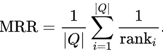
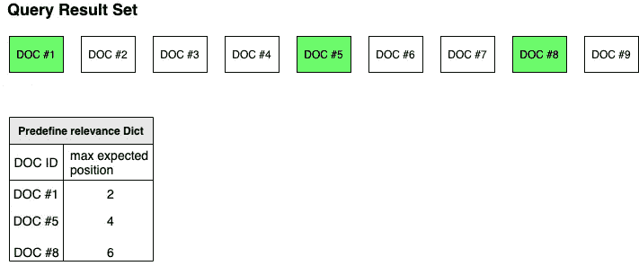
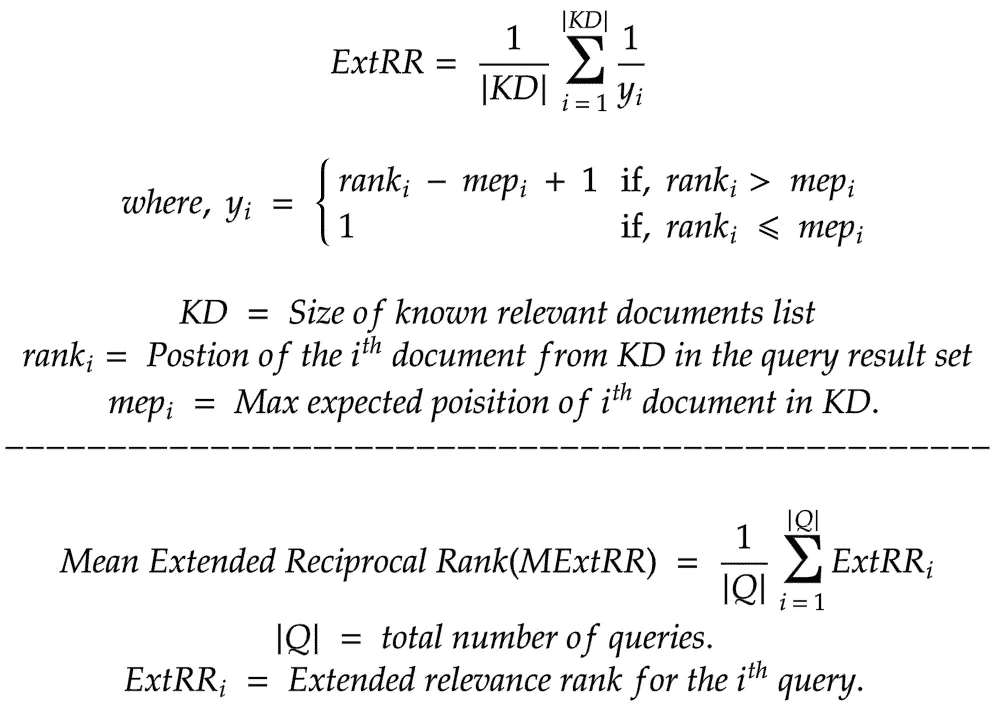

# 扩展倒数秩——ExtRR:介绍

> 原文：<https://towardsdatascience.com/extended-reciprocal-rank-ranking-evaluation-metric-5929573c778a?source=collection_archive---------27----------------------->

## 一种强有力的排名评价指标的研究

Unsplash 上的 Marten Newhall

## 动机

最近，我正在评估搜索结果的质量。倒数排名(RR)对我们的用例来说似乎很有希望，因为在结果集中的 100 或 1000 个文档中，我们只有几个“已知的”相关文档。

我在倒数排名和其他排名方法上遇到的问题——在我们的用例中，

*   RR 只评估最上面的文档。
*   在其他措施中，您需要标记/分级结果集中的所有文档(未标记的零级)，即使您不确定某些内容是否相关。
*   我需要像常规测试一样工作的东西，有预期的结果，实际的结果，并对它们执行断言。

所以，我试图将这种倒序推广到 N 个**已知的**相关文档中。因此得名**扩展互惠等级(ExtRR)。**

> 注意，这些是 N 个已知的相关文档，不一定是前 N 个文档

**平均倒数排名**是搜索/推荐排名评估度量。

这里，

*   |**|*|*|**表示查询的总次数
*   ***rank(i)*** 表示第***I****th*查询的结果集中顶部文档的位置。

因此，为了计算平均倒数排名(MRR)，我们简单地将各个查询的倒数排名相加，然后除以查询的总数。

正如我们在上面的公式中看到的，如果在结果列表中发现顶部的文档位置靠后，我们会降低搜索质量。

## **扩展倒数秩(ExtRR)**

我们可以将这个概念推广到已知的相关文档，而不是集中在单个最上面的文档。

考虑下图，我们有 9 个结果，其中 3 个是已知的**相关文档，其他的可能相关也可能不相关。**

上表中的***max _ expected _ position***表示单据的预期位置。
如果单据的实际位置大于预期值，评估员应扣分。

> 注意，我没有将图中三个文档的***max _ expected _ position***分别设为 1、2、3。这意味着这个文档不一定是前三个文档。相反，可以这样想——“我知道三个文档(我不知道它们的确切位置)肯定是相关的，它们应该在第十个位置之前出现”

如上图所示， *DOC #5* 必须出现在 1 和 4 之间的任何位置。
现在，直观地，我们可以说文件#5 偏离了 1 个位置，即 5 - 4 = 1。
在倒数排名中，如果顶部文档偏离 1 个位置，意味着它位于第二个位置，我们说质量得分为 1/2。
同样，在我们的例子中，文档#5 的倒数将是 1/(5–4+1)= 1/2

使用上述类比，我们可以设计出 ExtRR 的公式:

> 如果在最大预期位置或之前找到文档，则 ExtRR 的除数(y)将为 1。

**使用上面的公式，让我们计算上一个例子的 ExtRR:**

ExtRR =(1/1+1/(5–4+1)+1/(8–6+1))/3 = ~ 0.61
或者，
我们甚至可以说，3 次测试中有 1 次通过。

理想的情况是在最大位置之前找到所有文档。在这种情况下，ExtRR 将:
ExtRR = (1/1 + 1/1 + 1/1) /3 = 1

**Github 代码链接:** [扩展倒数排名](https://github.com/bkatwal/search-ranking-measures/blob/main/src/main/java/org/bkatwal/relevanceevaluator/ExtendedReciprocalRank.java)
**测试链接:** [ExtRR 测试](https://github.com/bkatwal/search-ranking-measures/blob/main/src/test/java/org/bkatwal/relevanceevaluator/TestExtendedReciprocalRank.java)

## 结论

正如我们到目前为止所看到的，ExtRR 主要关注已知的“n”个相关文档，并根据它们在搜索结果中的位置给出质量分数。
因此，当我们确定一些文档是相关的，但不确定其他文档是否相关时，ExtRR 是一个很好的选择。

ExtRR 最大的优点是——你可以通过使用一些相关的文档来评估搜索质量，而不需要对所有的文档进行评级。

## 参考

 [## 平均倒数排名-维基百科

### 平均倒数排名是一种统计方法，用于评估产生可能响应列表的任何过程…

en.wikipedia.org](https://en.wikipedia.org/wiki/Mean_reciprocal_rank)