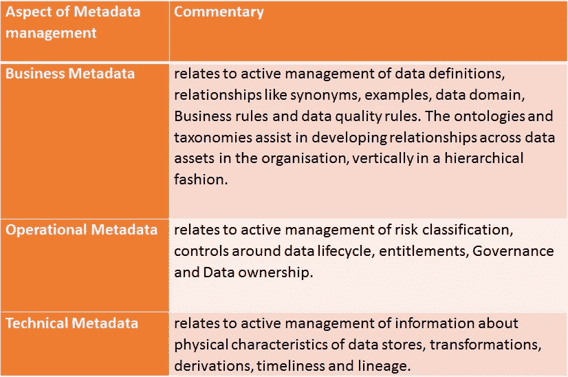

# 元数据在现代数据环境中的扩展使用和优势

> 原文：<https://towardsdatascience.com/extended-use-of-metadata-in-modern-data-landscape-and-benefits-t-4336837ac37e?source=collection_archive---------42----------------------->

企业正在对其数据平台和相关工具集进行现代化改造，以满足数据从业者的快速需求，包括数据科学家、数据分析师、商业智能和报告分析师，以及包括业务和技术人员在内的自助服务。

然而，随着大多数组织中工具栈的现代化，生成的各种元数据也在现代化。随着数据量每天都在增加，与数据相关的元数据也在增加，管理数据的需求也在增加。

一个广义的数据景观。礼貌:Tejasvi Addagada

当我们看到数据环境并听说目录时，我们首先想到的是，“它扫描从关系到 NoSQL 或图形的任何数据库，并给出有用的信息。”

*   名字
*   模型化数据类型
*   推断的数据类型
*   数据模式
*   具有最小和最大阈值的长度
*   最小值和最大值
*   数据的其他分析特征，如值的频率及其分布

在目录中管理元数据的基本好处是什么？

1.  提高数据情报的可用性，带来更好的洞察背景
2.  减少分析过程中寻找答案的周转时间
3.  提高专题专家为影响分析提供信息的效率
4.  消除环境中数据之间关系的模糊性
5.  通过含义、确定的冗余和关系简化数据视图

元数据的类型，由 Tejasvi Addagada 提供

由于技术进步和公共政策的变化，元数据的使用在过去一年中有了多倍的发展。大多数企业将目录用于所列的几个用例。

1.  **数据发现** —与数据民主化原则相关

*   回答诸如“数据作为对象和实例作为元素在模式中的物理位置”等问题
*   在单个或多个应用程序记录系统、参考系统(如湖泊或仓库)中搜索数据

2.**系统隐私剖析** —与数据保护和隐私管理惯例相关

*   识别数据主体私有的因素，即使建模名称可能不相关
*   帮助了解应用程序的风险分类，包括它们在 SOC 操作中的日志。

3.**控制对数据的访问** —类似于数据安全的原理。

*   确定数据授权并在单个存储库中处理它们
*   管理用户组、用户、数据访问策略、可以授予/撤销数据访问权限的所有者

4.**数据管理** —与管理数据和治理数据相关

*   管理和确定与数据创建和处理相关的流程
*   人员信息，如数据、业务、流程和人员管理数据的所有者
*   在整个组织中寻找数据所有权的共性，以管理上下文

5.**意为** —与“以正确的方式解释数据”的原则相关。

*   数据对特定情况和个人的意义的定义
*   基于数据在流程中的应用，收集和发现单一和共同的上下文描述

6.**用途** —对应于公司内外数据互操作的原则

*   使用方式包括报告、仪表板、人工智能模型
*   使用频率，使用特定数据的文物年份

7.**对数据进行分类**以实现更好的管理——与数据可用性原则相关

*   数据变化和应用的速度—主数据、参考数据、交易数据
*   隐私分类—隐私、敏感、特殊类别、行为数据
*   标签——国家标识符、地址、姓名、卡片相关数据、健康信息
*   转换分类-本地、派生或转换的数据

8.**规范管理** —逻辑组、名称、规范建模属性名称、其他标准建模名称、BIAN 中的类关联、MISMO 等

9.**规则操作** —与互操作性原则相关&覆盖范围

*   业务元数据不可或缺的一部分，在操作元数据流程中经常被忽略，为操作而编排
*   通过业务规则、策略实施规则、派生和转换规则、数据质量规则、规则执行统计数据更好地对规则进行分类
*   维护业务规则是执行影响分析、数据分析和需求分析的一个很好的使能因素
*   管理数据之间的关系可以更好地找到数据参与的规则。

目录中管理的规则类型

10.**数据操作** —扩展了数据分发管理的原理。

*   帮助了解数据使用情况、派生/本机特征、年份、上次使用、管道、归档和销毁策略、分区、作业、时间表。

**治理如何支持元数据？**

元数据管理还要求分析师在变更的适当阶段将信息放入目录中。这可以通过在数据的整个生命周期中始终包含正确的利益相关方来实现。数据也有一个生命周期，POSMAD(计划、获取、存储/共享、维护、应用、衰退)，这有助于展现血统。

即使是丰富的敏捷管理模型，如 scrum、kanban、DAD、FDD，也可以从在项目中管理和使用数据的机构知识中获益，以加速特性的交付。数据治理可以平衡元数据的托管和服务，保证元数据适用于大多数用例。

它来自哪里？

它适用于哪些流程？

谁使用商业术语？

哪个系统利用数据元素—存储、共享、转换和衰减

随着治理通过特定的操作节奏和过程将元数据的主动管理正式化，将它集成到项目生命周期的数据变更或使用计划中变得更加容易。数据治理功能提供了放置导轨或护栏的余地，这些导轨或护栏有助于评估、指导和监控元数据的管理，以帮助实现在组织中管理数据和元数据的目标。

此外，管理元数据需要一个标准框架，该框架可以引导人员方便地捕获与数据相关的信息。

**管理目录时常见的一些问题**

1.  你**是否已经将目录**民主化，让组织中的任何人员都可以输入他们知道的关于数据的信息？是否有确定的**数据管理员**能够指导组织使用基线信息？
2.  来自数据源的元数据是否促进了数据湖和数据仓库中**模式漂移**的管理？应该多长时间扫描一次源中的元数据或将其推入目录中？
3.  您是否在关注在生动的上下文中使用的带有专业名称的**业务术语**，但您是否在捕捉同义词或通用名称，以便在全球范围内轻松使用？
4.  元数据管理**是否弥合了地区、全球运营和 IT** 之间的差距？业务分析已经准备好支持这种交流，但是元数据管理附带了可以加速推进这一方面的使能器。
5.  今天，您是否有一个论坛，让所有相关的利益相关者能够在发布数据之前对他们所知道的数据进行**共同理解或丰富**？
6.  您计划如何利用元数据存储库中捕获的优秀信息来帮助**业务自助服务**？是不是目录太技术化，接受不了？
7.  合规性是否带走了你在**小方向**上的最大努力，让你首先找到你为什么要这么做？
8.  您的**元模型是否考虑了各种用例——比如**一个业务术语可以有多少数据所有者，多少可以是贡献者和查看者，我们可以定义多少真理系统？

业务元数据不会自己生成信息，它需要每个负责任的利益相关者、系统和流程一致地生成元数据，包括定义和管理方面。这一领域的供应商关注的焦点是最大限度地从数据库和系统中自动提取任何信息。但是，元数据如果得到积极管理，将使组织能够更好地治理数据。

目录可以是丰富数据人员在数据操作上的协作的一种方式。关于使用目录作为协作工具的进一步阅读—[https://www . dattamza . org/dattamza-blog/data-catalog-as-a-single-means-to-collaborate-through-data-operations](https://www.dattamza.org/dattamza-blog/data-catalog-as-a-single-means-to-collaborate-through-data-operations)

在 [LinkedIn](https://in.linkedin.com/in/tejasvi-addagada) 和 [Twitter](https://twitter.com/TejasviAddagada) 或我的[网站](https://www.tejasviaddagada.com/)上关注我