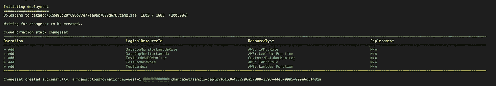
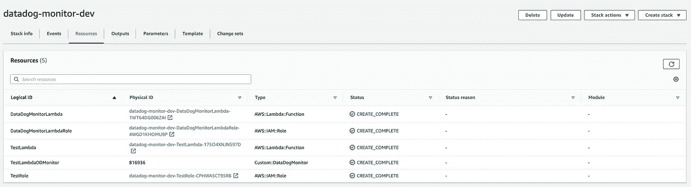
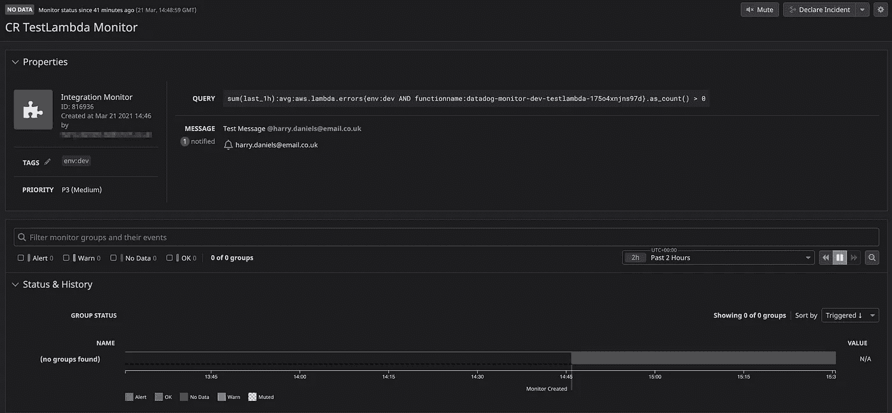
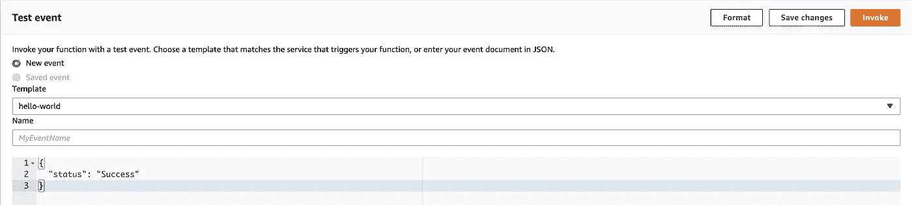
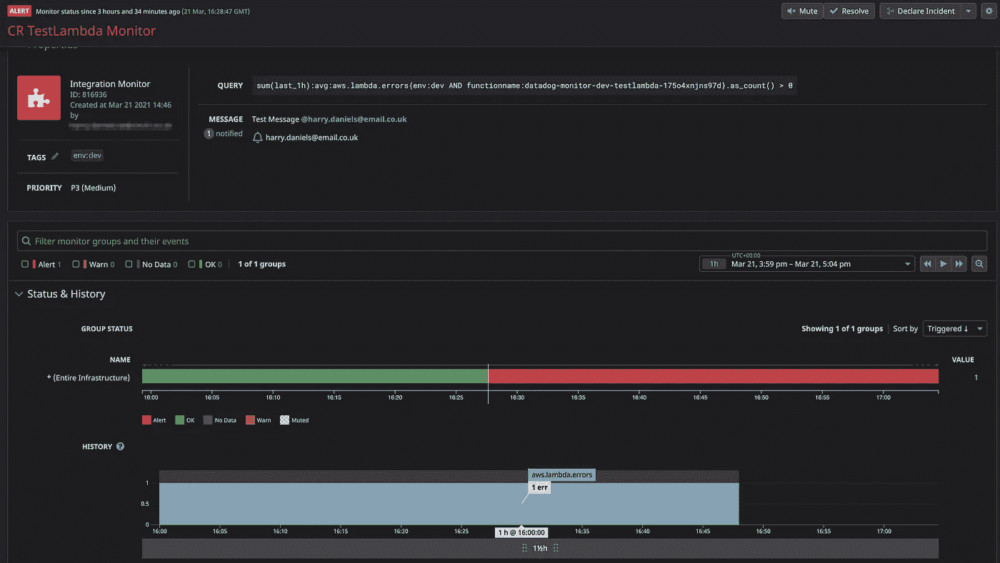

# 使用 lambda 支持的定制资源扩展云形成

> 原文：<https://towardsdatascience.com/extending-cloudformation-using-lambda-backed-custom-resources-c99b98cc7304?source=collection_archive---------12----------------------->

## CloudFormation 是在 AWS 生态系统中管理服务的一个很好的工具，但是使用定制资源，可能性是无限的


:照片由 [Unsplash](https://unsplash.com?utm_source=medium&utm_medium=referral) 上的 [Kaushik Panchal](https://unsplash.com/@kaushikpanchal?utm_source=medium&utm_medium=referral) 拍摄

本文分为两部分:

*   云形成的背景和自定义资源的介绍。
*   监控代码:使用 CloudFormation 管理 Datadog 监控器。

如果你想跳过，这篇文章中讨论的所有代码都可以在我的 GitHub [**这里**](https://github.com/HDaniels1991/datadog_cloudformation) **找到。**

# 云的形成

CloudFormation 是 AWS 提供的一个奇妙的“基础设施即代码”产品，它允许您有效地对资源集合建模，并在它们的整个生命周期中管理它们。AWS 的“意大利面条碗”继续以极快的速度增长，这意味着即使是云的形成也无法跟上它们，但不要担心，因为我们能够使用自定义资源来填补任何缺口和更多缺口。

对于云来说，基础设施即代码是一种新常态，它让您能够深入了解您的环境是如何形成的，并且有信心在不导致任何严重错误的情况下更新您的堆栈。例子包括云的形成和地形。

CloudFormation 提供了一种通用语言来描述和配置您的云环境中的所有基础设施，它以可重复的方式配置资源，并且由于一切都是以代码形式编写的，因此可以进行版本控制。CloudFormation 通过调用模板中描述的 AWS 服务来调配和配置资源。创建完所有资源后，它会报告您的堆栈已经创建好，可以使用了。如果堆栈创建失败，CloudFormation 将回滚您的更改。

有时你会想做一些 CloudFormation 不支持的事情，这可能是部署后的手动步骤，甚至是在 AWS 生态系统之外提供一些基础设施。幸运的是，自定义资源使这变得非常容易。

# 自定义资源

自定义资源使您能够在模板中编写自定义供应逻辑，AWS CloudFormation 会在您创建、更新或删除堆栈时运行这些模板。如果已经在模板中定义了定制资源，CloudFormation 将在堆栈操作期间向资源提供者端点发送外部请求，并等待响应。来自响应的数据随后可用于供应和配置其他资源。可以在 Cloudformation 模板中定义自定义资源，如下所示:

```
CustomResource:
    Type: 'Custom::MyCustomResourceTypeName'
    Properties: 
      ServiceToken: RequestAddress
      var1: variable1
      var2: variable2
```

定制资源只需要一个属性:ServiceToken，它将告诉 Cloudformation 将请求发送到哪里，但是也可以包含其他属性。对于 lambda 支持的定制资源，`ServiceToken`将是 lambda Arn，Cloudformation 将以事件的形式发送请求。请求示例如下所示:

```
{
    "RequestType": "Create",
    "ServiceToken": "lambda-arn",
    "ResponseURL": "[http://pre-signed-S3-url-for-response](http://pre-signed-S3-url-for-response)",
    "StackId": "cloudformation-stack-id",
    "RequestId": "request-id",
    "LogicalResourceId": "CustomResource",
    "ResourceType": "Custom::MyCustomResourceTypeName",
    "ResourceProperties": {
        "ServiceToken": "lambda-arn",
        "var1": "variable1",
        "var2": "variable2"
    }
}
```

一旦请求被发送，Cloudformation 将在预先签名的 URL: `ResponseURL`中等待响应。根据操作的类型，可以创建、更新或删除`RequestType`。定制资源提供者将处理请求，执行您要求的任何任务，并向预先签名的 URL 返回一个响应`SUCCESS`或`FAILED`。如果返回无响应或`Failed`状态，云形成操作将失败并回滚。

```
{
    "Status": "SUCCESS",
    "PhysicalResourceId": "function-return-value",
    "StackId": "cloudformation-stack-id",
    "RequestId": "request-id",
    "LogicalResourceId": "CustomResource",
    "Data": {
        "out1": "output1",
        "out2": "output2"
    }
}
```

包含在`Data`字段中的任何值都存储在预先签名的 url 位置，并且可以使用`!GetAtt`函数在模板中引用。要从上面的输出中检索`out1`值，可以使用下面的命令:`!GetAtt CustomResource.out1`。

# Lambda 支持的自定义资源

当 lambda 用作定制资源提供者时，每当创建、更新或删除定制资源时，都会调用该函数。CloudFormation 调用带有请求数据的函数(如上)并等待响应。幸运的是，有许多库使得编写定制资源变得非常容易。我将使用的是[custom-resource-helper](https://github.com/aws-cloudformation/custom-resource-helper):AWS 提供的一个基于 Python 的库，使用 decorators。

自定义资源助手是一个非常棒的包，它大大降低了部署 lambda 支持的自定义资源的复杂性。下面的代码可以作为 lambda 开发的起点。它可以分为以下几点:

*   首先导入`CfnResource`类。一个`CfnResource`对象被实例化并被调用`helper`。
*   create、update 和 delete decorators 确定将为 difference CloudFormation 堆栈操作调用哪个函数。
*   CloudFormation 模板中定义的资源属性在 lambda 事件中的`ResourceProperties`对象中可用。
*   保存在`helper`对象的`Data`对象中的任何内容都可以被 CloudFormation 模板中的其他资源使用`!Get Att`内在函数引用。
*   每次成功执行函数后，`helper`对象负责将响应上传到 lambda 事件中定义的`ResponseUrl`。

# 作为代码进行监视:使用 CloudFormation 管理 Datadog 监视器

为了真正展示 CloudFormation 定制资源的一些好处，我在 [Datadog](https://www.datadoghq.com/) 中提供了一个演示，演示了如何使用它们来配置监视器，以便在任何资源出现故障时发送警报。以下示例仅监视失败的 lambda 调用。

本演练的先决条件如下:

*   本文中的所有资源都是使用 AWS SAM CLI 部署的。要继续操作，必须安装 CLI，并且必须在项目的根目录中定义配置文件:samconfig.toml。

```
version=0.1
 [default.deploy.parameters]
 profile = "personal"
 stack_name = "datadog-monitor-dev"
 s3_bucket = "custom-resources-dev-20200318"
 s3_prefix = "datadog"
 region = "eu-west-1"
 capabilities = "CAPABILITY_IAM"
 confirm_changeset = true
 tags = "project=\"datadog-monitor-dev\" stage=\"dev\""
```

*   在您的 Datadog 帐户中设置 AWS 服务集成，并确保选择 lambda tile。这使得 Datadog 能够收集 Amazon lambda 指标。一旦完成，所有 lambda 函数将在 Datadog 无服务器视图中可用。
*   检索 DataDog API 密钥并创建应用程序密钥。这些必须存储在 AWS secrets manager 中，如下所示，您可以为作为参数添加到 CF 模板的机密选择任何名称:

```
{
  "DD_CLIENT_API_KEY": "API KEY",
  "DD_CLIENT_APP_KEY": "APP KEY"
}
```

## Datadog API

Datadog 有一个 HTTP REST API，允许您以编程方式与平台进行交互。下面的代码中使用了 API 来创建 Monitor 类，该类将由自定义资源 lambda 使用。以下代码被总结为以下要点:

*   API 的基本 url 是:`https://api.datadoghq.eu/api/v1`
*   要验证对 API 的调用，必须在请求头中提供 datadog API 密钥和应用程序密钥。这些键用于初始化类对象。
*   该类有三个方法来创建、更新和删除 Datadog 监视器，还有一个帮助器方法来构造简单的监视器查询。
*   `create_monitor`方法接受以下参数:名称、消息、优先级、函数名和标签。该名称就是监视器在 Datadog UI 中显示的名称。消息是每个警报发送的内容。优先级表示警报的严重性。functionname 被`_create_query`方法用来构造一个简单的监视器查询，而标签被用来标记监视器。创建监视器后，返回其`monitor_id`。
*   `_create_query`方法使用 functionname 参数创建一个监视器查询，该查询检查最近一个小时内的任何 lambda 错误。
*   除了增加了`monitor_id`之外，`update_monitor`方法采用与`create_monitor`方法相同的所有参数，因此它知道要更新哪个监视器。
*   `delete_monitor`方法使用`monitor_id`删除监视器。

Datadog Python 模块

## Datadog 自定义资源 lambda

使用 Datadog Monitor 类以及上面定义的自定义资源框架代码，现在可以创建一个自定义资源，该资源可以创建、更新和管理 Datadog Monitor 以及 CloudFormation 堆栈操作。

*   如先决条件中所述，Datadog API 和 App 密钥存储在 AWS secrets manager 中。这些是使用`aws_lambda_powertools`包检索的。
*   创建了`CfnResource`和`DD_monitor`对象。
*   在第一次创建堆栈时执行的`create`函数中调用`create_monitor`方法；如`@helper.create`装饰器所示。所需的参数在 CloudFormation 模板中定义，并在事件对象的`ResourceProperties`字段中提供。
*   分别在`update`和`delete`函数中调用`update_monitor`和`delete_monitor`方法。
*   `create`和`delete`函数都返回`monitor_id`，它将被指定为资源的物理 id。

Datadog 自定义资源 lambda

## 测试λ

测试λ是将在 Datadog 中监控的λ。lambda 将仅用于生成一些成功和失败的调用度量。

测试λ

## 云形成模板

现在已经定义了所有的 lambdas，下一步是创建 CloudFormation (SAM)模板来部署它们。该模板明确定义了三个资源，即`DataDogMonitorLambda`、一个`TestLambda`和`TestLambdaDDMonitor`。

*   `DataDogMonitorLambda`是自定义资源将调用的 lambda 函数。这一点很明显，因为定制资源中的`ServiceToken`指向了`DataDogMonitorLambda` Arn。
*   `TestLambda`是将被监控的λ。
*   `TestLambdaDDMonitor`是通过调用`DataDogMonitorLambda`创建的数据狗监视器。创建监视器所需的参数作为附加属性传递。

## 部署堆栈

要使用 SAM 部署堆栈，请执行以下命令:

*   `sam build --use-container`
*   `sam deploy`

检查变更集中的所有内容，并按下`y`继续部署。



云形成变更集

一旦栈创建完成，所有资源都将拥有逻辑和物理 id。因为自定义资源 lambda 中的`create`函数返回它刚刚创建的 Datadog 监视器的`monitor_id`，所以它被设置为资源物理 ID。可通过以下地址在 Datadog 中查看监视器:`https://datadoghq.eu/monitors/{MonitorID}`。



云形成资源

## 测试显示器

最初，Datadog 监视器没有数据，如下所示，这是因为监视器要求 lambda 执行成功或失败。



生成一些数据的最简单方法是在 AWS UI 中手动调用 TestLambda。因为监视器每小时只检查失败的调用，所以最好成功调用几次 lambda，等待数据填充到 Datadog 中，然后导致 lambda 失败。



最后，如果监控器在 lambda 执行失败后按预期工作，它应该保持在警报状态。



我希望你喜欢读这篇文章，就像我喜欢写它一样。Lambda 函数和定制资源的简单性真正打开了云形成的可能性。我正计划写另一篇关于你如何使用自定义资源来管理你的雪花账户的文章，所以请关注这个空间！

查看我的其他工程帖子:

*   [连接到 AWS 上私有子网中的 ec2 实例](/connecting-to-an-ec2-instance-in-a-private-subnet-on-aws-38a3b86f58fb)