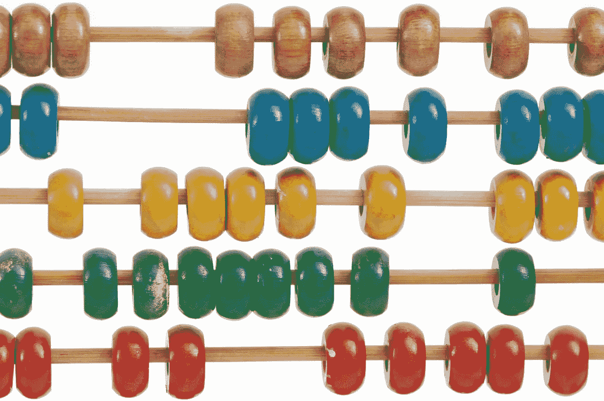

# 用惊人的结果扩展 Julia 的算子

> 原文：<https://towardsdatascience.com/extending-julias-operators-with-amazing-results-96c042369349?source=collection_archive---------36----------------------->

## 如何在 Julia 中加载和扩展方法，用一个非常激动人心的例子



[**https://unsplash.com/photos/gdL-UZfnD3I**](https://unsplash.com/photos/gdL-UZfnD3I)

# **介绍**

**有了 Julia，模块扩展的可能性实际上是无限的。这种无限的潜力是由于朱莉娅神奇的多重调度带来的。多重分派允许我们扩展旧的方法，以便处理我们可能想要传递的新类型。如果你想进一步了解多重分派，以及为什么我认为这是一个编程计算机的好方法，我写了一篇文章详细介绍了它，并提供了一些非常好的例子，你可以在这里查看:**

**</why-multiple-dispatch-is-my-favorite-way-to-program-786bf78f4878>  

多重分派对 Julia 模块来说也意味着大多数模块都是直接重要的，并且变得更加有用。使用多重分派，我们可以将任何方法应用于语言内部的任何类型。这包括来自完全不同模块的类型。我有一个非常酷的想法，将它应用到车床软件包中。对于那些不熟悉车床的人来说，车床是 Julia 的一个包容性预测学习模块。这个包包含了面向对象的语法，这使得它的用法非常类似于 Pythonic 的反义词 SkLearn。如果说 Flux 是 Julia 的张量流，那么车床就是 Julia 的 SkLearn。

也就是说，Python 的 SkLearn 模块和 Julia 的车床模块都有一个突出的特性，那就是管道类型。管道类型允许我们以一定的顺序组合对象，以快速和自动地处理数据。车床的代码实际上已经很旧了，急需更新。我们将通过使用这些基本操作符重新创建我们的管道类型来开始分派这种类型的过程。** 

# **重构管道**

**我想首先用一个戏剧性的变化来重构这些管道，这个变化也是不间断的。以下是最新版本的车床中已经存在的代码:**

```
[@doc](http://twitter.com/doc) """
      Pipelines can contain a predictable Lathe model with preprocessing that
      occurs automatically. This is done by putting X array processing methods
      into the iterable steps, and then putting your Lathe model in.\n
      --------------------\n
      ==PARAMETERS==\n
      [steps] <- An iterable list of methods to call for X modification. These mutations should
      have ALREADY BEEN MADE TO THE TRAIN X.\n
      pipl = Pipeline([StandardScalar(),LinearRegression(trainX,trainy)])\n
      --------------------\n
      ==Functions==\n
      predict(xt) <- Returns a prediction from the model based on the xtrain value passed (xt)
      """
function Pipeline(steps)
    predict(xt) = [xt = step[xt] for step in steps]
    (var)->(steps;predict)
end
```

**这个函数工作得很好，并将采取一系列可迭代的步骤。然而，这样做的问题是我们不知道将返回什么类型。该类型将是一个 Julia 不安全类型，它将构造一个新的类型，该类型实际上是由我们在语言中放入的内容定义的。我们可以通过将管道转换为常规类型来改变这一点。我还将在完整的车床软件包中添加一个新的抽象类型。这将允许我们限制可以作为参数传递的内容，同时不删除从预处理模块放置对象的能力。如果我们将这个函数限制为 just ::Model，我们将无法将缩放器或编码器放入这个函数中——这在某种程度上违背了创建它的初衷。让我们继续创建这个抽象类型:**

```
abstract type LatheObject end
```

**我将把它添加到 Lathe.jl 文件中并导出它，这将定义类型层次结构的顶层。现在我将进入 Lathe.preprocess 并为所有预处理器对象添加子类型。我将为车床做同样的事情。型号:**

```
abstract type Model <: LatheObject endabstract type Preprocessor <: LatheObject end
```

**现在，所有被定义为这些超类型下的子类型的类型都可以通过分派方法传递。现在，我们可以将这个分派添加到我们的管道函数中。然而，为了确保在这些模块中定义这个抽象类型，我们可能还希望在车床模块中导出我们的车床对象，并对每个模块使用 using，以便将该类型加载到每个子模块中。**

```
export LatheObject
```

**现在我们将 using 添加到我的 preprocess.jl 文件和 models.jl 文件中。**

```
using Lathe: LatheObject
```

**尽管整个包可能会被预编译，但是为了提高速度，直接导入这个类型可能会更聪明，即使它是导出的。最后，我将包含来自 REPL 的代码，以确保该类型被正确导入，并且在包中有子类型。**

```
include("Lathe.jl")
```

**为了确保这样做有效，我将导入并创建一个 StandardScaler 类型。为此，我进入了 REPL:**

```
using Lathe.preprocess: StandardScaler, LatheObject
```

**子类型运算符<:/>**

```
StandardScaler <: LatheObject
```

****

**作者图片**

> **酷！**

**如果你想了解更多关于子类型的知识，我写了一整篇文章来介绍它们以及它们的用法，你可以在这里找到更多的细节:**

**</overview-abstract-super-type-heirarchies-in-julia-26b7e64c9d10>  

让我们在模型类型上尝试同样的事情。

```
using Lathe.models: LinearRegression
LinearRegression <: LatheObject
```

现在让我们将这种类型转换添加到我们的参数中，以确保只传递带有 predict()函数的车床对象:

```
function Pipeline(steps::LatheObject ...)
    predict(xt) = [xt = step[xt] for step in steps]
    (var)->(steps;predict)
end
```

我还打算加上…这将使得不再需要提供 iterable，我们现在可以提供无限数量的车床对象作为参数。否则，我们需要转换类型数组{LatheObject}。现在，我将为管道类型编写一个外部构造函数。我们可以使用{}来添加一个未知类型到我们的构造函数中。旧函数将成为内部构造函数。我们还需要将这些类型放入 iterable 中，因为这是 predict()方法所需要的。

```
mutable struct Pipeline{P}
    steps::Array{LatheObject}
    predict::P
    function Pipeline(steps::LatheObject ...)
        steps = [step for step in steps]
        predict(xt) = [xt = step[xt] for step in steps]
        (var)->(steps;predict)
    end
end
```

我们将通过将(var) ->()部分更改为 new()方法的用法来完成内部构造函数，将 predict()的类型设置为 p。工具类型已经是模型的子类型，为这个类型创建了三个具有不同规范的类型层。这是我们的最终构造函数的样子:

```
mutable struct Pipeline{P} <: Tool
    steps::Array{LatheObject}
    predict::P
    function Pipeline(steps::LatheObject ...)
        steps = [step for step in steps]
        predict(xt) = [xt = step[xt] for step in steps]
        new{typeof(predict)}(steps, predict)
    end
end
```

这个结构的可变也是至关重要的。这是因为 Julia 的基本操作符将用于改变我们传递的管道对象。

# 扩展运算符

从这一点开始，我们将在一个笔记本上工作，代码将在以后添加到车床文件中。我这样做是为了让我的读者可以轻松地访问和重新创建即将到来的代码。以下是为感兴趣的人准备的笔记本:

> [笔记本](https://github.com/emmettgb/Emmetts-DS-NoteBooks/blob/master/Julia/Pipelines%20And%20Operators.ipynb)

为了从 Julia 的基础上扩展我们的操作符，我们需要直接导入它们。我将从加法运算符+开始。

```
using Lathe.models: Pipeline, LatheObject, LinearRegressionusing Lathe.preprocess: StandardScaler
import Base: +
```

现在，我们可以用一个管道分派这个+方法，以便能够通过简单地使用这个操作符，用 predict()方法将任何车床对象添加到管道中。

```
+(p::Pipeline, step::LatheObject) = push!(p.steps, step)
```

现在，我们可以构造两种类型，并将其放入管道中。

```
x, y = [5, 10, 15, 20, 25, 30], [2, 4, 6, 8, 10, 12]scaler = StandardScaler(x)model = LinearRegression(x, y)
```

现在，我们将制作一个管道，但我将避免将模型添加到我们的步骤中:

```
pipe = Pipeline(scaler)
```

假设我们想在这个例子中添加模型的步骤。现在，我们可以使用我们分派的+操作符将车床对象推送到我们的管道步骤。我很好奇的一件事是，这是否会创建一个新的管道副本并返回它，或者实际上改变我们原来的管道。为了测试这一点，我将把它作为一个名为 pipe2 的新变量。如果是这种情况，我们将会遇到很大的问题，因为我们将得到管道步骤的返回，而不是管道返回的新步骤:

```
pipe_with_model = pipe + model
```

当然，pipe_with_model 现在只是一组步骤。然而，我们真正想要检查的是模型是否在管道结构的步骤数组中。用下面的 for 循环打印这些步骤表明它正如预期的那样工作了！：

```
for step in pipe.steps
    println("=STEP=", step)
end
```


作者图片

记住 than，我们可以在不使用断言操作符的情况下调用它，只需使用 pipeline + object。使用这种方法，我们还能够将管道添加到管道中，使得使用这种方法和数据数组的链的可能性几乎是无限的。让我们试着从这个模型中得到一个预测，即使我们从未用我们的定标器定标我们的 X，为了让这个模型实际上与定标器的数据一起工作，我们应该这样做。


作者图片

这产生了一个错误，因为我甚至没有想到要改变内部构造函数中 predict()方法的功能。这是我们管道真正的最终构造函数。

```
mutable struct Pipeline{P} <: Tool
          steps::Array{LatheObject}
          predict::P
          function Pipeline(steps::LatheObject ...)
              steps = [step for step in steps]
              predict(xt) = [xt = step.predict(xt) for step in steps]
              new{typeof(predict)}(steps, predict)
          end
      end
```

既然我们已经重新创建了 predict()方法，我们可以再次尝试运行它。

```
y_hat = pipe.predict(x)
```


作者图片

我想做的最后一件事是扩展-()方法，以便允许删除步骤。这将以同样的方式完成，但是使用一个整数作为第二个参数。然后我们将使用 deleteat 删除数组中二聚体！()方法。

```
-(p::Pipeline, n::Int64) = deleteat!(p.steps, n)pipe - 2
```


作者图片** 

# **结论**

**如果你问我，这肯定是非常棒的。关于 Julia 语言的一件很酷的事情是，它实际上主要是自己编写的。这使得它既易于贡献又易于扩展。这就是为什么在 Julia 语言中，非常有限数量的扩展基函数在随机的包中执行不同的功能是很常见的。我认为这是利用这一点的一种非常有趣和酷的方式，并且很难反对使用加法和减法运算符来从管道中删除步骤等等。在我看来，这些新管道既酷又令人兴奋！非常感谢您的阅读！**