# 扩展 KNIME Python 与 Plotly Express 和 Kaleido 的集成

> 原文：<https://towardsdatascience.com/extending-knime-python-integration-with-plotly-express-and-kaleido-5c306074a5ca?source=collection_archive---------28----------------------->

## 以最少的编码生成强大的交互式图形和高质量静态图像的替代方法

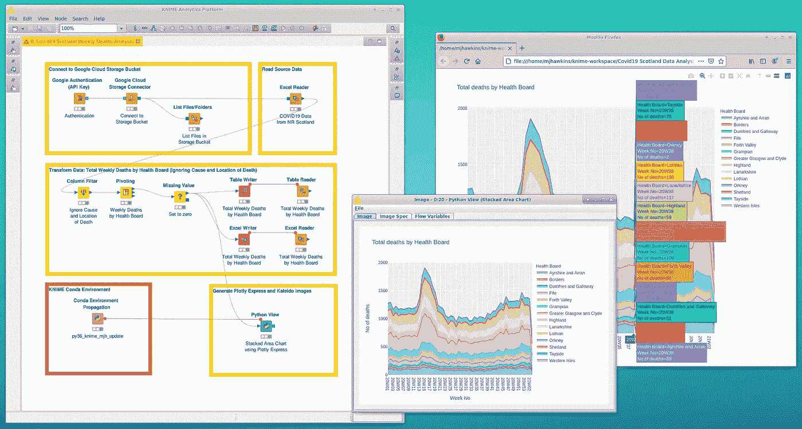

作者图片:截图 KNIME 分析平台工作流程示例-桌面视图

KNIME Analytics 平台的一个关键优势是它的灵活性，允许您安装各种扩展来增强其常规的“开箱即用”功能。当然，是否安装特定的 KNIME 扩展取决于您的项目及其环境的需要。有时候可能只是被你自己的个人喜好所驱使。其中一个领域与数据可视化有关。在本文中，我描述了如何配置 KNIME，以使用 Plotly Express 和 Kaleido 作为我首选的 python 视图图像生成引擎，从而为我的 KNIME 工作流提供了大量额外的强大图形库。

# 目录

## 装置

*   基础环境
*   KNIME 与 Python 的集成
*   安装 Plotly 和 Plotly Express
*   安装 Kaleido
*   最终 Conda 环境配置

## KNIME 工作流程示例

*   概观
*   读取源数据
*   转换数据
*   生成情节表达和万花筒图像
*   示例图像
*   与 KNIME 堆积面积图视图的比较
*   KNIME Conda 环境传播

## 外卖食品

## 参考

# 装置

## 基础环境

简而言之，我的基本安装环境如下:

*   本地机器:运行 Chrome OS 的 Google Pixelbook。
*   托管在[谷歌云平台](https://cloud.google.com/)(计算引擎)上的 Linux VM。操作系统:Ubuntu。版本:16.04 LTS。
*   谷歌 Chrome 远程桌面配置为访问 Linux 虚拟机上的 [Xfce](https://www.xfce.org/) 桌面。安装说明[此处](https://cloud.google.com/solutions/chrome-desktop-remote-on-compute-engine)【1】。
*   用于 Linux 的 KNIME 分析平台(版本 4.3.1)。安装说明[此处](https://docs.knime.com/2020-12/analytics_platform_installation_guide/index.html)【2】。

此外，我还使用了 Google Cloud Storage Bucket 来存储源数据，以供 KNIME 工作流使用。

## KNIME 与 Python 的集成

接下来，我安装了用于 KNIME 分析平台的 KNIME Python 集成。对于 KNIME 版本 4.3，安装说明在这里是【3】。本质上有三个步骤:

*   安装 KNIME Python 集成扩展
*   安装 [Anaconda Python](https://www.anaconda.com/products/individual) (个人版)。
*   为 KNIME Python 集成创建一个 Conda 环境。

请注意，建议从 KNIME Analytics 平台中自动创建 Conda 环境(而不是使用 YAML 配置文件手动创建)。

我把默认版本设为 Python 3，创建了一个新环境，名为“py36_knime_mjh_update”。正在使用的 Python 版本是 3.6.12。

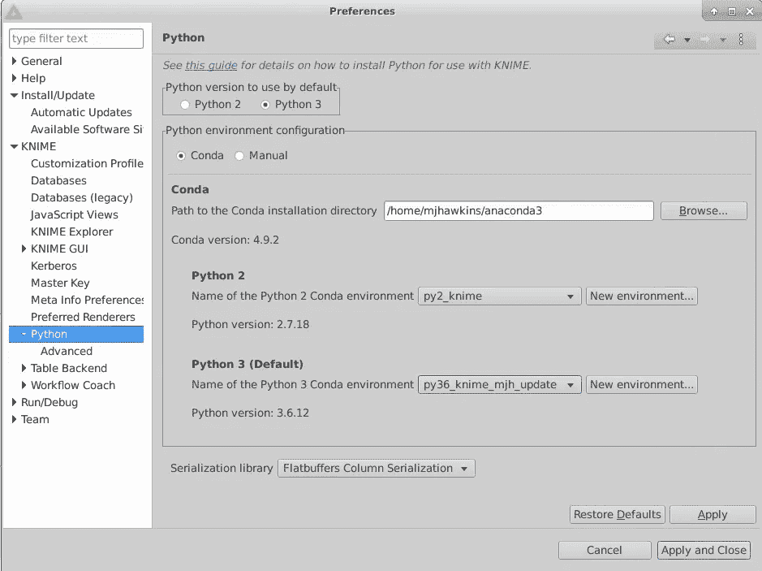

图片作者:截图— KNIME 首选项— Python

## 安装 Plotly 和 Plotly Express

设置好核心的 KNIME Python 集成环境后，接下来我安装了 [Plotly](https://plotly.com/python/) 和 [Plotly Express](https://plotly.com/python/plotly-express/) 模块。为此，我使用 [Anaconda Navigator](https://docs.anaconda.com/anaconda/navigator/) 将 conda 安装到上面创建的 KNIME conda 环境中。

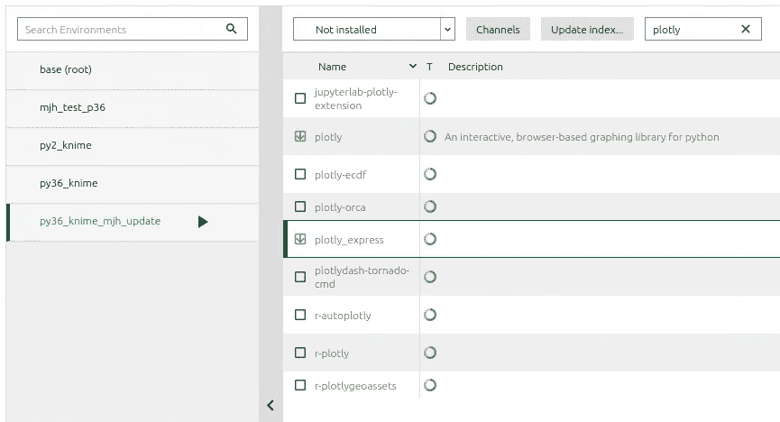

作者图片:截图—使用 Anaconda Navigator 的 Plotly 和 Plotly Express 安装

这将安装以下软件包和依赖项:

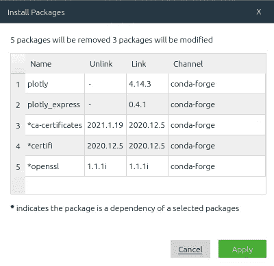

作者提供的图片:截图—选择的 Plotly 和 Plotly Express 包

## 安装 Kaleido

最后一步是安装[万花筒](https://pypi.org/project/kaleido/)。这需要几次尝试才能让它工作。

对于第一次尝试，我尝试使用 Anaconda Navigator 如上所述对 Kaleido 进行 conda 安装。然而，当我试图执行 KNIME 工作流来生成静态图像时(见后面)，抛出了一个异常。由于某种原因，它无法找到 Kaleido 可执行文件夹在:

> "../anaconda 3/envs/py36 _ knime _ mjh _ update/lib/python 3.6/site-packages/kaleido/"

在进一步尝试找出问题所在后，我决定用锤子敲打这个东西，并从终端窗口安装 Kaleido。

首先，我激活了 KNIME conda 环境:

```
$ conda activate py36_knime_mjh_update
```

然后我安装了 Kaleido:

```
$ pip install kaleido
```

现在快速检查显示，Kaleido 可执行文件夹现在在预期的位置。这解决了问题。

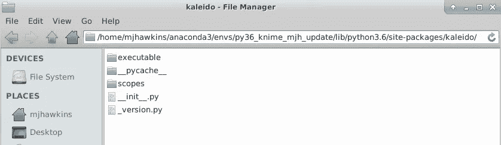

作者图片:截图 Kaleido 可执行文件夹位置

## 最终 Conda 环境配置

在这个[GitHub gist](https://gist.github.com/CedarwoodInsights/6bf92a2d6779248019f3be18f199cb6a)【4】中，KNIME conda 环境的最终配置以 YAML 文件的形式提供。

# KNIME 工作流程示例

## 概观

我的示例工作流如下所示。

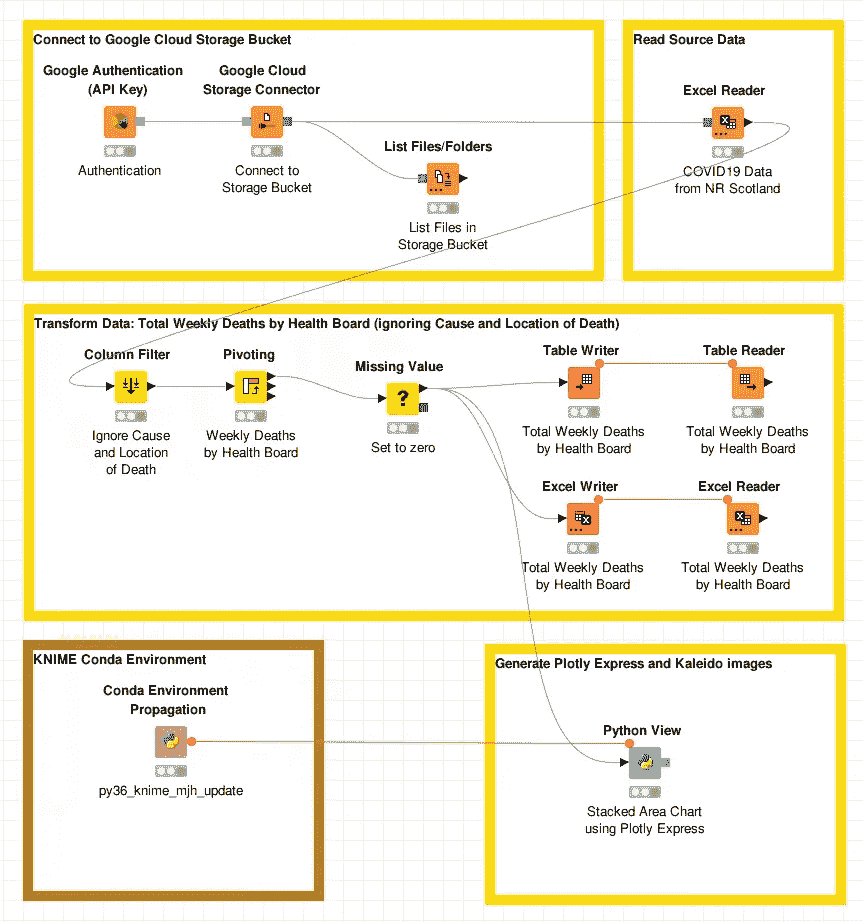

作者图片:截图— KNIME 工作流示例

本质上，它是这样做的:

*   连接到谷歌云存储桶
*   从 Excel 文件中读取源数据
*   对数据应用一些转换，为查看数据做准备(并将结果表转储到文件中)。
*   以多种格式生成堆积面积图(用于演示目的)

我现在将更详细地描述各种元素。

## 读取源数据

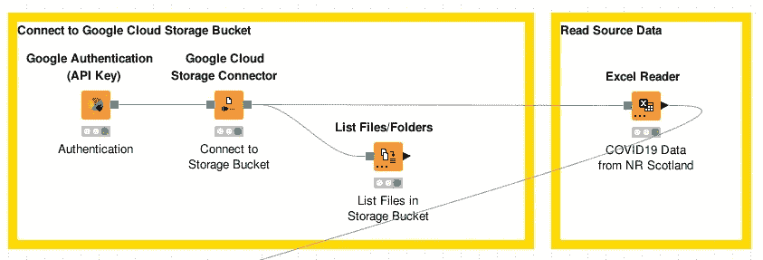

作者图片:截图 KNIME 工作流-读取源数据

示例数据涉及 2020 年和 2021 年前几周苏格兰涉及 COVID19 的死亡。它可以从苏格兰国家记录中公开获得。数据以 Excel 电子表格的“长格式”提供。

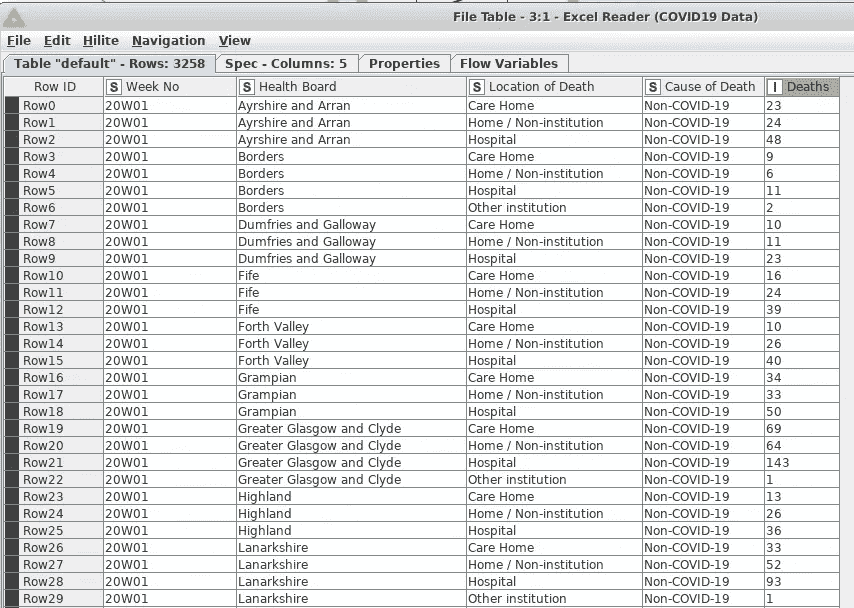

作者图片:截图-源数据(长格式)

## 转换数据

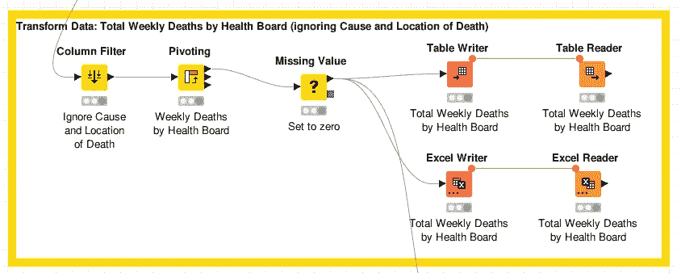

作者图片:截图 KNIME 工作流-转换数据

在这里，源数据被简单地过滤和透视，以便生成“宽格式”的数据表，作为堆积面积图的输入。我还将输出表转储到一个 KNIME 表文件和一个 Excel 文件中(以便以后需要时参考)。

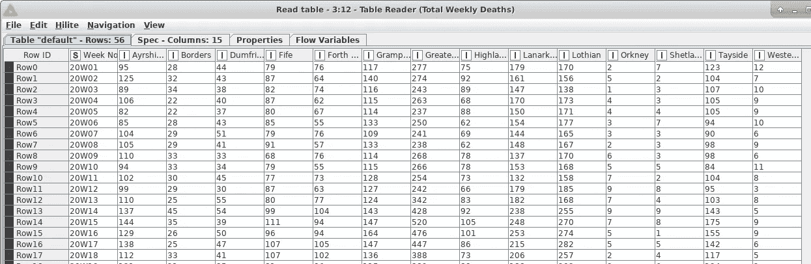

作者提供的图片:截图-转换后的数据(宽格式)

## 生成情节表达和万花筒图像

现在我们来为我们的数据生成堆积面积图。这是使用 KNIME Python 视图节点实现的。

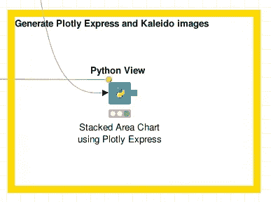

图片作者:截图— KNIME 工作流— Python 视图

要配置此节点，请右键单击→配置:

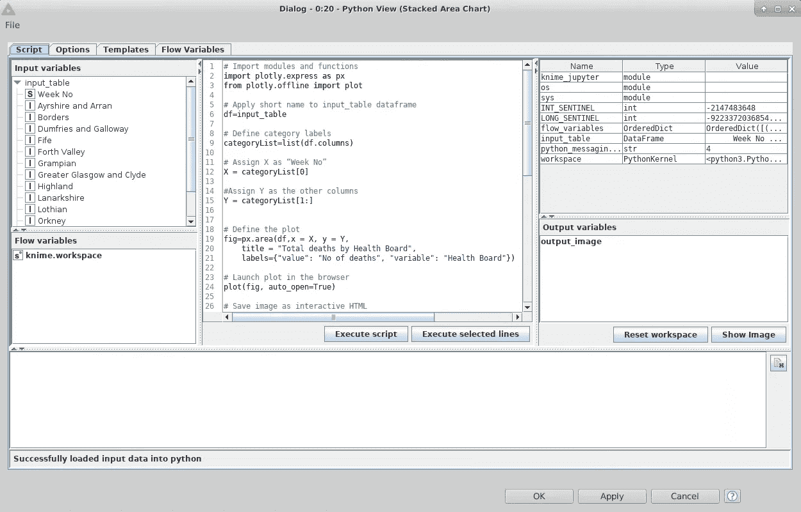

作者图片:截图 Python 视图配置

在左侧面板中，我们可以看到输入变量。这是我们的“输入表”，在 Python 视图节点中，它被视为数据帧(相对于[熊猫](https://pandas.pydata.org/))。因此，没有必要显式加载 pandas 模块。

中央面板包含用于本例的脚本。全文如下:

下面是它首先做的事情:

*   导入所需的模块 plotly.express 和 plotly . offline . plot
*   将短名称应用于 input_table 数据帧
*   根据 input_table 列名创建列表。
*   从列表中抓取第一个列名，指定为 X 轴
*   抓取剩余的列名，指定为 Y 轴的类别。
*   定义情节。在 plotly express 中，使用 px.area 函数生成堆积面积图。

然后，出于演示目的，它生成了各种格式的堆积面积图:

*   在默认浏览器中自动启动交互式绘图
*   将交互式绘图保存为 HTML 文件(以及所需的 JavaScript)
*   使用 Kaleido 将堆叠面积图保存为 png、jpeg、svg 和 pdf 格式的静态图像。

最后，它使用 plotly.io 模块将图形转换为静态图像字节字符串。它将这个赋值给 Python 视图节点的 KNIME“output _ image”变量。

## 示例图像

由 Plotly Express 生成的交互式 HTML 绘图在默认浏览器中自动启动，此处显示启用了“悬停时比较数据”切换:

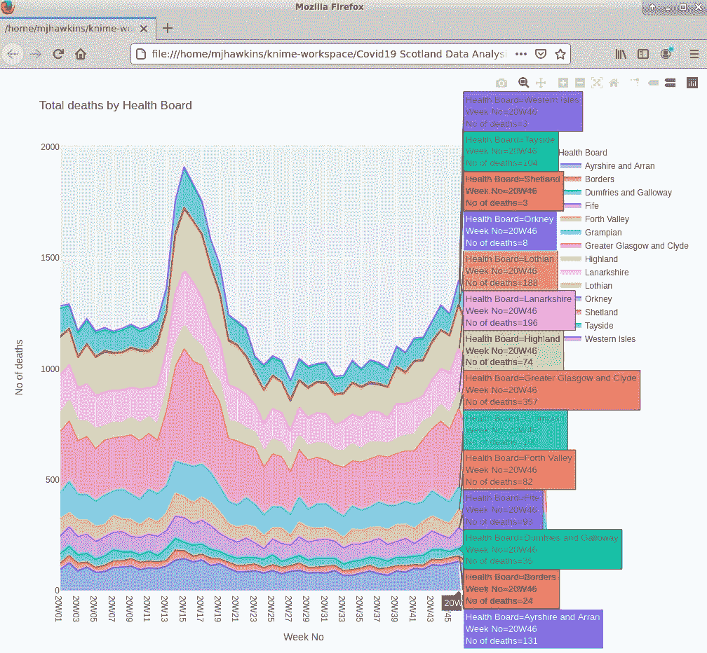

作者图片:截图— Plotly Express —堆积面积图—交互式 HTML 绘图

这是使用 Kaleido 引擎生成和保存的静态图像(png 格式):


作者图片:由 Kaleido 生成的静态 PNG 图像

右键单击 KNIME Python 视图节点，选择 Image:

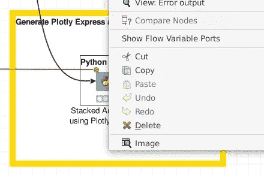

作者图片:截图 KNIME Python 视图节点-右键菜单

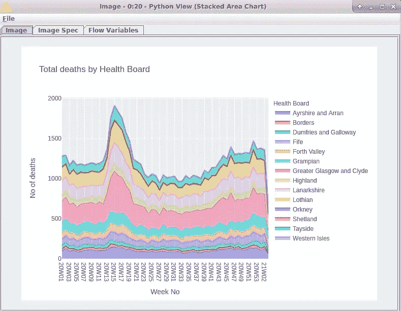

作者图片:截图 KNIME Python 视图节点-输出图片

## 与 KNIME 堆积面积图视图的比较

应该注意的是，KNIME Analytics Platform 的“开箱即用”基础版本已经为生成不同类型的图提供了各种“现成的”JavaScript 视图节点。其中包括堆积面积图节点。

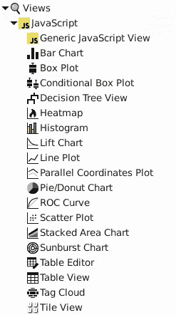

作者图片:截图

为了快速比较，我简单地在类似的工作流中连接了这个节点。

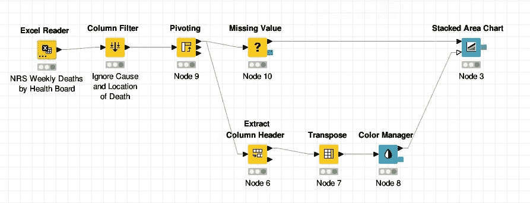

按作者分类的图像:屏幕截图—带有堆叠面积图(JavaScript)节点的 KNIME 工作流

这是生成的静态图像:

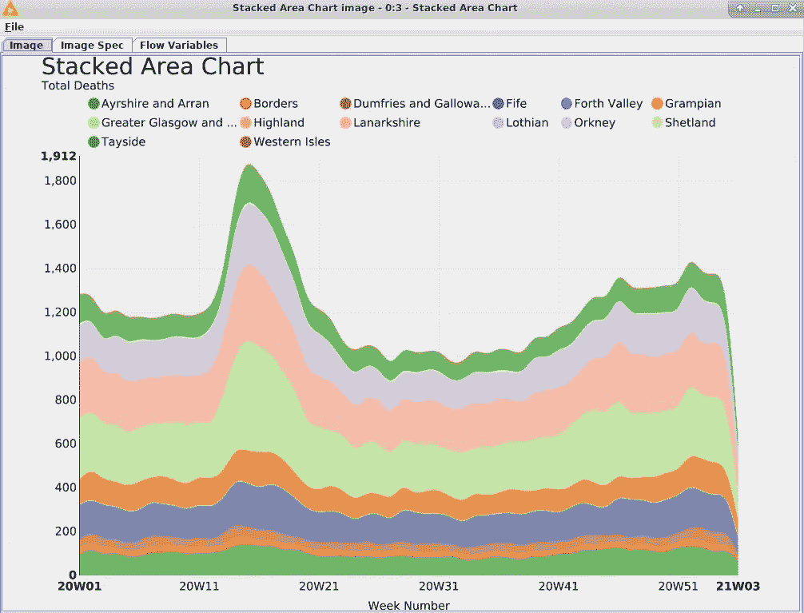

作者图片:截图 KNIME 堆积面积图节点-静态图片

还可以查看交互式 JavaScript 图表:

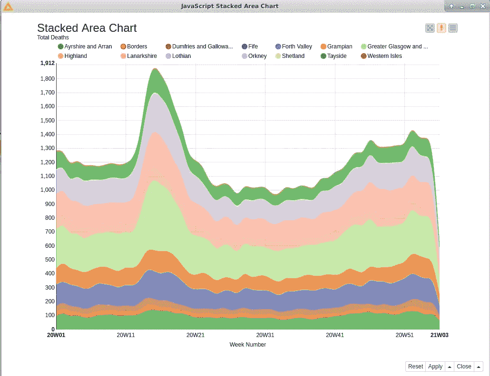

作者图片:截图— KNIME 堆积面积图节点—交互式图表

使用固定的 KNIME 视图的优点是在这种情况下根本不需要任何代码。只需将其插入工作流程，进行配置，然后按下按钮。这取决于你自己的需要。

这很大程度上取决于个人喜好。我自己的选择是为了 Plotly Express(及其“母公司”Plotly)提供的更大的灵活性和剧情范围。在这个例子中，python 代码保持在最低限度(只需要几行优雅的代码)。我当然可以忍受！

## KNIME Conda 环境传播

最后，您会注意到，我还将 KNIME Conda 环境传播节点包含到了这个示例工作流中(尽管对于我们的目的来说，它在这里并不是真正必要的)。

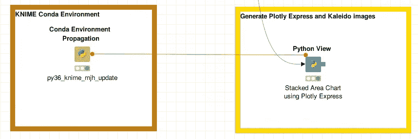

图片作者:截图— KNIME 工作流— Conda 环境传播

这是一个允许您在工作流程中保留特定 KNIME conda 环境的功能。这可确保指定所需的 python 模块和版本，使工作流更具可移植性。例如，您希望与其他同事共享工作流程或将工作流程上传至 [KNIME 服务器](https://www.knime.com/knime-server)。更多信息请阅读[本](https://hub.knime.com/knime/extensions/org.knime.features.python2/latest/org.knime.python2.nodes.conda.CondaEnvironmentPropagationNodeFactory)【6】。

# 外卖食品

*   KNIME Analytics Platform 提供了基于特定需求和个人偏好扩展其“开箱即用”功能的灵活性。
*   KNIME Python 集成发挥了 Python 的威力，并允许您将其集成到您的工作流中。
*   Plotly Express 和 Kaleido python 模块带来了丰富的图形库，并提供了出版质量的交互式图形和静态图像。
*   特别是 Plotly Express 允许您将编码减到最少。仅仅几行优雅的代码就能达到目的！
*   当设置 KNIME conda 环境时，似乎需要执行 Kaleido 的 pip 安装(相对于 conda 安装)以使其在 KNIME 中运行。

最后，我很想听到任何人关于万花筒装置的最后一点的意见。

对于那些希望获得 KNIME 工作流副本(包括使用的源数据)的人来说，在 [KNIME Hub](https://hub.knime.com/) 上有一个修改版本。只需搜索“使用 Plotly Express 和 Kaleido 的 Python 视图”。

# **参考文献**

[1] [在计算引擎上为 Linux 设置 Chrome 远程桌面](https://cloud.google.com/solutions/chrome-desktop-remote-on-compute-engine)

[2] [KNIME 分析平台安装指南](https://docs.knime.com/2020-12/analytics_platform_installation_guide/index.html)

[3] [KNIME Python 集成指南](https://docs.knime.com/2020-12/python_installation_guide/index.html)

[4] [KNIME Python Conda 环境 GitHub Gist 上的 YAML 文件](https://gist.github.com/CedarwoodInsights/6bf92a2d6779248019f3be18f199cb6a)

[5] [苏格兰国家记录——涉及冠状病毒的死亡(新冠肺炎)](https://www.nrscotland.gov.uk/statistics-and-data/statistics/statistics-by-theme/vital-events/general-publications/weekly-and-monthly-data-on-births-and-deaths/deaths-involving-coronavirus-covid-19-in-scotland)

[6] [KNIME 康达环境传播](https://hub.knime.com/knime/extensions/org.knime.features.python2/latest/org.knime.python2.nodes.conda.CondaEnvironmentPropagationNodeFactory)