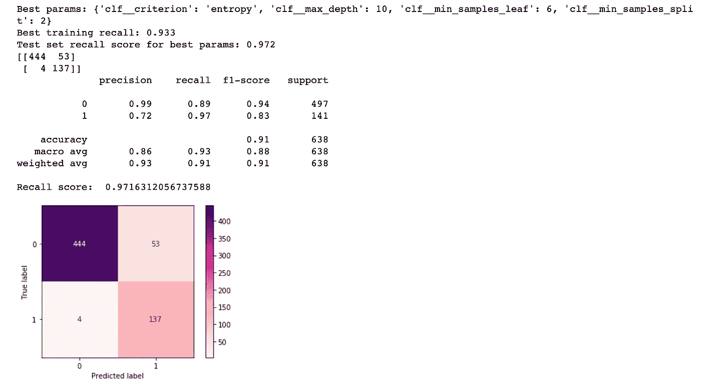

# 请多放些树

> 原文：<https://towardsdatascience.com/extra-trees-please-cec916e24827?source=collection_archive---------26----------------------->

杰伊·曼特里在 [Unsplash](https://unsplash.com?utm_source=medium&utm_medium=referral) 上的照片

## 冒险进入决策树和随机森林的机器学习领域

网格搜索。管道。决策树。支持向量机。超参数调谐。混淆矩阵。ROC 曲线。如果你在三个月前向我提到这些术语中的任何一个，我绝对不知道你在说什么。我们说的是同一种语言吗？然而，现在我在这里，刚刚使用所有这些技术、方法和工具完成了一个项目。这就是加速新兵训练营学习节奏的奇妙之处；我的大脑已经接受了这样一个事实:它每天都会被新的概念淹没，并被期望几乎立即投入使用。

我们 Flatiron School 的数据科学项目的第三个主要项目是一个专门关注分类的监督机器学习项目。与我们之前的其他项目不同，我们被指示建立预测*分类*目标变量的模型，而不是连续或数字变量。与预测电影票房价值或房屋销售价格不同，我们可以选择一些不同的分类数据集，或者选择我们自己的数据集。在搜索了几天的存储库和数据收集后，我最终选定了一个与我的兴趣相符的，并提出了一个需要解决的现实世界的问题。

我们作为一个团队在 Zoom 上见面，讨论我们选择的主题。当我听我的同事讨论他们的话题时，我意识到我错过了一个难得的机会，为这个项目选择一些乐观和有吸引力的东西进行调查。我听到学生们谈论他们兴奋地做出的不同体育相关的预测，以及其他人使用算法来预测音乐类型或视频游戏评级的计划。这么多有趣的想法！当轮到我介绍我的话题时，我重重地叹了口气，尴尬地解释说，我选择了一个与胎儿健康结果和死亡率有关的数据集。没错。不知何故，活泼的无忧无虑的·明挑了一个最严肃、最令人沮丧的话题。

然而，我的项目本身和数据的目标实际上是充满希望和乐观的。这一切的前提是持续的公共健康问题，即美国的胎儿死亡率。这是一个我非常关心的话题，这促使我花费数小时寻找用于此目的的正确数据。我发现的是[这个数据集](https://www.kaggle.com/andrewmvd/fetal-health-classification)包含 2000 多行患者的 CTG 记录，完整的特征包括胎儿心率、子宫收缩、胎动等等。然后由“产科专家”将每个记录分类为正常、可疑或病理胎儿健康结果。我通过将可疑结果和病理结果合并到一个标记为“处于危险中”的类别 I 中，将这调整为一个二元分类问题。我开始证明胎儿健康结果可以仅从 CTG 检查的指标中预测，这意味着这种预测可以自动化，医疗保健提供者可以简单地从这种容易获得的技术的读数中采取更积极的救生措施。

开始这个项目时，我首先意识到的一件事是，管道基本上是一种神奇的创造，可以简化将分类器与数据相匹配的过程。管道完成了缩放、预处理和设置分类器的所有步骤，并将它们合并到一个对象中，该对象干净地完成了整个过程，并消除了一些人为错误。由于我想探索许多不同的算法，所以我首先编写了一个函数来接受您选择的分类器，并返回一个准备好适合 X 和 y 的管道对象。(请注意，我的 class_weight 参数被设置为“balanced ”,以考虑到我不平衡的目标变量；在我的数据中，正常健康的婴儿比高危婴儿多得多。)

作者要点。

现在，可以说比管道更令人惊奇的是网格搜索的能力。GridSearchCV 允许您为一个模型检查许多不同的超参数，并通过为所选度量选择最佳参数来优化您的模型。在这种情况下，我优先考虑的指标是回忆。通过优化召回率，我将模型预测中的假阴性或第二类错误的数量降至最低。虽然我可以接受模型有时错误地预测婴儿处于危险之中，但我不太能接受模型有时错误地预测婴儿健康。因为我们在这里讨论的是人的生命，所以召回指标是这个项目中最重要的指标，远远高于精确度、准确度或任何其他评估指标。为此，我编写了一个函数，它接受一个管道对象(例如，来自上面的函数)和一组要调优的超参数，并返回一个网格搜索对象。如果你要优化的不是回忆，比如准确性，你只需要改变评分参数来反映这一点。

作者要点。

最后，我编写了一个函数来接收一个网格搜索对象(就像上面的函数所创建的那样),并返回用于评估的相关信息。这才是真正的奇迹发生的地方。最后一个函数接收上面的网格搜索对象，并开始优化您的模型。你坐着等着。你的电脑发出一些可怕的噪音。你慢慢后退。你的丈夫担心地问，他是否能在三个房间之外听到你的电脑。你微笑着说一切都好，而你却大汗淋漓，脑子里盘算着一台新 MacBook 的价格。你偶尔会往房间里瞥一眼，看到不祥的沙漏仍在屏幕上，深灰色的圆圈仍在 Jupyter 笔记本的右上角，呼呼声和咆哮的音量只会越来越大。但是过了一段时间后，一切又恢复了光明和宁静。在屏幕上，在你的输出单元里，等待着你的是:

*   根据您选择的评估标准，您的模型的最佳可能超参数，
*   一份分类报告，其中包含您针对此优化模型的精确度、召回率、F1 分数和准确度值，
*   还有一个彩色编码的混淆矩阵，告诉你基于这个模型预测的真阳性、真阴性、假阳性和假阴性的数量。

作者要点。

图片作者。

然后，一旦你有了这个，你就可以从头再做一遍！一遍又一遍，尽可能多的次数，直到你有了你最好的模型。(而且不，当电脑发出那些噪音时产生的焦虑不会消失；你只是逐渐接受你的电脑随时可能爆炸的事实。它让生活变得令人兴奋。)就我个人而言，我尝试了几个决策树、一些逻辑回归、一个随机森林、一个支持向量机，甚至一些带有 TPOT 分类器的 AutoML(没有我希望的那么好)。上面这张图片是我用额外的树分类器完成的最好的模型。它的召回率为 97%，虽然不完美，但比我的基线模型的召回率 77%要好得多。

## 等等，但是这个额外的树分类器到底是什么呢？

如果你熟悉随机森林，那么你就知道它是一种由决策树集合组成的算法。Extra Trees 是一种非常类似的算法，它使用一组决策树来最终预测数据点属于哪个类或类别。然而，额外树不同于随机森林，因为它使用整个原始样本，而不是像随机森林那样使用替换对数据进行子采样。另一个区别是节点的分割方式。随机森林总是选择最好的可能分割，而额外的树选择随机分割。额外的树和随机森林都是为了优化最终结果而设计的。

我感到惊讶的是，我能够用额外的树建立一个比随机森林更好的模型。虽然我的随机森林模型和我的网格搜索的最佳参数返回了 94%的良好回忆分数，但我的额外树模型返回了更好的分数。这里的教训是，使用不同的算法和分类器会有很多收获，所以不断迭代不同的模型和算法，直到找到最适合特定数据集和评估指标的模型和算法，这总是一个好主意。

在令人头痛的线性回归和处理多重线性和异方差等问题之后，这些分类模型真的是一股新鲜空气。看到这些模型能做多少事是很有启发性的；他们如何在不完善的数据下仍然表现出色。我特别喜欢直观地*看到*决策树模型如何做出决策的能力！了解所有这些不同的模型是如何运作的，它们背后的数学和科学，以及它们所呈现的直觉和可解释性是非常有趣的。我迫不及待地想进入我们的下一阶段，这将向我们介绍像深度学习和神经网络这样的概念。

那么，我的项目的最终结果是什么？我能够拒绝我的无效假设，即 CTG 数据和胎儿健康结果之间没有关系，并得出结论，有风险的胎儿健康结果可以通过模型预测 97%的时间。但是事情远不止如此；如果你对我使用的方法、详细的结果和可视化以及我的结论和建议感兴趣，请查看我的 GitHub repo 项目:【https://github.com/dtunnicliffe/fetal-health-classification】T2。