# 从 PayPal API 提取数据

> 原文：<https://towardsdatascience.com/extract-data-from-paypal-api-c25c76748746?source=collection_archive---------30----------------------->

## 或者使用 Serverless Node.js 从任意数据源 API 加载，并在加载到数据仓库之前执行任何 ETL/ELT

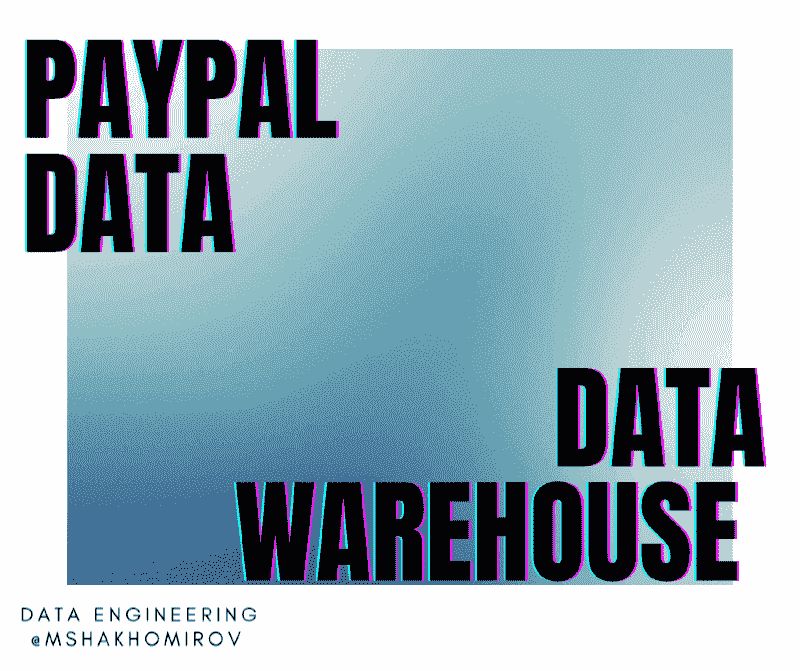

作者图片

## [代码为](https://github.com/mshakhomirov/pipelinetools)的 Github 库

# 项目大纲

## 您将了解如何:

# 创建一个开发人员访问和沙箱和模拟测试交易的贝宝账户

*   创建一个**沙盒账户**，在 PayPal 的测试环境中集成和测试代码。
*   用一些事务数据填充您的测试环境
*   尝试从 PayPal 报告 API 中**提取**这些数据。

# 使用 AWS Lambda 创建 PayPal 数据连接器

*   连接到您的 PayPal 帐户，使用 PayPal API 授权令牌提取交易数据，例如，昨天的交易数据。
*   使用名为**的配置文件。/config.json** ，它将设置如何访问和保存你的数据。例如，您可能希望使用与数据仓库中的表名相同的前缀来命名文件。
*   向 **PayPal API** 发送 http 请求以获取交易数据，并将结果作为 JSON 文件保存到您的 AWS S3 存储桶中。
*   使用 **npm 运行测试**命令在本地运行

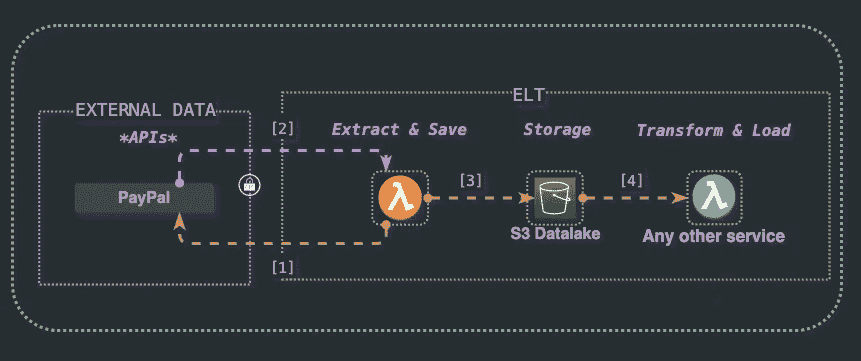

图片作者@mshakhomirov

# 关于这个想法

# 构建数据仓库:

通常，您会希望将您的数据仓库解决方案(BigQuery、Snowflake 或任何其他解决方案)放在图表的**中心**。

1.  **轻松连接任何外部数据源，即设置管道从 PayPal API** 获取数据并保存到云中。
2.  将数据加载到 **BigQuery** (AWS S3 到带有节点的 BigQuery 摄取管理器。JS)
3.  使用 Git、CI/CD 创建文档化的数据转换管道。例如，用**数据表单**
4.  通过云形成或地形简化和自动化部署(**基础设施代码**
5.  使用 **Google Data Studio** 创建 BI 报告(例如，收入对账等。)

作者图片[💡迈克·沙克霍米罗夫](https://medium.com/u/e06a48b3dd48?source=post_page-----c25c76748746--------------------------------)

# 现代数据堆栈工具(当然不是完整的列表):

*   摄入:五川，缝合
*   仓储:雪花，大查询，红移
*   转换:dbt、数据流、API。
*   BI: Looker，Mode，Periscope，Chartio，Metabase，Redash

图片作者@mshakhomirov

谈到**数据提取和摄取**您可能希望使用付费和托管工具，如 **Fivetran** 或 **Stitch** 从任意数据源(即支付商户提供商、汇率、地理编码数据库等)提取数据。)但是如果你遵循这个指南，你将完全有能力自己做这件事。

# 真实生活场景

假设你是一名数据工程师

您正在进行一个项目，将各种数据源连接到您在 **BigQuery** 中的数据仓库。您的公司是一家手机游戏开发工作室，在 IOS 和 ANDROID 两个平台上销售各种产品。

# 你的筹码

> *你的开发栈是混合的，包括****AWS****和****GCP****。你的团队经常使用 Node.js。*
> 
> *数据科学团队使用 Python，但服务器和客户端数据管道是使用 Node 创建的。*
> 
> *您的数据堆栈是现代的、事件驱动的和数据密集型的。*
> 
> 数据仓库解决方案必须具有足够的成本效益和灵活性，以便您可以添加任何您需要的数据源。
> 
> *它必须能够轻松扩展，以满足您不断增长的数据。*

# 任务

所有数据来自各种数据表面的文件，即数据库、kinesis 消防水带流和各种通知服务。它以不同的格式(CSV、JSON、PARQUET 等)存储到您的云数据湖中。).

作为一名**数据工程师**，你的任务是创建一条新的数据管道，将来自 **PayPal** 的财务数据输入数据仓库。财务团队将使用它来分析**谷歌数据工作室**每天的收入对账报告。

您决定使用 **AWS Lambda** 函数和 **Node.js** 每天从 PayPal 交易 API 提取数据，并首先保存到 AWS S3。

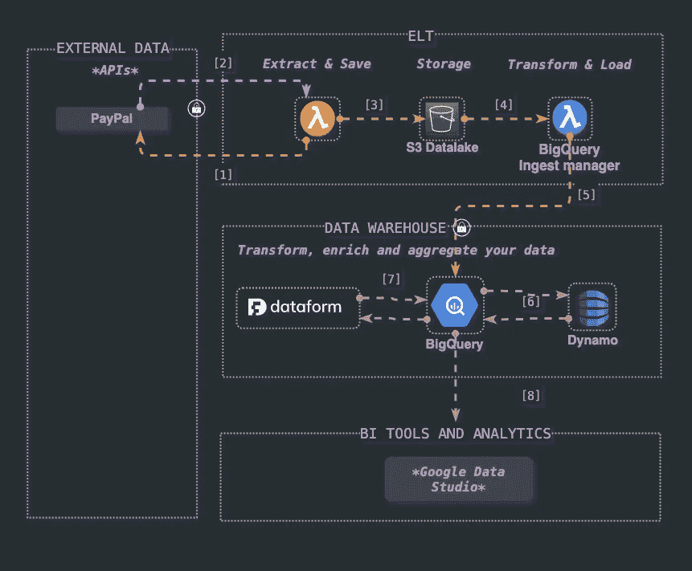

图片作者@mshakhomirov

> *这个简单的管道将确保数据被保存，并准备加载到 BigQuery，在那里它将被组织成表。*

# 先决条件、库和设置

# 工具

*   已安装 Node.js 和节点包管理器
*   对云计算(Amazon Web Services 帐户)、AWS CLI 和 AWS SDK 有基本的了解
*   PayPal 开发者账户
*   Shell(命令行界面)命令和脚本(高级)。

# 技术

*   对 REST APIs 的理解。
*   良好的节点知识。JS(中级)。您将创建一个 Lambda 函数。
*   你必须了解 Node。JS 基本概念，即异步函数、节点包和代码如何工作。
*   基本调试(控制台、打印报表)
*   循环:即用于
*   分支:if、if/else、开关
*   Shell 命令和脚本，就像您希望从命令行使用 AWS CLI 部署 Lambda 并能够在本地测试它一样。

# 我们开始吧

# 第一步。创建一个开发人员访问和沙箱的贝宝帐户

> *转到 developer.paypal.com***，创建一个* ***应用*** *。这将是对 Node.js 应用程序的集成。**
> 
> **创建一个* ***沙盒账号*** *在 PayPal 的测试环境中集成和测试代码。**
> 
> **用一些交易数据填充您的测试环境**
> 
> **试着将* ***收拢*** *这些数据从 PayPal 的 API 上报。**

*如果这些步骤中的任何一个导致困难，请参考下面的**帮助**部分。*

# *第二步。在你的机器上创建一个名为 bq-paypal-revenue 的本地 Node.js 应用。此应用程序将执行以下操作:*

> **连接到您的 PayPal 账户，使用 PayPal API 授权令牌提取交易数据，例如昨天的交易数据。**
> 
> **使用一个名为* ***的配置文件。/config.json*** *其中将有所有设置如何访问和保存您的数据。例如，您可能希望使用与数据仓库中的表名相同的前缀来命名文件。**
> 
> **发送****http****请求到****PayPal API****获取交易数据并将结果作为 JSON 文件保存到您的 AWS S3 桶中。**
> 
> **本地运行用* ***npm 运行测试*** *命令**

# *可交付的*

*该项目的可交付成果是一个工作的 **Node.js** 应用程序，它将能够在本地运行，并作为 **lambda 函数**部署在 **AWS** 帐户中。*

*感觉卡住了？*

# *帮助*

# *第一步:贝宝沙盒*

*   *使用访问令牌查询 PayPal API。如何获得访问令牌的更多信息可以在[这里](https://developer.paypal.com/docs/api/reference/get-an-access-token/)找到*
*   *[PayPal API 基础知识](https://developer.paypal.com/docs/api-basics/manage-apps/#create-or-edit-sandbox-and-live-apps)解释如何创建实时和沙盒 PayPal 账户。尝试创建一个沙盒。另一个有用的链接是 [PayPal 沙盒测试指南](https://developer.paypal.com/docs/api-basics/sandbox/)，它解释了测试过程，并提供了一些创建 PayPal 开发者账户的技巧。*
*   *使用您的沙箱`client_id:secret`并将其添加到 CURL 请求中:*

*   *结果，您会看到类似这样的内容:*

*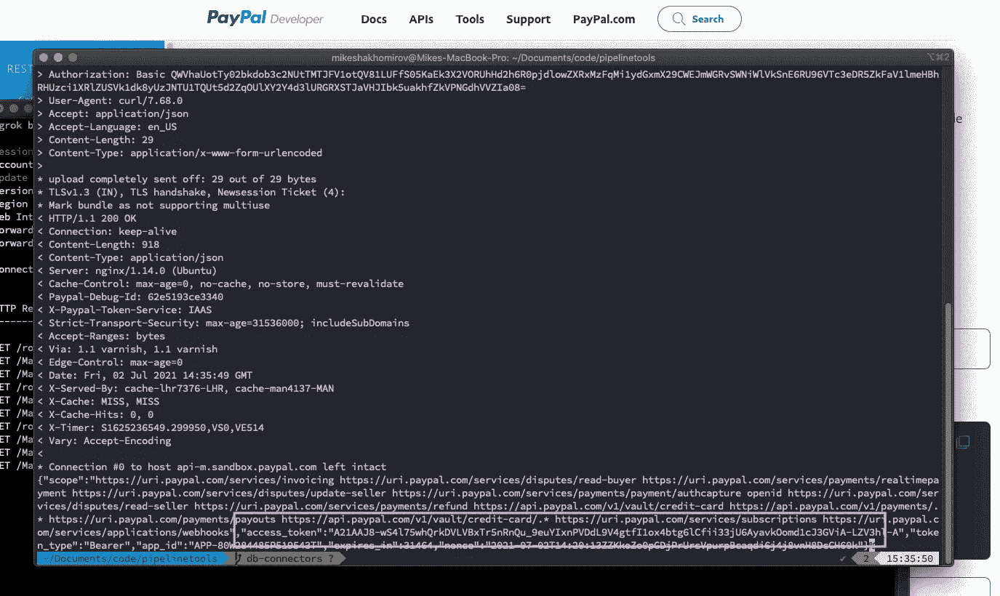*

*图片作者@mshakhomirov*

*   *现在，您可以使用这个**访问令牌**创建另一个请求来提取交易或您需要的任何其他数据，例如发票等。重复使用访问令牌，直到它过期。然后，获得一个新的令牌。这个想法是自动化的过程，所以在**步骤 2** 中，我们将创建一个微服务，以编程方式从 PayPal 获取数据。*

*   *用上一步中的标记替换'<access-token>'。您将看到类似这样的内容:</access-token>*

*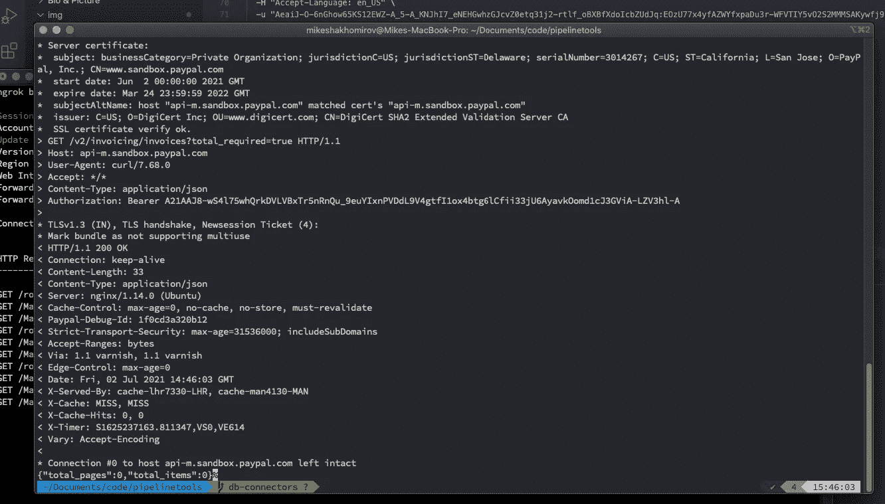*

*作者图片[💡迈克·沙克霍米罗夫](https://medium.com/u/e06a48b3dd48?source=post_page-----c25c76748746--------------------------------)*

*   *您可以看到还没有交易。*

# *第一步:如何模拟测试贝宝交易*

*   *在您的沙箱中创建样本交易的最简单方法是使用 [PayPal 产品 API 执行器](https://www.paypal.com/apex/home)*

*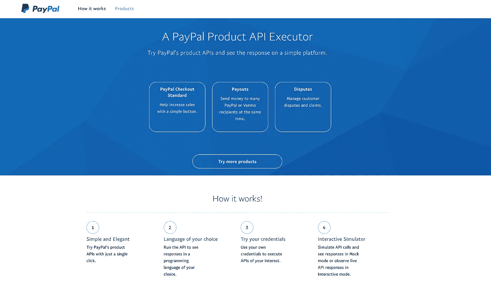*

*图片作者@mshakhomirov*

*你想使用贝宝结账标准，并创建一个完整的交易流程将是:*

*   *获取访问令牌*
*   *创建订单(授权和获取)。快速结帐的默认意图是**捕获**，并在交易被买方批准后立即捕获资金。点击此处了解更多关于[授权的信息。](https://developer.paypal.com/docs/platforms/checkout/add-capabilities/auth-capture/)*
*   *批准订单(买方批准订单并乐意付款)*
*   *更新订单*
*   *获取订单付款*
*   *显示订单详细信息*

***让我们创建一个订单**(用您的令牌替换“持票人”后的短语):*

*   *因此，您将看到创建了一些示例事务:*

*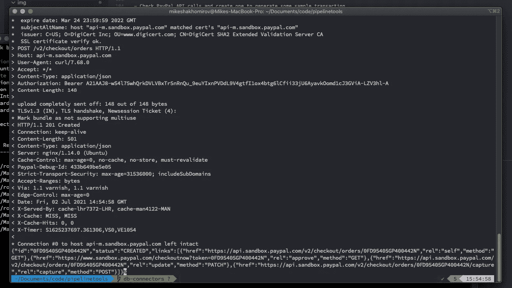*

*图片作者@mshakhomirov*

*   *客户现在将接受并批准它:*

*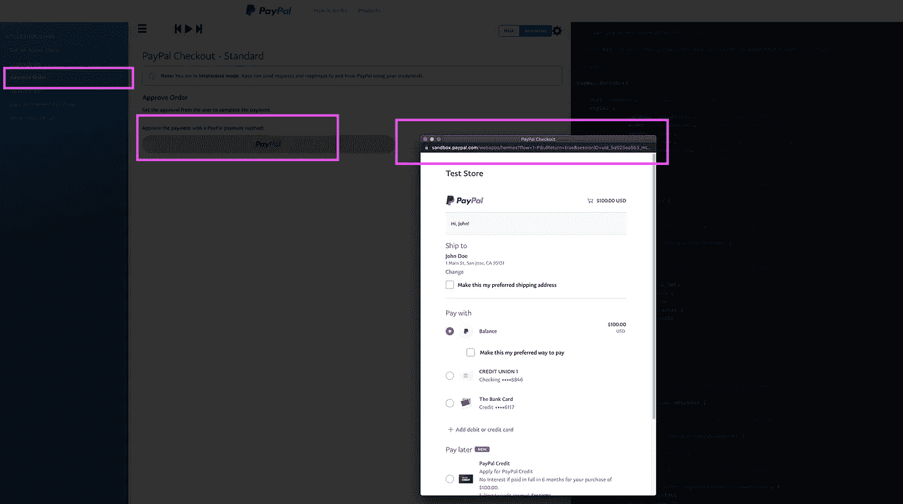*

*图片作者@mshakhomirov*

***重要提示:**为了模仿 Sandox 客户，您需要在 paypal.developer.portal 中创建一个测试个人账户，该账户不同于您的测试企业账户。通过这样做，您将能够实际批准您的订单。前往 https://developer.paypal.com/developer/accounts/[创建一个测试个人账户。然后登录并使用它来批准订单。](https://developer.paypal.com/developer/accounts/)*

*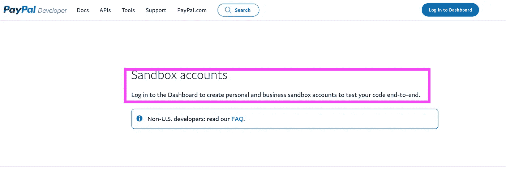*

*图片作者@mshakhomirov*

*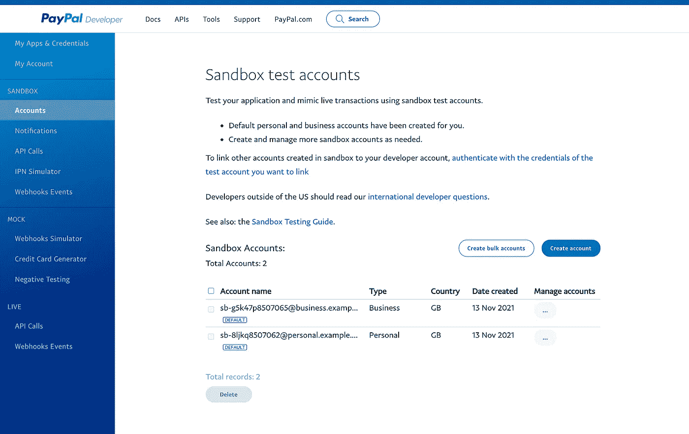*

*图片作者@mshakhomirov*

*   *订单批准后，您可能需要更新它。下面的 CURL 将订单更新为已创建或已批准状态。您不能更新状态为已完成的订单。*

*   *最后一步是获取付款。转到 APEX 或点击“捕获”或使用 CURL 和之前批准的订单 ID:*

***重要提示:**订单必须得到客户的批准才能获得付款，这是最棘手的部分，通常需要一些服务器开发，但您可以简单地使用 APEX 创建一个虚拟买家(使用个人沙盒帐户)来测试它。*

*   *现在您可以查看订单详情:*

# *步骤 1:使用报告 API 从 PayPal 获取历史交易*

*当您的**沙箱**中最终有了一些完成的事务时，您会想要使用一个**报告 API** :*

*输出应该是这样的:*

*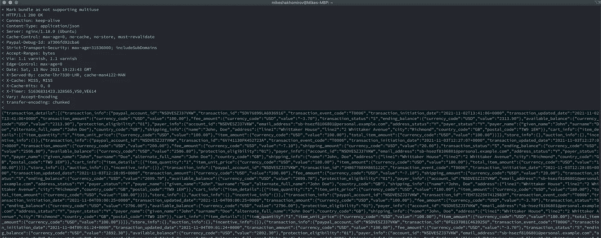*

*图片作者@mshakhomirov*

*这个 JSON 响应包含您需要的选定日期范围内的所有事务。接下来，您可能希望以编程方式运行这个命令，并将数据保存到云存储中，例如 AWS S3。这是一个“数据湖”步骤，旨在安全地存储您的数据，以便您可以在加载到数据仓库之前检查或更改它。这当然会在**云存储**和**数据仓库**中创建您的数据的副本，但是我建议这样做，以便您可以轻松检查任何数据加载错误。在存储桶上设置一个**过期策略**将在一定天数后清理云存储。*

# *步骤 2:用 AWS Lambda 创建一个无服务器 Node.js 应用程序，从 PayPal API 中提取数据*

*您可能希望使用以下 Node.js 模块:*

*   ***axios** 向 PayPal API 发出 HTTP 请求*
*   ***时刻**处理日期时间数据和参数*
*   *将数据保存到 S3 的 aws-sdk*
*   *在本地测试你的 lambda*

*初始化一个新的 Node.js 应用程序，这样你就有了这样一个`./package.json`:*

*您的应用程序目录如下所示:*

*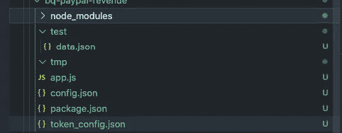*

*图片作者@mshakhomirov*

*   *使用`./config.json`来分隔您的真实环境和临时环境。例如:*

*   *创建一个文件来配置您的 PayPal 访问令牌凭证，并将“Basic *”替换为 Base64 编码的 client_id 和 secret 的组合，即:您还可以从本教程开始时获得 access_token 的一个 CURL 请求中复制并粘贴这个 Base64 编码的字符串。*

*   *您可能希望将 Base64 编码的字符串`clien_id:client_secret`传递给授权头。例如，如果您使用 Postman，您会发现您的 client_id 和 client_secret 值附加到标题中的文本“Basic”中，如下所示:`"Authorization": "Basic QWNxd2xIYT.....`使用它来获得带有 **OAuth2.0** 的访问令牌，然后在您的 PayPal API 调用中使用。点击阅读更多相关信息[。](https://learning.postman.com/docs/sending-requests/authorization/)*
*   *现在创建一个名为`app.js`的文件:*

*   *现在，您需要创建一个名为`processEvent`的函数来处理一个事件，该事件将触发该函数从 PayPal 提取交易数据。*

***最终解决方案***

## *检查 [Github 库](https://github.com/mshakhomirov/pipelinetools)*

*   *如果交易请求太大，PayPal 将对输出进行分页。所以`processEvent`会先估算大小，然后从 PayPal API 中逐页提取数据。*
*   *要在您的机器上本地测试和运行，请使用:`npm i`，然后使用命令`npm run test`。*
*   *使用 `[./deploy.sh](https://github.com/mshakhomirov/pipelinetools/blob/master/api-connectors/stack/bq-paypal-revenue/deploy.sh)`在 AWS 中部署您的 Lambda。*
*   *当 Lambda 部署到 AWS 并正在执行时，例如，由 **Cloudwatch** 事件触发。AWS Cloudwatch 事件将使用计划每天触发 Lambda。*
*   *Lambda 将从。/token_config.json 并通过 PayPal 认证*
*   *循环查看所需的每份 PayPal 报告(中的表格。/config.json) Lambda 会将每批交易以 json 格式保存到 AWS S3 中。*
*   *这将为您的数据仓库中的一个表提供数据，也就是说，如果您将该文件命名为与您的数据仓库表相同的名称，它可以通过编程方式加载到相关的表中。因此另一个微服务可以从那里获得它(不包括在这个项目中)*
*   *您可以通过运行以下脚本在 lambda 部署时手动调用它(需要 AWS CLI):*

*   *`app.js`*

# *项目结论*

*传统的 ETL，代表提取、转换和加载，现在已经发展到 ELT。数据从源系统中提取出来，加载到数据仓库中，然后在数据仓库中进行转换。这个实时项目帮助您管理“E”部分，即从外部数据源提取数据。*

*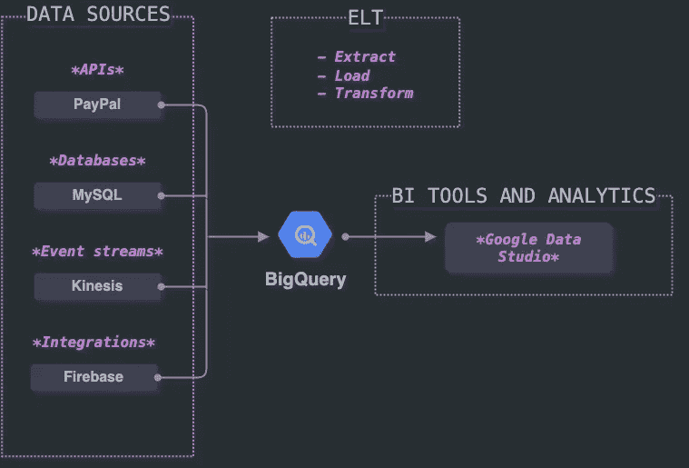*

*图片作者@mshakhomirov*

*   *无论您是一家初创企业还是一家全球性企业，您都已经学会了如何使用无服务器从任意的数据源中提取数据。*
*   *您已经学习了数据湖、数据仓库和解耦数据存储的概念。*
*   *您已经学习了如何使用 AWS Lambda 函数创建简单可靠的数据提取管道。*
*   *所有这些都提供了一个思路或模板，可以很容易地扩展并重用于将来可能需要的任何其他任意数据源。*

# *有用的资源*

*[1][https://docs . AWS . Amazon . com/AWS count billing/latest/about v2/free-tier-limits . html](https://docs.aws.amazon.com/awsaccountbilling/latest/aboutv2/free-tier-limits.html)*

*[2]https://aws.amazon.com/lambda/*

*[3]https://aws.amazon.com/cli/*

*[https://developer.paypal.com/docs](https://developer.paypal.com/docs)*

**最初发表于*[*https://mydataschool.com*](https://mydataschool.com/blog/extract-paypal-data-from-api/)*。**