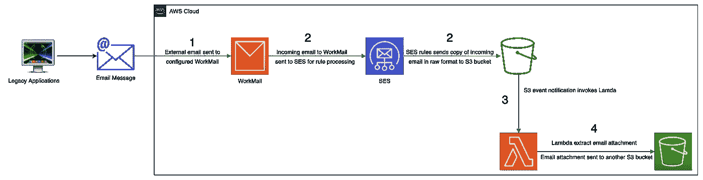
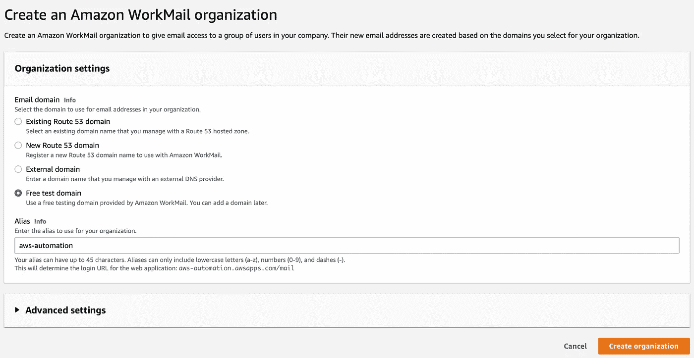
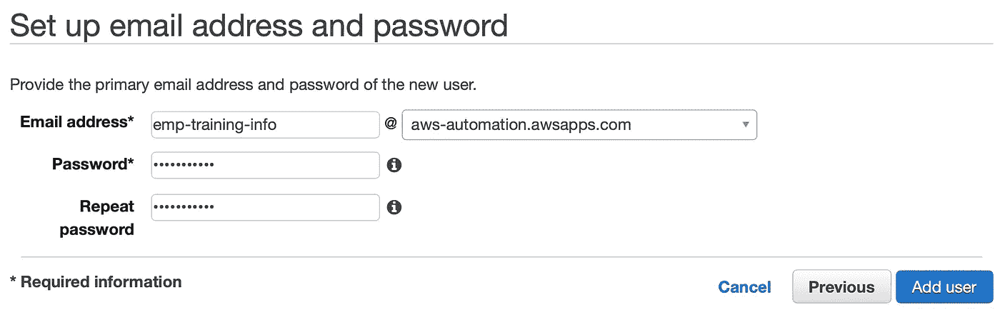
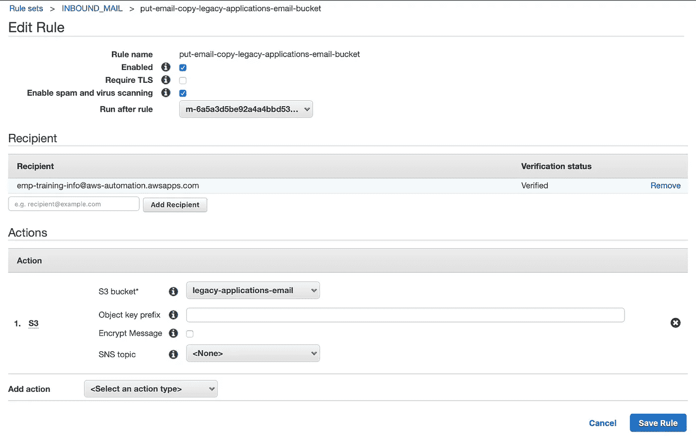
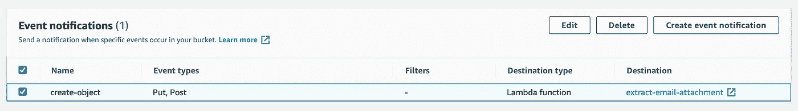
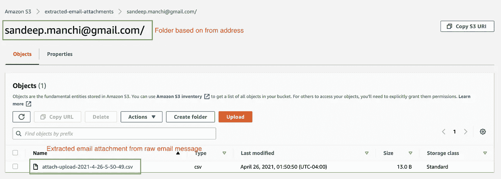
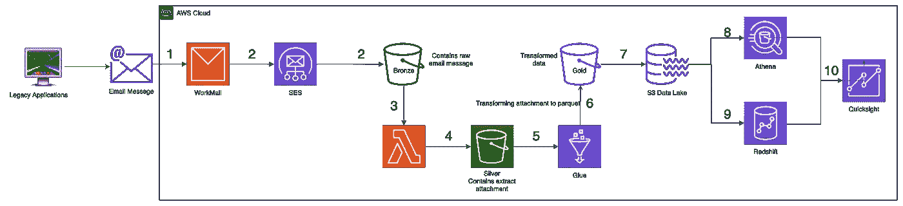

# 使用 AWS 提取电子邮件附件

> 原文：<https://towardsdatascience.com/extract-email-attachment-using-aws-624614a2429b?source=collection_archive---------1----------------------->

## 数据工程—通过处理电子邮件附件创建数据管道

照片由[妮可·德·霍斯](https://burst.shopify.com/@ndekhors)在[爆发](https://burst.shopify.com/photos/courier-delivery-zone-sign?q=mail)

电子邮件是后互联网时代人与人之间最原始的交流方式。电子邮件中包含附件是非常常见的。在大多数情况下，出于个人或专业原因，这些附件应该由用户手动处理。

在当前的云计算时代，不同环境上托管的应用程序可以通过 API 进行通信，也可以通过队列交换数据。内部和云系统也可以通过站点到站点 VPN 连接或像 AWS DirectConnect 这样的专用连接进行连接。

然而，即使在今天的云计算时代；有些情况下，数据是通过带有附件的电子邮件从遗留系统(内部)或遗留应用程序发送的，因此个人可以手动下载这些附件并上传到任何云服务。这些附件可能包含需要进一步提取、处理和分析(或 ETL)的重要信息。以下是一些这样的原因或场景:

*   在内部和云系统之间创建 VPN 或专用私有连接不可用或缺乏可能性(由于技术或组织原因)
*   无法创建基于 API 或队列的与传统 CRM / HR /财务系统的通信

本文的核心目的是提供一种使用 AWS 服务提取电子邮件附件的方法。本文还提供了在 AWS 中创建灵活管道来处理电子邮件附件的选项。使用 AWS 服务提取电子邮件附件涉及多个步骤，下面详细介绍了这些步骤:

使用 AWS 提取电子邮件附件的图示

1.  使用**亚马逊工作邮件**配置专用电子邮件服务器
2.  配置**亚马逊 SES** (简单电子邮件服务)发送一份**原始格式**的接收邮件到**亚马逊 S3** (简单存储服务)的桶中
3.  在 python 中创建 **AWS Lambda** 函数，从原始电子邮件消息中提取电子邮件附件
4.  配置 **S3 事件通知**以调用 AWS Lambda 上传事件(当原始格式的电子邮件被添加到 S3 时)将电子邮件附件发布到另一个 S3 存储桶

# # 1 —使用亚马逊工作邮件配置专用的电子邮件服务器

第一个显而易见的问题是——为什么不使用像 Outlook 这样更受欢迎的电子邮件服务器呢？为什么使用亚马逊工作邮件？

有现成的自动化工作流工具，如 Microsoft Flow 或 Zapier。例如，Zapier 有一个现成的自动化工具，可以提取电子邮件附件并直接发送到 AWS S3 公司。这种方法的主要问题(*除了需要使用高级订阅*)是必须输入 AWS 访问密钥 ID 和 AWS 秘密访问密钥。这给共享外部服务的密钥带来了安全风险，对许多人来说可能不是一个合适的选择。

解决方案是使用亚马逊工作邮件创建一个专用的电子邮件主机。这意味着可以创建一个专用且安全的电子邮件主机，遗留应用程序或遗留系统可以在其中发送带有附件的电子邮件以供进一步处理。鉴于电子邮件正在进入 AWS 生态系统，与 S3 等其他亚马逊服务的集成变得非常容易。

## 使用 Amazon WorkMail 创建专用电子邮件服务器的步骤

1.  登录 AWS 控制台并导航至服务——Amazon WorkMail
2.  选择创建组织的选项。Amazon WorkMail 组织为您公司的一组用户提供电子邮件访问权限。他们的新电子邮件地址是根据您为组织选择的域创建的
3.  为新电子邮件服务器选择电子邮件域，以关联新电子邮件地址，提供别名并创建组织。有选项来选择电子邮件域，包括现有的路由 53 域，一个新的路由 53 域，一个外部域(像一些托管在 godaddy.com)或一个免费的测试域。在这个具体的案例中，选择“*免费测试域*”作为**邮箱域**的选项，输入“ *aws-automation* ”作为**别名**(见下文参考)

使用“免费测试域”创建一个亚马逊工作邮件组织

## 创建专用电子邮件地址以接收来自遗留系统或应用程序的电子邮件的步骤

1.  导航到 Amazon WorkMail 并选择新创建的组织—“AWS-automation”
2.  选择创建用户的选项。按照提示和**创建一个名为“*员工培训信息*”的用户**。假设我们之前输入的组织名称是“aws-automation ”,并且我们正在使用测试电子邮件域；**电子邮件地址将被创建**为'*emp-training-info@aws-automation.awsapps.com*'(参见下文以供参考)

根据新的电子邮件域配置用户

如果在创建组织时使用了不同的电子邮件域，比如说——'*myorganization.com*'(假设正确配置了 Route 53 条目)，那么在这种情况下，电子邮件地址可能是*emp-training-info@myorganization.com*

# # 2 —配置亚马逊 SES 向亚马逊 S3 发送原始格式的接收电子邮件副本

假设我们已经使用 Amazon WorkMail 创建了一个电子邮件服务器，内置的 AWS 集成在 Amazon SES 中创建了以下两条记录:

*   测试电子邮件域→'*aws-automation.aws-apps.com*'被自动验证。可以在亚马逊 SES——域名中找到记录
*   自动创建一个名为“ *INBOUND_MAIL* 的活动规则集。使用 Amazon SES-rules Sets 下的“查看活动规则集”操作可以找到记录

## 为活动规则集创建新规则的步骤，该规则集将发送到特定电子邮件地址的电子邮件复制到特定的 S3 存储桶中

1.  选择 Amazon SES —规则集—查看活动规则集下的“创建规则”选项
2.  添加收件人以个性化规则。在这种情况下，将接收人添加为'【emp-training-info@aws-automation.awsapps.com】T4
3.  通过选择原始电子邮件格式应复制到的目标 S3 存储桶，为“S3”添加操作。
4.  从下拉选项中选择一个现有的 S3 时段或创建一个时段。在这个具体的例子中，创建一个 S3 存储桶'*legacy-applications-email*'。存储桶名称是全局唯一的，因此请选择您自己的存储桶名称。(可选)选择一个对象关键字前缀。否则继续下一步
5.  提供一个规则名称(比如—*put-email-copy-legacy-applications-email-bucket*)并创建规则

将特定收件人的传入电子邮件副本(原始)重定向到 S3 存储桶的 SES 规则

现在，发送到已配置的电子邮件地址(*emp-training-info@aws-automation.awsapps.com*)的传入电子邮件的副本将在已配置的 S3 桶(*传统-应用-电子邮件*)中创建。然而，以原始电子邮件消息格式复制的消息是不可读的，因此不能提取电子邮件附件。使用 python 包“email”的 python 程序可用于从原始电子邮件消息中提取电子邮件附件。这将在下面讨论。

# # 3 —用 python 创建 AWS Lambda 函数，从原始电子邮件中提取电子邮件附件

以下是在 python 中创建 AWS lambda 函数以提取电子邮件附件的步骤:

1.  在 AWS 控制台中导航到 Lambda
2.  通过提供函数名、运行时和默认执行角色来创建函数。在这种情况下，选择函数名为“提取-电子邮件-附件”，运行时为“Python 3.8”。对于默认执行角色，选择一个预先创建的角色，其中包括 Lambda 和 S3 的权限(这可以在此步骤之前通过 AWS IAM 创建)
3.  复制下面提到的代码。代码也可以在[https://gist . github . com/sandeepmanchi/365 BFF 15 F2 f 395 eeee 45 DD 2d 70 e 85 e 09](https://gist.github.com/sandeepmanchi/365bff15f2f395eeee45dd2d70e85e09):

从原始电子邮件中提取附件并发送到目的地 S3 桶的 Python 代码

上述代码执行以下步骤:

*   根据 S3 存储桶“传统-应用程序-电子邮件”，从新创建的原始电子邮件中提取存储桶名称和对象键。这是通过 Amazon SES 中配置的规则接收传入电子邮件的桶
*   使用电子邮件包，原始电子邮件上的附件和发件人地址被提取出来(第 24-28 行)
*   提取的附件临时存储为 attach.csv，然后上传到选择的目标存储桶，文件名为' *attach-upload- <时间戳>。CSV*’(第 36–40 行)。在这种情况下，目的地 S3 桶被选择为“*提取-电子邮件-附件*”。第 37 行的代码还使用电子邮件上的 from 地址在这个 bucket 中创建了一个文件夹。这样，来自不同发件人地址的附件就可以分组到不同的文件夹中

# # 4 —配置 S3 事件通知以调用 AWS Lambda(当原始格式的电子邮件被添加到 S3 时),并将电子邮件附件提取到另一个 S3 存储桶

对于在步骤# 2(*legacy-applications-email*)中创建的保存原始电子邮件消息副本的存储桶，创建一个事件类型为‘Put’的 S3 事件通知，并配置为调用在步骤# 3(*extract-email-attachments*)中创建的 lambda 函数

调用步骤 3 中创建的 AWS Lamda 的 S3 事件通知

在步骤# 3 中创建的 lambda 函数使用一个目的地桶，提取的电子邮件附件将被发送到该桶。在这个特定的例子中，目的地桶是'*extracted-email-attachments*'。这个桶应该在创建 lambda 函数之前创建。也建议更改存储桶名称，因为它是全局唯一的。

这就完成了所有的步骤。要进行测试，请向配置的电子邮件地址发送一封带有附件的电子邮件。在这种情况下是 emp-training-info@aws-automation.awsapps.com。发送电子邮件后，导航到 S3 存储区，注意到一个以“attach-upload-*”开头的对象。csv。该对象将使用文件夹前缀创建，其中文件夹名称与从电子邮件中提取的发件人地址相同(参见下文以供参考)。

提取电子邮件并复制到目标 S3 存储桶，按发件人地址分组

这将是作为电子邮件的一部分发送的相同附件。下载并验证内容进行确认。假设文件的内容现在在 AWS 中可用，那么可以通过创建一个定制的数据管道来进一步处理该内容，该数据管道可用于进一步的分析。

# 构建数据流水线以处理提取的电子邮件附件

B 下图展示了一种潜在的数据管道架构，该架构可以对提取的电子邮件附件执行 ETL 过程，并使其可用于进一步分析。这里假设发送到 Amazon WorkMail 的原始电子邮件包含附件形式的 csv 文件

AWS 中处理提取附件的潜在数据管道

下面是从第 5 步到第 10 步的细分:

*   #5 — AWS Glue 将 S3 桶(银桶)视为其输入，读取 csv 文件并转换为拼花格式。可选地，可以使用 AWS Lambda 代替胶水。两者之间的选择取决于数据的数量和性质
*   #6 —然后将转换后的数据放入另一个 S3 桶(黄金桶)
*   #7 —金桶将成为 S3 数据湖的一部分
*   #8、# 9—S3 数据湖可以作为 Athena 和 RedShift 的输入
*   # 10—Athena 和 Redshift 的数据可以通过 AWS Quciksight 进行分析

这就完成了详细介绍使用 AWS 提取电子邮件附件的逐步过程的文章。还提供了一个示例体系结构，以便使用 AWS 服务通过 ETL 过程进一步处理提取的附件