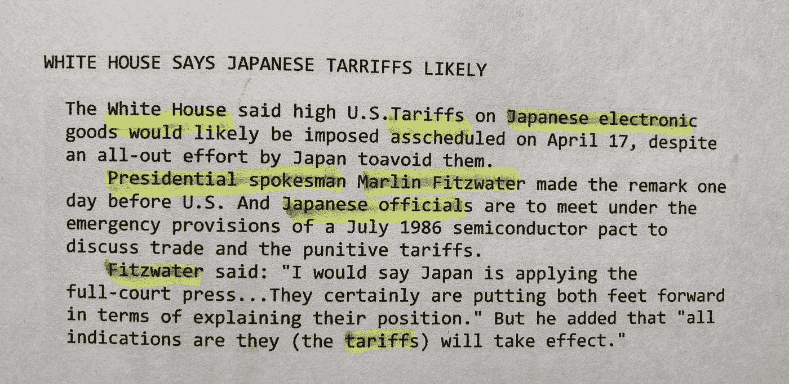
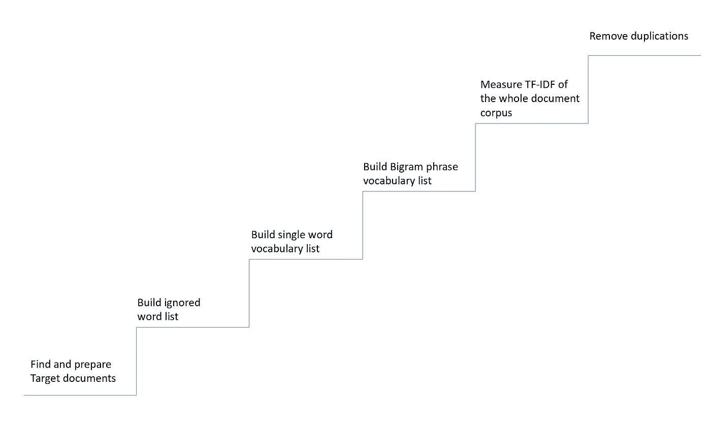
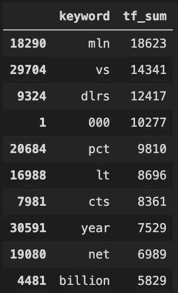
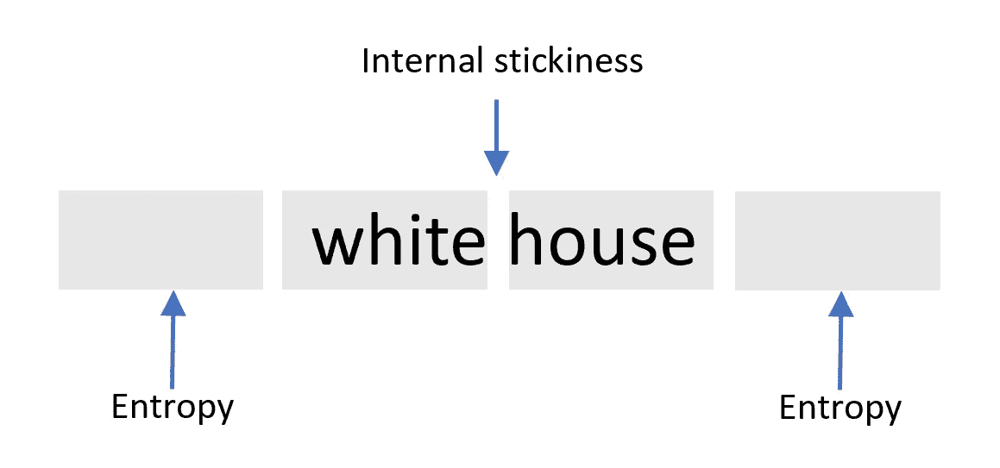
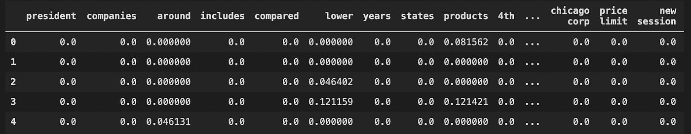
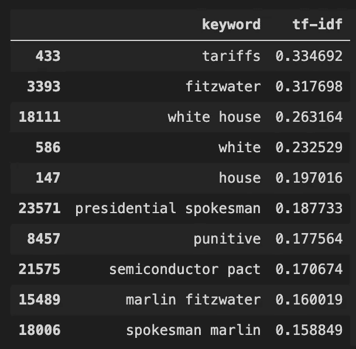
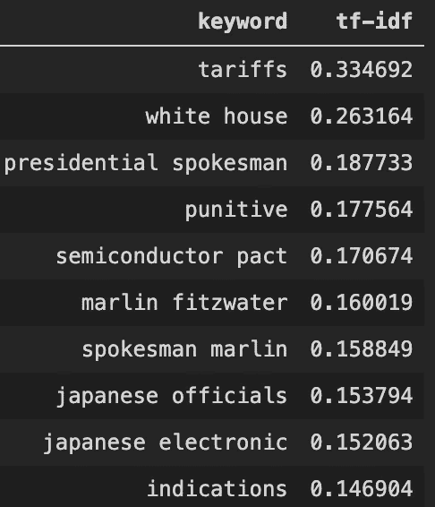

# 从文档中提取关键词，一种无监督的解决方案

> 原文：<https://towardsdatascience.com/extract-keywords-from-documents-unsupervised-d6474ed38179?source=collection_archive---------11----------------------->

## 一种从文档中自动提取关键词的解决方案。用 Python 实现了 NLTK 和 Scikit-learn。



图片由安德鲁·朱提供，路透社旧新闻

假设您手中有数百万(也许数十亿)的文本文档。无论是客户支持单、社交媒体数据还是社区论坛帖子。数据生成时没有标签。你正在绞尽脑汁给那些随机的文档添加标签。

手动标记是不切实际的；给出一个现有的标签列表很快就会过时。雇佣一个供应商公司来做标记工作是非常昂贵的。

你可能会说，为什么不用机器学习呢？比如，网络深度学习。但是，神经网络首先需要一些训练数据。适合您数据集的训练数据。

那么，有没有一个解决方案可以让我们给文档加标签满足:

1.  不需要预先请求训练数据。
2.  人工干预最小，可自动运行。
3.  自动捕捉新单词和短语。

这篇文章记录了我是如何用 Python 提取关键字的，它是如何工作的，walkarounds。

注意，本文中的代码是在 Jupyter Notebook 中运行和测试的。如果您运行一个代码块，但是受到缺少导入包错误的欢迎，那么这个包一定已经在前面的某个地方被导入了。

## 核心理念

TF-IDF 是一种广泛使用的算法，用于评估一个单词与文档集合中的一个文档的相关程度。

在我的上一篇文章:[在 Python 和 scikit-learn 中使用 TF-IDF 测量文本权重](/measure-text-weight-using-tf-idf-in-python-plain-code-and-scikit-learn-50cb1e4375ad)中，我使用了一个简单的示例来展示如何计算文档中所有单词的 TF-IDF 值。纯 Python 代码和使用 scikit-learn 包。

基于 TF-IDF，那些唯一且重要的词在某个文档中应该有很高的 TF-IDF 值。因此，理论上，我们应该能够利用文本权重#来提取文档中最重要的单词。

例如，一个谈论 scikit-learn 的文档应该包括更高密度的关键字 **scikit-learn** ，而另一个谈论“熊猫”的文档应该具有针对**熊猫**的高 TF-IDF 值。



从文档语料库中提取关键词的步骤

## 目标文档

因为我不能在这里使用我的日常工作数据库，也要确保你可以在你的本地机器上用最少的努力执行关键字提取示例代码。我发现来自 [NLTK](https://www.nltk.org/) 的路透社文档语料库是一个很好的关键词提取目标。

如果您不熟悉 NLTK 语料库，这篇文章可能有助于在不到一个小时的时间内开始使用 NLTK:[书籍写作模式分析—使用一个用例](/book-writing-pattern-analysis-625f7c47c9ad)开始使用 NLTK 和 Python 文本分析。

下载路透社文集。运行 Python 代码:

```
import nltk
nltk.download("reuters")
```

列出我们刚刚下载的语料库中的所有文档 id。

```
from nltk.corpus import reuters
reuters.fileids()
```

检查一个文档的内容及其类别。

```
fileid = reuters.fileids()[202]
print(fileid,"\n"
      ,reuters.raw(fileid),"\n"
      ,reuters.categories(fileid),"\n")
```

路透社的语料库是由重叠的类别组织的。我们还可以通过类别名称获取文档。关于完整的 NLTK 语料库操作，请查看这篇精彩的文章:[访问文本语料库和词汇资源](https://www.nltk.org/book/ch02.html#fig-inaugural2)

## 建立忽略单词列表

为了节省时间和计算资源，我们最好排除停用词，如“am”、“I”、“should”。NLTK 提供了一个很好的英语停用词表。

```
from nltk.corpus import stopwords
ignored_words = list(stopwords.words('english'))
```

您还可以使用 NLTK 停用词列表中没有的停用词来扩展该列表。

```
ignored_words.extend(
'''get see seeing seems back join 
excludes has have other that are likely like 
due since next 100 take based high day set ago still 
however long early much help sees would will say says said 
applying apply remark explain explaining
'''.split())
```

## 构建关键词词汇—单个单词

在使用 TF-IDF 提取关键字之前，我将构建自己的词汇表，包括单个单词(例如“Python”)和两个单词(例如“white house”)。

这里我将使用 scikit-learn 中的`CountVectorizer`来执行单个单词的提取工作。

```
from sklearn.feature_extraction.text import CountVectorizer
import pandas as pd
count_vec = CountVectorizer(
    ngram_range = (1,1)   **#1**
    ,stop_words = ignored_words
)
text_set     = [reuters.raw(fileid).lower() for fileid in reuters.fileids()] **#2**
tf_result    = count_vec.fit_transform(text_set)
tf_result_df = pd.DataFrame(tf_result.toarray()
                               ,columns=count_vec.get_feature_names()) **#3**
the_sum_s = tf_result_df.sum(axis=0) **#4**
the_sum_df = pd.DataFrame({ **#5**
    'keyword':the_sum_s.index
    ,'tf_sum':the_sum_s.values
})
the_sum_df = the_sum_df[
    the_sum_df['tf_sum']>2  **#6**
].sort_values(by=['tf_sum'],ascending=False)
```

代码 **#1** ，指定 CountVectorizer 将只计算单个单词。又名，1 克字。你可能会问，为什么不使用`ngram_range = (1,2)`然后同时获得单个和双元单词呢？这是因为在这里捕获 bigram 将得到类似于`"they are"`、`"I will"`和`"will be`的短语。这些是连接短语，通常不是文档的关键字或关键短语。

另一个原因是为了节省内存资源，由于组合太多，在这个阶段捕获二元短语将使用大量内存。

代码 **#2** ，使用 Python 理解将所有路透社文章放在一行代码中。

代码 **#3** ，将计数向量结果转换为可读的 Pandas 数据帧。

代码 **#4** ，产生一系列包括关键字及其在语料库中总出现次数的列表。

代码 **#5** ，将系列转换为数据帧，以便于阅读和数据操作。

代码 **#6** ，取只出现 2 次以上的词。

如果你偷看一下`the_sum_df[:10]`设置的前 10 个结果，你会看到那些最常用的词:



最常用的 10 个词

最常见但无意义的是，我们可以通过 Python 切片轻松地按比例排除这些:

```
start_index     = int(len(the_sum_df)*0.01) # exclude the top 1%
my_word_df      = the_sum_df.iloc[start_index:]
my_word_df      = my_word_df[my_word_df['keyword'].str.len()>2]
```

也删除少于 2 个字符的单词，如“vs”，“lt”等。

注意，我用的是`.iloc`而不是`.loc`。因为原始数据集是按 TF(词频)值重新排序的。`iloc`将切片放在索引的索引上(或索引标签的序列上)。但是`loc`会在索引标签上切片。

## 构建关键词词汇—两个单词的短语(二元短语)

为了构建二元短语列表，我们不仅需要考虑一起出现的频率，还需要考虑它与相邻词的关系。

例如短语`they are`，多次出现在一起，但`they are`只能跟随着有限的词，如`they are brothers`、`they are nice people`，这些词具有高的内部粘性，但低的外部连接灵活性。

外部连接灵活性通常可以用[信息熵](https://www.youtube.com/watch?v=2s3aJfRr9gE&ab_channel=KhanAcademyLabs)来度量。熵值越高，表示与其他单词一起使用的可能性越高。



对于我们的大脑来说，具有高内部粘性(计数频率)和高外部熵的短语，我们称之为“常用短语”，这些是我们想要添加到提取词汇中的内容。

NLTK 为解决二元短语提取问题提供了类似的解决方案。

```
from nltk.collocations import BigramAssocMeasures
from nltk.collocations import BigramCollocationFinder
from nltk.tokenize import word_tokenize
text_set_words  = [word_tokenize(reuters.raw(fileid).lower()) 
                   for fileid in reuters.fileids()] **#1**
bigram_measures = BigramAssocMeasures()
finder = BigramCollocationFinder.from_documents(text_set_words) **#2**
finder.apply_freq_filter(3) **#3**
finder.apply_word_filter(lambda w: 
                         len(w) < 3 
                         or len(w) > 15 
                         or w.lower() in ignored_words) **#4**
phrase_result = finder.nbest(bigram_measures.pmi, 20000) **#5**
colloc_strings = [w1+' '+w2 for w1,w2 in phrase_result] **#6**
```

代码 **#1** ，在这个 Python 理解表达式中，我使用`word_tokenize`将文档标记为单词列表。输出将是这样的:

```
[
    ['word1','word2',...,'wordn'], 
    ['word1','word2',...,'wordn'],
    ...
    ['word1','word2',...,'wordn']
]
```

代码 **#2** ，从标记化文档列表中启动 bigram finder 对象。还有另外一个功能`from_words()`可以处理分词词表。

代码 **#3** ，删除频率小于 3 的候选项。

编码 **#4** ，删除字长小于 3 或大于 15 的候选字。还有那些在`ignored_words`列表里的。

代码 **#5** ，使用`BigramAssocMeasures`中的`pmi`函数测量 2 个单词短语的可能性。你可以在[静态自然语言处理基础](https://citeseerx.ist.psu.edu/viewdoc/download?doi=10.1.1.121.2604&rep=rep1&type=pdf)的第 5.4 节中找到它是如何工作的。和[该链接](https://tedboy.github.io/nlps/generated/generated/nltk.BigramAssocMeasures.html#methods)列出所有其他测量功能和源。

编码 **#6** ，将结果转换成可读性更好的格式。

通过将`BigramAssocMeasures`、`BigramCollocationFinder`替换为`TrigramAssocMeasures`和`TrigramCollocationFinder`，您将获得 3 字短语提取器。在 Reuters 关键字提取示例中，我将跳过 3 个单词的短语。我在这里发布了示例代码，以备您需要。

```
from nltk.collocations import TrigramAssocMeasures
from nltk.collocations import TrigramCollocationFinder
from nltk.tokenize import word_tokenize
text_set_words  = [word_tokenize(reuters.raw(fileid).lower()) 
                   for fileid in reuters.fileids()]
trigram_measures = TrigramAssocMeasures()
finder = TrigramCollocationFinder.from_documents(text_set_words)
finder.apply_freq_filter(3)
finder.apply_word_filter(lambda w: 
                         len(w) < 3 
                         or len(w) > 15 
                         or w.lower() in ignored_words)
tri_phrase_result = finder.nbest(bigram_measures.pmi, 1000)
tri_colloc_strings = [**w1+' '+w2+' '+w3 for w1,w2,w3** in tri_phrase_result] 
tri_colloc_strings[:10]
```

## 激动人心的时刻，用 TF-IDF 测量关键词权重

现在，让我们将单个单词和两个单词的短语结合在一起，构建路透社定制词汇列表。

```
my_vocabulary = []
my_vocabulary.extend(my_word_df['keyword'].tolist()) 
my_vocabulary.extend(colloc_strings)
```

让我们发动引擎。请注意，请找一台内存至少为 16g 的机器来运行代码。TF-IDF 的计算需要一段时间，并且可能会占用您的大量内存。

```
from sklearn.feature_extraction.text import TfidfVectorizer
vec          = TfidfVectorizer(
                    analyzer     ='word'
                    ,ngram_range =(1, 2)
                    ,vocabulary  =my_vocabulary)
text_set     = [reuters.raw(fileid) for fileid in reuters.fileids()]
tf_idf       = vec.fit_transform(text_set)
result_tfidf = pd.DataFrame(tf_idf.toarray()
                            , columns=vec.get_feature_names()) #1
```

在将结果集转换为代码#1 中的 Dateframe 之后，`result_tfidf`保存所有关键字的 TF-IDF 值:



## 看看结果

让我们检查其中一篇文章，并与上面的提取器提取的关键字进行比较，以验证有效性。

通过指定`fileid`索引输出一个原始文件。

```
file_index= 202 # change number to check different articles
fileid = reuters.fileids()[file_index]
print(fileid,"\n"
        ,reuters.raw(fileid),"\n"
        ,reuters.categories(fileid),"\n")
```

返回 **fileid** ，**原始内容**，及其**类别**。(嗯，很多年前，美国和日本打了一场关税战)

```
test/15223 
 WHITE HOUSE SAYS JAPANESE TARRIFFS LIKELY
  The White House said high U.S.
  Tariffs on Japanese electronic goods would likely be imposed as
  scheduled on April 17, despite an all-out effort by Japan to
  avoid them.
      Presidential spokesman Marlin Fitzwater made the remark one
  day before U.S. And Japanese officials are to meet under the
  emergency provisions of a July 1986 semiconductor pact to
  discuss trade and the punitive tariffs.
      Fitzwater said: "I would say Japan is applying the
  full-court press...They certainly are putting both feet forward
  in terms of explaining their position." But he added that "all
  indications are they (the tariffs) will take effect."

 ['trade']
```

从我们刚刚酝酿的`result_tfidf` dataframe 对象中打印出前 10 个关键字。

```
test_tfidf_row = result_tfidf.loc[file_index]
keywords_df = pd.DataFrame({
    'keyword':test_tfidf_row.index,
    'tf-idf':test_tfidf_row.values
})
keywords_df = keywords_df[
    keywords_df['tf-idf'] >0
].sort_values(by=['tf-idf'],ascending=False)
keywords_df[:10]
```

十大关键词:



看起来这里的`white`和`house`与`white house`是重复的。我们需要删除那些已经出现在两个单词短语中的单词。

```
bigram_words = [item.split() 
                    for item in keywords_df['keyword'].tolist() 
                    if len(item.split())==2]
bigram_words_set = set(subitem 
                        for item in bigram_words 
                        for subitem in item) 
keywords_df_new = keywords_df[**~**keywords_df['keyword'].**isin**(bigram_words_set)]
```

上面的代码首先构建了一个单词`set`，它包含了一个双单词短语中的单词。然后，通过`~xxxx.isin(xxxx)`过滤掉已经在二字短语中使用的单字。

## 其他考虑

您拥有的文本语料库越大，TF-IDF 在提取关键词方面的表现就越好。路透社的语料库包含 10788 篇文章，结果表明它是有效的。我相信这个解决方案对于更大的文本数据库会更好。

上面的代码在我的 Macbook Air M1 上运行不到 2 分钟，这意味着每日刷新结果集是可行的。

如果您有数百 GB 甚至 TB 大小的数据。您可能需要考虑用 C/C++或 Go 重写逻辑，还可能利用 GPU 的能力来提高性能。

本文描述的解决方案远非完美，例如，我没有过滤掉动词和形容词。解决方案的主干可以扩展到其他语言。

## 提取的关键词

让我们再次打印出最终结果。

```
keywords_df_new[:10]
```

获得最高的 TF-IDF 值，其余的关键字看起来很适合代表这篇路透社文章。目标达成！

