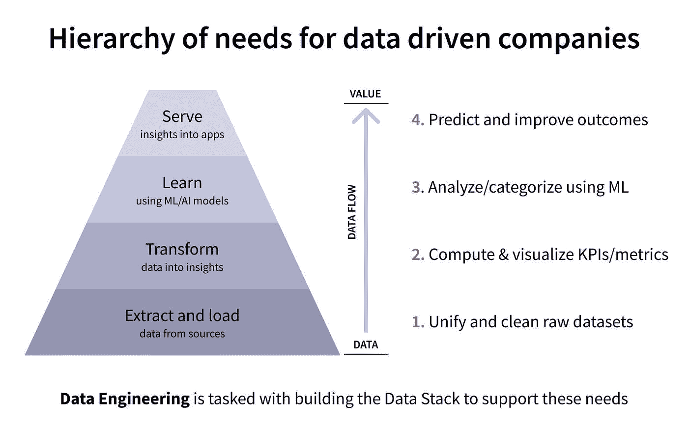

# 需求的数据层次:从数据到价值的 4 个步骤

> 原文：<https://towardsdatascience.com/extract-load-transform-learn-and-serve-getting-value-from-data-4f08d70bf343?source=collection_archive---------36----------------------->

## *介绍 ELTLS —提取&加载、转换、学习和服务*

每个公司都希望提供高价值的数据洞察，但不是每个公司都准备好或有能力。他们经常相信围绕点击式无代码数据连接器的市场宣传。只要设置好并忘记它，所有困难的工作都会完成——对吗？严酷的事实是，为了让团队得到他们想要的东西，所有数据都必须经过几个关键步骤:高价值的洞察力。

在许多方面，集中数据是*最容易的部分*。现在有了比以往更多的选择，可以快速轻松地构建管道，从数百个来源接收数据，并将其加载到数据仓库或数据湖中。然而，今天的工具营销忽略了一个主要话题:实现从数据集中化到高价值洞察交付的转变。**这就是数据科学的辛苦**。高价值的见解不是免费的，公司只能通过测试数据来获得这些见解。

从“我们拥有数据”到“我们拥有价值”的过程非常复杂，可以分为四个关键步骤:

1.  提取和加载:将来自多个来源的数据集中到一个数据仓库中
2.  转换:通过转换(清理、连接、聚合)来自不同来源的数据来理解数据
3.  学习:现在你已经理解了数据，建立机器学习模型。从技术上来说，“学习”只是一种更复杂转换
4.  服务:向应用程序和其他系统发送见解和推论，以“实现”数据的价值

这些步骤是特定数据工作的进展，而不是流程或工具的集合。让我们来谈谈如何从“提取和加载”转移到“服务”，以及“按部就班地处理数据”意味着什么

# 通过它的步伐获取数据

数据团队的任务是构建数据堆栈，以支持我们归类为“数据驱动型公司的需求层次”的业务需求层次结构如下所示:

图片由 Datacoral 提供

业务关键型数据存在于数十个(如果不是数百个)不同的来源中。在某些情况下，Datacoral 和 Fivetran 等服务提供商提供连接器，将数据传输到中央仓库和湖泊中。在其他情况下，工程团队用定制代码构建这些管道。但是，即使数据在流动，也需要专业知识来弄清楚这些数据到底意味着什么。公司不能直接进入数据，开始提供预测和改善业务成果的见解。首先要做的是基础工作。

数据科学的基础工作包括实验、假设检验、标准化、清理、转换、可视化、分析等等。没有对数据的深刻理解，就无法提供见解。让我们来看看这通常是如何进行的。

# 从“提取和加载”转向“转换”

让我们想象一下，一个小型创业公司刚刚签下了他们的第一批客户。他们将产品使用数据保存在 PostgreSQL 数据库中，并开始考虑分析和从这些数据中获取价值。目前，它们处于数据层次的最底层。他们提升数据层次结构的第一步是从他们的数据库或其他数据源中提取数据，并将其加载到数据仓库中，如 Snowflake。

一旦数据在其仓库中可用，团队就可以开始通过简单的转换来探索和清理数据。由于他们的团队很小，这项工作很可能由他们的一名软件工程师(或非常技术性的产品经理)作为一个附带项目来完成，结果是一个小仪表板，显示用户如何使用初创公司产品的重要指标。在这一点上，创业公司不仅能够从他们的来源提取和加载数据，而且能够转换数据以产生与其产品相关的 KPI 和指标。这已经创造了巨大的价值。当团队的规模和复杂程度增长时，他们可以开始开发机器学习模型，并将数据提供给应用程序。

# 从“学习”到“服务”

现在，让我们想象一个更大、更成熟的公司。这家公司已经有了从不同来源提取数据的连接器。数据已经整合到数据仓库中。该团队花了几个月的时间来探索和清理他们的数据，他们有简单的仪表板来显示关键指标。团队对数据质量的信任足以依赖这些指标进行内部报告。他们现在确定了预测分析的使用案例，并决定雇佣第一批数据科学家。新的数据科学家能够依靠仓库中干净和充分理解的数据，并通过训练第一个 ML 模型来帮助团队爬上数据层次。

在生产中使用 ML 模型，团队能够服务于内部和外部用例:为他们的销售和营销团队进行客户终身价值(LTV)估计，或者为他们的客户提供省时功能。此时，团队成功地导航了数据层次结构；他们正在从锁定在源系统中的原始数据一路发展到在应用程序中提供洞察力。虽然总是有更多的工作要做，以扩展到更多的数据源、新的用例以及更大的数据量，但这是一个很少有公司能够完成的成功的数据之旅。

# 作为框架的数据层次结构

构建数据堆栈的想法可能令人生畏。采用数据层次结构作为总体设计框架可以让您放心。它是工具无关的，非指令性的，关注于高级设计和执行过程。

框架的第一层(“提取和加载”)涉及将数据集中到一个仓库或湖中。第二层(“转换”)涉及聚合来自多个来源的数据并发现有意义的见解。第三层(“学习”)利用机器学习模型和人工智能建立在这些见解的基础上。第四层(“服务”)允许来自 AI/ML 工作的数据为内部和外部服务、客户、仪表板等增加价值。

通过识别数据堆栈的哪些部分适合框架的每一层，数据团队可以采用概念性的方法来交付价值。也不是一对一的关系。一些数据工具可以服务于框架的多个层次。例如，Fivetran 可以在“提取和加载”和“转换”层中工作。Datacoral 可以在所有四层中工作。定制代码可以用来服务于“提取和加载”以及“学习”层。关键是使用框架来帮助设计，而不是使用一系列工具来找出价值所在。

**从“提取和加载”到“服务”的转变，我们称之为“测试数据”**

当采用工具优先的思维方式而不是数据层次的思维方式时，我们经常会看到混乱。不同组件和互连的数量可能看起来像天文数字。([查看我们的数据质量帖子了解更多信息。](/the-3-things-to-keep-in-mind-while-building-the-modern-data-stack-5d076743b33a))对于刚刚起步的小型数据团队来说，找到合适的工具组合来满足特定需求是一件非常困难的事情，而且事关重大。这个工具网络需要继续存在，并使公司在未来两三年内继续发展。工具的功能也需要随着增长而扩展。

# 通过数据提供有价值的见解

希望提供高价值见解的公司需要测试数据。需求的数据层次提供了“什么”,正如我们在以前的帖子中探讨的关于简化[现代数据栈](/the-3-things-to-keep-in-mind-while-building-the-modern-data-stack-5d076743b33a)和[使用元数据的操作能力](/how-to-use-metadata-to-future-proof-your-data-stack-97c4885f97f6)来适应未来的所述栈，元数据优先的三层框架提供了“如何”

框架的数据流层代表了从“数据”到“价值”的转变但这仅仅是一个开始。这些想法共同提供了一种以客观和抽象的方式思考数据的方法。

该层次结构清楚地表明，从“拥有数据”过渡到“从数据中获得高价值的洞察力”存在一系列依赖关系这就是数据驱动型公司的运作方式。这绝非偶然。他们通过它的步伐移动数据。这需要专业知识和实验。

透过数据需求层次的镜头来看数据，可以让任何数据团队对他们在层次中的位置、如何评估他们当前职位的优势和劣势以及如何进入下一步有一个有意义的了解。

如果你在寻找如何在实践中检验数据的例子，我们有两个故事可以分享。企业人才获取平台 [Greenhouse 提升了数据层次，以便使用 ML 模型来改善他们的面试安排体验](https://www.datacoral.com/customers/case-studies/greenhouse/)并解决他们的“点画意大利面条数据问题”零工经济初创公司 [Jyve 利用他们的数据情报](https://www.datacoral.com/customers/case-studies/jyve/)通知他们平台上的“Jyvers”并拓展新市场。这两个用例都展示了小数据洞察如何大有作为！