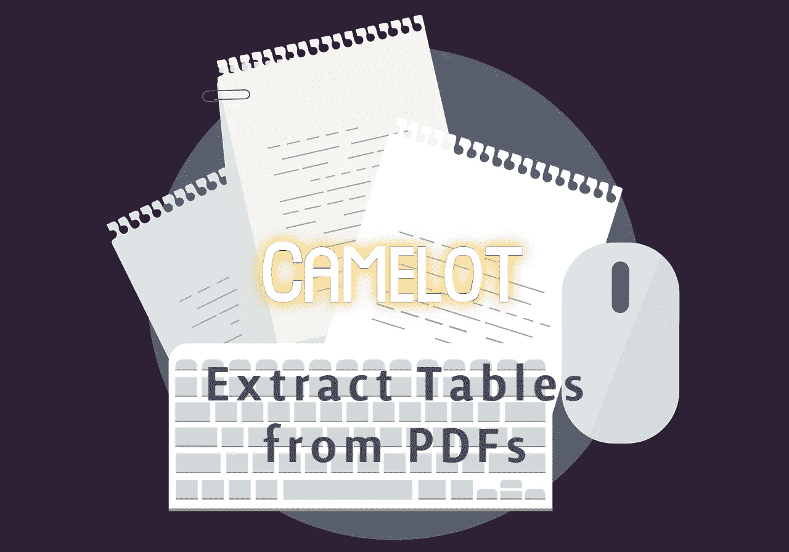

# 用一行 Python 代码从 PDF 文件中提取表格

> 原文：<https://towardsdatascience.com/extract-tables-from-pdf-file-in-a-single-line-of-python-code-5b572cd9fbe5?source=collection_archive---------9----------------------->

## 如何使用 Camelot 从 pdf 提取表格并将其转换为 Pandas 数据框架



图片由[皮克斯拜](https://pixabay.com/?utm_source=link-attribution&amp;utm_medium=referral&amp;utm_campaign=image&amp;utm_content=5000691)的[梅根·雷扎辛](https://pixabay.com/users/megan_rexazin-6742250/?utm_source=link-attribution&amp;utm_medium=referral&amp;utm_campaign=image&amp;utm_content=5000691)拍摄

数据科学中的一个标准原则是，更多数据的存在会导致训练更好的模型。数据可以以任何格式呈现，数据收集和数据准备是模型开发流程的重要组成部分。任何案例研究所需的数据都可以以任何格式呈现，数据科学家的任务是将数据转换成所需的格式，以继续进行数据预处理和管道中的其他组件。

许多结构化/半结构化或非结构化数据可以在基于文本的 PDF 文档中以表格格式和图像格式呈现。开发定制的表提取模型需要大量的时间和精力。在本文中，我们将讨论如何使用开源库 Camelot，仅用一行 Python 代码从 PDF 文档中提取所有可用的表格。

# 卡梅洛特是什么？

Camelot 是一个开源的 Python 库，使开发人员能够从 PDF 文档中提取所有表格，并将其转换为 Pandas Dataframe 格式。提取的表格还可以以结构化形式导出，如 CSV、JSON、Excel 或其他格式，并可用于建模。

Camelot 有一个限制，因为它只能处理基于文本的 pdf，而不能处理扫描的文档。

# 卡梅洛特是如何运作的？

Camelot 使用两种表格解析技术，即 Stream 和 Lattice，从 PDF 文档中提取表格。人们可以在两种表解析技术之间进行选择。

## 流:

Stream 是一种解析技术，它使用 PDFMiner 的功能根据空白或边距将字符分组到单词或句子中。流解析技术就像一种基于猜测的技术。

## 晶格:

Lattice 是另一种解析技术，它不依赖于猜测，而是找到表格中的水平线和垂直线来解析 PDF 文档中的多个表格。Lattice 只能解析单元格之间有分界线的表格。在 PDF 文档中查找表格的格子算法步骤是:

1.  使用 Ghostscript 将 PDF 文档转换为图像。
2.  应用基于 OpenCV 的形态学变换来获得转换图像中表格的水平和垂直线段。
3.  然后，通过对线段(从点 2 开始)和表格像素强度进行“与”运算来检测线交点。
4.  通过取线段(从点 2 开始)和它们的像素强度的或来检测表格边界线。
5.  通过使用线交点和线段来检测跨越单元或合并单元。
6.  然后，由于图像和 PDF 中的尺寸可能不同，检测到的表格的线段和边界线被缩放并映射到 PDF 文档。
7.  将表格的线段和边界线放置在适当的(x，y)坐标中后，在表格的像元上找到的单词将被检测并映射到数据框。

> 要可视化上述每个步骤，请遵循 Camelot 的[高级使用文档页面](https://camelot-py.readthedocs.io/en/master/user/advanced.html)。

# 安装:

可以使用以下命令从 PyPl 安装 Camelot 和 Ghostscript:

```
**!pip install "camelot-py[cv]"
!apt install python3-tk ghostscript**
```

安装后，可以使用以下方式导入 Camelot:

```
**import camelot**
```

# 用法:

导入必要的模块后，使用`**camelot.read_pdf()**` 功能读取 PDF 文件。

```
**tables = camelot.read_pdf('table.pdf')**
```

默认情况下，Camelot 只解析 pdf 文档的第一页，要解析文档多页中的表格，请使用`**read_pdf**` 函数中的`**pages**` 参数。

```
**# pass comma seperated page numbers or page ranges
tables = camelot.read_pdf('table.pdf', pages='1,2,3,5-7,8')**
```

Camelot 还可以从受密码保护的 PDF 文档中提取表格，只需绕过所需的密码。

```
**tables = camelot.read_pdf('table.pdf', password='*******')**
```

`**camelot.read_pdf**` 是唯一的一行 Python 代码，需要从 PDF 文件中提取所有表格。现在，所有的表都以 Tablelist 格式提取，并可以通过其索引进行访问。

```
**#Access the ith table as Pandas Data frame
tables[i].df**
```

要将表格导出为所需格式，可以使用`**camelot.export()**` 功能，并使用参数`**f=’csv’**`、`**f=’excel’**`、`**f=’html’**`或`**f=’sqlite’**`、**、**。

```
**tables.export('name.csv', f='csv')**
```

获取关于数据提取情况的解析报告或指标报告

```
**tables[i].parsing_report****# Output:** 
{'accuracy': 99.27, 'order': 1, 'page': 1, 'whitespace': 13.89}
```

## 代码:

> 下图中使用的 PDF 文档是从[表](https://www.w3.org/WAI/WCAG20/Techniques/working-examples/PDF20/table.pdf)、[表 1](https://s16458.pcdn.co/wp-content/uploads/2017/01/sample1.pdf) 下载的。

# 结论:

在本文中，我们讨论了如何从 PDF 文档中提取表格，并将其转换为 Pandas Dataframe，以便进一步用于建模。有各种开源库，包括 Tabula、pdftables、pdf-table-extract、pdfplumber，它们提供了与 Camelot 类似的功能。

卡梅洛特比它的替代品更好，阅读[这篇文章](https://github.com/camelot-dev/camelot/wiki/Comparison-with-other-PDF-Table-Extraction-libraries-and-tools)来比较卡梅洛特和它的竞争对手的图书馆的结果。

# 参考资料:

[1]卡梅洛特文献:【https://camelot-py.readthedocs.io/en/master/ 

> 感谢您的阅读