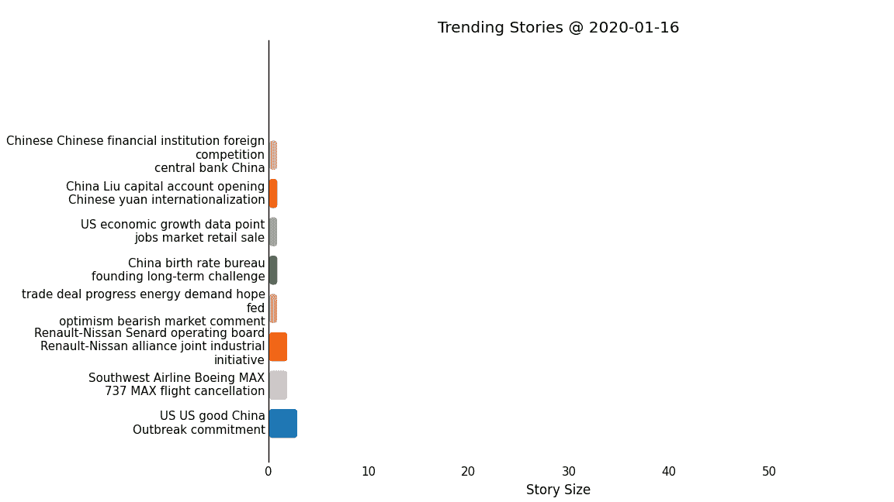
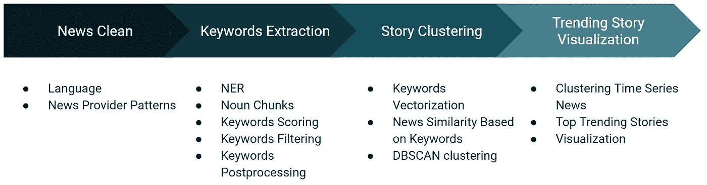
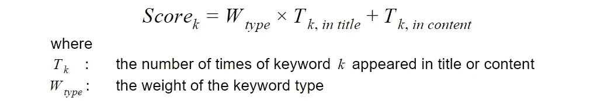
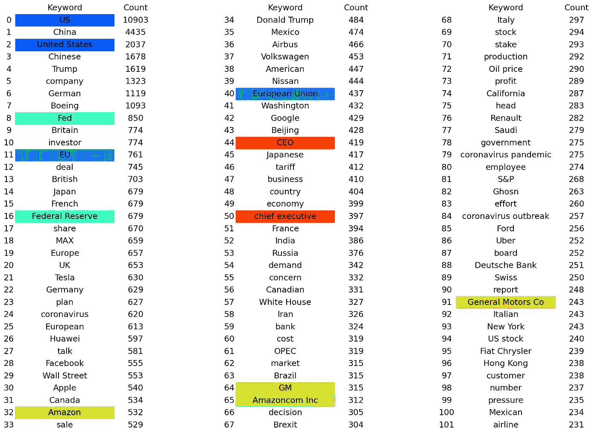
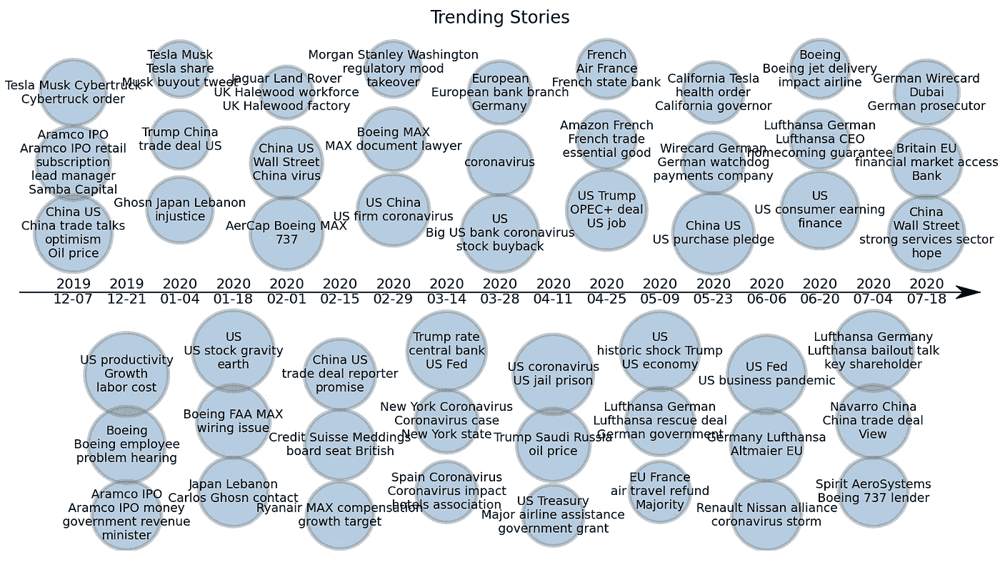

# 提取新闻中的趋势故事

> 原文：<https://towardsdatascience.com/extract-trending-stories-in-news-29f0e7d3316a?source=collection_archive---------16----------------------->

## 如何有效提取关键词，聚类海量新闻

如今，每天都有数百万篇新闻文章和博客在网上发布[1]。新闻数据以几年前无法想象的速度产生。社交媒体平台已经成为网上新闻的主要来源，以满足互联网用户的信息消费需求[2]。然而，也产生了大量重复、重复或垃圾内容的新闻。如何有效地对海量新闻内容进行预处理、组织和分析，是提供良好用户阅读体验的基石。



趋势报道摘录(作者图片)

因此，越来越需要基于文章内容的新闻自动分组，即内容驱动的分组。本文探讨了 NLP 技术，用于聚类在线新闻并提取随时间变化的趋势故事。通常，从大量新闻中获取热门新闻有几项任务。下图说明了数据处理管道(新闻搜索除外):



数据管道(图片由作者提供)

以下部分将详细解释所有这些任务和方法。这个解决方案的所有代码都可以在[我的 GitHub 库](https://github.com/steveyx/trending-stories)中找到。

# 新闻来源和抓取

经常需要从互联网资源中收集数据用于文本分析。Scrapy 是一个流行的工具来建立网页抓取工具。有几篇关于使用 Scrapy 抓取新闻或相关数据的有趣文章[4，5]。然而，新闻数据抓取并不是这里的主要焦点。

本文使用来自 Kaggle [6]的财经新闻标题数据集作为例子来说明新闻聚类和趋势故事提取。该数据集拥有 2018 年至 2020 年超过 3 万条新闻标题。每篇文章都包含标题、简短描述和出版时间。数据集中有三个新闻来源，即路透社、卫报和美国消费者新闻与商业频道。

# 新闻清洁

在线新闻通常包含许多不想要的文本、来自其他语言的单词、特定于提供商的模式等。如果不在管道的早期阶段清理这些文本特征，可能会对下游任务造成干扰。

文本清理通常是特定领域或特定问题的任务。这个数据集中的大部分文章都是用英语写的。非英语字符被简单地删除。

## 特定于提供程序的文本模式

新闻提供者可能在其文章中有一些模式。例如，该数据集中的 Reuters news 有许多文章都有跟随短语或实体的常见模式。

```
**-** Facebook’s Zuckerberg to testify before Congress: **source
-** McDonald’s accused of firing worker who sued over COVID-19 claims**: Bloomberg
-** Coty to appoint Chairman Peter Harf as its new CEO**: WSJ
-** Siemens prepares for COVID-19 trough to last 6–9 months**: CNBC**
```

如果那些模式短语没有被移除，它们可能被识别为文章的关键词，从而导致故事聚类的更多噪声。

在本文中，使用 Python 中的正则表达式清理了那些与提供者相关的模式。

# 关键词提取

关键词提取是流水线中的主要任务之一。目标是选择几个具有词频的关键词来反映文章的关键信息。关键词通常来自文章中的命名实体和名词短语。

Spacy 是一个开源 Python 库，支持大多数 NLP 应用程序。使用其预先训练的模型，它支持快速 NER(命名实体提取)，包括大多数实体，如个人，组织，GPE(国家，城市，州)等。它还支持名词短语的提取。

本文使用 Spacy 作为基础工具来高效地提取实体和名词组块，而不是花费大量精力来训练深度学习模型。

为了提高关键字提取的性能，提供了以下模块:

## 关键词评分

考虑到关键词在新闻中的重要性，根据关键词类型(实体或名词组块)、关键词位置(标题或内容)和出现次数使用不同的权重。

出现在标题中的关键字被赋予比在内容中更大的权重。一个实体关键词的权重比同一位置的一个名词块要大。计算关键字分数的简单公式如下:



## 关键词过滤

由于机器学习模型并不完善，Spacy NLP 模型中也存在少量的误分类错误。关键词过滤的目的是去除不想要的单词、错误分类的实体和符号，例如停用词、日期时间、月份名称、介词、形容词、限定词、连词、标点符号、电子邮件、特殊符号# 、@、^ *等。

此外，与新闻提供者的姓名和写作模式相关的关键词也被移除，例如，路透社、汤森路透、美国消费者新闻与商业频道、来源、故事、路透社故事等。

## 关键词后处理

这一步的目标是将实体与其替代名称或缩写联系起来，以改进下一阶段的关键字相似性计算。有[*BLINK*](https://github.com/facebookresearch/BLINK)【7】等 Python 库，用维基百科数据验证提取的实体，用于通用应用。

对于这个 30k+的文章数据集，总共提取了大约 25 万个关键词。最受欢迎的关键词如下所示。



从数据集中提取的热门关键词

前 100 个关键词约占所有提取关键词的 24%，前 500 个约占 40%。为了简单起见，本文通过快速检查这些顶级关键字来构建一个实体链接表。

如图所示，以相同颜色突出显示的关键字被称为同一实体。随后，创建一个简单的查找表，将这些顶级关键字链接到它们的备选名称或缩写。

这种方法中的关键字提取运行得相当快。使用 2.5GHz CPU 和 8GB RAM 的 PC，完成所有 30k+新闻文章大约需要 50 分钟。平均来说，处理一篇文章需要不到 0.1s 的时间。

# 故事聚类

提取了所有文章的加权关键词后，下一步是将新闻聚类成故事。新闻故事聚类不同于传统的文本分类。对于文本分类，监督学习方法通常用于将文本文档分类到预定义的主题或类别列表中[8]。故事聚类是无监督学习[9]。此外，对于从大量新闻中聚类故事，通常没有固定数量的聚类[9，10]。*k 均值*聚类方法不适合此应用。

以下小节解释了这种方法中的故事聚类:

## 关键词矢量化

这一步是将文章的关键词转换成数字表示。本文中的矢量器将提取的关键词的分数视为术语频率。根据要聚类的新闻文章的数量，使用 Sklearn 库中的*计数矢量器*或*哈希矢量器*。哈希矢量器对于更大的数据集更有效。

## 基于关键词的新闻相似度

在对提取的关键词进行矢量化之后，计算余弦相似度来测量两篇文章的关键词之间的相似度。然后为要聚类的文章列表构建相似性矩阵。关键字矢量化和相似度计算的代码如下:

计算带有关键词的文章列表的余弦相似度

## 新闻聚类

如前所述，新闻聚类是无监督学习。对于聚集大量新闻，通常没有预先确定的故事数量。此外，根据读者的观点，从新闻中聚集的故事可能是主观的。

例如，下面列出的新闻文章都与贸易战有关。然而，如果我们仔细阅读，不同国家之间有贸易战的故事。甚至美中贸易战故事也可能有讨论不同事情或影响的“子故事”。

```
**-** Mnuchin says U.S. won't start a trade war: Brazil's Meirelles
**-** G20 talks on trade 'constructive,' no concern of trade war: Argentina
**-** U.S., Mexico resume talks to avert tariffs as deadline approaches
**-** Trade war, tariffs pose risks to U.S. and global growth: IMF, Fed officials
**-** EU readies new trade retaliation list before Trump visit
**-** USTR proposes $4 billion in potential additional tariffs over EU aircraft subsidies
**-** China announces new tariff waivers for some U.S. imports
**-** Trump prepares for 'productive' talks with Xi on trade war
**-** Factbox: Winners and losers in Trump's trade war with China
**-** China to slap additional tariffs on $16 billion of U.S. goods
**-** China rare earth prices soar on their potential role in trade war
**-** Oil prices slide as U.S.-China trade war escalates
```

读者可能对新闻中的故事有不同的看法。因此，在故事的数量上没有明确的答案。本文采用 *DBSCAN* 方法对新闻文章进行聚类。

参数 *eps* 是同一聚类中两篇新闻文章的最大关键词距离(1-关键词相似度)。当 *eps* 接近 0 时，聚类更具内聚性，但存在将相同的故事新闻聚类到不同的聚类中的风险。当 *eps* 为 1 时，所有新闻文章都属于同一个簇。这里， *eps* 初始设置为 0.35。

此外，还引入了集群的另一个参数 *max_size* 。因为有许多文章具有顶级关键词(例如美国、中国、特朗普等)，所以那些文章可能形成超大规模的聚类。该算法将使用更小的 *eps* 在超级聚类中进一步聚类新闻，直到所有聚类大小都小于 *max_size* 。

这个聚类算法的代码可以在[我的 git 仓库](https://github.com/steveyx/trending-stories)中找到。

# 趋势故事可视化

在新闻文章被聚类之后，趋势故事被直接提取出来。对于任何给定的日期，这里的趋势故事被定义为在过去的某个时间段(例如，过去的两周)发表了更多新闻文章的前几个聚类。

下图显示了从该数据集中提取的 2019 年 11 月至 2020 年 7 月之间的热门新闻。



从数据集中提取的趋势故事

在该图中，通过取集群中文章数量的对数来计算圆的大小。圆圈中的关键词是特定时间段内那些头条新闻的关键词。

# 结论和讨论

本文介绍了如何从海量新闻中提取热门新闻的 Python 解决方案。该解决方案涵盖了数据清理、关键词提取、新闻聚类和故事可视化。

虽然这个解决方案是针对这个金融新闻应用程序提出的，但是通过对数据清理、关键字过滤和实体链接表进行少量定制，不难扩展到其他领域数据集。

此外，关键字模块是使用 Spacy 库及其预训练模型开发的。这种解决方案更侧重于高效的关键词提取和新闻聚类，而不是需要大量训练工作的深度学习方法。

为了更好的实体链接、内容驱动的聚类等，可以在特定领域知识图的领域中进行进一步的改进。

# 参考

[1]:[https://wordpress.com/activity/](https://wordpress.com/activity/)

[2]:社交媒体如何改变了我们消费新闻的方式，[https://www . Forbes . com/sites/Nicole Martin 1/2018/11/30/How-Social-Media-Has-Changed-How-We-Consume-News/？sh=6d403f743c3c](https://www.forbes.com/sites/nicolemartin1/2018/11/30/how-social-media-has-changed-how-we-consume-news/?sh=6d403f743c3c)

[3]:汤姆·尼科尔斯和乔纳森·布莱特(2019)使用信息检索和网络聚类技术理解新闻故事链，传播方法和措施，13:1，43–59，DOI:10.1080/1931。53666.88638636361

[4]:Python 中的网络抓取新闻文章，[https://towards data science . com/we B- Scraping-news-articles-in-Python-9dd 605799558](/web-scraping-news-articles-in-python-9dd605799558)

[5]:使用 Scrapy 构建自己的数据集，[https://towards data science . com/Using-Scrapy-to-Build-your-Own-Dataset-64 ea 2d 7d 4673](/using-scrapy-to-build-your-own-dataset-64ea2d7d4673)

[6]:财经新闻头条数据，【https://www.kaggle.com/notlucasp/financial-news-headlines】T4

【7】:[https://github.com/facebookresearch/BLINK](https://github.com/facebookresearch/BLINK)

[8]:Python 中的文本分类，[https://towardsdatascience . com/Text-Classification-in-Python-dd95d 264 c 802](/text-classification-in-python-dd95d264c802)

[9]:塔里克·阿尔通库先生、索菲娅·亚拉基先生和毛里西奥·巴拉霍纳先生。2018.通过多尺度图划分对新闻文章进行内容驱动的无监督聚类。2018 年 KDD 数据科学、新闻与媒体会议录

[10]:使用层次聚类识别新闻报道中的隐藏趋势，[https://towards data science . com/Identifying-hidden-trends-in-news-stories-using-hierarchical-clustering-b 6297 df 795 af](/identifying-hidden-trends-in-news-stories-using-hierarchical-clustering-b6297df795af)