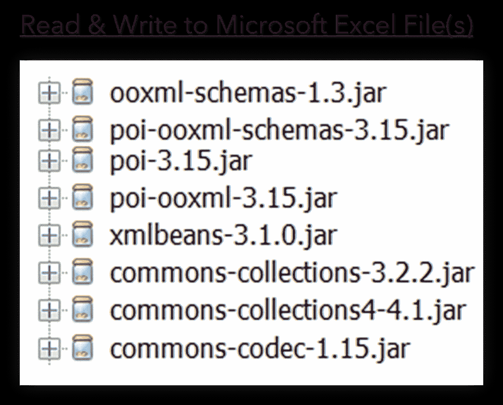
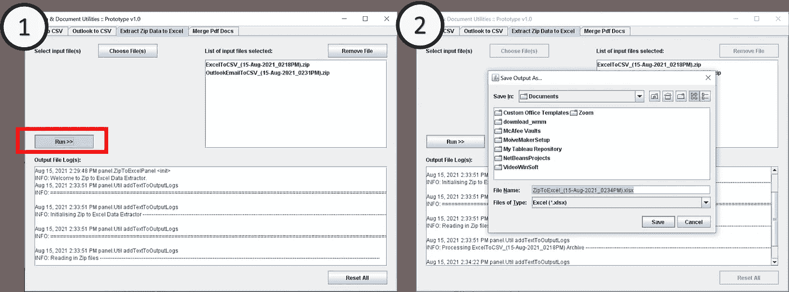

# 用 Java 从 Excel 和 Outlook 文件中提取数据

> 原文：<https://towardsdatascience.com/extracting-data-from-excel-and-outlook-files-with-java-7979eb64edff?source=collection_archive---------16----------------------->

## 代码实现+用例&情境约束

过去一年多的冠状病毒爆发已经在行业和个人层面上扰乱了工作场所的运作。对我来说，在医疗保健行业工作意味着亲眼目睹普通医疗保健行业现存的裂缝。更具体地说，信息流的低效率&缺乏稳定的数据管理框架，再加上工作场所中技术专家的稀缺，最终形成了我最终实施的技术解决方案，以实现一些工作流的半自动化。


米卡·鲍梅斯特在 [Unsplash](https://unsplash.com?utm_source=medium&utm_medium=referral) 上的照片

对于本文的技术部分，我将分享我实现的 Java 代码片段，这些代码片段也可以在 GitHub 资源库中找到:[用 Java 提取数据](https://github.com/incubated-geek-cc/data-extraction-with-Java)。样本[输入数据](https://github.com/incubated-geek-cc/data-extraction-with-Java/tree/main/data)和[输出](https://github.com/incubated-geek-cc/data-extraction-with-Java/tree/main/outputs)也出现在同一个 GitHub repo 中。

# 免责声明:本文中使用的所有数据都是虚拟数据，用于说明应用程序的功能。

首先，最迫切需要解决的问题是**减少手动编译传入数据 Excel 文件和嵌入在日常 Outlook 电子邮件提要中的数据表的需要**。因此，最终的技术实现在功能上有望使用户能够将嵌入在单独的 excel 和 Outlook 文件中的所需数据集提取到一个主 Excel 电子表格中。经过一番考虑，我决定用 Java 创建一个应用程序:



作者图片|用于读写 Microsoft Excel 文件的 Java 库列表|请注意，使用的 [apache poi](https://poi.apache.org/) 的具体版本是 **3.15** 。不同版本的 [apache poi](https://poi.apache.org/) 有不同的依赖版本。

作者代码片段|上面的代码片段利用 apache poi 库从 Microsoft Excel 数据文件中读取数据，提取数据并写入 CSV 文件，存储在为用户提供的单个 Zip 输出中


按作者分类的图片|用于解析 Microsoft Outlook 文件内容的 Java 库列表

作者代码片段|上面的代码片段利用 msg-parser Java 库从 Microsoft Outlook 数据文件中读取内容，提取内容作为 CSV 文件存储在单个 Zip 输出中供用户使用

最后用 Java 内置的图形用户界面(GUI)库 [Java Swing](https://www.javatpoint.com/java-swing) 对应用进行编译打包。


作者图片|最终应用交付的预览，可通过 Java 的内置 GUI 库 Java Swing 与用户进行交互。图片展示了将 Outlook 文件提取为 CSV 格式— **(1)** 选择多个邮件文件； **(2)** 处理完 Outlook 文件后，应用程序提示用户将输出保存在 ZIP 存档中；并且 **(3)** 文件输出保存成功后自动打开。

为了整合应用程序生成的每个档案，创建了另一个单独的模块来读取用户输入的所有 Zip 文件(可以在[ZipToExcel _(15-Aug-2021 _ 0234pm)找到最终输出示例)。xlsx](https://github.com/incubated-geek-cc/data-extraction-with-Java/raw/main/outputs/ZipToExcel_(15-Aug-2021_0234PM).xlsx)

作者代码片段|存储在输入 Zip 文件中的每个 CSV 文件都经过处理并写入单个 excel 文件。请注意，每个 excel 选项卡都是根据每个 Zip 文件创建和命名的。



作者图片|将所有数据整合到单个 excel 文件输出的演示

仅供参考:如果有人想要上述应用程序的副本，请随意从[同一个 GitHub 库](https://github.com/incubated-geek-cc/data-extraction-with-Java) **☺** 中检索可运行的 JAR

# ⚠面临的情况限制概述

可以说，在这整个传奇中，我所面临的最大挑战是与业务用户的沟通，以及在前所未有的限制下工作。虽然 it 开发人员和业务用户之间的观点不一致并不是什么新鲜事，但我认为分享我不得不面对的真实世界的障碍仍然是值得的:

**I .运行技术实现的有限平台—** 虽然大多数 ETL 过程都是用 Python 实现的，与 Java 相比，Python 是轻量级的，并且具有大量以数据为中心的库，但这种情况只有在预先存在设置的情况下才是有利的。

> 不幸的是，目前许多公司(更不用说公共医疗保健公司)的情况并非如此，这种情况只适用于那些长期以来建立良好的技术文化并不断得到强化的工作场所。

考虑到最需要技术改进以提高工作效率的地方往往是不仅缺乏技术设施，而且许多工作人员对"技术解决方案"持不接受态度的地方，这是一个极大的讽刺；这反过来导致许多令人不快的连锁反应。客观地说，这些工人中的大多数肯定不缺乏才能或高度——对于公共医疗保健等行业来说，较短的周转时间和分配任务的紧急性质强化了他们更加规避风险的自然倾向，因此回到了他们传统的(通常是手工的)做事方法。

由于对最小设置和安装的严格要求，这导致了**使用 Java 编程语言的最本能的选择，因为它的平台无关性**。

**二世。接受业务用户有限的技术相关知识** —虽然我最初并不打算为应用程序构建 GUI，但我很快意识到少数用户在运行以下命令来执行应用程序时遇到了问题:

```
java -jar <name of jar file>
```

按照任何其他编译的 Java 软件。令人惊讶的是， **40%的用户无法打开他们的 Windows CMD/Shell 终端/PowerShell 终端**,这给了我很大的打击😨。因此，为了完全避免这个问题，我开始构建应用程序的界面，只需要双击鼠标🖱️就可以执行。

**三。总体意见采用可持续的心态来实现持续改进—** 通过与不同用户组的互动，任何实际进展的共同点毫无疑问是**管理用户期望&迭代用户参与** *(我知道，这是老生常谈)*。更具体地说，业务流程的任何技术实现都应该分阶段进行，这是有充分理由的；**用户工作方法的突然和剧烈变化往往会导致更大的阻力，因为用户会感到非常不熟悉**。开发人员自然会就如何*“把事情做得更好”*进行头脑风暴，而另一方面，业务用户(至少从我遇到的一些情况来看)更倾向于*“只要不会给我带来更多的工作，就很好”*。尽管要不断提高公共医疗部门(或者说实际上所有部门)当前工作流程的效率，无疑是一条漫长而艰巨的道路，但一点点耐心确实能走很长的路。

# 非常感谢您的阅读，您可以在我的 GitHub 查看原始源代码和应用程序！❤

链接在:[孵化器-geek-cc/data-extraction-with-Java:一个用 Java Swing 和其他 jar 库构建的 Java 应用程序，用于从 Outlook 和 Excel 文件中提取数据。(github.com)](https://github.com/incubated-geek-cc/data-extraction-with-Java)

<https://geek-cc.medium.com/membership> 