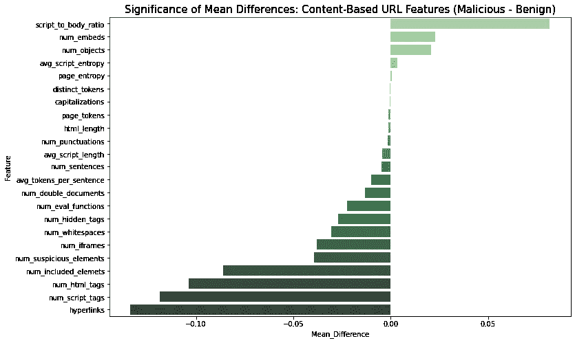

# 从 URL 字符串中提取特征向量用于恶意 URL 检测

> 原文：<https://towardsdatascience.com/extracting-feature-vectors-from-url-strings-for-malicious-url-detection-cbafc24737a?source=collection_archive---------5----------------------->

# 介绍

在网上传播的网络攻击中，恶意网址是相当大比例的攻击媒介。恶意 URL 要么是指向恶意代码静默下载的链接，要么是指向恶意网页、钓鱼网站等的链接。这种 URL 已经成为一种流行的在线危害主机的方式，从而创建了大规模的僵尸网络。例如，在驾车下载中，攻击者将恶意 javascript 嵌入到网页中，当用户访问某个页面时就会执行该脚本。它试图危害用户系统上的浏览器或用户插件。要构建主动模型来识别此类恶意 URL，分析师需要能够使用某些功能。这些特征将从简单的 URL 字符串中提取出来。因此，给定一个简单的 URL 字符串，我们如何提取有用的特征向量来建立预测？

在本文中，我将演示如何从 URL 字符串中提取深入的词汇特征、基于主机的特征和基于内容的特征。这些特征包括从 Shodan、WHOIS、Wayback machine 中提取的特征，从网站的原始 HTML 内容中提取的统计特征，以及 URL 字符串本身的静态特征。本文中提取的特征分为三大类:基于内容的特征、基于主机的特征和词汇特征。本文策划并实现了这些特征作为 URL 特征向量的提取。这些 X 特征可以在恶意 URL 归属问题中用作特征向量，为恶意 URL 检测建立预测模型，或者为日志流中的不良主机建立简单的快速过滤器。

# 数据

我将使用的数据来自[加拿大网络安全研究所](https://www.unb.ca)。有一个 [2016 URL 数据集](https://www.unb.ca/cic/datasets/url-2016.html)，根据攻击类型对 URL 进行分类。你可以在他们的网站上下载这些数据，对于这个项目，我们将在这篇文章中使用 11，500 个恶意网址和 35，300 个良性网址。恶意软件 URL 与从 DNS-BH 获得的恶意软件网站相关。因此，这些网址不包含钓鱼网址或恶意嵌入式下载链接，而是指向包含恶意代码或软件的恶意网站的链接。良性网址是从 Alexa 顶级网站收集的。一旦你下载了数据，你应该有两个文件'恶意软件 _ 数据集. csv '和'良性 _ 列表 _ 大 _ 最终. csv '。在我的代码中，我将这些文件重命名为“malware.csv”和“良性. csv”。

# URL 功能

从 URL 中提取的特征是确定 URL 是否是恶意的基础。任何学习努力的成功都取决于训练数据的质量，因此也取决于输入模型的特征的质量。我们必须确保提取的特征代表或潜在地表明我们试图建模的问题。这里，我们的意思是所收集的特征的变化必须代表问题的发生或不存在。因此，问题是，URL 字符串的哪些特征可以告诉我们它是恶意的还是非恶意的，或者它是良性的还是非良性的？从 URL 字符串中提取要素有三种信息来源。

*   **词法特征**:这些是指从文字 URL 字符串中提取的统计特征。例如，URL 字符串的长度、位数、其查询部分中的参数数量、URL 是否被编码等。
*   **基于主机的特征**:这些是 URL 的主机名属性的特征。这些提供关于网页主机的信息，例如，注册国家、域名属性、开放端口、命名服务器、连接速度、从注册开始的生存时间等。
*   **内容特征**:从下载的网页 HTML 代码中获取。这些特征捕捉网页的结构和嵌入其中的内容。这些信息包括脚本标签、嵌入对象、可执行文件、隐藏元素等。

我将解释从这些信息源中提取的不同特征，并证明为什么它们与识别恶意或良性 URL 相关。我还执行了一些基本的统计 t 测试，以测试恶意和良性之间这些特征的差异的显著性，从而识别每个类别中的关键区别特征。

# 词汇特征

词法特征从 URL 字符串中获得。包含词汇特征的动机是基于一个简单的事实，即恶意 URL 看起来不同于良性 URL，因此我们可以提取统计属性来量化这些外观的差异。举个简单的例子，URL“Amazon . com”中“. com”的存在和位置看起来并不可疑，但是，相同的子字符串在“amazon.com.support.info”中看起来是恶意的。另一个经典的例子是黑客常用的策略是 ***混淆*** 一个恶意的网址看起来像一个合法的网址。他们通过模仿流行品牌的名字并对其稍加改动来做到这一点(googleinfo.com，apple-support.com)。检测网络钓鱼网址的不同项目一致认为，不同类型的网址表现出不同的字母分布。这里的“字母分布”指的是 URL 字符串中字符的顺序、字符的复杂性等。这些是一些可能被提取的词汇特征。我仅从 URL 字符串中提取了 18 个词汇特征。

词汇特征表

URL 的方案很重要，因为这表明网页上配置了何种安全级别(HTTP/HTTPS)，服务器的用途是什么(显示信息(HTTP)，传输文件(FTP)，通过网站收集的信息是否加密(HTTPS)等)。显示为 IP 地址的主机或域名通常意味着主机没有解析为域名，或者没有正确配置为指向域名。

最常用的词汇特征包括 URL 字符串的一些上述统计属性，如 URL 字符串的长度、模式、路径长度、子目录等。然而，一些不太明显的问题，如在 URL 和 URL 编码中出现某些关键字，也值得包括在内。众所周知，DGA 域名的字母分布比合法域名更加混乱[见](https://github.com/SuperCowPowers/data_hacking/blob/master/dga_detection/DGA_Domain_Detection.ipynb)。合法的域名往往有定义明确的名称，说明一个品牌或产品，所以倾向于不那么杂乱无章。因此，测量 URL 字符串的熵可以告诉我们哪些域名“不太真实”。

这也适用于作为 IP 地址的域名，例如“42 . 50 . 23 . 80/子目录. com”。例如，当恶意网站托管在受损公共网络中的受害者机器上时。其他词汇特征，如‘的存在。com '作为域扩展名，表示。URL 字符串中的“com”。在下表中，我列出了样本中恶意和良性 URL 之间的显著不同的特征。

词汇特征的箱线图

目测，我们看到良性网址的熵更高，一般比恶意网址长。此外，所有的网址中至少有一个句点(如预期的那样)，但恶意网址中平均至少有两个句点。类似地，我们可以捕捉某些“红旗”关键字出现在 URL 字符串中的事实。这些关键字可能涉及攻击者在试图欺骗合法页面时使用的关键字，或者涉及黑客将试图操纵的网站上的安全设置的流行术语的关键字。例如，URL 中的关键字“admin”通常表示站点管理用户的身份验证页面。

红色标记关键字的条形图

在我们的示例中，只有恶意 URL 将 IP 作为主机名，并将端口号作为 URL 字符串。正如前面所解释的，恶意 URL 中绝大多数都包含子字符串“admin”。我们还可以探索恶意和良性网址的“域扩展”或“TLD”矩阵。给定一个逻辑矩阵，其中 0 和 1 表示 URL 中是否存在 TLD，我们可以估计良性和恶意文件之间每个 TLD 的平均差异，并返回两组之间有显著差异的文件。我们可以创建一个 TLD 矩阵，并从两组之间的独立 t 检验中提取差异和 p 值。

现在，我们可以排除 P 值小于 0.05 的 TLD(在 95%的置信水平下测试)，并绘制恶意和良性 URL 之间 TLD 的排序平均差异和 P 值。我们用最高平均差和最低(最高)显著 P 值作图。

词汇特征平均差异的显著性(恶意——良性)

每个条形的宽度是 Y 轴上恶意和良性 TLD 之间的平均差异。条形按其显著差异的降序排列(因此最小的 P 值是第一个条形)。顶级域名如。信息，。茹，还有。cn 更像是恶意网址的同义词，而良性网址则更容易链接到。com 和。net 域。

基于词汇特征的互相关图

***恶意网址长度一般比良性网址*** 短。相关图显示，虽然良性 URL 的熵可能比恶意字符串略高，但恶意 URL 字符串的长度比良性字符串短。良性字符串也记录更多的数字计数和更多的编码字符。这是可以预期的，尤其是大多数良性网站流行的某些博客或文章命名约定，例如，'【https://blogname.com/article-name/YYYY-MM-DD】'或'[' https://Hollywood life . com/2015/05/13/Justin-Bieber-perfect-girl-someone-pusses-spiritically/](https://hollywoodlife.com/2015/05/13/justin-bieber-perfect-girl-someone-pushes-spiritually/)'。最后，运行'[get _ lexical _ features . py](https://raw.githubusercontent.com/eneyi/eneyi.github.io/master/assets/random/get_lexical_features.py)'(<<在此获取完整代码)

# 基于内容的功能

基于内容的特征是从原始内容(即网页的 HTML 和 javascript 内容)中提取的统计信息。这些包括关于页面的原始编码内容的信息，例如空白百分比、页面上的标记数量、脚本数量、脚本中的字符数量，以及 HTML 代码的结构信息，例如某些标签的位置和存在。包含这些基于内容的功能背后的基本原理是捕获在受损页面中发现的页面内容特征，例如，存在注入的内容或被设计为包含恶意代码的页面，例如，存在某些脚本标签或可疑的 HTML 元素。 [Prophiler 项目](https://dl.acm.org/doi/abs/10.1145/1963405.1963436)寻找攻击副作用的存在，例如注入页面上不合适的标签。例如，在 SQL 注入攻击中，格式错误的文档或重复的标签等异常情况会出现在原始 HTML 内容中。

这组特征提取的目标是寻找页面上的“可疑”内容。可疑对象可能包括 HTML 标签之间存在纯文本格式的外壳代码，存在双“”、“”和“<title>”元素，存在零大小或隐藏的 iframes，存在可疑的“<object>”和“<embed>”标签等。除了在 HTML 代码内容中寻找可疑活动，我们还可以从脚本中的函数调用和关键字中搜索可疑活动。通常，我们不能访问外部脚本，但我们也可以从内嵌和包含的脚本中提取大量信息。例如，下载驱动在攻击执行期间调用几个 DOM 修改函数和事件附件。此外，一些 javascript 函数被恶意行为者用来加密恶意代码或执行不需要的例程。还有一些在跨站脚本攻击中使用的流行脚本函数有<strong class="kn ir"> <em class="md"> escape()、eval()、link()、unescape()、exec()和 search() </em> </strong>。此外，可以编写恶意脚本，将 iframe，其他脚本，object 标记，embed 标记和 frame 标记插入网页，如果没有混淆，就有可能使用这些元素' iframe '，' object '，' embed '来识别 DOM 修改脚本。提取以下 24 个基于内容的特征:</embed></object></title>

基于内容的功能表

如前所述，我们对以下基于内容的特征的均值差异进行了简单的独立 t 检验。

基于宿主特征的均值差异的显著性

***良性网站的内容比恶意网站多。*** 一般来说，我们观察到良性网站的内容总体上比恶意网站多。虽然这对人类来说似乎是显而易见的，但最终拥有量化这一想法的功能还是不错的。最突出的是网页上的独特单词数和恶意网站中每句话的平均单词数。恶意网站也倾向于具有较低数量的 HTML 标签和较大的页面熵。良性站点通常有更多的脚本标记，而恶意站点的区别在于脚本标记比实际内容多。

此外，较高的脚本与正文比率也表明恶意脚本也比良性脚本更加详细或“健壮”。这些脚本观察的主要原因是良性网站上的大多数脚本倾向于外部链接(这仍然算作脚本标签，但不测量熵，因为原始 HTML 内容是空的)，而不是写入或注入的恶意或受损网站。然而，良性网站的平均脚本长度仍然比恶意网站略高，因此我们不能完全忽视恶意网站的大部分内容都在脚本标签中这一事实。最后，你可以在这里下载完整的“get _ content _ features . py”[。](https://raw.githubusercontent.com/eneyi/eneyi.github.io/master/assets/random/get_content_features.py)

# 基于主机的功能

有时有必要超越对 URL 字符串的视觉检查来识别恶意链接传播背后的参与者或参与者组。检查基于主机的功能可以将网络钓鱼 URL 或下载驱动(例如)归因于网站或链接所有者。基于主机的功能从 URL 的主机名属性中获得。这组功能允许我们抓住“谁”、“哪里”、“何时”和“网站如何托管”的某些特征。包含这些参数背后的动机是网站部署策略、存在时间以及恶意和良性网站的声誉存在差异。一个典型的例子是恶意网站隐藏注册信息，网站更新的平均间隔天数，使用同一个主机 IP 创建大量恶意链接，或注册域名和托管网站之间的天数。众所周知，攻击者会利用僵尸网络在多个国家的多台机器上运行。

为了提取有意义的基于主机的特性，我们需要用 python 编写三个库

*   与域名注册信息 [(python 的 whois 库)](https://pypi.org/project/python-whois/)进行交互。这将为我们提供与主机 IP 相关的域名信息。比如什么时候注册的，谁注册的，注册什么时候到期等等。 ***注意*** 这是一项免费服务，选择匿名的注册人的信息将保持不变。其他服务在注册服务商决定私有化之前提供关于注册服务商的可靠付费信息。“Domaintools.com”可能提供了关于主机的最可靠的 whois 信息。
*   访问网络上主机的信息 [(python 的 shodan 的 API)](https://shodan.readthedocs.io/en/latest/) 。这将为我们提供有关主机的信息，即网站所在的机器(如果可用)。Shodan 提供了一个开放的 API 来访问诸如开放端口、操作系统、web 技术等信息。
*   访问关于网站变化的信息 [(python 的 waybackpy 库)](https://pypi.org/project/waybackpy/)。Wayback Machine 是万维网的数字档案。对于任何一个网站，Wayback 机器都在线记录了其存在的所有版本。因此，我们可以使用它来获取有关网站更改的信息，更改频率，自其存在以来的更改总数，第一次更改，最后一次更改等。

以下是提取的 21 个基于主机的特征。

基于主机的功能表

***注意:*** 这些是特定于域的结果，所以我们不需要为每个 URL 运行代码，而是为每个唯一的主机运行代码。不管 URL 字符串上的子域、查询和参数如何，结果都不会改变。“缓存”列表将存储已处理主机的列表，此代码的输出将是 URL 文件中每个唯一主机的记录。

众所周知，当使用相同的漏洞利用工具包设计不同的攻击时，多组恶意行为者共享相同的主机名或在其路径名中具有相似的重复模式。此外，当恶意代码被托管在受害者计算机上时，在受损的公共网络上，网站通常不会与任何域名相关联，而是由 IP 地址引用。域名注册的“生存时间”检查从域名注册(从 whois 数据)到相关网页第一次在网上出现(Wayback 机器)之间的时间。有实验[ref]表明，生存时间较短的域将来很可能会迁移到其他 IP 地址或域。因此，由于恶意网址的生命周期比良性网址短，它们在整个生命周期中的网站更新次数也比良性网址少。
在这里，我们还可以验证恶意和良性 URL 之间的 TTL、网站更新频率和预期寿命是否存在差异。为了证实这种差异，我对每个特征进行了独立的学生 T 检验，比较了两组的平均值。

基于主机的特征的平均差异的显著性(恶意-良性)

与前面的概念相同，在我们的示例中，恶意主机比良性主机有更长的寿命。虽然知名品牌的良性主机(如 Alexa 顶级网站)比大多数恶意主机的寿命更长，但恶意主机在野生环境中的平均存在时间更长，但在其生命周期内站点更新更少。此外，恶意行为者在购买域名后，还需要更长的时间来托管网站，以域名托管生存时间来衡量。

TTL 和连接速度(恶意与良性)

如果我们忽略下图中的主要 ISP 提供商，如 Amazon、Google 和 Cloudflare，我们可以看到有相当多的恶意主机 ISP 提供商没有出现在良性顶部。此外，请注意 ISP 提供商获得良性和恶意信息的频率差异。良性主机泄露注册信息的可能性是恶意主机的 3 倍。

ISP(恶意与良性)

当考虑与恶意 URL 相关联的顶级域时，恶意行为者的 ISP 看起来也可以链接到特定的国家行为者。最后，在这里下载完整的‘get _ host _ features . py’[。](https://raw.githubusercontent.com/eneyi/eneyi.github.io/master/assets/random/get_host_features.py)

总之，恶意 URL 比良性 URL 更长，熵更低。恶意主机比良性主机注册的时间更长，但在其存在期间更新更少。良性 URL 也比良性 URL 有更长注册时间。本文展示了我们如何从 URL 字符串中提取有用的特征向量，还展示了恶意和良性主机和 URL 字符串之间的一些比较。在以后的文章中，我将介绍恶意、网络钓鱼和篡改 URL 属性，以从恶意主机中提取基于主机和基于内容的特征，并开发一种集成方法(Whois 链接、状态属性和基本的无监督学习)来确定恶意 URL 在线分布背后的属性组。

参考

*   《Prophiler:大规模检测恶意网页的快速过滤器》*第 20 届万维网国际会议论文集*。2011.