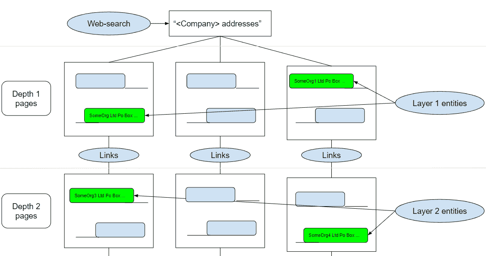

# 从非结构化来源中提取信息

> 原文：<https://towardsdatascience.com/extracting-information-from-unstructured-sources-b9d8bd14e70a?source=collection_archive---------44----------------------->


## [实践教程](https://towardsdatascience.com/tagged/hands-on-tutorials)

## 使用 Web-Search、spaCy 和 RegEx 搜索相关的组织地址

# 问题陈述

最近，我们的一个客户向我们提出了一个有趣的问题。这是一家投资公司，需要计算投资对象的潜在风险。他们需要一个解决方案来帮助生成与特定公司名称相关联的所有地址(或 GPS 坐标)的列表。我们的客户面临的问题是，许多公司可能有许多不同的细分市场，用不同的语言使用不同的名称。另外，很多公司在世界各地都有部门。此外，该公司可能有不同的隐藏位置，与他们相关联，这并没有直接在他们的法律文件。

我们从一个小的概念验证开始，检查是否有一种方法可以解决一个或几个这样的问题。结果必须以地理位置图的形式呈现，并描述与其他顶点的关系以及给定的公司名称。

有趣的挑战是，我们没有得到任何数据或方向。所以我们关注的第一个问题是数据来源。经过短暂的研究，我们将所有可用的相关数据源分为三大类:

1.  公共或私人登记处
2.  社交网络
3.  搜索引擎

考虑到每个数据源的缺点，我们决定为我们的 PoC 使用最后一个类别，因为注册中心和社交网络很难交互。除了难以查找之外，注册中心还提供各种格式的数据。这使得短时间的概念验证很难使用其中的几个。

我们最终选择的方法并不容易成功。由于种种原因，我们不得不尝试一些行不通的方法。我们将简要描述我们做了什么，以及如何指出最有希望的结果和失败的原因。

# 第一种方法

我们解决这个问题的主要思路是基于使用 [**空间**](https://spacy.io/) 。这个框架有一个内置的能力来标记文本中的组织和位置，我们发现这个能力对这个问题非常有用。一旦我们选择了数据源，我们就开始分析与一些随机选择的组织相关的网页。在用 **spaCy** 标记了一些网页文本后，我们发现了一些模式，这些模式大多出现在涉及公司地址的时候:


考虑到这种模式，我们开始着手以下想法:



我们在网上搜索一个看起来像“<company>地址”的词。返回的页面被声明为深度为 1 的页面。然后，我们在每个返回的网页上查找上述模式，并提取相应的文本—组织名称及其地址。在此之后，我们抓取这些页面上的所有链接，宣布它们的页面是深度 2 的页面，并以类似的方式继续处理这些页面。这个过程给我们一个带有顶点的图，对应于网页和组织(带有它们的地址)。第一个连接，第二个只连接第一个。</company>

上面描述的实现过程是一个简单的 [*刺儿头*](https://scrapy.org/) 网络爬虫。在收到一个初始链接列表(深度为 1 的页面)后，爬虫会寻找一个模式，收集链接并继续处理其他页面，将所有结果保存在一个 CSV 文件中。为了检查这种模式，我们使用了逐个标签的滑动窗口方法，这简单地意味着计算适合滑动窗口的特定标签或数字标记的数量。

尽管这种方法很简单，但由于许多原因，它很快就失败了。首先，即使是最初的几个链接(比如 100 个)，链接到它们的网页数量也是以千兆字节计算的。这一过程花费了太多时间，产生的有用文本非常少。第二，有许多文本既不包含组织的名称，也不包含其地址，但仍然符合我们的模式过滤器。这主要是因为许多与地址相关的单词被 spaCy 标记为组织或个人，或者根本没有被标记。

我们决定分析收集到的数据，并给它们贴上标签。只有大约 20%的收集文本包含组织名称和地址。另外 80%有很多额外的文本，缺少组织名称或地址中有意义的部分。这种数据很难处理。然而，在分析这些数据时，我们发现 **spaCy** 与组织名称本身配合得很好。但是我们的模式忽略了大多数这样的事件。我们还发现，几乎每个国家都有不同的地址模板。尽管我们为不同的语言使用了相应的 **spaCy** 模型，但这样一个简单的模式甚至不能覆盖几个地址模板。

这使我们得出这样的结论:这种方法对于给定的问题并不奏效。

# 第二种方法

考虑到所有这些信息，我们决定简化我们的 PoC，只关注美国的组织和英文页面。另外，我们决定将问题分成两部分:寻找相关组织和提取单个组织的地址。

为了解决第一个问题，我们决定尝试这样做:如果某个组织在与某个给定公司相关的网页上被提及，那么这个组织以某种方式与该公司相关联。暂时，我们会忽略一个组织与一个公司(对手、子公司、同一个基金会团体等)到底是如何联系的问题。)因为这似乎是一个更复杂的问题。为了加强观察到的关系，我们假设，在一些公司的网页上也必须提到该公司。

## 提取潜在的组织名称

我们开始使用网络搜索和**空间**对相关组织进行简单搜索。我们使用了 Bing，但是，你可以使用任何其他可用的搜索引擎。我们将向您展示我们用来收集数据的 Python 代码片段。请注意，我们的代码并不追求优雅，因为它是为 PoC 编写的，当然，可以进行增强或优化。

首先，我们搜索了一个类似这样的术语:“<given company="" name="">公司”。因此，如果给定的公司是三星，那么搜索词将是:“三星公司”。</given>

```
companies_search = bing_search(“{} companies”.format(COMPANY_NAME))
```

这就是我们如何收到 10 个搜索结果，足够开始。然后，我们提取每个相应的网页，用**空间**标记其文本(我们不需要标记 HTML 标签、脚本、属性等等)，并且只提取那些被命名为 **ORG** 的网页。

正如我们已经提到的，我们还通过检查一个给定的公司是否在与找到的命名实体相关的页面上被提到来加强观察关系的能力。为此，我们对每个找到的命名实体进行了搜索。

然后，我们对所有收集的数据进行预处理，并将其保存到 csv 文件中以备将来使用:

现在，为了检查给定的公司是否与已发现的命名实体相关，我们实现了一个 scrapy 爬虫。它使用一个 URL 列表和一个公司的名称来处理每个 URL，并计算某个公司的所有提及次数。请找到它的主要方法，而不是整个初始化，它主要处理文件基础结构:

我们简化了代码，删除了一些需要的 **try** … **，除了**语句或其他非常具体的代码部分。此外，计算提及次数的决定似乎并不完全正确:当给定的公司名称由两个或更多单词组成时，在一些(不是所有)复杂的情况下，这一决定会失败。更合适的方法是使用 **spaCy** tokenizer 并比较标记。

一旦爬虫完成了工作，我们就得到一个 CSV 文件，其中只包含那些潜在组织的 id，这些组织与给定的公司有着密切的关系。三星的近 1000 个命名实体的列表减少到只有近 600 个。剩下的看起来是这样的:


乍一看，还不错。但是，如果我们仔细看看这个列表，我们会发现很多命名实体根本不是组织名称。例如，*三星年度报告*也许只是某个文本的标题，而不是一个组织名称。也没有什么可指责的:所有这些命名的实体看起来确实像组织。

我们手工标记收集的数据。我们看到的是，这种方法给出了相当好的回忆。事实上，对于三星公司，我们的名单包含了近 80 个不同的分支机构，法律相关组织以及他们在不同领域的对手。然而，它的准确率很低:近 60%的命名实体不是有效的组织名称(也不是完整组织名称的一部分)

所以我们需要某种模型来过滤掉无效的组织名称。我们采用的方法有点复杂，太大了，无法在这里描述。[我们就这个话题单独写了一篇文章。](/classifying-spacys-org-named-entities-with-statistical-text-analysis-and-machine-learning-7e99ed7a58c3)

此外，我们试图建立一个模型，根据组织与给定公司的关系对组织进行分类。该模型应该是基于特定词语和某个公司以及一些命名实体的被提及次数之间的相关性。然而，这种方法并不奏效。

## 地址提取

使用上述模型，我们过滤掉了不是组织名称的内容。现在我们有了一个与给定公司相关的组织列表，我们需要它们的地址。为了实现这个目标，我们使用类似于 **" <组织名称>地址美国"**的搜索词对每个组织进行了搜索。它给了我们一个可能包含相关组织美国地址的网页列表。

一般来说，从 HTML 页面中提取地址是相当复杂的。该过程必须包括寻找不同国家通用的不同模式，处理预定义单词列表(如国家名称、州、地区等。)，以及理解哪段文字是地址。当您需要提取一个用不同语言书写的地址，或者一个以表格形式显示在网页上的地址时，这就更加困难了，表格中有类似于*街道、房屋号码、州、*等行。

至于 PoC，我们决定关注最简单的情况——美国地址写在一个标签中。为此，我们构建了一个简单的正则表达式，它考虑了 **spaCy 的**命名实体、数字、州，或许还有国家的顺序。这里有趣的一点是，我们需要将**空间**的 organization (ORG)标签包含在其中，因为地址的很多部分都带有这个标签。此外，我们需要为美国各州建立一个自定义的正则表达式。尽管事实上大多数州都有一个合适的上下文，但它们仍然很少被标记为:

这里的 address _ re:n—是一个小数字，后面跟着最多 4 个 **spaCy** ORG、LOC、FAC 或 GPE 标签((l|f|g|o){0，4})，然后是 state(s)和 zip(z)，也许还有 GPE 标签(g？)，最有可能是按国家。

我们通过以下方式从该文本中提取地址:

上面所有的代码都是我们用来收集地址的。同样，它的主要方法如下所示:

有了这个，我们通过每个搜索结果，并提取组织的地址。当然，这个解决方案并不完美。许多提取的文本根本不是地址，或者包含大量额外的文本。然而，与提取的数据量相比，这种情况相对较少。所有这些操作产生了如下所示的列表:


我们使用 *geopy* Python 包来获取地址的 GPS 坐标。

请注意，当您按顺序执行多个请求时，这些地理编码器不能很好地工作。这就是为什么我们添加了随机延迟，只是为了好玩:-)。

现在，在可视化了所有收集的数据之后，我们收到了一张地图，上面标明了与某个给定公司相关的组织的具体位置。


# 结论和进一步措施

以下是具有最高优先级的后续步骤列表:

1.  建立一个模型来分类两个公司之间的关系类型。或者至少在一个给定的公司和一个创建的公司之间。这可以通过多种方式实现，从词频分析开始，就像上面提到的模型，到复杂的 ML 系统结束，这取决于所需的结果和问题的复杂性。
2.  增强地址提取。这将包括预定义单词的字典、不同国家的格式和不同的语言标记系统。
3.  对现在与提取的地址相关的组织的分析，因为通常有几个相关的公司在同一地址注册或位于同一地址。
4.  加强现有方法。很多事情都是以最简单的方式完成的。许多代码可以改进，以获得更准确或更恰当的数据。

也许，中国、日本、韩国和其他国家需要一些特定的语言系统或翻译。

总而言之，我们现在有数据来构建与给定公司相关的实体的双层图。图的第一层是组织层，与给定的公司有某种关系。它可以包括不同类型的子公司、对手、合法关联的公司等。第二层是这些组织的地址层。这个图表可以用来建立一个通用的公司简介，计算投资风险，公司股票价格，等等。

# 感谢

我要感谢我的同事[安迪·博西](https://medium.com/u/8bc8d2a62041?source=post_page-----b9d8bd14e70a--------------------------------)、[米科拉·科兹连科](https://medium.com/u/5b6f8e76e312?source=post_page-----b9d8bd14e70a--------------------------------)、[沃洛季米尔·森德茨基](https://medium.com/u/29c9ae323b06?source=post_page-----b9d8bd14e70a--------------------------------)、[维亚奇·博西](https://medium.com/u/a1d9d09474e8?source=post_page-----b9d8bd14e70a--------------------------------)和[纳扎尔·萨维琴科](https://medium.com/u/7656f83999e3?source=post_page-----b9d8bd14e70a--------------------------------)富有成效的讨论、合作和有益的建议，以及整个 [MindCraft.ai](https://medium.com/u/bad3e22805b3?source=post_page-----b9d8bd14e70a--------------------------------) 团队的持续支持。

亚历克斯·辛基夫，

数据科学家，MindCraft.ai

信息技术和数据科学