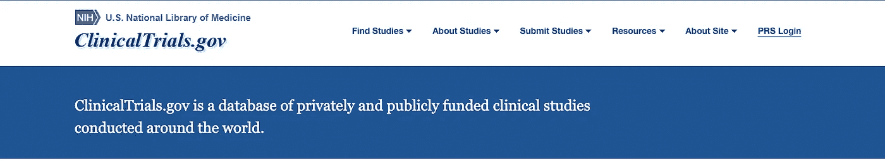
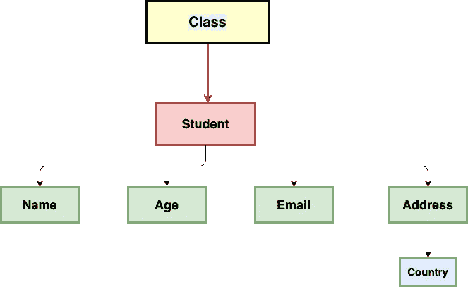
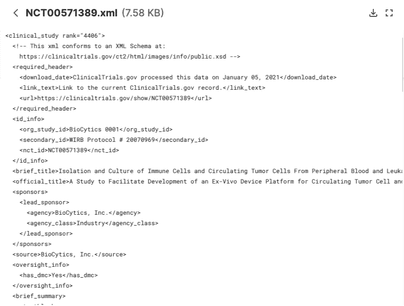
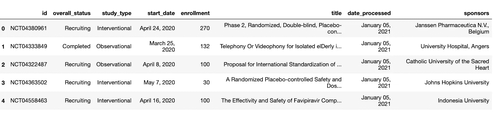

# 将 XML 文件中的信息提取到熊猫数据框架中

> 原文：<https://towardsdatascience.com/extracting-information-from-xml-files-into-a-pandas-dataframe-11f32883ce45?source=collection_archive---------3----------------------->

## [实践教程](https://towardsdatascience.com/tagged/hands-on-tutorials)

## 用 Python 的 ElementTree 包解析 XML 文件


【www.freepik.com】故事创建的网站载体

现实世界的数据是杂乱的，我们知道这一点。不仅这些数据需要大量的清理，而且我们接收数据的格式也不适合分析。这意味着，在分析开始之前，数据必须经过一系列转换，才能转换成合适的格式——一种易于处理的格式。这种情况大多发生在数据是从网上搜集的或是以文档的形式提供的时候。我遇到了一个非常相似的数据集，它是各种 XML 文件的形式。在本文中，我列出了我破译这些文件并将其转换为可供分析的 CSV 文件的步骤，该文件足够好，可以被摄取到 pandas 的库中以供进一步分析。

T 他的文章是寻找好数据集的完整系列的一部分。以下是该系列中包含的所有文章:

**第 1 部分** : [为数据分析任务获取数据集——高级谷歌搜索](/getting-datasets-for-data-analysis-tasks-advanced-google-search-b1c01f9cc324)

**第 2 部分** : [为数据分析任务寻找数据集的有用站点](/useful-sites-for-finding-datasets-for-data-analysis-tasks-1edb8f26c34d)

**第三部分** : [为深度学习项目创建定制图像数据集](/creating-custom-image-datasets-for-deep-learning-projects-6e5db76158d4)

**第 4 部分** : [毫不费力地将 HTML 表格导入 Google Sheets](/import-html-tables-into-google-sheets-effortlessly-f471eae58ac9)

**第 5 部分** : [使用 Camelot，从 pdf 中提取表格数据变得很容易。](/extracting-tabular-data-from-pdfs-made-easy-with-camelot-80c13967cc88)

**第六部分** : [从 XML 文件中提取信息到熊猫数据框架中](/extracting-information-from-xml-files-into-a-pandas-dataframe-11f32883ce45)

**第 7 部分** : [5 个真实世界的数据集，用于磨练您的探索性数据分析技能](/5-real-world-datasets-for-exploratory-data-analysis-21b7cc5afe7e)

# 动机

全世界都在集体打新冠肺炎战争，2021 年带来了一线希望。我们都知道许多国家正在开展疫苗接种运动，包括我自己的国家印度，它于 2021 年 1 月 16 日开始了世界上最大规模的疫苗接种运动。但是，疫苗在经过几个阶段和试验后才形成最终形式，只有在它被认为合适后，它才会被授予绿色标志，以供普通人群使用。

我发现了 ClinicalTrials.gov 的<https://www.clinicaltrials.gov/ct2/home>****，这是一个在世界各地进行的私人和公共资助的临床研究的数据库。我认为在网站上查看所有与 COVID 19 研究相关的临床试验将会非常有趣和有益。****

****

**来源:[https://www.clinicaltrials.gov/ct2/home](https://www.clinicaltrials.gov/ct2/home)**

**然而，试验的数据集由 XML 文件组成，每个 XML 文件对应一项研究。因此，不可能立即进行分析。数据需要首先转换成一种可以读入熊猫数据帧的格式。**我已经下载了数据集，并上传到** [**Kaggle**](https://www.kaggle.com/parulpandey/eda-on-covid-19-clinical-trials) 供其他人查看。这些数据每周更新，为 COVID 疫苗和药物的开发提供了一些很好的见解。**

**[](https://www.kaggle.com/parulpandey/covid19-clinical-trials-dataset)

来源:[https://www . ka ggle . com/parulpandey/covid 19-临床试验-数据集](https://www.kaggle.com/parulpandey/covid19-clinical-trials-dataset) |图片由作者提供** 

**本文的其余部分将处理用 Python 解析这些 XML 文件。但是在此之前，让我们更深入地研究一下 XML 文件及其组成部分。**

# **什么是 XML？**

****

**作者图片**

**XML 代表*可扩展标记语言。*顾名思义，它是一种 [*标记语言*，通过定义一套机器可读和人类可读格式的规则对文档进行编码。该语言定义了一组规则，用于以特定格式对文档进行编码。让我们看看下面的 XML 文件示例:](https://en.wikipedia.org/wiki/XML#:~:text=Extensible%20Markup%20Language%20(XML)%20is,free%20open%20standards%E2%80%94define%20XML.)**

```
<?xml version="1.0" encoding="UTF-8"?>
<class>
  <student>
    <name>Negan</name>
    <age>40</age>
    <email>[imnegan@abc.com](mailto:imnegan@abc.com)</email>
    <address>
     <country>US</country>
   </address>
  </student>
</class>
```

**每个 XML 文件都有一个树形结构，其中顶部的元素是根元素。然后，子元素被连接到根元素。如果直观地呈现，上面的 XML 文档的树结构将如下所示:**

****

**作者图片**

*   ****XML 版本** = "1.0 "编码= "UTF-8 "？:`<XML version and the character encoding>`**
*   ****根元素** : `<Class>`**
*   ****`**Student**` 的子元素**元素** : `<name>`，`<age>`，`<email>` & `<address>`****
*   ******子元素** : `<country>`****

# ****ElementTree XML API****

****现在让我们看看如何解析给定的 XML 文件，并以结构化的方式提取其数据。在本文中，我们将研究`[**ElementTree**](https://docs.python.org/3.10/library/xml.etree.elementtree.html#module-xml.etree.ElementTree)`一个内置的 Python 库来操作 XML 文件。我们已经了解了数据集。以下是它在 Kaggle 上的一瞥:****

********

****来自数据集|作者图像的单个 XML 文件****

****数据集由几千个 XML 文件组成。每个 XML 文件对应一项研究。文件名是 **NCT 号**，它是 ClinicalTrials 存储库中一项调查的唯一标识符。****

# ****解析 XML 文件****

****让我们首先导入必要的库，并查看数据集中的文件数量。****

```
**import xml.etree.ElementTree as ETpath = '../input/covid19-clinical-trials-dataset/COVID-19 CLinical trials studies/'files = os.listdir(path)
print(len(files))------------------------------------------------
4663**
```

****数据集中有 4663 个单独的文件。上面的数字对应于数据中 XML 文件的数量，包括临床试验报告的数量。现在让我们看看第一个 XML 文件并打印出值，以理解树的结构。****

```
**# Reading the first filefile_path_file1 = os.path.join(path, list_of_files[0])
tree = ElementTree.parse(file_path_file1)
root = tree.getroot()
print(root.tag, root.attrib)
--------------------------------------------------------clinical_study {'rank': '4406'}**
```

******ElementTree** 将整个 XML 文档表示为一棵树，而**元素**表示这棵树中的一个节点。树的每个部分(包括根)都有一个描述元素的标签。此外，元素还可能包含属性，顾名思义，这些属性是附加的描述符。如果您仔细观察上面提供的 XML 示例，就会发现— **临床研究**是根元素，并且有一个等于 4406 的**等级属性**。****

****我们现在可以通过使用一个简单的 for 循环来查看一些其他的子元素。****

```
**for child in root:     
print(child.tag, child.attrib)**
```

****所有上述内容似乎是报告的不同部分。还可以通过下面的代码查看整个文档以及树中的所有属性或级别。****

```
**print(ElementTree.tostring(root, encoding='utf8').decode('utf8'))**
```

****然后，我们可以选择在我们的格式化数据中包含所有元素或选择一些元素。这些元素将在数据帧中显示为单独的列。我们现在将初始化两个空数据框，它们将被上述元素填充。我们将在数据集中包括`id,overall_status,` `study_type, start_date, enrollment, condition, location_countries, intervention, title, date_processed` 和`sponsors`。****

****这给了我们一个格式良好的数据帧，就像我们习惯看到的那样。您也可以将其保存为 CSV 文件，以供将来参考。****

```
**df.head()
df_covid.to_csv('COVID_trials.csv')**
```

********

****作者处理的数据帧|图像****

# ****下一步是什么****

****现在，您已经有了所需格式的数据，您可以对其进行分析以得出特定的细节，如:****

*   ****这些研究的总体状况如何****
*   ****不同的研究类型****
*   ****审判的时间表****
*   ****参加各种研究的人数，以及更多类似的问题。****

****您还可以使用自己选择的工具创建一个仪表板，以便一次查看所有细节。我在上面的例子中只提取了很少的属性，但是在报告中有很多。继续对其他人进行实验，以了解更多关于数据的信息。就像提到的那样。 [**数据集**](https://www.kaggle.com/parulpandey/covid19-clinical-trials-dataset) 可供公众使用，有待进一步探索。****

# ****参考****

*   ****[**新冠肺炎临床试验数据集:**全球正在进行的新冠肺炎相关临床研究数据库](https://www.kaggle.com/parulpandey/covid19-clinical-trials-dataset)****