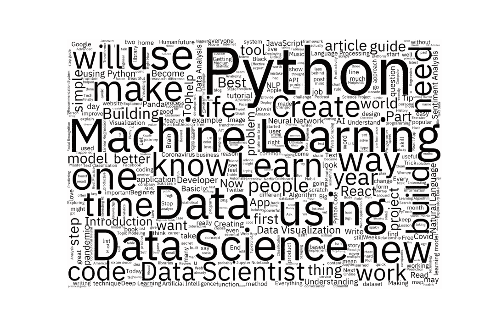

# 通过 Gmail API 从媒体每日文摘时事通讯中提取元数据

> 原文：<https://towardsdatascience.com/extracting-metadata-from-medium-daily-digest-newsletters-via-gmail-api-97eee890a439?source=collection_archive---------11----------------------->

## 消化摘要:用主题建模对我的兴趣进行逆向工程(第 1 部分)


作者图片

我实话实说。我着迷于媒体的推荐系统经常比我自己更了解我。他们推荐的阅读材料是如此的诱人，以至于我希望每天早上醒来都能狼吞虎咽地阅读 10-11 篇完全符合我兴趣的文章。也就是说，生活会碍事。虽然承认这一点很尴尬，但在上班(从家里)之前，我几乎没有时间刷牙和穿上工作服。通常情况下，我会将这些摘要邮件标记为未读，直到清理收件箱的时候，这时我会将一些听起来最有趣的邮件添加到我的中等阅读列表中。

我突然意识到，因为 Medium 非常了解我的兴趣，如果我着手一个项目，利用这些时事通讯作为数据来了解更多关于我的兴趣以及它们是如何随着时间的推移而演变的呢？

这个项目和我的大多数数据科学项目一样，将包括数据挖掘、数据清理、探索性数据分析和可视化的元素。然而，在我的下一篇文章中，我将通过与 LDA 和 BERTopic 讨论主题建模，将事情推向一个新的高度，敬请关注！在本文中，我们将重点讨论如何利用 Gmail API 来解析 Medium Daily Digest 时事通讯或任何其他格式一致的时事通讯。


斯蒂芬·菲利普斯-Hostreviews.co.uk 在 [Unsplash](https://unsplash.com/s/photos/gmail?utm_source=unsplash&utm_medium=referral&utm_content=creditCopyText) 上的照片

# 工作区开发人员入门和启用 Gmail API

Gmail API 是一个 RESTful API，可用于访问 Gmail 邮箱，甚至发送邮件。它适用于只读邮件提取(即我们将要做的事情)、自动化或程序化的邮件发送、电子邮件帐户迁移以及邮件的组织过滤和排序。为了使用此 API 对您的 Gmail 数据进行授权访问，我们必须获得对 API 的访问权限，并设置适当的凭据和范围。

## 第一步:在[谷歌云控制台](https://console.cloud.google.com)中创建一个新项目

1.  选择一个描述性的项目名称
2.  不需要组织

## 第二步:启用 [Gmail API](https://console.cloud.google.com/apis/library/gmail.googleapis.com?q=gmail&id=869e4b9c-0da4-4cbe-8b8d-c77f7ae060cc&project=medium-digest)

1.  在谷歌云平台仪表板的左上角，点击菜单☰按钮
2.  单击 API 和服务
3.  单击启用 API 和服务
4.  通过搜索或浏览找到 Gmail API
5.  单击启用

## 步骤 3:创建凭据

1.  单击左侧菜单中的凭据
2.  单击顶部的创建凭据
3.  单击 OAuth 客户端 ID
4.  选择桌面应用程序并选择一个客户端名称(没有太大关系)
5.  单击 Create，现在不用担心保存客户端 ID 和客户端密码

## 步骤 4: OAuth 同意屏幕

1.  输入您的应用名称和用户支持电子邮件
2.  忽略应用程序域部分，因为我们暂时不会通过任何托管网站访问数据
3.  输入开发者联系信息
4.  单击保存并继续

## 第五步:范围

1.  单击添加或删除范围
2.  搜索“gmail.readonly”，点击弹出的范围
3.  单击更新

## 步骤 6:测试用户

*注意:有必要添加一个测试用户，因为如果您没有自己的组织，阅读和访问电子邮件是一个受限制的范围*

1.  在测试用户下，单击添加用户
2.  输入您的电子邮件，然后点按“存储”

## 步骤 7:下载凭据

1.  单击左侧菜单中的凭据
2.  在 OAuth 2.0 客户端 id 下，单击下载图标
3.  将凭证 JSON 文件移动到您的工作项目目录中
4.  为了便于使用，将其命名为`credentials.json`

# Python 快速入门

下面的起始代码很大程度上是仿照[Gmail for Developers>Gmail API>Python quick start](https://developers.google.com/gmail/api/quickstart/python)页面编写的，但是让我们一起浏览一下，设置好我们的服务实例，并开始阅读电子邮件！

首先，我们必须注意导入和范围。如果您正在跟进，您将需要初始化一个名为`quickstart.py`的新文件，并粘贴以下代码行。

接下来，我们必须完成授权流程并存储我们的访问/刷新令牌！注意，这一步需要我们之前下载的`credentials.json`文件。下面的函数返回一个服务实例，我们将使用它来访问 Gmail API 中的方法。


展示 Gmail 标签|作者图片

在验证我们可以访问经过身份验证的用户数据之前，让我们先讨论一下标签。鉴于每日摘要电子邮件倾向于模板化并通过自动邮件服务发送，我们可以通过将感兴趣的电子邮件组织到单个标签分组中来使我们的生活变得更容易。为此，请在 Gmail 搜索栏中输入搜索词，选择全部，然后单击标签(🏷)图标将现有标签或新标签分配给所有选定的邮件。对于所有符合搜索标准的未来简讯，您可以设置一个高级 Gmail 过滤器，自动将它们分配到同一个标签。

当调用上述方法时，它将打印用户 Gmail 帐户中所有标签的列表。这个列表可能看起来类似于、`INBOX`、`SENT`、`IMPORTANT`、`TRASH`、`DRAFT`、`SPAM`、`STARRED`等。值得注意的是，标签 id 并不总是与标签名称一致。例如，我新创建的`MEDIUM`标签的 id 是`Label_793897032304597046`。我们希望保留这个 id，因为我们需要它来获取我们感兴趣的电子邮件。

```
if __name__ == '__main__':
    service = get_service()
    get_all_email_labels(service)
```

要执行这段代码，我们必须在快速入门中运行上述两个函数。为此，您只需打开一个终端窗口，并通过键入以下命令来执行包含所有代码片段的完整脚本:

`python quickstart.py`

如果是第一次执行 quickstart，您可能会看到弹出如下提示。它们是为了让你确认，虽然你不是谷歌认证的开发人员，但你希望继续并允许应用程序/项目查看你的电子邮件。


作者提供的图片

```
The authentication flow has completed. You may close this window.
```

如果一切顺利，您应该会看到包含上述消息的页面。这意味着我们可以走了！

# 数据采集和清理

为了获取数据，我们可以编写一个简单的函数`get_data()`来获取带有指定标签 id 的所有用户消息。

## 执行 API 调用

获取电子邮件元数据的代码大致如下:

```
results = services.users().messages().list(userId='me', labelIds = ['XXXXXXXX'], maxResults=500).execute()
```

以下代码行为所有提取的消息编译一个元数据列表:

```
messages = results.get('messages', [])
```

因为这种类型的 API 调用返回的最大结果数永远不会超过 500，所以我们将从 API 调用中收集下一个页面标记，并实现一个简单的 while 条件。

要调用这个方法，我们可以从`quickstart`模块导入它，并指定我们想要获取中等的每日摘要电子邮件。在引擎盖下，这将找到正确的标签 id。

```
from quickstart import get_service, get_data
service = get_service()
messages = get_data(service, 'Medium Daily Digest')
print(len(messages))
```

就这样，596 条信息被获取了！我们能打印一份出来吗？嗯……不完全是。打印第一条消息实际上会返回以下元数据:

```
{'id': '17b590fa1e590dfa', 'threadId': '17b590fa1e590dfa'}
```

这意味着需要进行更多的 API 调用来检索电子邮件内容本身。要获得实际的消息，我们必须进行以下 API 调用:

```
msg = service.users().message().get(userId='me', id=message['id'], format='full').execute()
```


作者图片

啊…混乱！这不完全是我们希望的精确提取的内容，但它是一个起点。原来我们的 msg 对象实际上是一个字典，它有以下键:`dict_keys([‘id’, ‘threadId’, ‘labelIds’, ‘snippet’, ‘payload’, ‘sizeEstimate’, ‘historyId’, ‘internalDate’])`。

打印出来的`msg['snippet']`实际上很整洁，但是限制在 200 个字符左右。因此，必须使用`'payload'`键提取所有有价值的信息。


作者图片

有趣的是，电子邮件正文数据是 MIME 消息部分，这实质上意味着数据存储为 base64url 编码的字符串。要解码它，我们可以使用`base64` Python 库。完整的数据采集代码流程如下所示:

## 使用正则表达式解析电子邮件正文

专注于我们上面实验的示例电子邮件消息，让我们解码正文数据，并获得一些关于文章元数据在每日摘要中如何格式化的直觉。下面是与本文开头所包含的我的每日文摘截图相对应的邮件正文的转储:

```
Today's highlights

NLP Profiler: Profiling datasets with one or more text columns

Creating high-level insights from text dataset using NLP Profiler

Himanshu Sharma (https://medium.com/@hmix13?source=email-e353ddb0c125-1629269257172-digest.reader-7f60cf5620c9-9b791193db89----0-59------------------e4b04afc_f3d7_492e_98c5_a3c1bbb1304a-1-dbdc0eb5_2de9_432f_a90c_bcf2300858ca)
 in Towards Data Science (https://medium.com/towards-data-science?source=email-e353ddb0c125-1629269257172-digest.reader-7f60cf5620c9-9b791193db89----0-59------------------e4b04afc_f3d7_492e_98c5_a3c1bbb1304a-1-dbdc0eb5_2de9_432f_a90c_bcf2300858ca)
·5 min read

Data Cleaning in Python with NumPy and Pandas

The first utilities that an aspiring, python-wielding data scientist must learn include numpy and pandas. All…

Mike Flanagan (https://medium.com/@mike-flanagan?source=email-e353ddb0c125-1629269257172-digest.reader-29038077e4c6-3776f9a6e77f----1-98------------------e4b04afc_f3d7_492e_98c5_a3c1bbb1304a-1-dbdc0eb5_2de9_432f_a90c_bcf2300858ca)
 in CodeX (https://medium.com/codex?source=email-e353ddb0c125-1629269257172-digest.reader-29038077e4c6-3776f9a6e77f----1-98------------------e4b04afc_f3d7_492e_98c5_a3c1bbb1304a-1-dbdc0eb5_2de9_432f_a90c_bcf2300858ca)
·5 min read

A data scientist has a look at Japan's Coronavirus analytics

After having been post-posted until 2021, the summer olympics are being sponsored by Tokyo, Japan from 23…

Tracyrenee (https://medium.com/@tracyrenee61?source=email-e353ddb0c125-1629269257172-digest.reader-f19413a43ae4-4f3a1dbfd5e8----2-98------------------e4b04afc_f3d7_492e_98c5_a3c1bbb1304a-1-dbdc0eb5_2de9_432f_a90c_bcf2300858ca)
 in MLearning.ai (https://medium.com/mlearning-ai?source=email-e353ddb0c125-1629269257172-digest.reader-f19413a43ae4-4f3a1dbfd5e8----2-98------------------e4b04afc_f3d7_492e_98c5_a3c1bbb1304a-1-dbdc0eb5_2de9_432f_a90c_bcf2300858ca)
·7 min read
```

我们希望从这种非结构化但格式松散的数据中提取的字段是**标题**、**副标题**、**作者**、**出版物**和**会议记录**(例如，“X 分钟阅读”)。我们想忽略所有链接，因为抓取文章内容是不道德的，如果我有时间自己阅读所有这些文章，我早就这样做了。

为了提取想要的信息，我们将使用我们邪恶的敌人，他有时也是我们充满爱心和支持的朋友:`regex`。regex 是正则表达式的缩写，是指定搜索模式的字符序列。当我们可能不知道我们希望提取的具体文本，但我们知道它将呈现给我们的一般模式时，它可能是强大的。将这一概念应用到我们当前的任务中，每篇文章的信息都遵循以下一般结构:

```
[TITLE][SUBTITLE][AUTHOR] (link to profile) in [PUBLICATION] (link to article within publication)
·[MINUTES] min read
```

在正则表达式的世界中，我们可以通过两个强大的步骤提取这些信息:

**第一步:通过替换删除所有链接(** `**sub**` **方法)**

```
text = re.sub(r'\(https?:\S+.*\)', '', msg_body, flags=re.MULTILINE)
```

**第二步:通过** `**findall**` **方法**进行模式匹配

```
# \r\n means we expect a line break
# (.*) is a capture group, meaning we want to store the filler textre.findall('(.*)\r\n\r\n(.*)\r\n\r\n(.*) \r\n in (.*)\r\n*·(.*) min read', text, re.MULTILINE)
```


作者截图

在用 regex 快速地打了两下之后，我们已经获得了我们想要获得的所有 5 个字段的数据！又快又无痛，对吧？老实说，派生正则表达式模式来完成这个任务实际上是相当痛苦的。谢天谢地，regex101 帮我解决了问题，并帮助我对问题进行了分类。我强烈推荐在那里制定正则表达式，并准备了一个方便的测试用例来使用。

## 组装的数据帧

包含从 API 获取的文章中经过正则表达式解析的信息的数据如下所示:

```
[Timestamp('2021-08-18 11:40:00+0000', tz='UTC'), 'NLP Profiler: Profiling datasets with one or more text columns', 'Creating high-level insights from text dataset using NLP Profiler', 'Himanshu Sharma', 'Towards Data Science ', '5']
[Timestamp('2021-08-18 11:40:00+0000', tz='UTC'), 'Data Cleaning in Python with NumPy and Pandas', 'The first utilities that an aspiring, python-wielding data scientist must learn include numpy and pandas. All…', 'Mike Flanagan', 'CodeX ', '5']
[Timestamp('2021-08-18 11:40:00+0000', tz='UTC'), "A data scientist has a look at Japan's Coronavirus analytics", 'After having been post-posted until 2021, the summer olympics are being sponsored by Tokyo, Japan from 23…', 'Tracyrenee', 'MLearning.ai ', '7']
```

只需一行代码，我们就可以组装一个由这些文章元数据组成的`pandas`数据框架。

```
df = pd.DataFrame(data, columns = ['Date', 'Title', 'Subtitle', 'Author', 'Publication', 'Minutes'])
```

接下来是一个艺术作品，包含来自每封电子邮件的正则表达式匹配的解包元组值。


作者图片

# 一览式可视化


媒体每日文摘中出现的前 10 位出版物和作者|由

我们可以从上面简单的`matplotlib`条形图中看到，阅读推荐文章的前 3 位出版物是关于数据科学、更好的编程和创业。这是有意义的，因为我对媒体的兴趣和互动倾向于数据科学相关的应用程序和软件开发技巧和工具。在我的推荐阅读清单中，前三名最多产的作者是里士满·阿拉克、马卡姆·海德和戴夫·格什格恩。我记得 Parul Pandey 是第一个让我迷上 Medium 的作者，所以很高兴看到她出现在这个前 10 名的名单中，还有 TDS 团队经常发布的综述和亮点！


作者创建的可视化

制作“分钟”列的直方图，我们可以发现中等文章的长度/阅读时间分布遵循一个非常标准的钟形曲线，稍微向左倾斜。中篇文章最常见的长度是 4 分钟左右。


作者创建的可视化

按出版物细分阅读时间，我们可以观察到，面向数据科学的文章通常篇幅较长，因为它们倾向于深入研究更多的技术细节，并夹杂着大量引发评论的图表和数字。锻造物品的长度通常在 3-5 分钟之间，元素物品的长度通常在 5-7 分钟之间，有一些异常值。

## 反文字云的视角

如果你是一个热衷于数据科学的读者或数据可视化的爱好者，我相信你已经偶然发现了数百篇使用 Python `wordcloud`库的文章。在我看来——我是作为一个犯了这种错误的人这么说的——对于那些被自然语言处理(NLP)吓倒的人来说，生成一个词云是一种回避策略。wordcloud 甚至没有触及可以通过新的和快速出现的自然语言处理技术利用的洞察力的表面，如主题建模、标记化、词条化、命名实体识别、文本摘要、单词嵌入等。但是为了完整起见，我们来做一个 wordcloud。



作者生成的 Wordcloud

酷毙了。单词 *Python* 、*机器学习*和*数据科学*在语料库中出现频率最高。希望这不会让任何人感到震惊。在我的下一篇文章中，我将挑战自己不要满足于文字云。相反，我将通过主题建模的方式对我的中等兴趣进行逆向工程——我也将向您展示如何做到这一点！

# 结论

这就结束了使用 Gmail API 从 Medium Daily Digest 电子邮件中提取文章元数据的教程。我希望你在阅读的过程中学到了一些新的东西。我想强调的是，我有意地决定避开一个以摘要为导向的项目，因为在我们生活的当前世界中，似乎一切都在被合成、优化，并且变得对我们更方便。我的目标不是避免阅读中等推荐的文章，而是通过人工制品来分析我自己的行为数据，人工制品是我通过算法整理的符合我最近兴趣的文章列表。我希望更多地了解我的兴趣在过去几年中是如何发展的，我希望你能决定一起来。

所有源代码可在以下 GitHub repo 获得:

<https://github.com/sejaldua/digesting-the-digest> 