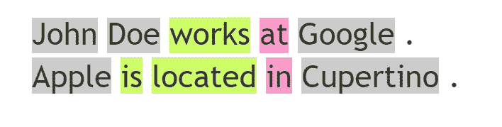

# 利用自然语言处理抽取实体间的关系

> 原文：<https://towardsdatascience.com/extracting-relations-among-entities-using-nlp-b3d773c709ce?source=collection_archive---------12----------------------->

## 示例和如何进行头脑风暴


照片由[帕里什·弗里曼](https://unsplash.com/@parrish?utm_source=unsplash&utm_medium=referral&utm_content=creditCopyText)在 [Unsplash](https://unsplash.com/s/photos/graph?utm_source=unsplash&utm_medium=referral&utm_content=creditCopyText) 上拍摄

在这篇文章中，我们介绍了使用 NLP 提取命名实体之间关系的问题。我们用越来越复杂的例子来说明这个问题，并在这个过程中思考解决这些问题的方法。

让我们开始吧。

考虑这些句子。

```
John Doe works at Google.
Apple is located in Cupertino.
```

我们想要检测这些句子中的各种实体。他们是

```
Person name = John Doe
Company = Google
Company = AppleCity = Cupertino
```

幸运的是，这项任务(命名实体识别)的 NLP 已经足够成熟，可以高质量地完成。参见[1]。

合乎逻辑的下一步是能够使用 NLP 推导出这些实体之间的关系。在我们的案例中，我们希望得到

```
works_at(person:john doe,company:google)
located_in(company:apple, city:cupertino)
```

很明显，自动化不仅检测实体，而且检测它们之间的关系的过程具有相当大的价值。使用这种方法，我们可以从非结构化文档中提取结构化数据(这种文档有很多)。然后可以对结构化数据执行强大的查询。例如给问答系统供电。

这个元用例有许多特殊的应用。例如挖掘特定垂直领域中的文档以揭示该垂直领域中的实体和它们之间的关系。类似地，挖掘一家公司的文档来揭示其工程或业务流程中的内幕。

**第一次观察**

让我们仔细看看我们的句子。利益关系嵌入在的*工作中，*位于*。看起来我们应该可以用 NLP 来检测这些。先给这个问题起个名字:*关系短语提取*。*

我们对这个句子做了词性分析，在[https://parts-of-speech.info/](https://parts-of-speech.info/)



灰色是名词，绿色是动词，紫色是介词

正如我们所看到的，词性标签携带着识别关系短语的强烈信号。还要记住，*命名实体识别*将已经标记了这些句子中的命名实体，这将进一步增强我们的信心，即在这些例子中，关系短语对应于词性标记<动词> <介词>的序列。

为了更生动地说明这一点，让我们描述一下标记化的句子以及它们的标记序列，如下所示。

```
Tokens:   John   Doe     works at          Google
POS tags: noun   noun    verb  preposition noun
NER tags: person person  —     —           companyTokens:   Apple  is    located in          Cupertino
POS tags: noun   verb  verb    preposition noun
NER tags: company —    —       —           city
```

显然，在这些例子中，将 POS 标签中的信息与 NER 标签中的信息结合起来可以很好地识别关系短语。

**一个更详细的例子**

接下来考虑这句话，摘自[2]。

```
Read The Adventures of Sherlock Holmes by Arthur Conan Doyle online or in your email
```

被命名的实体是一本书的书名*和一个人的名字*亚瑟·柯南·道尔*。前者比后者更难识别。这是因为书名更长，有更多样的宇宙。有趣的是，这本书的书名里有一个人的名字。*

现在，让我们把识别书名的复杂性埋在引擎盖下。如果你很好奇，请阅读一些更详细的方法，如[1]中 NER 背景下的 HMMs。

假设这两个实体被正确识别，我们注意到关系短语仍然位于它们之间。也就是说，这个句子的结构是

```
<words> book-title by person-name <words>
```

下面是这句话相关部分的词性分析。


紫色表示介词

夹在两个实体中间的单词*是一个介词，这一点令人放心。它支持由*从这个*形成关系短语。*

让我们利用这个机会，通过更深入地‘钻研】一下*。很容易想象，在一个巨大的语料库中，我们可能会遇到无数的*

```
book-title by person-name
```

从这些例子中，我们也将能够推断出书名总是在*之前加上*，并且人名总是跟在其后。因此，原则上，单词 *by* 可以用作实体本身的附加预测符，在我们的例子中是书名和人名。考虑用由编写的*替换*的*。*后者对书名和人名实体的预测强度现在更高。

接下来，我们来看看

```
Wimbledon is a tennis tournament held in the UK in the first two weeks of July every year.
```

这一个可以通过实体识别来“解析”(有点广义的解释)为

```
**Sports event name** is a **sport tournament** held in the **location** in the **time**.
```

前三个实体相当清晰，可以通过适当训练的 NER 方法检测出来。第四个，**时间**，不太脆。在我们的例子中，它的值是每年七月的前两周*。为这样一个不太清晰的实体培养一个 NER 可能很难。相反，我们可以考虑识别更细粒度的基于时间的实体。如*月*。有了这样的探测器，我们就可以部分推断出 **时间**中的*为* **月份** : *七月*。*

*现在让我们看看**位置**。用分等级的方式对待它是有意义的。具体来说，要将**位置**分解成更精细的实体，如**国家**、**州**、**城市**……我们可以识别这些实体，并使用分类法将它们联系起来。如**国家** *是-个* **地点**，**州** *是-个* **地点**，**州** *是-个* **国家，**等。(注意，一个特定的州可能与多个国家有多个 is-in 关联。)*

*好了，现在我们已经讨论了实体，我们能推断出它们之间的关系吗？肯定是下面这种 is-a 关系。*

```
***Sports event name** is-a **sport tournament***
```

*其他的需要更多的思考。首先，为了方便起见，我们将含有实体变量的句子缩写如下。*

```
***SEN** is a **ST** held in the **L** in the **T**.*
```

*在我们的例子中，我们看到**ST**hold-inL 会是一个错误的推论。是**森** = *温网*在 **L** = *英国*举行，而不是 **ST** = *网球赛*？*

*一个值得探讨的想法是从形成三个假设开始，以关联规则的形式表达[3]*

```
*ST=tennis tournament, held-in ⇒ L=UK
SEN=Wimbledon, held-in ⇒ L=UK
SEN=Wimbledon, ST=tennis tournament, held-in ⇒ L=UK*
```

*在上图中，将*X*Y*视为**

```
*IF X THEN Y*
```

*给定一个巨大的语料库，如维基百科，分解成单独的句子，然后我们可以计算每个关联规则的所谓支持度和置信度。一条规则的支持度*X*Y 就是 *X* 成立的句子数。这条规则的置信度是*P*(*Y*|*X*)。*

*从这样的分析中，我们可以合理地推断出，ST**ST**=*网球锦标赛*并不意味着它在英国举行，而 **SEN** = *温布尔登*总是意味着它在英国举行。*

*接下来考虑涉及 **T** (时间)的关系中的*。我们可以同样对待。我们的候选关联规则集有点大。在*X**Y*， *Y* 永远是每年七月的前两周**T**=*。 **X** 是{ **森** = *温网*， **ST** = *网球锦标赛*， **L** = *英国* }的任意非空子集***

*将这个问题框架化为一个涉及挖掘高置信度关联规则的问题，让我们可以使用为这个问题开发的高度可伸缩的算法。例如 FP 增长或先验算法。参见[3]。如果我们要对维基百科中的所有句子进行这种分析，我们可能真的会面临规模问题，许多句子中有两个以上的实体(我们也是如此)。*

*最后，让我们把注意力转向下面这句话。*

```
*In 2019, the men’s singles winner was Novak Djokovic who defeated Roger Federer in the longest singles final in Wimbledon history.*
```

*这个句子是一个很好的例子，它说明了如何超越仅仅从句子的内容来联系句子中出现的实体。相反，我们将推断(或者更准确地说，收集证据)可能通过将本句中的信息与合适的全球知识模型相结合而推断出的关系。*

*我们实际上不会指定知识模型的形式。相反，如果我们也能使用这样一个模型，我们将思考我们能从这句话的信息中推断出什么。*

*从*

```
*Novak Djokovic who defeated Roger Federer*
```

*我们可以提取*

```
*defeated(Person Name: Novak Dkokovic, Person Name: Roger Federer)*
```

*以前面讨论的方式。*

*现在考虑一下稍后出现在同一个句子中的单词*温布尔登*。假设其被正确识别为*体育赛事名称。*我们现在可以将这些人的名字与这个事件联系起来。如果是这样，假设我们的知识图谱知道温网是一个*网球*赛事，我们也可以推断*诺瓦克·德科科维奇*和*罗杰·费德勒*是网球运动员。*

*我们在上一段的最后一句列出推论，主要是为了说明我们能推断出什么样的东西。对于这些特定的断言——这些人是网球运动员——在维基百科的其他句子中可能有更有力、更直接的证据。*

*最后，让我们注意一下，我们甚至可以从这些人的名字中推断出他们的性别。在句子的前面提到的男子的可以被看作是确凿的证据。*

***延伸阅读***

1.  *[https://towards data science . com/named-entity-recognition-in-NLP-be 09139 fa 7b 8](/named-entity-recognition-in-nlp-be09139fa7b8)*
2.  *[https://www . cs . CMU . edu/~ nbach/papers/A-survey-on-Relation-extraction . pdf](https://www.cs.cmu.edu/~nbach/papers/A-survey-on-Relation-Extraction.pdf)*
3.  *[https://en.wikipedia.org/wiki/Association_rule_learning](https://en.wikipedia.org/wiki/Association_rule_learning)*