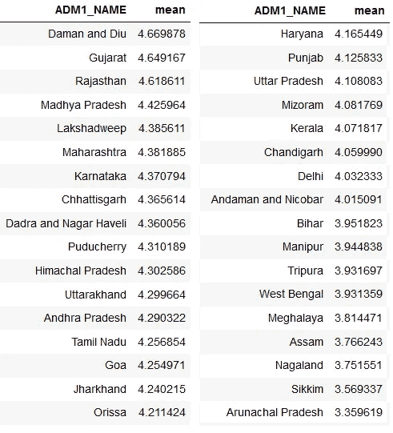

# 利用全球太阳图集提取太阳能潜力

> 原文：<https://towardsdatascience.com/extracting-solar-potential-using-global-solar-atlas-e9cbcae06ca8?source=collection_archive---------20----------------------->

## 如何使用光栅图像计算粒度级别的太阳能潜力


在 [Unsplash](https://unsplash.com/s/photos/solar-panel?utm_source=unsplash&utm_medium=referral&utm_content=creditCopyText) 上[科学高清](https://unsplash.com/@scienceinhd?utm_source=unsplash&utm_medium=referral&utm_content=creditCopyText)拍摄的照片

# 1.介绍

随着野火、洪水、全球变暖和其他自然灾害事件的增加，向可再生能源过渡的压力越来越大。许多国家已经承诺减少化石燃料的消耗，并转向替代能源，如太阳能、风能和水能，这些能源对气候造成的温室气体排放为零。与化石燃料不同，它们也很丰富，而且取之不尽用之不竭。

为了帮助各国实现可持续发展的目标，世界银行集团与 Solargis 合作发布了全球太阳能图集(GSA)[【https://globalsolaratlas.info/】。它为世界上任何地点或地区提供了快速、简便的太阳能潜力获取途径。光伏(PV)产量估计值由模拟模型使用太阳辐射和气象数据生成。鼓励读者参考技术文件，以了解如何计算估计值的更多信息([https://documents 1 . world bank . org/curated/en/529431592893043403/pdf/Global-Solar-Atlas-2-0-Technical-report . pdf](https://documents1.worldbank.org/curated/en/529431592893043403/pdf/Global-Solar-Atlas-2-0-Technical-Report.pdf))。这些初步估计可以帮助决策者、研究人员和商业太阳能公司做出更好的决策。在这篇博文中，我将演示如何使用 GSA 提供的 GIS 数据层来提取任何地区的光伏潜力数据。使用这些估计值的一个注意事项是，它们没有考虑可能影响一个地区光伏潜力的许多因素，因此，应该使用更详细的估计工具来获得对发电量的精确估计。

# 2.工作流程

GIS 数据的粒度允许我们估计任何地区的光伏潜力——无论大小——如地区、州、国家等。在这些光栅文件中捕获的像素级信息可以很容易地在 Google Earth Engine (GEE)中聚合，以在几秒钟内得出估计值。

有四个主要步骤:

*   下载 GIS 数据。PVOUT GeoTiff 文件是我们正在寻找的。
*   将 GIS 数据上传到 GEE 代码编辑器中的资产。本质上，我们将数据加载到 GEE，以利用 Google 云计算架构的能力来加速我们的分析。
*   用矢量形状覆盖光栅图像。使用 GEE 函数根据矢量边界对像素级别信息进行分组，并通过对其求和，将它们简化为每个多边形边界的 PV 潜力的单一统计数据。
*   将 GEE `FeatureCollection`转换为 pandas 数据框架，并计算单位面积的 PV 潜力。

# 3.在 GEE 中编码并导出结果

我们将从导入`earth engine`和`geemap` 库开始。接下来，我们初始化并验证到 GEE 的连接。我们在邦/UT 级别为印度导入 FAO-GAUL 矢量图层。我们还导入了太阳能潜力的栅格，并通过平均将像素级别信息聚合到州/UT 级别。栅格中的像素值代表光伏电站日总发电量的长期年平均值，光伏电站采用独立式固定安装的晶体硅(c-Si)模块，以最佳倾斜度安装，以最大化年光伏发电量。

```
# Import the relevant libraries
import ee
import geemap
import pandas as pd# Initalize Earth Engine
try:
    ee.Initialize()
except:
    ee.Authenticate()
    ee.Initialize()# Accessing state level polygon boundaries of India using FAO dataset
india = ee.FeatureCollection("FAO/GAUL/2015/level1") \
            .filter(ee.Filter.eq('ADM0_NAME', 'India'))# Access the solar potential raster image saved as GEE asset
solarpot = ee.Image("users/skantbksc/pvpot")# Add reducer output to the Features in the collection.
solarPotFC = solarpot.reduceRegions(
  collection =  india,
  reducer = ee.Reducer.mean(),
);# Sort the dataframe by PV potential per unit area
solarPotdf[['ADM1_NAME','mean']].sort_values(by='mean', ascending = False)
```



各邦/中央直辖区的平均太阳能潜力:作者图片

# 4.结论

光伏输出取决于几个因素，如落在光伏组件上的太阳辐射量、倾角、气温、天空中的灰尘/气溶胶量、云、光伏组件表面的清洁度、靠近光伏系统的外部障碍物造成的阴影等。虽然将所有变量准确地纳入模拟可能是不可能的，但 GSA 列出了使用历史太阳辐射、温度和气象数据的模拟练习的结果。GSA 以 GIS 数据层的形式提供这些结果，可以使用 GEE 对其进行分析。在使用 FAO-GAUL 数据集的印度矢量数据的图示中，我们看到印度西部各邦的太阳能潜力相对比东部和东北部各邦更丰富。

# 参考

*   [数据/信息/地图]摘自“全球太阳能地图集 2.0”，这是一个基于网络的免费应用程序，由 Solargis s.r.o .公司代表世界银行集团开发和运营，利用 Solargis 数据，由能源部门管理援助计划(ESMAP)提供资金。更多信息:[https://globalsolaratlas . info](https://globalsolaratlas.info)
*   吴(2020)。geemap:一个 Python 包，用于与 Google Earth 引擎进行交互式地图绘制。《开放源码软件杂志》，5(51)，2305 页。[https://doi.org/10.21105/joss.02305](https://doi.org/10.21105/joss.02305)
*   Gorelick，m . Han cher，m . Dixon，m . Ilyushchenko，s .，Thau，d .，& Moore，R. (2017)。谷歌地球引擎:面向所有人的全球地理空间分析。环境遥感。