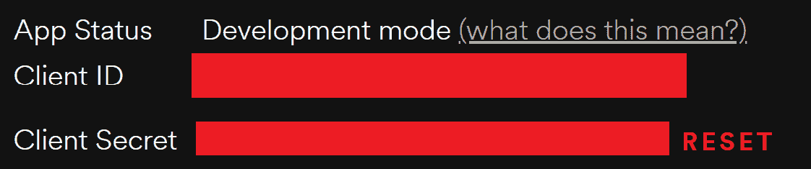
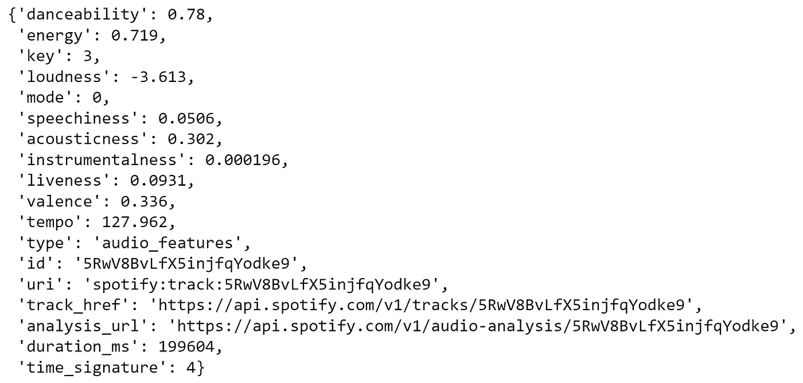

# 使用 Python 从 Spotify API 提取歌曲数据

> 原文：<https://towardsdatascience.com/extracting-song-data-from-the-spotify-api-using-python-b1e79388d50?source=collection_archive---------2----------------------->

## 利用 Spotify 保存在其图书馆中的数据，并将其用于我们的机器学习项目


sgcdesignco 在 [Unsplash](https://unsplash.com?utm_source=medium&utm_medium=referral) 上拍摄的照片

本文是展示我们使用 [Spotify 的百万播放列表数据集](https://www.aicrowd.com/challenges/spotify-million-playlist-dataset-challenge)【1】构建音乐推荐系统的四篇系列文章中的第一篇。本文详细介绍了从 Spotify 的 API 中提取数据，从构成数据集的唯一歌曲标识符中提取数据。本系列的其他文章如下:

*   第一部分:(本文)
*   第二部分:EDA 和集群
*   第三部分:[用 Spotify 搭建歌曲推荐系统](https://medium.com/@enjui.chang/part-iii-building-a-song-recommendation-system-with-spotify-cf76b52705e7)
*   第四部分:[用 Flask 部署 Spotify 推荐模型](https://medium.com/@yaremko.nazar/deploying-a-spotify-recommendation-model-with-flask-20007b76a20f)

# 介绍

Spotify 在内部保存了大量关于其歌曲的数据，我们可以通过 Spotify API 访问这些数据。Spotify API 是一个很棒的公共工具，允许使用 Spotify 丰富的音乐数据来构建多种系统。在本文中，我们通过 Python 的 Spotipy 包学习使用这个 API 从唯一的歌曲标识符中提取数据。

这个项目我们需要的进口如下:

```
import spotipy
from spotipy.oauth2 import SpotifyClientCredentials
```

# 我们可以用 Spotify API 做什么？

Spotify API 非常强大，让我们可以访问 Spotify 上任何歌曲或艺术家的大量信息。这包括描述音频“感觉”的特征，如变量“活跃度”、“声音度”和“能量”，以及描述艺术家和歌曲受欢迎程度的特征。如果我们想对数据进行更高级的分析，我们还可以从这个 API 中获得更高级的信息，例如歌曲中每个节拍的预测位置。

Spotify 的其他功能，如推荐引擎和搜索，也可以通过 Spotify API 使用。要了解更多关于 Spotipy 包所基于的 Web-API 的信息，您可以在[网站上查看。此外，您可以在这里使用控制台来测试 API 的功能，这可能有助于您修复自己的实现。](https://developer.spotify.com/discover/)

# 这篇文章将涵盖什么？

本文将介绍通过 Spotify 使用 Spotify web API 的基础知识。这包括从获取访问令牌和认证，到从播放列表中的歌曲中提取特征，给定其相关联的 URI(统一资源标识符)。

# API 键

如果您以前没有使用过 API，那么使用各种密钥进行身份验证和发送请求可能会有点令人生畏。我们要看的第一件事是获取要使用的密钥。为此，我们需要一个面向开发者的 Spotify 账户。这与 Spotify 帐户相同，不需要 Spotify Premium。从这里，转到仪表板并“创建应用程序”。现在，我们可以访问使用 API 所需的公钥和私钥。

现在我们有了一个应用程序，我们可以获得这个应用程序的客户端 ID 和客户端密码。对于我们的应用程序，这两者都需要通过 Spotify web API 的认证，并且可以被认为是应用程序的一种用户名和密码。最佳实践是不要共享这两个密钥，尤其是不要共享客户端密钥。为了防止这种情况，我们可以将它保存在一个单独的文件中，如果您使用 Git 进行版本控制，那么应该忽略这个文件。



这些是各自的客户端 ID 和客户端密钥，需要它们来验证我们的应用程序。作者图片

# 使用 Spotipy 认证

我们可以使用 Spotipy 库执行两种类型的身份验证。首先，我们可以在不考虑特定用户的情况下进行身份验证。这允许我们访问 Spotify 的一般功能，并查看播放列表。如果没有这个，我们就看不到特定用户的统计数据，比如他们的关注列表和所听音乐的统计数据。

要在不登录帐户的情况下进行身份验证，我们只需要 id、客户端和密码。然后，我们可以用下面几行代码创建我们的“Spotify”对象:

```
#Authentication - without user
client_credentials_manager = SpotifyClientCredentials(client_id=cid, client_secret=secret)
sp = spotipy.Spotify(client_credentials_manager = client_credentials_manager)
```

要使用帐户进行身份验证，我们需要提示用户登录。这是使用包的“spotipy.utils”部分中的“prompt_for_user_token”方法完成的。由于我们没有在这个项目中使用它，所以就不做探讨了，但是可以在 Spotipy 包【3】的[文档中读到更多关于它的内容。](https://spotipy.readthedocs.io/en/2.19.0/)

# 使用 Spotify 对象

这两种类型的认证创建相同的 Spotify 对象，只是创建方法不同。这意味着相同的类方法可用于任一种身份验证方法，与当前用户相关的方法除外。现在，使用这个对象，我们可以与 Spotify API 进行交互，以获取我们想要的信息。

# URI 到底是什么？

使用 Spotify API 的一个重要组成部分是使用统一资源标识符，指向 API 中的每个对象。我们需要一个 URI 来执行 API 引用 Spotify 中对象的任何功能。任何 Spotify 对象的 URI 都包含在其可共享链接中。例如，从 Spotify 桌面应用程序中找到的全球热门歌曲播放列表的链接是:

> [https://open.spotify.com/playlist/37i9dQZEVXbNG2KDcFcKOF?si=77d8f5cd51cd478d](https://open.spotify.com/playlist/37i9dQZEVXbNG2KDcFcKOF?si=77d8f5cd51cd478d) "

该链接中包含的 URI 是“37i 9 dqzevxbng 2 kdcfckof”——如果我们将它与 API 一起使用，那么我们将引用全球热门歌曲播放列表。您可能还会看到以“spotify:object_type:uri”格式列出的 URI，这也是一种有效的方式，如果有的话，这是一种更有效的引用对象的方式。使用这些 URIs，我们将提取播放列表中歌曲的特征，并进而从这些歌曲中提取一系列特征，这样我们就可以创建一个数据集来进行分析。

# 从播放列表中提取曲目

我们将用于从播放列表中的轨道提取特征的第一种方法是“playlist_tracks”方法。该方法从播放列表中获取 URI，并输出包含该播放列表所有信息的 JSON 数据。幸运的是，Spotipy 包为我们对此进行了解码，因此我们可以相当容易地以 python 化的方式解析这些数据。

我们希望在这里提取轨迹数据，以便从中获取特征。这可以通过以下代码段来完成，该代码段提取给定播放列表中每首歌曲的 URI(在我们的示例中仍然是全球前 40 名):

```
playlist_link = "[https://open.spotify.com/playlist/37i9dQZEVXbNG2KDcFcKOF?si=1333723a6eff4b7f](https://open.spotify.com/playlist/37i9dQZEVXbNG2KDcFcKOF?si=1333723a6eff4b7f)"
playlist_URI = playlist_link.split("/")[-1].split("?")[0]
track_uris = [x["track"]["uri"] for x in sp.playlist_tracks(playlist_URI)["items"]]
```

当我们在这里时，我们还可以提取每个曲目的名称、它所属的专辑的名称以及该曲目的流行度(在这种情况下，我们预计它会很高—我们正在查看全球最流行的歌曲)。从艺术家那里，我们可以找到一个流派(尽管不是无懈可击的——艺术家可以创作多种流派的歌曲)，以及一个艺术家流行度评分。

```
for track in sp.playlist_tracks(playlist_URI)["items"]:
    #URI
    track_uri = track["track"]["uri"]

    #Track name
    track_name = track["track"]["name"]

    #Main Artist
    artist_uri = track["track"]["artists"][0]["uri"]
    artist_info = sp.artist(artist_uri)

    #Name, popularity, genre
    artist_name = track["track"]["artists"][0]["name"]
    artist_pop = artist_info["popularity"]
    artist_genres = artist_info["genres"]

    #Album
    album = track["track"]["album"]["name"]

    #Popularity of the track
    track_pop = track["track"]["popularity"]
```

# 从轨迹中提取特征

现在我们已经有了轨迹 URIs 的列表，我们可以从这些轨迹中提取特征，以便执行我们的分析。Spotify 根据对音频的分析，列出了每首歌曲的这些功能。我们可以通过 spotify 对象“audio_features(uri)”的一个方法来访问它们。这给了我们一个主要是数字特征的列表，我们可以用它来进行分析。

```
sp.audio_features(track_uri)[0]
```



以上代码的结果。图片作者。

# 其他用途

你可以用这个对象做很多其他事情，包括建立和编辑播放列表，控制你自己的 Spotify 播放，以及访问 Spotify 中对象的许多不同方面。我们在本文中只涉及了其中的一小部分，但是您可以在 Spotipy 包的[文档中读到更多，这里是](https://spotipy.readthedocs.io/en/2.19.0/) [3]。

# 此项目的用途

在这个项目中，Spotify API 用于从[百万播放列表数据集](https://www.aicrowd.com/challenges/spotify-million-playlist-dataset-challenge) [1]中给我们的数据中提取一组特征(上面展示的那些)。我们只使用这个数据集中的 1000 个播放列表的子集，因为整个数据集确实很大。在这个项目的链接 Github 库中，我们使用一个脚本为此编写一个函数，返回一个给定轨道 URI 的特性列表。

# 结论

Spotify 保存了大量内部数据，并允许我们通过他们的 API 访问这些数据。当我们想要使用自己的数据来构建数据集进行分析时，这是非常有用的。在[百万播放列表数据集](https://www.aicrowd.com/challenges/spotify-million-playlist-dataset-challenge)【1】中，能够提取所包含歌曲的特征是非常有用的，这样我们可以更好地理解歌曲之间的关系，并执行聚类以构建我们自己的推荐引擎。

同样，本文是我们使用 Spotify 的百万播放列表数据集构建推荐引擎系列的第 1 部分。本系列的其他文章链接如下:

*   第一部分:(本文)
*   第二部分: [EDA 和聚类](https://medium.com/p/6d755624f787/edit)
*   第三部分:[用 Spotify 搭建歌曲推荐系统](https://medium.com/@enjui.chang/part-iii-building-a-song-recommendation-system-with-spotify-cf76b52705e7)
*   第四部分:[用 Flask 部署 Spotify 推荐模型](https://medium.com/@yaremko.nazar/deploying-a-spotify-recommendation-model-with-flask-20007b76a20f)

在以后的文章中，我们将探索数据集，并基于提取的特征创建一个基于聚类的推荐模型。

这个项目的 Github 库链接到[这里:](https://github.com/enjuichang/PracticalDataScience-ENCA)

[https://github.com/enjuichang/PracticalDataScience-ENCA](https://github.com/enjuichang/PracticalDataScience-ENCA)

# 参考资料/进一步阅读

[1] Spotify / AICrowd，百万播放列表数据集(2018)，[https://www . ai crowd . com/challenges/Spotify-Million-Playlist-Dataset-challenge](https://www.aicrowd.com/challenges/spotify-million-playlist-dataset-challenge)

[2] Spotify，面向开发者的 Spotify，[https://developer.spotify.com/](https://developer.spotify.com/)

[3]普拉米尔，斯波特比文献公司，[https://spotipy.readthedocs.io/en/2.19.0/](https://spotipy.readthedocs.io/en/2.19.0/)

[4]普拉米尔，斯波蒂皮代码库，【https://github.com/plamere/spotipy 