# 使用 5 行代码提取图像和视频中的对象。

> 原文：<https://towardsdatascience.com/extraction-of-objects-in-images-and-videos-using-5-lines-of-code-6a9e35677a31?source=collection_archive---------4----------------------->

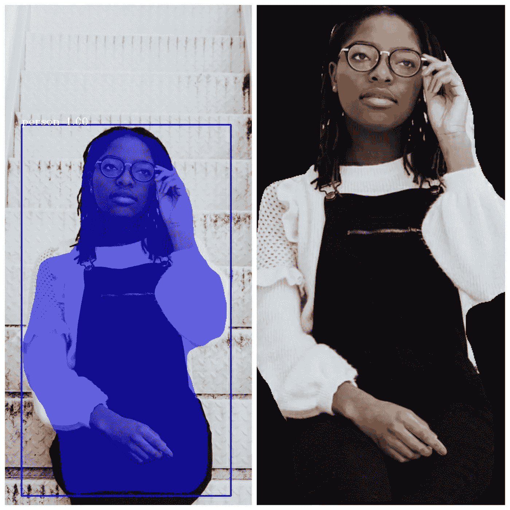

Joanna Nix-Walkup 在 Unsplash 上拍摄的原始照片

计算机视觉是计算机看到和识别物体的媒介。计算机视觉的目标是使计算机能够分析图像和视频中的对象，解决不同的视觉问题。对象分割为方便地分析图像和视频中的对象铺平了道路，为不同领域做出了巨大贡献，如医学、自动驾驶汽车中的视觉以及图像和视频中的背景编辑。

PixelLib 是一个为在现实生活应用中轻松集成图像和视频分割而创建的库。PixelLib 采用了强大的对象分割技术，使每个人都可以使用计算机视觉。我很兴奋地宣布，PixelLib 的新版本使计算机视觉中的对象分析比以往任何时候都更容易。PixelLib 使用分段技术，通过五行代码实现图像和视频中的对象提取。

**安装 PixelLib 及其依赖项:**

安装 Tensorflow 与:(PixelLib 支持 tensorflow 2.0 及以上版本)

*   *pip3 安装张量流*

安装 PixelLib 与

*   *pip3 安装 pixellib*

如果已安装，请使用以下工具升级至最新版本:

*   *pip3 安装 pixellib —升级*

**使用掩模 R-CNN COCO 模型提取图像中的对象**

```
import pixellibfrom pixellib.instance import instance_segmentationsegment_image=instance_segmentation()
segment_image.load_model(“mask_rcnn_coco.h5”)
```

**line 1–4:**我们导入了 PixelLib 包，创建了 ***实例分段类*** 的一个实例，并加载了预训练的 Coco 模型。从[这里](https://github.com/ayoolaolafenwa/PixelLib/releases/download/1.2/mask_rcnn_coco.h5)下载模型。

```
segment_image.segmentImage("image_path", extract_segmented_objects=True,                       save_extracted_objects=True, show_bboxes=True,  output_image_name="output.jpg")
```

这是代码的最后一行，在这里我们用下面的参数调用函数 ***segmentImage*** :

**图像路径:**这是要分割的图像的路径。

**extract _ segmented _ objects:**该参数告诉函数提取图像中分割的对象，设置为 ***true*** 。

**保存提取对象:**这是保存提取的分割对象的可选参数。

这是用边界框显示分段对象的参数。如果设置为 false，则仅显示分段掩码。

**输出图像名称:**这是保存输出图像的路径。

*样本图像*

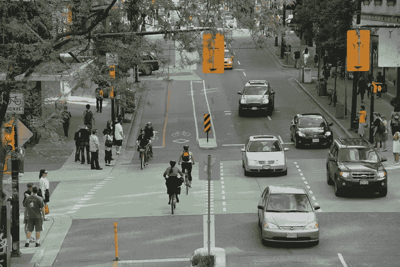

来源:保罗·克鲁格(CCO)

**物体提取的全部代码**

*输出图像*

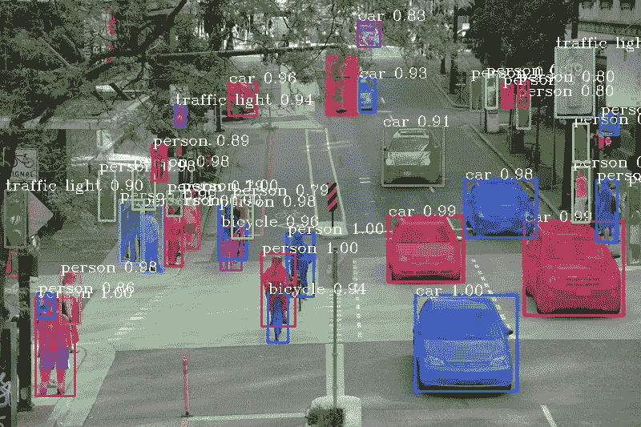

*从图像中提取物体*

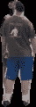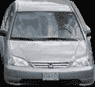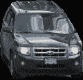

**注:**图像中的所有对象都被单独提取并保存为一幅图像。我只展示了其中的一些。

## Coco 模型中特定类的分割

我们使用一个预先训练的掩模 R-CNN coco 模型来执行图像分割。coco 模型支持 80 类对象，但在某些应用中，我们可能不想分割它支持的所有对象。因此，PixelLib 使得过滤未使用的检测和分割特定类别成为可能。

**修改了用于分割特定类别的代码**

```
target_classes = segment_image.select_target_classes(person=True)
```

除了我们调用了一个新的函数 ***select_target_classes、*** 来过滤未使用的检测并只分割我们的目标类 ***person*** *之外，它还是相同的代码。*

```
segment_image.segmentImage("sample.jpg", segment_target_classes=target_classes, extract_segmented_objects=True,save_extracted_objects=True, show_bboxes=True,  output_image_name="output.jpg")
```

在 ***segmentImage*** 函数中我们引入了一个新的参数叫做***segment _ target _ classes，*** 来对目标类执行分割从***select _ target _ classes****函数 ***中调用。****

*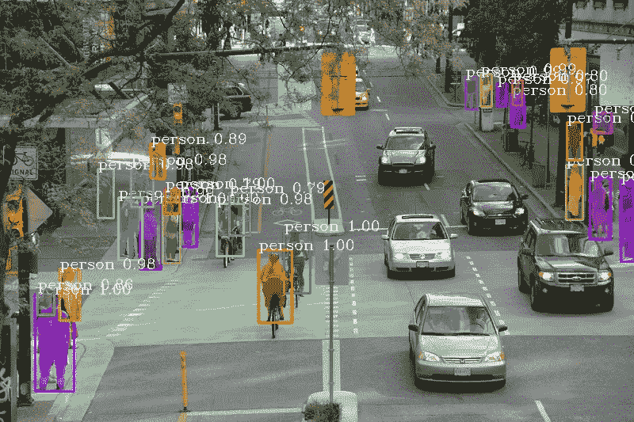*

> *哇！我们只能检测到这张照片中的人。*
> 
> *如果我们只对检测照片中人的交通工具感兴趣呢？*

```
*target_classes = segment_image.select_target_classes(car=True, bicycle = True)*
```

*我们把目标阶级从 ***人*** 改为 ***车*** 和 ***自行车*** *。**

**

> *漂亮的结果！我们在这张照片中只发现了自行车和汽车。*

***注意:**如果您过滤 coco 模型检测，将提取图像中分割的目标类别的对象。*

# *基于 Coco 模型的视频对象提取*

*PixelLib 支持提取视频和相机馈送中的分段对象。*

**样本视频**

```
*segment_video.process_video("sample.mp4", show_bboxes=True,  extract_segmented_objects=True,save_extracted_objects=True, frames_per_second= 5,  output_video_name="output.mp4")*
```

*还是一样的代码，只是我们把函数从 ***segmentImage*** 改成了***process _ video***。它采用以下参数:*

*   *这是显示带有边界框的分段对象的参数。如果设置为 false，则仅显示分段掩码。*
*   ****每秒帧数:*** 该参数设置保存的视频文件每秒帧数。在这种情况下，它被设置为 5，即保存的视频文件每秒将有 5 帧。*
*   ***extract _ segmented _ objects:**该参数告诉函数提取图像中分割的对象，设置为 ***true*** 。*
*   ***保存提取对象:**可选参数，用于保存提取的分割对象。*
*   ****输出 _ 视频 _ 名称:*** 这是保存的分段视频的名称*。**

**输出视频**

**从视频*中提取 *物体**

**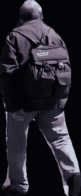****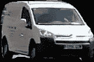****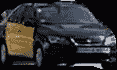**

****注:**视频中的所有对象都被提取出来，单独保存为一幅图像。我只展示了其中的一部分。**

****视频中特定类别的分割****

**PixelLib 可以过滤未使用的检测，并分割视频和摄像机馈送中的特定类别。**

```
**target_classes = segment_video.select_target_classes(person=True)segment_video.process_video("sample.mp4", show_bboxes=True, segment_target_classes= target_classes, extract_segmented_objects=True,save_extracted_objects=True, frames_per_second= 5,  output_video_name="output.mp4")**
```

> **用于检测的目标类别被设置为**人**，并且我们能够仅分割视频中的人。**

```
**target_classes = segment_video.select_target_classes(car = True)segment_video.process_video("sample.mp4", show_bboxes=True, segment_target_classes= target_classes, extract_segmented_objects=True,save_extracted_objects=True, frames_per_second= 5,  output_video_name="output.mp4")**
```

> **分割的目标类别设置为**汽车**，我们只能分割视频中的汽车。**

****视频中分割特定类别和对象提取的完整代码****

****用于在相机馈送中分割特定类别和对象提取的完整代码****

```
**import cv2 capture = cv2.VideoCapture(0)**
```

**我们导入了 cv2 并包含了捕捉相机帧的代码。**

```
**segment_camera.process_camera(capture, show_bboxes=True, show_frames=True, extract_segmented_objects=True, save_extracted_objects=True,frame_name="frame", frames_per_second=5, output_video_name="output.mp4")**
```

**在执行分段的代码中，我们替换了要捕获的视频文件路径，也就是说，我们正在处理摄像机捕获的帧流。我们添加了额外的参数来显示相机的帧:**

*   ***show_frames:* 这是处理分段摄像机帧显示的参数。**
*   ***帧名:*这是显示的摄像机帧的名称。**

# **使用用 PixelLib 训练的定制模型提取图像中的对象**

**PixelLib 支持定制分割模型的训练，并且可以提取用定制模型分割的对象。**

```
**import pixellib
from pixellib.instance import custom_segmentation segment_image = custom_segmentation()segment_image.inferConfig(num_classes=2, class_names=['BG', 'butterfly', 'squirrel'])
segment_image.load_model("Nature_model_resnet101.h5")**
```

****line 1–4:**我们导入了 PixelLib 包，创建了 ***自定义*** ***分段类*** *，*调用了推理配置函数(*I****nferConfig*)**并加载了自定义模型。从[这里](https://github.com/ayoolaolafenwa/PixelLib/releases/download/1.0.0/Nature_model_resnet101.h5)下载定制模型。自定义模型支持以下两个类:**

*   *****蝴蝶*****
*   *****松鼠*****

```
**segment_image.segmentImage("image_path", extract_segmented_objects=True,                       ave_extracted_objects=True, show_bboxes=True,  output_image_name="output.jpg")**
```

**我们调用相同的函数 ***segmentImage*** 用于 coco 模型检测。**

****使用自定义模型进行对象提取的完整代码****

***样本图像***

**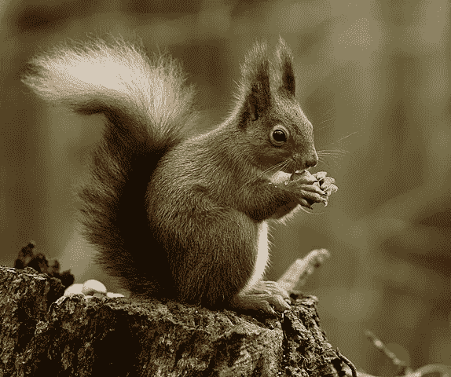**

**来源:[作者:维基公共网站(CCO)的彼得·切林](https://commons.wikimedia.org/wiki/File:Squirrel_posing.jpg)**

***输出***

**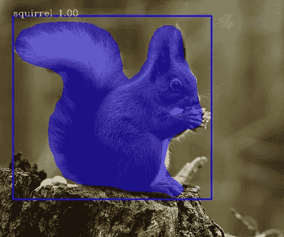**

***从图像中提取物体***

**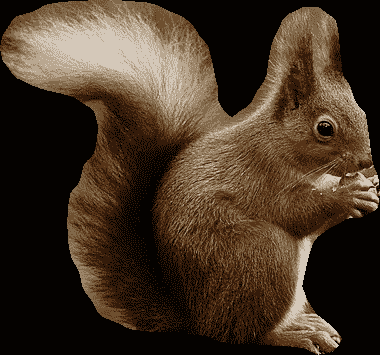**

# **使用用 PixelLib 训练的定制模型提取视频中的对象**

***样本视频***

****使用自定义模型在视频中提取对象的完整代码。****

***输出***

***提取对象***

**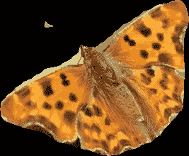****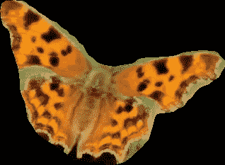**

****使用自定义模型在摄像机输入中提取对象的完整代码****

**阅读本文，了解如何使用 PixelLib 训练一个定制模型。**

**[](/custom-instance-segmentation-training-with-7-lines-of-code-ff340851e99b) [## 用 7 行代码进行自定义实例分段训练。

towardsdatascience.com](/custom-instance-segmentation-training-with-7-lines-of-code-ff340851e99b) 

> [访问 PixelLib 的官方 github 库](https://github.com/ayoolaolafenwa/PixelLib)
> 
> [访问 PixelLib 的官方文档](https://pixellib.readthedocs.io/en/latest/)

通过以下方式联系我:

邮件:[olafenwaayoola@gmail.com](https://mail.google.com/mail/u/0/#inbox)

推特: [@AyoolaOlafenwa](https://twitter.com/AyoolaOlafenwa)

脸书:[阿尤拉·奥拉芬娃](https://web.facebook.com/ayofen)

Linkedin: [阿尤拉·奥拉芬娃](https://www.linkedin.com/in/ayoola-olafenwa-003b901a9/)

查看这些关于如何利用 PixelLib 在图像和视频中进行语义分割、实例分割和背景编辑的文章。

[](/image-segmentation-with-six-lines-0f-code-acb870a462e8) [## 用 5 行代码实现图像分割

towardsdatascience.com](/image-segmentation-with-six-lines-0f-code-acb870a462e8) [](/video-segmentation-with-5-lines-of-code-87f798afb93) [## 用 5 行代码实现视频分割

### 视频的语义和实例分割。

towardsdatascience.com](/video-segmentation-with-5-lines-of-code-87f798afb93) [](/semantic-segmentation-of-150-classes-of-objects-with-5-lines-of-code-7f244fa96b6c) [## 用 5 行代码对 150 类对象进行语义分割

### 用 PixelLib 对 150 类对象进行语义分割

towardsdatascience.com](/semantic-segmentation-of-150-classes-of-objects-with-5-lines-of-code-7f244fa96b6c) [](/change-the-background-of-any-image-with-5-lines-of-code-23a0ef10ce9a) [## 用 5 行代码改变任何图像的背景

towardsdatascience.com](/change-the-background-of-any-image-with-5-lines-of-code-23a0ef10ce9a) [](/change-the-background-of-any-video-with-5-lines-of-code-7cc847394f5d) [## 用 5 行代码改变任何视频的背景

### 使用 PixelLib 对视频进行模糊、彩色、灰度处理并创建虚拟背景

towardsdatascience.com](/change-the-background-of-any-video-with-5-lines-of-code-7cc847394f5d)**