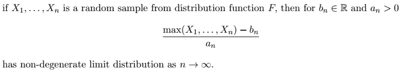
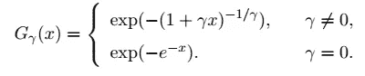
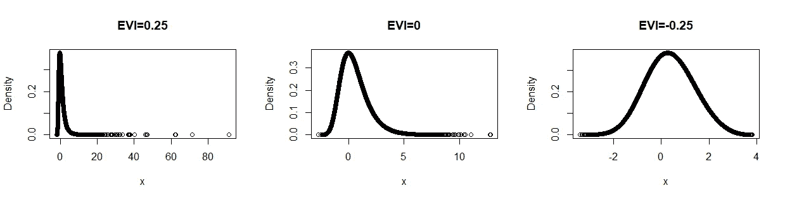
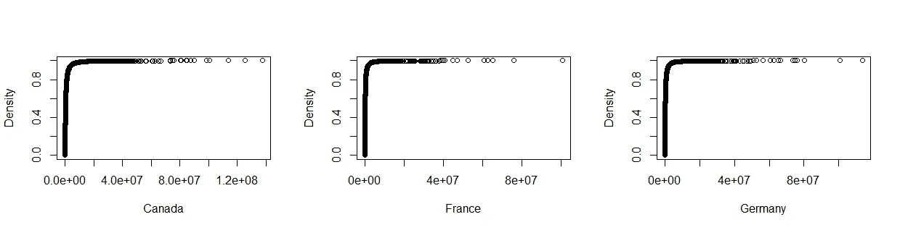
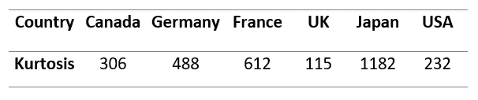
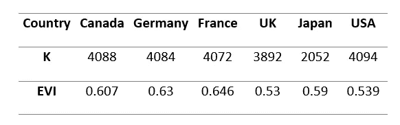

# 简而言之，极值理论有各种应用

> 原文：<https://towardsdatascience.com/extreme-value-theory-in-a-nutshell-with-various-applications-3260b6a84316?source=collection_archive---------13----------------------->

图片由 Bálint Szabó on Unsplash 提供

## [实践教程](https://towardsdatascience.com/tagged/hands-on-tutorials)

在 18 世纪，当统计学被发现用来回答与赌博获胜几率相关的问题时，正态分布是一个非常令人满意的工具。对于其他各种情况，您可能有兴趣研究大事件的影响，以进一步了解和未来的预期，正态分布不会做工作！。许多数据都符合这一描述，例如，您需要研究重大财务损失的影响并获得其发生概率的财务数据。由于这种事件很少发生，正态分布会忽略它，因为它不会发生，而**极值理论(EVT)** 似乎可以通过突出数据的极端部分来解决这一问题，并单独建模以回答与极端事件相关的问题。

正如统计学中的任何表达都有**【理论】**这个词一样，给人一种装满复杂/未触及内容的黑匣子的印象，这与 EVT 的名声是一样的。在这篇文章中，我们将预览各种应用程序的 EVT 的简化介绍，**最后你会对 EVT 有个大概的了解，为什么以及何时需要使用它？！**。

# 概观

这篇文章内容如下

*   EVT 简介。
*   列出了实现 EVT 的不同应用程序。
*   与 EVT 相关的主要软件包，应用于 YouTube 趋势视频数据。

# 介绍

“In cauda venenum”是你在劳伦斯·德·汉和安娜·费雷拉所著的《极值理论:导论》一书中看到的第一句话，这句话很能表达应用 EVT 时你将要处理的数据的性质。极端数据通常有更重要的尾部信息，反映真实的行为。**峰度**是简单统计中最适合检测极端数据的度量，其中**高峰度表示重尾分布，而低峰度表示相当轻的尾分布**。峰度仍然不足以获得关于尾部有多重的准确信息，端点的估计(如果可能的话)，..等。

作者图片

根据 EVT，对于被视为和分析为极端数据的数据，其样本最大值必须具有极限分布。从统计学上来说

弗雷歇、罗纳德·费雪、伦纳德·蒂皮特、理查德·冯·米塞斯和鲍里斯·格涅登科建立的 EVT 理论和基本原理。它们规定了样本最大值的一组非退化极限分布，

显然，这类分布取决于一个主要参数，即所谓的**极值指数(EVI)** ，这是理解极限分布性质的关键参数。EVI 将极值分布的一般类别分为三个子类:

作者图片

*   **正 EVI** 表示要和*分布的无限端点*，那表示你正在和**重尾分布**打交道。
*   **零 EVI** 意味着分布*端点等于无穷大*，这是指**轻尾分布**。
*   **负 EVI** 是指*端点为负的 EVI* 的可逆分布，表示**短尾分布。**

通常，极端分析从相对较大的数据开始，然后缩小规模，只分析极端观察值。选择这些观测值的方法主要有两种，分别是**块最大值法**和**峰值超过阈值** (POT)法。**块最大值法** *将数据分成若干块，得到每个块的最大值*。它需要非常大的数据集来拥有足够数量的块。 **POT 方法**是对极端事件建模的更现代的方法，它通过*指定某个* ***高阈值*** *并在分析*中考虑该点以上的所有观察值。在盆栽法中，找到阈值总是很关键的，有许多方法可以找到阈值，例如 Hill 图。

# 应用程序

从介绍中，你可能对使用极端分析的案例有所了解。简而言之，当您有兴趣查看数据中可能从未发生过的极端/不规则事件时，峭度这一简单工具可能会给出提示。但是如果还不清楚，也不用着急！在这里，我会给你几个真实的应用和他们的结论，以及 EVT 是如何被纳入分析。

图片由 [Hermes Rivera](https://unsplash.com/@hermez777) 在 Unsplash 上拍摄

**一、人类寿命的极限**

此应用程序考虑 1986 年至 2015 年间死亡的荷兰居民的死亡年龄数据。基于这些数据，他们想确定人类寿命的极限？！。使用 POT 方法，通过最大似然估计器估计，女性和男性的 EVI 均为负值，这强烈表明年龄分布存在有限终点。然后，终点估计为女性 124 岁，男性 125 岁。关于分析和数据的详细信息，你可以查阅《T2 通过极值理论对人类寿命的限制》一文。

图片由[布拉登·科拉姆](https://unsplash.com/@bradencollum)在 Unsplash 上拍摄

**二。极限运动记录**

为了回答这个问题，收集了关于跑步、投掷和跳跃的运动记录数据，**每项特定运动的最终记录是多少？！**。他们首先通过矩估计量来估计 EVI，对于大多数事件，矩估计量变成负值，这表明具有有限的终点。然后基于估计的 EVI 来估计终点。更详细的内容可以在论文 [**中通过极值理论**](https://www.janmagnus.nl/papers/JRM082.pdf) 记录田径运动。

由 Thom Milkovic 在 Unsplash 上拍摄的图片

**三。堤坝高度**

这被认为是 EVT 最著名的应用之一。在荷兰，众所周知，几乎 40%的国土低于海平面。确保国家免受 1953 年发生的那种可能的洪灾是非常重要的。然后，EVT 需要回答一个重要的问题:**在一年内发生洪水的概率很小的情况下，堤坝应该有多高？！。**通过收集 100 年的风暴数据，他们通过估计堤坝高度的极端分位数来回答这个问题，假设洪水的概率是 0.0001。

杰夫·亨德里克斯在 Unsplash 上拍摄的图片

**四。摩天大楼**

另一个有趣的应用是**对摩天大楼的数据建模，并检查它们的高度和层数的限制**。全球摩天大楼的数据来自高层建筑和城市人居委员会(CTBUH)。摩天大楼的数量分布符合对数线性模型。进行 EVT 分析以预测极限高度和楼层数。 [**用极值理论预测城市天际线**](https://arxiv.org/pdf/1808.01514.pdf) 文中有详细的分析和结果。

图片由 [Pepi Stojanovski](https://unsplash.com/@timbatec) 在 Unsplash 上拍摄

**五、风险管理**

在这里，我不会举出一个具体的应用，因为有几个与保险和银行领域的风险管理相关的应用使用 EVT。a 一个关键工具是风险价值和预期短缺，这两个工具都用于根据极端情况评估偿付能力。对于这些领域还有更多其他的 EVT 工具和实现，可以查看 [**极值理论作为风险管理工具**](https://www.casact.org/library/studynotes/Embrechts_ExtremeValue.pdf) 进行进一步的讨论和应用。

其他应用可以在诸如[网络](https://journals.aps.org/prresearch/abstract/10.1103/PhysRevResearch.1.033034)、[分类](https://medium.com/cognigo/reducing-uncertainty-in-document-classification-with-extreme-value-theory-97508ebd76f)、..等。

# **R 包和 YouTube 数据上的实现**

现在到了“你需要知道自己怎么做！”为此，我将给出 R 中与 EVT 相关的一些重要函数的源代码，然后我将讨论实际数据的实现。r 因为一个繁荣的统计软件包是一些准备好的与极端相关的软件包的好地方，你可以检查由 Christophe Dutang 和 Kevin Jaunatre 的[极端值分析](https://cran.r-project.org/web/views/ExtremeValue.html)的几个软件包的更新列表。该资源包含与单变量和多变量极值分析相关的主要软件包，其中包含 EVI、极值分位数、模型和重要图的不同估计量。

对于应用程序方面的额外说明和数据处理，我将简要分析 YouTube 上大多数热门视频的真实数据，以了解其分布的尾部。

图片由 Unsplash 上的 [NordWood Themes](https://unsplash.com/@nordwood) 提供

我从 Kaggle 那里获得了关于 YouTube 上不同国家热门视频的[数据。该数据包含关于每个视频的观看次数、喜欢、不喜欢和评论的信息。我主要关心查看视图分布在尾部的特殊表现，并估计其 EVI，以查看所选国家视图分布的尾部有多重。](https://www.kaggle.com/datasnaek/youtube-new)

不同国家 YouTube 上最热门视频的经验性分布

经验分布图显示了数据的一般形状和每个国家的一些极端观察结果，但它没有给出关于极端观察或尾部沉重的明确答案。为了更清楚地了解情况，我估计了每个国家的峰度。

选定国家的峰度

所有峰度都非常高，这可能反映了重尾数据，但由于它主要集中在离群值上，因此最高的峰度可能不反映最重的尾部。现在，为了真正检查尾部的重量，我将估计每个国家的 EVI，以便更清楚地了解所选国家中尾部最重的分布。

EVI 对选定国家的估计

我用 POT 方法用最大似然估计量来估计 EVI。第二行指的是阈值以上的观察次数，被认为是样本量的 10%。估计结果表明，所有被选国家都具有重尾分布，端点为无穷大。从 EVI 估计中，我们可以看到，EVI 最高的最重的尾部在法国，而日本的值较低，尽管日本的峰度较高，这再次支持了之前的陈述，即峰度不足以得出关于数据尾部的结论。基于获得的结果，我有兴趣计算一个非常著名的极端措施，称为**预期短缺。**它提供了***给定视图超过非常高的分位数时的期望视图数，*** 换句话说，它给出了那些超过非常高的视图数(比如大于视图的第 99 个分位数)的视频的期望视图数。

选定国家的预期短缺估计数

如上表所示，英国的最大预期浏览量估计为 1.42 亿，而日本的浏览量最少。如果你点击了👉[在这里](https://github.com/hananahmed1/EVT_app)，您将到达用于产生先前结果的数据和代码。