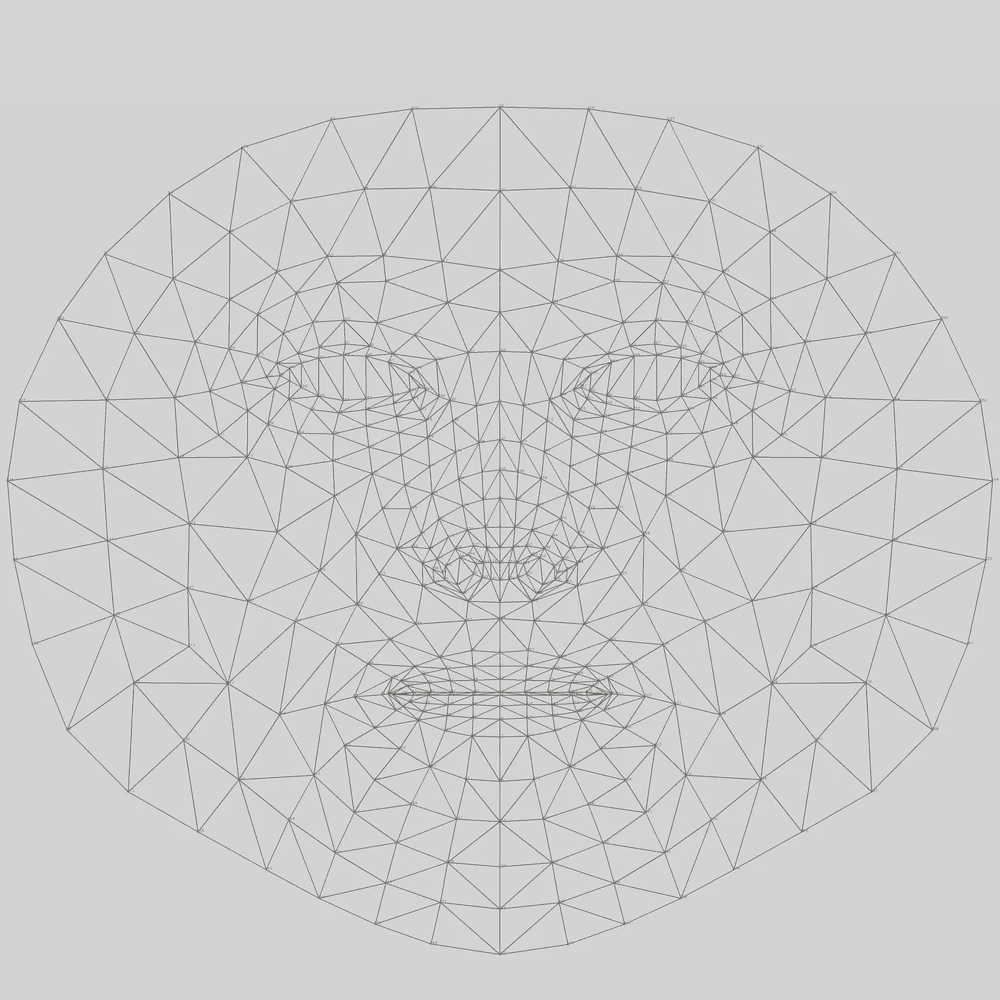

# 基于 Python 的人脸标志点检测

> 原文：<https://towardsdatascience.com/face-landmark-detection-using-python-1964cb620837?source=collection_archive---------2----------------------->

## dlib 和 mediapipe 库的比较。


德米特里·秋科夫在 [Unsplash](https://unsplash.com/s/photos/selfie?utm_source=unsplash&utm_medium=referral&utm_content=creditCopyText) 上的照片

# 介绍

人脸标志点检测是一项计算机视觉任务，我们希望从人脸中检测和跟踪关键点。这项任务适用于许多问题。

例如，我们可以使用关键点来检测人的头部姿势位置和旋转。有了这个，我们就可以追踪司机是否注意了。此外，我们可以使用关键点来更容易地应用增强现实。基于这项任务，我们可以产生很多解决方案。

值得庆幸的是，我们不必详细理解面部标志检测的概念。我们可以使用预先构建的库，如 dlib、OpenCV 和 mediapipe。在本文中，我将向您展示如何使用 dlib 和 mediapipe 实现人脸地标检测。

没有进一步，让我们开始吧！

# 基于 Dlib 的人脸标志点检测

Dlib 是一个应用机器学习和计算机视觉解决方案的库。这个库是基于 C++语言的，但是我们可以使用像 Python 这样的语言来使用这个库。通过使用这个库，我们可以应用的解决方案之一是面部标志检测。现在让我们进入实现阶段。

## 安装库

安装库可能会成为一个问题。如果我们没有好的向导，安装库可能需要几天时间。Dlib 就是其中之一。因为它使用 C++作为主要语言，所以我们必须安装 C++工具来安装库。

安装它需要几个步骤。以下是步骤:

*   首先，安装 CMake。你可以在这里下载软件[](https://cmake.org/download/)**。如果您使用的是 Windows，请先找到 CMake 文件路径。然后，在环境变量中将路径设置为可执行路径。**
*   **然后，安装带有 C++依赖项的 Visual Studio。你可以在这里 下载软件 [**。对于依赖关系，您可以查看下面的截图:**](https://visualstudio.microsoft.com/downloads/)**

****

**截图由作者捕捉**

*   **安装 Visual Studio 后，下一步是安装 Python。为了使您的安装更简单，我推荐您安装 Anaconda。你可以在这里 下载 [**。对于 Python 版本，我建议您使用 3.6.6 版本以避免任何错误。**](https://www.anaconda.com/products/individual-d)**
*   **最后，使用 pip 安装 CMake、dlib 和 OpenCV 库。下面是执行该操作的命令:**

```
**pip install cmake
pip install dlib 
pip install opencv-contrib-python**
```

## **导入库**

**安装完库之后，下一步是将它们导入到我们的代码中。我们将导入 OpenCV 来从网络摄像头获取输入，导入 NumPy 来进行数值计算，导入 Dlib 来检测人脸的关键点。**

**下面是实现这一点的代码:**

## **初始化对象**

**现在让我们初始化几个变量。我们将初始化三个必须需要的变量:**

*   **用于检测一个或多个面部的**检测器**。我们在变量内部设置了**dlib . get _ frontier _ face _ detector**函数。**
*   **用于从面部检测关键点的**预测器**。我们在变量内部设置了 **dlib.shape_predictor** 函数。该功能需要一个预先训练好的模型位置作为参数，您可以在这里 下载 [**。**](https://github.com/italojs/facial-landmarks-recognition/blob/master/shape_predictor_68_face_landmarks.dat)**
*   ****cv2。VideoCapture** 用于从网络摄像头捕捉图像的对象。此外，我们为从网络摄像头捕捉图像设置了一个值为 0 的参数。**

**让我们编写初始化变量的代码:**

## **人脸标志检测机制**

**正如你从上面看到的，我们通过使用预训练模型来初始化面部标志检测器。该模型基于集合回归树，因为该模型将预测连续的数字。你可以在这里 阅读关于 [**车型的详细信息。**](http://kth.diva-portal.org/smash/get/diva2:713097/FULLTEXT01)**

**该模型在 iBUG-300 W 数据集上进行训练，其中包含图像及其对应的 68 个面部标志点。一般来说，这些标志点属于鼻子、眼睛、嘴和脸的边缘。你可以在这里 下载数据集 [**。**](https://ibug.doc.ic.ac.uk/resources/facial-point-annotations/)**

**下面是面部标志位置的可视化:**

****

**这张图片是由来自 CMU 的 Brandon Amos 创建的**

## **实现人脸标志点检测**

**现在你知道面部标志检测算法是如何工作的了。现在让我们实现算法。为了实现这一点，您可以查看下面的代码以及每行代码的解释:**

**通过将所有代码组合成一个，现在让我们来尝试代码！如果代码没有任何错误，网络摄像头将显示结果以及关键点。我的情况是这样的:**

****

**该图像由作者捕获。**

# **基于 Mediapipe 的人脸标志检测**

**Mediapipe 是一个实现基于 ML 的计算机视觉解决方案的工具。这个工具是由谷歌开发的。**

**这个工具包含各种计算机视觉解决方案，如人脸检测，姿态估计，物体检测等等。**

**这个库的优点是你可以在很多平台上应用这些解决方案，比如 web、移动、PC 等等。**

**在上一节中，我已经向您解释了如何使用 dlib 实现面部标志检测。现在让我们使用 Mediapipe 实现面部标志检测。**

## **该机制**

**该库使用 BlazeFace 模型来检测面部标志。BlazeFace 是一个深度学习模型，已经针对智能手机等低规格设备进行了优化。因此，我们可以实时使用该模型。**

**BlazeFace 包含两个主要步骤。首先，该模型检测图像上的一个或多个人脸。第二，图像通过使用回归检测大约 468 个面部关键点。**

**与 dlib 库不同的是，这个模型检测的是 3D 坐标。这些 x 和 y 坐标是根据图像比例归一化的。通过进行屏幕和模型 x 坐标之间的相对计算来检索 z 坐标。更多详情 [**可点击**](https://google.github.io/mediapipe/solutions/face_mesh.html) 阅读。**

**下面是一个面的展平网格及其相应的索引:**

****

**图片摘自 TensorFlow 的 [**GitHub 资源库**](https://github.com/tensorflow/tfjs-models/tree/master/facemesh) **。****

## **实现人脸标志点检测**

**一般来说，实现面部标志检测的管道与 dlib 库相同。它从导入库、初始化对象、检测人脸及其标志开始，并完成。**

**下面是实现这一点的代码:**

**如果您正确实现了代码，图像将显示在您的计算机上。以下是我的结果预览:**

****

**该图像由作者捕获。**

# **比较**

**我们已经使用 dlib 和 mediapipe 浏览了人脸标志检测库。我们可以说两个库都很好用。因此，我们可以快速构建我们的解决方案。**

**然而，它们之间存在差异。dlib 库需要 C++依赖它。这就是为什么我们需要 CMake 和 Visual Studio 来安装这个库。**

**此外，这个库需要一个特定的 python 库。因此，如果没有受支持的 Python 版本来运行库，就必须创建一个虚拟环境。**

**另一方面，安装 mediapipe 更容易。你只需要从 pip 安装就可以了。因此，在使用 mediapipe 时，您不必担心更多的安装问题。**

**在这种情况下，dlib 只能检测关键点的 2D 坐标。另一方面，媒体管道可以检测关键点的 3D 坐标。因此，您可以使用 mediapipe 库中的这些关键点来估计头部姿势。**

# **结束语**

**干得好！现在你知道如何使用 Python 实现人脸标志检测了。我已经向您展示了用于实现该解决方案的库，如 dlib 和 mediapipe。**

**我希望它能帮助你实现一个计算机视觉解决方案。还有，我希望它能成为你构建更复杂应用的基础。**

**如果你对我的文章感兴趣，你可以在 Medium 上关注我，看更多这样的文章。还有，如果你有什么问题，可以在 [**LinkedIn**](https://www.linkedin.com/in/alghaniirfan/) 联系我。**

**谢谢你看我的文章！**

## **参考**

**[1][https://www . pyimagesearch . com/2017/04/03/face-landmarks-DLI b-opencv-python/](https://www.pyimagesearch.com/2017/04/03/facial-landmarks-dlib-opencv-python/)
[https://www . analyticsvidhya . com/blog/2021/07/face-landmark-detection-simplified-with-opencv/](https://www.analyticsvidhya.com/blog/2021/07/facial-landmark-detection-simplified-with-opencv/)**