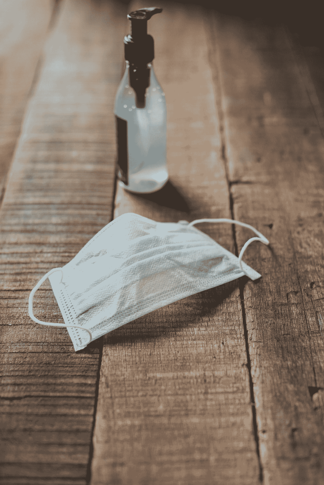
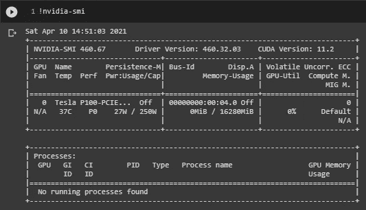
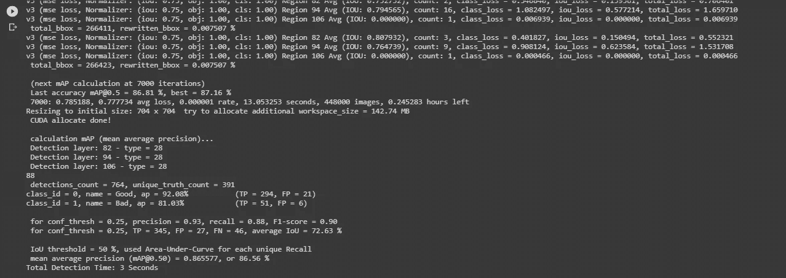
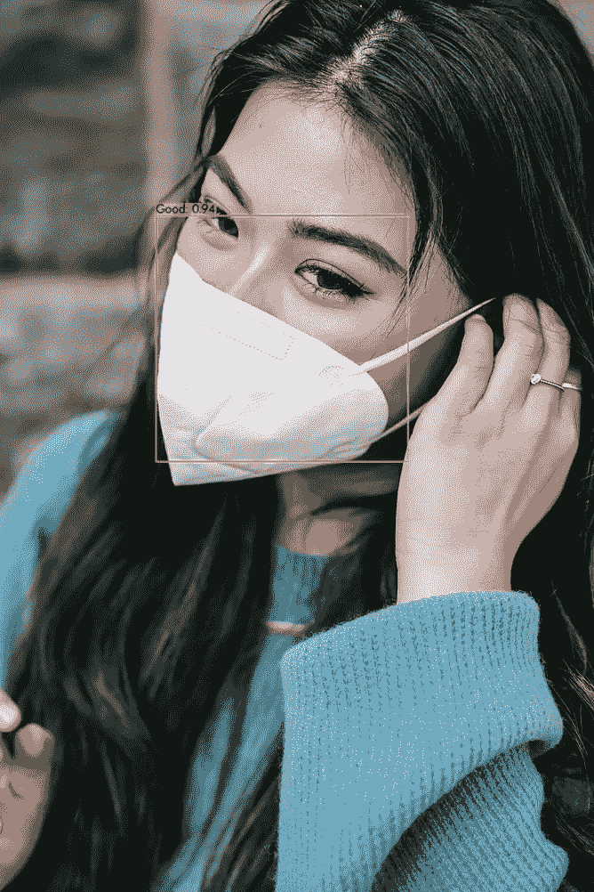
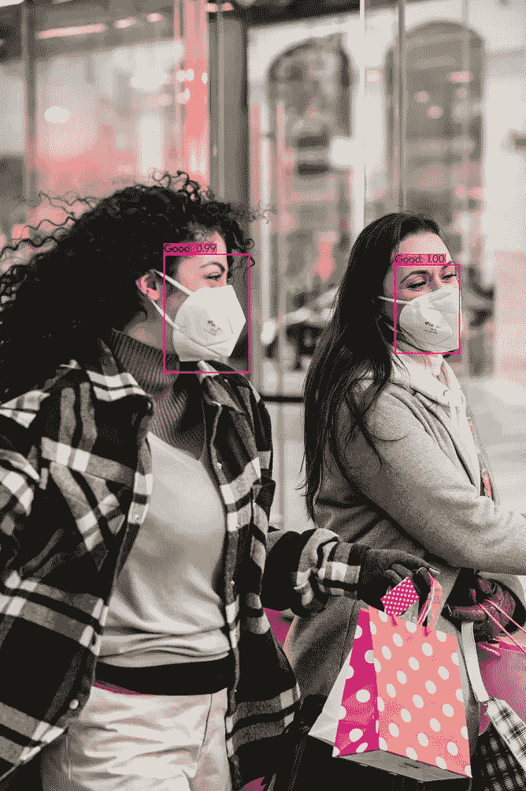
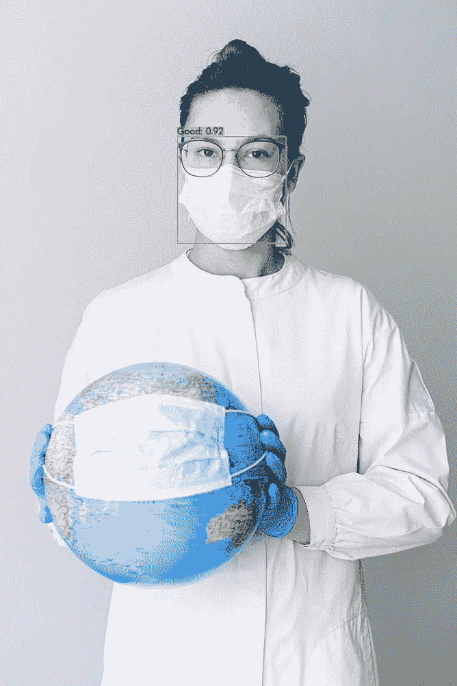
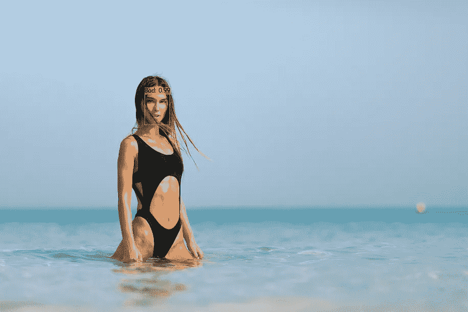
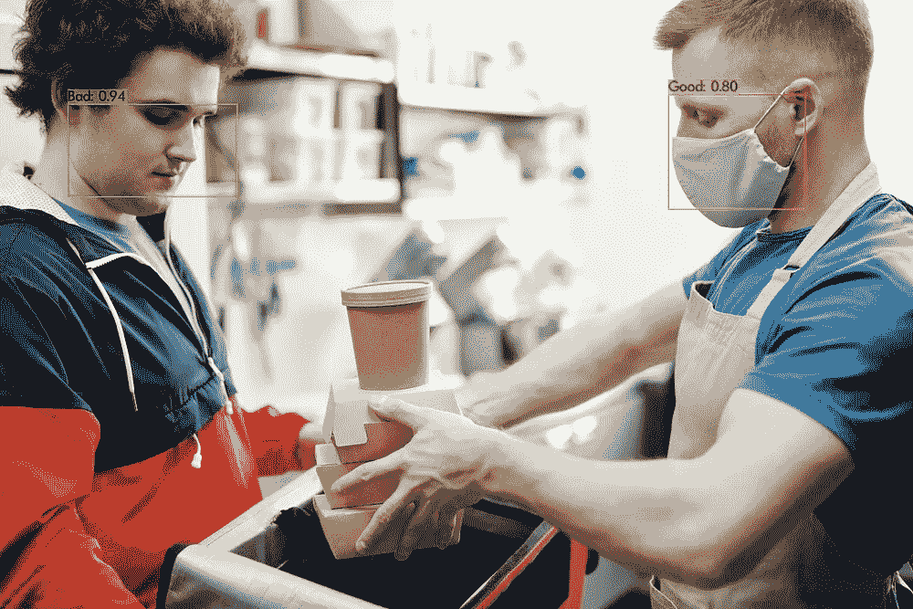
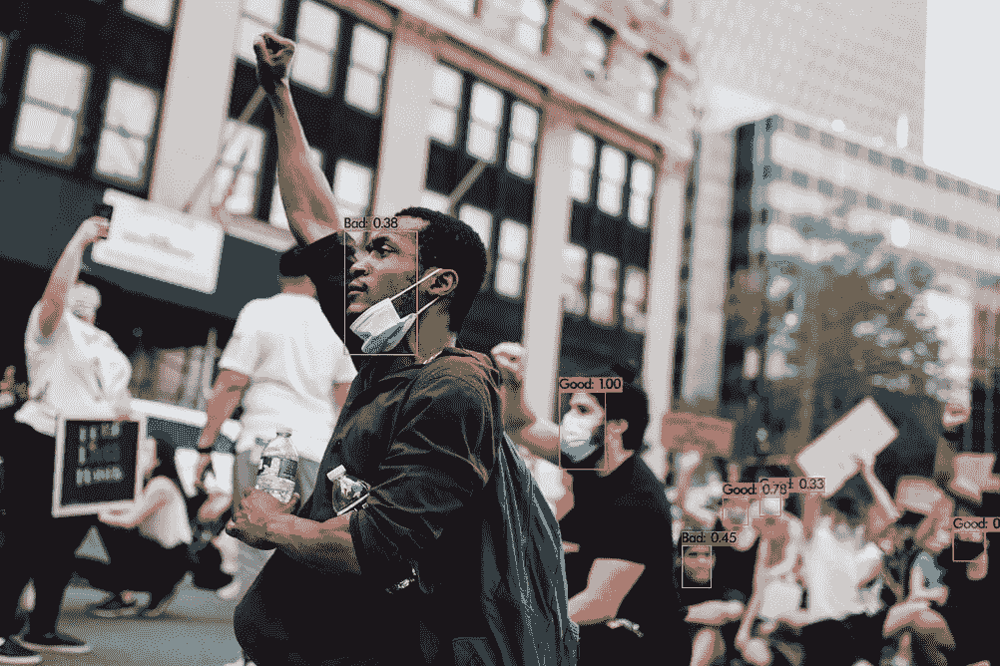
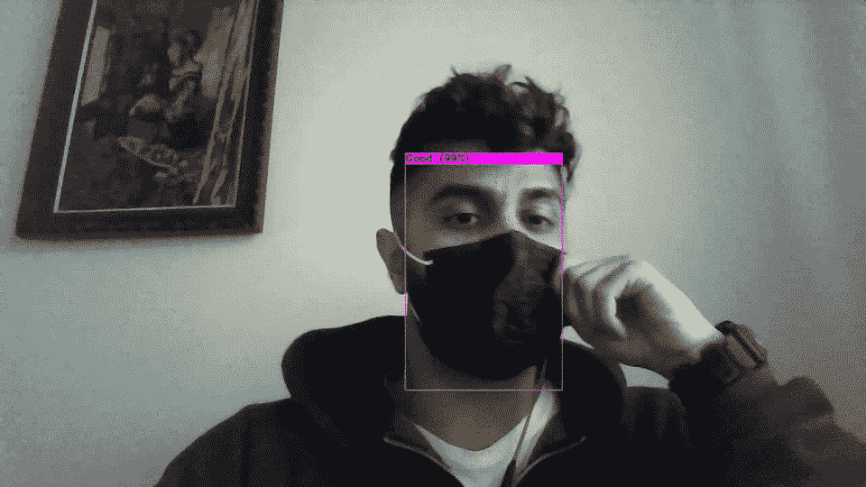

# 使用 darknet 的 YOLOv3 进行面具检测

> 原文：<https://towardsdatascience.com/face-mask-detection-using-darknets-yolov3-84cde488e5a1?source=collection_archive---------9----------------------->

## 新冠肺炎:如何使用 YOLOv3 构建面具检测器的教程。*为了便于推断，视频流和图像都可以使用。

这篇文章旨在为那些想要训练来自 YOLO 家族的物体探测器的人提供完整的指南(一步一步)。由于疫情，这样的任务似乎很热门。

对于本教程，我将使用 [YOLOv3](https://github.com/AlexeyAB/darknet) ，这是 YOLO 家族最常用的版本之一，它包含了用于实时场景的最先进的对象检测系统，它的准确性和速度令人惊讶。YOLOv4、YOLOv5 等新版本可能会获得更好的结果，在我的下一篇文章中，我还将尝试这些架构，并与您分享我的发现。

假设你已经掌握了使用深度学习技术的物体检测，特别是你知道关于 YOLO 的基础知识，让我们开始我们的任务…



在 [Unsplash](https://unsplash.com?utm_source=medium&utm_medium=referral) 上[安舒 A](https://unsplash.com/@anshu18?utm_source=medium&utm_medium=referral) 的照片

你可以在我的 Github [repo](https://github.com/skanelo/Face-Mask-Detection) 上找到这个上传的项目。

# 环境🌠

为了实现这个项目，我利用了 Google Colab 的资源。我的第一个预处理步骤实验是在我的笔记本电脑上进行的，因为它们的计算成本不高，但是模型是在 Colab 上使用 **GPU** 进行训练的。



在 Colab 上通过**编辑** - > **笔记本设置**有人可以激活 **GPU，**我*法师作者*

# 资料组📚

首先，为了构建一个掩膜检测器，我们需要相关数据。此外，由于 YOLO 的性质，我们需要带边界框的注释数据。一种选择是通过从网上或通过拍摄朋友/熟人的照片收集图像来建立我们自己的数据集，并使用特定的程序如 [LabelImg](https://github.com/tzutalin/labelImg) 手工注释它们。然而，这两种想法都非常乏味和耗时(尤其是后者)。另一个选项，也是目前为止对我来说最可行的，是使用公开可用的数据集。我从 Kaggle 中选择了[人脸面具检测数据集，并将其直接下载到我的 Google Drive 中(你可以在这里](https://www.kaggle.com/andrewmvd/face-mask-detection)[查看如何做](https://laptrinhx.com/how-to-download-kaggle-datasets-into-google-colab-via-google-drive-1107891156/))。下载的数据集包含两个文件夹:

*   **图像**，包含 853。png 文件
*   **注解**，包含 853 个对应。xml 注释。

下载数据集后，我们需要将。xml 文件转换成。更准确地说，我们需要创建 YOLO 格式来训练我们的模型。下面显示了一个示例:

假设这是一个只包含 3 个边界框的图像的注释(这可以从中的 … 跨度的数量看出)。xml 格式。

为了创建一个. txt 文件，我们需要从每一个 5 件事。xml 文件。对于 an 中的每个 *<对象>…</对象>* 。xml 文件取数**类**(即*名称>…</名称>* 字段)，以及**边界框**的坐标(即*<bnd box>…</bnd box>*中的 4 个属性)。理想的格式如下所示:

`<class_name> <x_center> <y_center> <width> <height>`

然而，为了实现这一点，我创建了一个[脚本](https://github.com/skanelo/Face-Mask-Detection/blob/main/xml_to_yolo.py)来获取每个对象的上述 5 个属性。xml 文件并创建相应的。txt 文件。 *(* ***注:*** *更多关于转换的方法的解析步骤可以在我的脚本中找到)。*

例如，`image1.jpg`必须有一个关联的`image1.txt`，包含:

```
1 0.18359375 0.337431693989071 0.05859375 0.10109289617486339
0 0.4013671875 0.3333333333333333 0.080078125 0.12021857923497267
1 0.6689453125 0.3155737704918033 0.068359375 0.13934426229508196
```

而这正是上面的转换。xml 文件转换为. txt 文件。 *(* ***注:*** *将对应的图像分组到同一个文件夹中至关重要。txt 注释)。*

当然，在继续训练之前，我们需要绝对确定转换是正确的，并且我们将为我们的网络提供有效的数据。为此，我创建了一个[脚本](https://github.com/skanelo/Face-Mask-Detection/blob/main/show_bb.py)，它获取一个图像及其对应的。txt 注释，并显示带有基本事实边界框的图像。对于上述示例，图像如下所示:


maksssksksss0.png 来自 [Kaggle 的](https://www.kaggle.com/andrewmvd/face-mask-detection)公开发布的面具检测数据集

这是当我们知道到目前为止我们做得很好，但让我们继续下去…

# 火车测试分裂❇️

为了在训练阶段训练和验证我们的模型，我们必须将数据分成两组，训练组和验证组。比例分别为***90–10%***。因此，我创建了两个新文件夹，将 86 张图片及其相应的注释放入 test_folder，将其余 767 张图片放入 train_folder。

*再忍耐一下，我们需要一些最后的润色，我们已经准备好训练我们的模型了* **😅**


布鲁斯·马斯在 [Unsplash](https://unsplash.com?utm_source=medium&utm_medium=referral) 上的照片

# 克隆暗网框架⬇️

下一步是通过运行以下命令克隆 [**暗网**回购](https://github.com/AlexeyAB/darknet):

```
!git clone [https://github.com/AlexeyAB/darknet](https://github.com/AlexeyAB/darknet)
```

之后，我们需要下载预训练模型的权重，以便应用迁移学习，而不是从头开始训练模型。

```
!wget https://pjreddie.com/media/files/darknet53.conv.74
```

**darknet53.conv.74** 是 YOLOv3 网络的主干，它最初是为 ImageNet 数据集上的分类而训练的，并扮演提取器的角色。为了使用这一点进行检测，在训练之前，随机初始化 YOLOv3 网络中存在的附加权重。但是当然，他们会在训练阶段得到他们应有的价值观。

# 最后一步🚨

我们需要创建 5 个文件来完成我们的准备工作，并开始训练模型。

1.  **face_mask.names** :创建文件 _ *。包含问题类别的名称*。在我们的例子中，原始 Kaggle 数据集有 3 个类别:*带 _ 掩码*、*不带 _ 掩码*和*掩码 _ 磨损 _ 不正确。为了简化任务，我将后两个类别合并成一个。因此，对于我们的任务，我们根据某人是否恰当地佩戴了她的/他的面具，将**分为两个**类别:*好*和*坏*。*

```
1\. Good
2\. Bad
```

2. **face_mask.data** :创建一个 _ *。数据*文件，包含与我们的问题相关的信息，将在程序中使用:

```
classes = 2
train = data/train.txt
valid  = data/test.txt
names = data/face_mask.names
backup = backup/
```

***注:*** *如果没有备份文件夹，就创建一个，因为每 1000 次迭代后都会保存权重。这些实际上是你的检查点，以防意外中断，从那里你可以继续训练过程。*

3. **face_mask.cfg** :这个配置文件必须根据我们的问题进行调整，即我们需要复制 yolov3.cfg，将其重命名为 *_。cfg* 并应用如下所述的修正:

*   将生产线批次更改为[批次=64](https://gist.github.com/skanelo/794ce78fdd136bff336a478644c0e736#file-face_mask-cfg-L6)
*   将行细分改为[细分=16](https://gist.github.com/skanelo/794ce78fdd136bff336a478644c0e736#file-face_mask-cfg-L7) ( ***注:*** *如果出现内存不足问题，将该值增加到 32 或 64* )
*   将输入尺寸更改为默认的*宽度=416* ，*高度=416。(* ***注*** *:就我个人而言，我从这个分辨率开始，对我的模型进行了 4000 次迭代的训练，但为了实现更准确的预测，我* [*提高了分辨率*](https://github.com/AlexeyAB/darknet#how-to-improve-object-detection) *，并继续了 3000 次迭代的训练过程*)。
*   将行 [max_batches](https://gist.github.com/skanelo/794ce78fdd136bff336a478644c0e736#file-face_mask-cfg-L20) 改为(#classes * 2000)，这样我们的任务 *(* ***注*** *)就有 4000 次迭代:如果你只有一个***类别，你不应该只训练你的模型 2000 次迭代。建议 4000 次迭代是模型的最小迭代次数)*。*
*   *将生产线步长更改为 [max_batches](https://gist.github.com/skanelo/794ce78fdd136bff336a478644c0e736#file-face_mask-cfg-L22) 的 80%和 90%。对于我们的例子，80/100 * 4000 = 3200，90 / 100 * 4000 = 3600。*
*   *使用 ctrl+F 并搜索单词“yolo”。这将把你直接带到 yolo_layers，在那里你想做两件事。更改**类别数量**(对于我们的案例类别=2)并更改[yolo]线上方两个变量的过滤器数量。这个变化必须是**过滤器=(类+ 5) * 3** ，也就是说，对于我们的任务，过滤器= (2 + 5) * 3 = 21。在我们的。cfg 文件，有 3 个 yolo_layers，因此你应该做上述的变化 3 次。*

*4. **train.txt** 例如，我的 train.txt 文件的一个片段如下所示:*

```
*/content/gdrive/MyDrive/face_mask_detection/mask_yolo_train/maksssksksss734.png
/content/gdrive/MyDrive/face_mask_detection/mask_yolo_train/maksssksksss735.png
/content/gdrive/MyDrive/face_mask_detection/mask_yolo_train/maksssksksss736.png
/content/gdrive/MyDrive/face_mask_detection/mask_yolo_train/maksssksksss737.png
/content/gdrive/MyDrive/face_mask_detection/mask_yolo_train/maksssksksss738.png
...*
```

**(* ***注:*** *正如我前面提到的。png 文件应该与它们对应的。txt 注解**

*因此，我们的项目结构如下:*

```
***MyDrive**
├──**darknet**
      ├──...
      ├──**backup**
      ├──...
      ├──**cfg**
            ├──face_mask.cfg ├──...
      ├──**data**
            ├──face_mask.data
            ├──face_mask.names
            ├──train.txt
            ├──test.txt├──**face_mask_detection**
      ├──**annotations** *(contains original .xml files)* ├──**images** *(contains the original .png images)* ├──**mask_yolo_test** *(contains .png % .txt files for testing)* ├──**mask_yolo_train** *(contains .png % .txt files for training)*
      ├── show_bb.py
      └── xml_to_yolo.py*
```

# *让我们开始训练吧📈*

*在我们[编译](https://github.com/AlexeyAB/darknet#how-to-compile-on-linux-using-make)模型之后，我们需要更改相关的权限，如下所示:*

```
*!chmod +x ./darknet*
```

*最后，我们可以从跑步开始训练:*

```
*!./darknet detector train data/face_mask.data cfg/face_mask.cfg backup/face_mask_last.weights -dont_show -i 0 -map*
```

*标志`-map` 会通过打印出平均丢失、精度、召回、平均精度(AP)、平均精度(mAP)等重要指标来通知我们训练的进度。*

**

*作者图片*

*然而，控制台中的 mAP 指示器被认为是比损耗更好的指标，所以在 mAP 增加时进行训练。*

**(* ***注:*** *训练过程可能需要* ***多个小时****……这是正常的。对于这个项目，为了训练我的模型到这一点，我需要大约 15 个小时。但是我在大约 7 个小时内完成了 4000 个步骤的训练，对这个模型有了第一印象*。*

# *测试(和讨论)时间到了🎉*

*是的…模型已经准备好展示了！！！让我们尝试一些它从未见过的图像。为此，我们需要运行:*

```
*!./darknet detector test data/face_mask.data cfg/face_mask.cfg backup/**face_mask_best.weights***
```

*你是否注意到我们使用了 **face_mask_best.weights** 而不是*face _ mask _ final . weights*？幸运的是，我们的模型将最佳权重(**map . 5*****87.16%***被达到)保存在备份文件夹中，以防我们对其进行比它应该的更多的时期的训练(这可能会导致过度拟合)。*

*下面显示的示例取自[像素](https://www.pexels.com/)，是高分辨率图像，用肉眼看，我可以说它们与来自不同点的训练/测试数据集非常不同，因此它们具有不同的分布。我选择这样的图片是为了看看这个模型的概括能力有多强。*

******

***(左)**模特对一张照片的预测[夏洛特梅](https://www.pexels.com/@charlotte-may?utm_content=attributionCopyText&utm_medium=referral&utm_source=pexels)来自[派克斯](https://www.pexels.com/photo/crop-attractive-asian-woman-putting-on-mask-on-street-5965831/?utm_content=attributionCopyText&utm_medium=referral&utm_source=pexels) | **(中)**模特对一张照片的预测[蒂姆道格拉斯](https://www.pexels.com/@tim-douglas?utm_content=attributionCopyText&utm_medium=referral&utm_source=pexels)来自[派克斯](https://www.pexels.com/photo/women-in-masks-with-shopping-bags-walking-on-street-during-coronavirus-6567212/?utm_content=attributionCopyText&utm_medium=referral&utm_source=pexels) | **(右)**模特对一张照片的预测来自[安娜什韦茨](https://www.pexels.com/@shvetsa?utm_content=attributionCopyText&utm_medium=referral&utm_source=pexels)来自[派克斯](https://www.pexels.com/photo/photo-of-person-wearing-protective-wear-while-holding-globe-4167541/?utm_content=attributionCopyText&utm_medium=referral&utm_source=pexels)*

*在上述示例中，模型是准确的，并且对其预测相当有信心。值得注意的是，右边的图像没有将模型与地球上面具的存在混淆。它揭示了这些预测不仅仅是基于面具的存在，还基于它周围的环境。*

****

***(左)**模特对一张照片的预测[金德尔传媒](https://www.pexels.com/@kindelmedia?utm_content=attributionCopyText&utm_medium=referral&utm_source=pexels)发自[佩克斯](https://www.pexels.com/photo/people-smiling-on-the-poolside-7294264/?utm_content=attributionCopyText&utm_medium=referral&utm_source=pexels) | **(右)**模特对一张照片的预测[亚历山大·帕萨里克](https://www.pexels.com/@apasaric?utm_content=attributionCopyText&utm_medium=referral&utm_source=pexels)发自[佩克斯](https://www.pexels.com/photo/woman-wearing-black-monokini-2038014/?utm_content=attributionCopyText&utm_medium=referral&utm_source=pexels)*

*这两个例子清楚地表明，被描绘的人没有戴面具，而且模特也很容易识别这一点。*

****

***(左)**模特对一张照片的预测[诺玛·莫滕森](https://www.pexels.com/@norma-mortenson?utm_content=attributionCopyText&utm_medium=referral&utm_source=pexels)来自[派克斯](https://www.pexels.com/photo/men-putting-food-on-a-thermal-bag-4393665/?utm_content=attributionCopyText&utm_medium=referral&utm_source=pexels) | **(右)**模特对一张照片的预测[生活要紧](https://www.pexels.com/@life-matters-3043471?utm_content=attributionCopyText&utm_medium=referral&utm_source=pexels)来自[派克斯](https://www.pexels.com/photo/man-with-raised-fist-in-a-protest-4614144/?utm_content=attributionCopyText&utm_medium=referral&utm_source=pexels)*

*在上面的两个例子中，我们可以在两个类别都出现的情况下测试模型的性能。该模型甚至可以在模糊的背景中识别人脸，这一事实令人钦佩。我还观察到，与其后面的预测(在模糊区域上为 100%)相比，其不太确定的最前面的预测(在清晰区域上仅为 38%)可能与被训练的数据集的质量有关，因此它似乎在一定程度上受到影响(至少它不是不准确的😅 ).*

## *最后一次测试🐵*

*当然，YOLO 的一大优势是它的速度。出于这个原因，我还想向您展示它在输入视频时是如何工作的:*

```
*!./darknet detector demo data/face_mask.data cfg/face_mask.cfg backup/face_mask_best.weights -dont_show vid1.mp4 -i 0 -out_filename res1.avi*
```

**

*作者对视频流、图像的推断*

# *结论👏*

*这是我的第一个分步教程，介绍如何在自定义数据集上使用 YOLOv3 构建自己的检测器。希望你觉得有用。请随时给我反馈或询问任何相关问题。*

*非常感谢您的宝贵时间！一会儿见…😜*