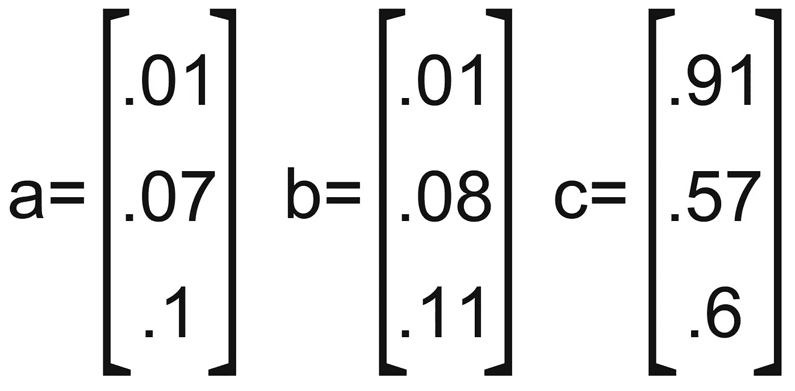
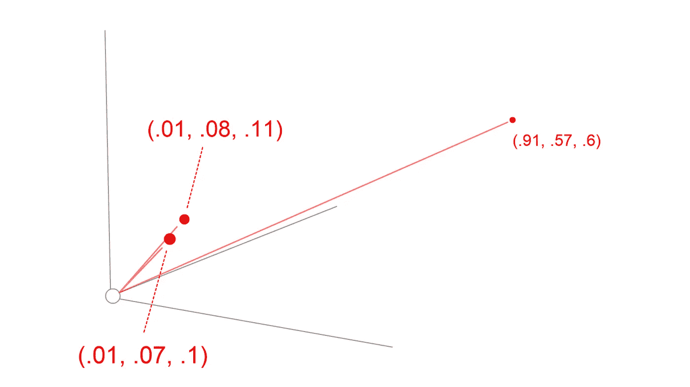
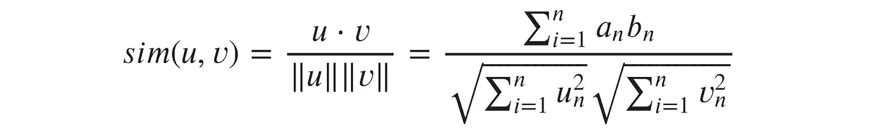
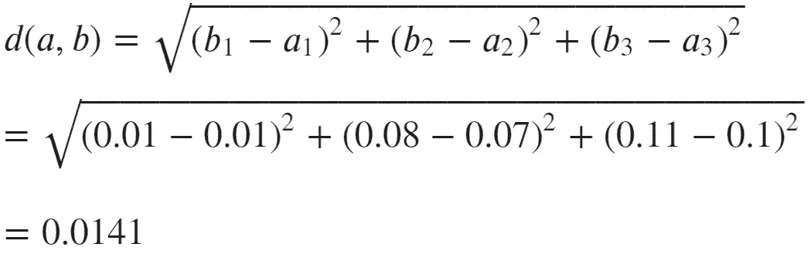

# 脸书人工智能相似性搜索

> 原文：<https://towardsdatascience.com/facebook-ai-similarity-search-7c564daee9eb?source=collection_archive---------11----------------------->

## FAISS 简单指南


在 [Unsplash](https://unsplash.com?utm_source=medium&utm_medium=referral) 上 [NeONBRAND](https://unsplash.com/@neonbrand?utm_source=medium&utm_medium=referral) 拍摄的照片

准确、快速且节省内存的相似性搜索是一件很难做到的事情——但如果做得好，它非常适合我们无穷无尽(并呈指数增长)的庞大数据仓库。

相似性搜索如此之好的原因是，它使我们能够搜索图像、文本、视频或任何其他形式的数据——而不会在我们的搜索查询中变得过于具体——这是我们人类不太擅长的事情。

我将使用图像相似性搜索的例子。我们可以拍一张照片，然后搜索相似的图片。其工作原理是首先将每张图像转换成一组自动生成的特征，这些特征用数字向量表示。

当我们比较两幅相似图像的矢量时，我们会发现它们非常相似。

现在，如果我们拍照，并搜索其他类似的图像——我们真的不想将我们的*查询*向量与数据库中的每一个向量进行比较。想象一下用谷歌图片搜索来做这件事——你可能要等上一段时间。

相反，我们希望找到一种更有效的方法——这正是脸书人工智能相似性搜索(FAISS)提供的方法。

# 向量

我们高效相似性搜索的故事从向量开始——事实上有很多向量。

如果我们取三个向量:



我们可以很有把握地说，矢量 **a** 和 **b** 比 **c** 彼此更接近。这可以用一个简单的三维图表来显示:



在我们的例子中，我们的向量有更多的维度——多到无法想象。但是我们仍然可以使用相同的距离度量来计算两个高维向量之间的接近度和/或相似度。其中一些是:

*   欧几里德距离(度量大小)


*   点积(测量方向和大小)


*   余弦相似性(测量方向)



FAISS 利用欧几里得距离和点积来比较向量。

给定我们的矢量 **a** ，和 **b** 。我们将**欧几里德距离**计算为:



欧几里德距离计算

# 近似最近邻居

给定我们的欧几里德距离度量，我们可以使用一组向量来创建最近邻(NN)图。

NN 是 FAISS 的重要组成部分，它是我们在索引中构建核心*‘距离’*属性的方式。然而，由于 ***维数灾难*** ，NN-search 的计算量很大。

该过程包括计算两个向量之间的欧几里德距离，然后是另外两个向量，依此类推——最近的*邻居是它们之间距离最短的那些。*

神经网络搜索最基本的方法是强力穷举搜索——计算所有元素之间的距离。

现在，如果我们有几百万个索引向量，或者十亿个(FAISS 就是为这个数字而构建的)，这可能会成为一个繁重的操作，我们会为了准确性而牺牲速度和内存效率:

```
**Brute Force**Good Accuracy
Bad Speed
Bad Memory (eg a lot of memory is required)
```

因此，我们可以执行非穷举搜索，不搜索索引中的所有元素和/或转换向量以使它们更小(因此比较起来更快)。

因为这种非穷举(近似)NN 搜索使用稍微修改的向量或受限的搜索区域，所以它返回一个**近似**最佳结果，而不一定是*绝对*最佳结果。

```
**Approximate NN**Reasonable Accuracy
Good Speed
Good Memory
```

然而，这种精度下降非常轻微，被视为性能优势的公平权衡。

# FAISS 如何提高搜索效率

首先，FAISS 使用了我们已经学过的所有智能 ANN 图形构建逻辑。但是失败的不止这些。

第一个效率节省来自于 GPU 的有效使用，因此搜索可以并行而不是串行处理计算，从而大大加快速度。

此外，FAISS 在索引过程中执行三个附加步骤。预处理步骤，随后是两个量化操作——用于倒排文件索引(IVF)的*粗*量化器，以及用于矢量编码的*细*量化器。

对我们大多数人来说，最后一段是无意义的胡言乱语——所以让我们分解每一步，理解每一步的意思。

## 预处理

我们用我们希望 FAISS 索引的向量进入这个过程。第一步是将这些向量转换成更友好/有效的格式。FAISS 在这里提供了几种选择。

*   PCA——使用主成分分析来减少向量的维数。
*   L2 范数——L2——归一化我们的向量。
*   OPQ —旋转我们的向量，以便它们可以由*精细*量化器更有效地编码—如果使用乘积量化(PQ)的话。
*   填充(pad )-用零填充输入向量，直到给定的目标尺寸。

这个操作意味着，当我们将查询向量与已经嵌入的向量进行比较时，每次比较都需要更少的计算，从而使事情变得更快。

## 倒排文件索引

下一步是我们的倒排文件(IVF)索引过程。同样，有多种选择——但每一种都旨在将数据划分到*个相似的*簇中。

这意味着当我们查询 FAISS 时，我们的查询被转换成一个向量——它将与这些分区/聚类质心进行比较。

我们将相似性度量与我们的查询向量和每个质心进行比较——一旦我们找到最近的质心，我们就可以访问该质心内的所有完整向量(并忽略所有其他向量)。

我们立即显著缩小了所需的搜索区域，降低了复杂性，加快了搜索速度。

*这也被称为“非穷举”搜索组件——例如，允许我们避免“穷举”(比较* ***一切*** *)搜索的组件。*

## 向量编码

最后一步是对每个向量进行索引之前的最后一个编码步骤。这个编码过程由我们的*精细*量化器执行。这里的目标是减少索引内存大小并提高搜索速度。

有几个选项:

*   平面-矢量按原样存储，不进行任何编码。
*   PQ —应用[产品量化](http://kaiminghe.com/cvpr13/index.html#:~:text=Product%20quantization%20(PQ)%20is%20an,then%20quantize%20these%20subspaces%20separately.)。
*   SQ —应用[标量量化](http://people.ece.umn.edu/~arya/EE5585/lecture13.pdf)。

值得注意的是，即使使用*平面*编码，FAISS 仍然会非常快。

所有这些步骤和改进结合起来，创建了一个令人难以置信的快速相似性搜索引擎——在 GPU 上仍然是无与伦比的。

关于 FAISS 的这篇文章到此为止！FAISS 是一个非常酷的工具，你可以在这里阅读更多信息，在这里阅读 [FAISS repo。](https://github.com/facebookresearch/faiss)

你可以在本笔记本中找到 FAISS 的 Python 实现。

我希望你喜欢这篇文章。如果你有任何问题或建议，请通过推特或在下面的评论中告诉我。如果你对更多类似的内容感兴趣，我也会在 YouTube 上发布。

感谢阅读！

# 来源

[🤖带变压器的 NLP 课程](https://bit.ly/nlp-transformers)

**除非另有说明，所有图片均出自作者之手*