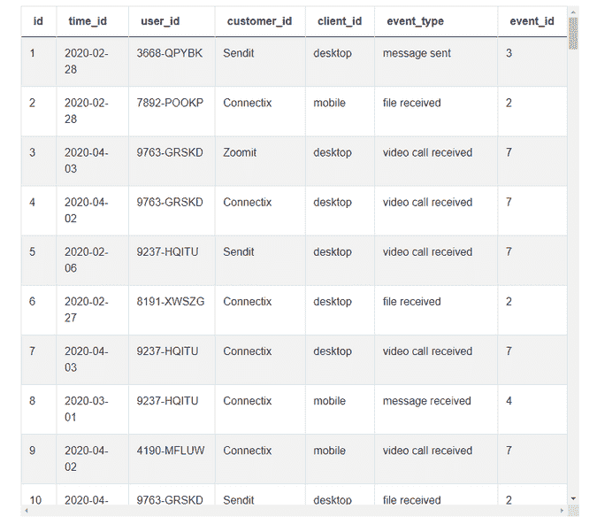
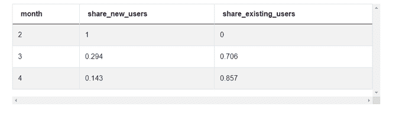

# 脸书和微软数据科学 SQL 面试问题

> 原文：<https://towardsdatascience.com/facebook-and-microsoft-data-science-sql-interview-questions-175a3e0fdf43?source=collection_archive---------11----------------------->

## 这是来自脸书和微软的一个硬数据科学 SQL 面试问题，测试你查找和细分用户以及将聚合表连接在一起的能力。让我们像在面试中一样解决这个问题。


由[卢卡·布拉沃](https://unsplash.com/@lucabravo?utm_source=medium&utm_medium=referral)在 [Unsplash](https://unsplash.com?utm_source=medium&utm_medium=referral) 上拍摄

脸书和微软的数据科学职位竞争激烈，很难找到。在工作中编写 SQL 将涵盖你在实践中要处理的所有问题。在本文中，我们将演练如何解决来自[微软](https://www.stratascratch.com/blog/microsoft-data-analyst-interview-questions/?utm_source=medium&utm_medium=click&utm_campaign=blog&utm_term=)和[脸书](https://www.stratascratch.com/blog/facebook-data-scientist-analytics-interview-questions/?utm_source=medium&utm_medium=click&utm_campaign=blog&utm_term=)的数据科学 SQL 面试问题。我们还将为您提供一些关于如何在此类数据科学面试中找到解决方案的提示。

作者通过 [YouTube](https://www.youtube.com/channel/UCW8Ews7tdKKkBT6GdtQaXvQ/) 发布的视频

# 数据科学 SQL 面试问题

**新老用户** *计算新老用户的份额。以比率形式输出月份、新用户份额和现有用户份额。
新用户定义为当月开始使用服务的用户。现有用户是在当月开始使用服务并在之前的任何一个月使用过服务的用户。
假设日期都是从 2020 年开始的。*

问题链接:[https://platform.stratascratch.com/coding-question?id=2028](https://platform.stratascratch.com/coding-question?id=2028&utm_source=medium&utm_medium=click&utm_campaign=blog&utm_term=)

# 解决这个面试问题的五步框架

这个框架可以用于任何数据科学 SQL 面试问题。这里有一个解决问题时你应该采取的步骤的列表，无论是在面试还是在工作中。

1.  **探索数据
    a)** 只有在我们工作的时候，因为大多数时候你不会有可执行的想法清单假设
2.  列出假设有助于你缩小解决方案的范围。它将帮助您识别边缘情况，并将您的解决方案限制在您的假设范围内。
3.  概述方法
    a) 把方法一步一步地写下来。每一步都是一个逻辑语句或业务规则。
    b)与面试官确认这些步骤。通常，如果面试官发现了一些错误，他们会提出来，这很好，因为你甚至可以在写一行代码之前就解决问题。
    c)如果你愿意，你可以提到你实现的解决问题的功能。
4.  **增量编码
    a)** 将解决方案分成逻辑部分，并就每个部分进行沟通，这样面试官就知道你在做什么。b)你的代码需要具有逻辑性和良好的结构。最重要的一点是，不要为每个“代码块”放置超过 1 个逻辑语句或业务规则。代码块可以定义为 CTE 或子查询，因为它是自包含的，并且与代码的其余部分相分离。
5.  优化代码这通常只是与面试官的一次谈话，但在工作中，如果代码会被重复使用，你通常会重构代码以提高运行效率。

# 数据探索

**表格模式:**


图片来自 [StrataScratch](https://www.stratascratch.com/)

**数据集:**



图片来自 [StrataScratch](https://www.stratascratch.com/)

当我们研究数据时，我们可以看到“time_id”是 YYYY-MM-DD 中的一个日期，因此我们可以从该日期字段中提取月份，以查找在该给定月份使用服务的用户。

“user_id”是一个常规的用户列表，将用于统计每月使用该服务的用户数量。

“event_type”确实是一种服务类型。我们可以忽略此列，因为我们正在考虑所有服务。在对面试官的假设中说明这一点很重要。如果您正在寻找特定的事件和服务，您需要在您的解决方案中使用这个专栏。幸运的是，我们不需要这么做，否则解决方案会复杂得多。

# 假设

*   Time_id 表示用户何时使用服务。所有数据都是 2020 年的。这将有助于我们识别新用户和现有用户。
*   我们只需要 User_id 来识别用户。
*   用户每次使用服务时，都会记录在表中，因此用户会在表中多次列出
*   Event_type 是服务，但这不是解决方案所必需的，因为我们考虑的是所有服务或事件

# 大纲方法

在开始编码之前概述你的方法是非常重要的。写出你的方法的主要好处是从面试官那里得到确认，这些步骤是正确的。如果面试官发现你的方法或逻辑有问题，那么你当然可以在写代码之前改正它们。

现在，让我们来看看这个数据科学 SQL 面试问题的方法:

1.  找到新用户，新用户被定义为第一次开始使用服务的用户。我可以使用 min()来查找用户第一次使用服务的日期。
2.  按月计算所有使用过服务的用户。一旦我们减去新用户，这将为我们提供现有用户。
3.  按月加入新用户和所有用户表。
4.  通过将新用户数除以所有用户数来计算份额。计算现有用户的份额仅仅是 1 和新用户的份额之差。

# 增量编码

现在，在你的方法中应该有以下步骤。对它们中的每一个进行编码，并在现有代码的基础上构建，然后检查查询是否会在每次添加逻辑时运行。以下是步骤:

*   计算新用户
*   计算所有用户
*   连接表格
*   计算用户份额

让我们来完成这些步骤。

**1。找到新用户，新用户被定义为第一次开始使用服务的用户。**

我们可以通过从“time_id”列中找到每个用户的最小日期来找到它，这给了我他们开始使用服务的日期。

```
SELECT user_id,
       min(time_id) as new_user_start_date
FROM fact_events
GROUP BY user_id
```

**2。通过从日期中提取月份并计算唯一用户数，按月计算新用户数**

```
SELECT date_part('month', new_user_start_date) AS month,
       count(DISTINCT user_id) as new_users
FROM
     (SELECT user_id,
       min(time_id) as new_user_start_date
      FROM fact_events
      GROUP BY user_id) sq
GROUP BY month
```

要按月聚集用户，我们可以使用 date_part()函数并从“time_id”中提取月份。知道所有的日期都在 2020 年内是有帮助的，因为我知道所有的月份都来自 2020 年。如果我们在这个数据集中有几年，我们不能使用 date_part()，因为不同年份的月份会混在一起。我们必须使用 to_char()函数并按 MM-YYYY 聚合数据。

**3。计算每个月的所有用户(现有用户和新用户)**

一旦我们减去新用户，这将为我们提供现有用户。

```
SELECT date_part('month', time_id) AS month,
       count(DISTINCT user_id) as all_users
FROM fact_events
GROUP BY month
```

**4。按月份将两个表连接在一起**

```
with all_users as (
    SELECT date_part('month', time_id) AS month,
           count(DISTINCT user_id) as all_users
    FROM fact_events
    GROUP BY month),
new_users as (
    SELECT date_part('month', new_user_start_date) AS month,
           count(DISTINCT user_id) as new_users
    FROM
        (SELECT user_id,
          min(time_id) as new_user_start_date
         FROM fact_events
         GROUP BY user_id) sq
    GROUP BY month
)
SELECT
  *
FROM all_users au
JOIN new_users nu ON nu.month = au.month
```

**5。计算用户份额**

```
with all_users as (
    SELECT date_part('month', time_id) AS month,
           count(DISTINCT user_id) as all_users
    FROM fact_events
    GROUP BY month),
new_users as (
    SELECT date_part('month', new_user_start_date) AS month,
           count(DISTINCT user_id) as new_users
    FROM
         (SELECT user_id,
           min(time_id) as new_user_start_date
          FROM fact_events
          GROUP BY user_id) sq
    GROUP BY month
)
SELECT
  au.month,
  new_users / all_users::decimal as share_new_users,
  1- (new_users / all_users::decimal) as share_existing_users
FROM all_users au
JOIN new_users nu ON nu.month = au.month
```

如果我们运行这个查询，我们现在就有了新用户和现有用户每月的份额数。

输出:



图片来自 [StrataScratch](https://www.stratascratch.com/)

这里需要注意的一点是，现有用户的计算方法是从新用户的份额中减去 1。此外，请记住在执行除法之前，将份额计算转换为小数或浮点数据类型。

# 最佳化

一个经常被问到的问题是，是否有优化代码的方法。面试官在测试你的 SQL 理论，所以即使没有办法优化代码，你也应该说点什么。

看看我们的解决方案，没有办法进一步优化这些代码。

有时，您可以使用 case 语句删除一个连接，但这在我们的方法中不起作用，因为我们需要标识整个数据集的最小日期，case 语句将逐行执行。因此，您需要一个子查询或 CTE 来执行该操作。

您还需要执行相同的子查询/CTE 操作来按月份查找所有用户，因此我们无法优化这部分代码或两个子查询的连接。

即使没有办法优化代码，但你仍然放弃了一些 SQL 知识，这将通过面试官对你是否了解 SQL 理论的评估。

## 结论

这是一个很难回答的数据科学 SQL 面试问题，因为你试图找到用户第一次使用服务的时间。使用 min()函数作为识别新用户的方法并不总是显而易见的。您还使用了[高级 SQL 函数](https://www.stratascratch.com/blog/types-of-window-functions-in-sql-and-questions-asked-by-airbnb-netflix-twitter-and-uber/?utm_source=medium&utm_medium=click&utm_campaign=blog&utm_term=)从日期字段中提取日期成分，比如月份，这使得问题变得更加复杂。但是有必要学习如何在数据科学中操作日期，因为大多数分析都有日期成分。

这个数据科学 SQL 面试问题的诀窍是使用一个框架来组织你的想法，因为有多个步骤。一旦你提出你的假设，比如知道所有的日期都是从 2020 年开始的，并且你正在考虑你的解决方案中的所有服务，这个问题就变得容易解决了。你所需要做的就是用逻辑和简洁的步骤来组织你的方法，并编写代码。

在编码前练习框架，练习整理思路，回答复杂的问题会变得容易很多。

*   *如果你对数据科学面试问题和解释感兴趣，可以查看* [***StrataScratch。***](https://www.stratascratch.com)
*   *在我的* [***Youtube 频道***](https://www.youtube.com/channel/UCW8Ews7tdKKkBT6GdtQaXvQ) ***上观看面试问题的解释和技术话题的深度指导。***
*   *要获得更多有用的资源，请查看我的其他文章，如**[***脸书面试问题指南***](https://www.stratascratch.com/blog/facebook-data-scientist-analytics-interview-questions/) *和* [***成为数据科学家的必备数据科学技能。***](https://www.stratascratch.com/blog/essential-data-science-skills-to-be-a-data-scientist/)*

**最初发表于*[*【https://www.stratascratch.com】*](https://www.stratascratch.com/blog/facebook-and-microsoft-data-science-sql-interview-questions/?utm_source=medium&utm_medium=click&utm_campaign=blog&utm_term=)*。**