# 脸书数据科学家采访指南

> 原文：<https://towardsdatascience.com/facebook-data-scientist-interview-guide-edb331a78c7c?source=collection_archive---------28----------------------->

## *我们将为您带来一份详细的分析，告诉您当您获得梦寐以求的脸书数据科学面试机会时，您会有什么样的期待*


作者创造的形象

脸书是世界上最大的上市公司之一，也是全球技术领导者。话虽如此，脸书成为数据科学的领导者并吸引了世界上一些最有技能的数据科学家也就不足为奇了。根据他们的[网站](https://research.fb.com/category/data-science/)，“脸书的数据科学家进行大规模、全球性的定量研究，以更深入地了解人们如何相互交流以及他们周围的世界。”

作为领先的科技巨头和 [FAANG 公司](https://www.stratascratch.com/blog/ultimate-guide-to-the-top-5-data-science-companies/?utm_source=blog&utm_medium=click&utm_campaign=medium)之一，脸书将数据科学置于其活动的核心也就不足为奇了。我们通过使用脸书进行的所有这些图片、视频、消息、喜欢、评论和许多其他活动都会被不断地存储和分析，以便改进脸书的产品(及其所有附属公司)，并保持该公司在过去十年中享有的社交媒体市场主导地位。

考虑到收集到的大量数据，以及脸书在数据科学上的主导地位和重视程度，我们决定进行分析，并提供一份关于数据科学面试流程的指南。我们在脸书收集了近 200 个真实的采访问题，我们为你带来了一个详细的分析，告诉你当你得到你梦寐以求的脸书的采访时，你应该期待什么。

# 分析的描述和方法

本文的目标是分析在脸书数据科学面试中被问到的各类问题。此外，本文将分析这些问题中出现的最突出的技术概念，以帮助读者(通过示例)理解我们数据库中许多问题的背景和方法。

在我们博客的早些时候，我们发表了一篇文章，对过去 4 年从 80 家不同公司收集的 900 多个数据科学面试问题进行了分析。在该分析中，脸书是提问最多的公司，也是高度重视编码问题的领先组织之一。

在过去的 4 年里，我们从 Glassdoor、Reddit、Blind App 和 Indeed 等来源收集了总共 193 个真实的脸书数据科学家采访问题。以下是我们团队对问题的分类:

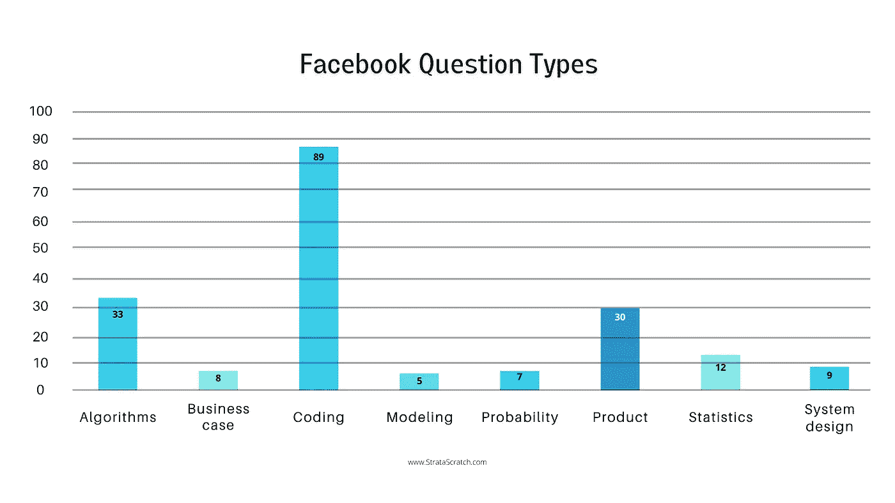

作者创造的形象

我们研究中的问题类型数据是通过将问题分成预先确定的类别而生成的。这些类别是由我们的专家对采访经历描述进行分析后得出的。谈到脸书，我们的团队已经确定了八个不同类别的问题。它们是:算法、商业案例、编码、建模、概率、产品、统计和系统设计。我们将在文章中更详细地解释这些类别。

# 脸书大学的数据科学面试

在这里，我们将更详细地介绍我们的分类方法，并解释如何选择和构建类别。此外，我们将分析所有问题，看看哪些类别在脸书数据科学面试过程中更普遍。最后，我们将通过现实生活中的例子来了解脸书面试中每个类别的问题。这将有助于你对脸书面试有一个大致的了解，也给你一些你可能会被问到的问题的具体知识。

# 脸书问题类型细分

让我们来看看为本文收集的所有脸书面试问题:

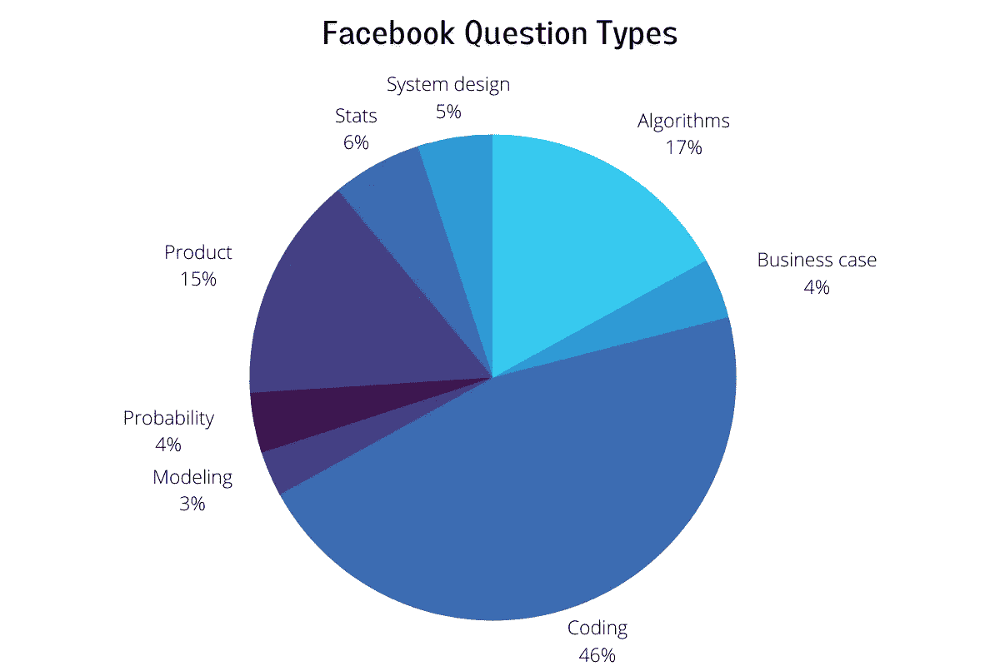

作者创造的形象

正如我们之前提到的，正如我们在图表上看到的，脸书非常重视[数据科学编码面试问题](https://www.stratascratch.com/blog/data-science-coding-interview-questions-with-5-technical-concepts/?utm_source=blog&utm_medium=click&utm_campaign=medium)；这一类别几乎占了我们数据库中所有问题的一半(46%)。既然如此，为了帮助你更好地准备脸书大学的面试，我们将在文章中更多地强调这类问题。另外两个突出的类别是算法和产品，分别占所有问题的 17%和 15%。统计学占我们数据库中所有问题的 6%,这是有 10 多个例子的列表中的最后一个类别，正如你在上一节的图表中看到的。系统设计占 5%，商业案例和概率各占 4%，而建模是最不占优势的类别，3%的此类问题在脸书数据科学面试中被问到。

## 编码

根据我们的分类标准，我们将编码问题定义为所有类型的问题，包括通过代码进行分析和数据操作。这种通过代码的操作通常是使用数据科学中一些最流行的语言来完成的，比如 SQL(最常见的)、Python 和 r。

脸书特有的编码问题示例如下:

*“了解脸书的高级员工(即更有经验的员工)数量是否高于美国的员工数量。如果老年人的数量更高，则输出为“更多老年人”。否则，输出为‘更基于美国’。”*

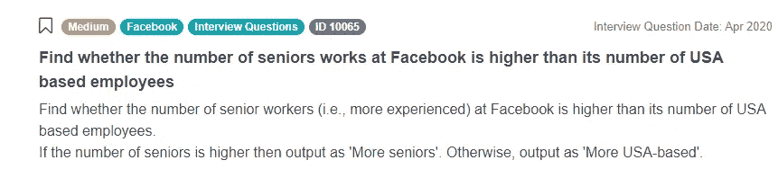

截图来自 [StrataScratch](https://www.stratascratch.com/?utm_source=blog&utm_medium=click&utm_campaign=medium)

我们将在 Postgres 中讨论这个问题的[可能的解决方案，这样你可以在面试中更熟悉如何处理类似的问题:](https://platform.stratascratch.com/coding/10065-find-whether-the-number-of-seniors-works-at-facebook-is-higher-than-its-number-of-usa-based-employees?python=&utm_source=blog&utm_medium=click&utm_campaign=medium)

*   首先，使用两个内部查询来查找老年人的数量和美国雇员的数量；
*   然后用公式 SUM(CASE WHEN … THEN 1 ELSE 0 END)统计学长人数；
*   之后，使用 COUNT()函数对美国的雇员进行计数。考虑在美国工作的员工的“地点”列的值为“美国”；
*   使用 WHERE 子句来应用条件；
*   然后，在 TRUE 上使用 LEFT JOIN 合并两个查询的结果；
*   最后，使用公式 CASE WHEN … THEN … ELSE … END 找到最终输出。

以下是来自我们平台的 Postgres 的完整解决方案:

```
SELECT
    CASE 
        WHEN n_seniors > n_usa_based
        THEN 'More seniors'
        ELSE 'More USA-based'
    END AS winner
FROM
    (SELECT
        SUM(CASE WHEN is_senior THEN 1 ELSE 0 END) AS n_seniors
    FROM
        facebook_employees) seniors
LEFT JOIN
    (SELECT
        COUNT(*) AS n_usa_based
    FROM
        facebook_employees
    WHERE
        location = 'USA'
    ) us_based
ON TRUE
```

由于编码是所有面试问题中最常见的一类，让我们再看几个与编码相关的例子。一个这样的[例子](https://platform.stratascratch.com/coding/9782-customer-revenue-in-march?python=&utm_source=blog&utm_medium=click&utm_campaign=medium)是:

*“计算 2019 年 3 月每个客户的总收入。每个订单的收入通过 order_quantity 乘以 order_cost 来计算。输出收入和客户 id，并根据收入按降序对结果进行排序。*

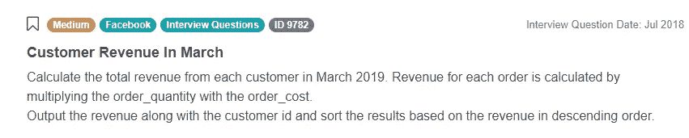

截图来自 [StrataScratch](https://www.stratascratch.com/?utm_source=blog&utm_medium=click&utm_campaign=medium)

一个可能的解决方案可以在[这里](https://platform.stratascratch.com/coding/9782-customer-revenue-in-march?python=&utm_source=blog&utm_medium=click&utm_campaign=medium)找到。

这一类别的最后一个例子是:

*“找出脸书上每个用户的受欢迎程度。人气百分比定义为用户拥有的好友总数除以平台用户总数，再乘以 100 转换成百分比。输出每个用户及其受欢迎的百分比。按用户 id 升序排列记录。“用户 1”和“用户 2”列是朋友对。*

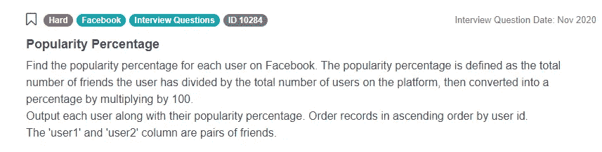

截图来自 [StrataScratch](https://www.stratascratch.com/?utm_source=blog&utm_medium=click&utm_campaign=medium)

这个问题的答案可以在[这里](https://platform.stratascratch.com/coding/10284-popularity-percentage?python=&utm_source=blog&utm_medium=click&utm_campaign=medium)找到。

脸书数据科学公司的面试中会问一些编码问题，以测试候选人解决问题的能力、对所用编程语言的技术知识以及创造力；所有这些都是你在脸书每天最可能需要的。正如我们在上一节中看到的，知道如何回答编码问题的重要性怎么强调都不为过，因为它们几乎占所有面试问题的一半。

*点击此处查看更多最近在脸书面试中问到的数据科学面试问题—* [*脸书数据科学面试问题*](https://www.stratascratch.com/blog/facebook-data-science-interview-questions/?utm_source=blog&utm_medium=click&utm_campaign=medium)

## 算法

关于算法的问题被归类为需要解决数学问题的所有问题，主要是通过代码，使用上面提到的一种编程语言。这些问题涉及一步一步的过程，通常需要调整或计算才能得出答案。你可能会被要求解释你的答案或者实际执行代码。

算法问题的一个例子是使用 Python 或 r 计算一个数的平方根。这些问题对于测试解决问题和数据操作的基本知识非常重要，这些知识可以用于解决工作中的复杂问题。正如我们在上图中看到的，在脸书的面试中，与算法相关的问题占所有问题的 17%。

## 产品

与产品相关的访谈问题被归类为需要通过数据评估产品/服务的所有问题。这些类型的问题旨在测试候选人是否能够将数据科学原理应用于现实生活中的日常问题，即脸书作为一家公司所经历的问题。下面是一个针对脸书的[产品问题](https://platform.stratascratch.com/technical/2203-investigate-the-discrepancy?utm_source=blog&utm_medium=click&utm_campaign=medium)的例子:

*“如果 iOS 上 70%的脸书用户使用 Instagram，而 Android 上只有 35%的脸书用户使用 Instagram，你会如何调查这种差异？”*


截图来自 [StrataScratch](https://www.stratascratch.com/?utm_source=blog&utm_medium=click&utm_campaign=medium)

正如我们在上面的图表中看到的，产品问题占脸书面试中所有问题的 15%。由于脸书的产品非常复杂，而且数据丰富，这是完全有道理的。能够回答与产品相关的问题是非常重要的，因为这显示了你对脸书产品的了解，以及你适应公司日常工作的难易程度。

## 统计学

统计面试问题被归类为所有需要统计理论和相关概念知识的问题。问这些问题是为了测试受访者对数据科学任务中使用的基本理论原理的了解程度。

下面是一个来自我们平台的[问题的例子，归类在统计](https://platform.stratascratch.com/technical/2009-expectation-of-variance?utm_source=blog&utm_medium=click&utm_campaign=medium)下:

*“方差的期望值是多少？”*

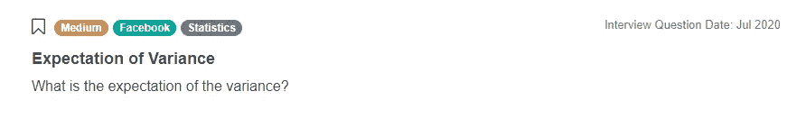

截图来自 [StrataScratch](https://www.stratascratch.com/?utm_source=blog&utm_medium=click&utm_campaign=medium)

回答这个问题的一种方法是这样的:

*   设 X 为随机变量；
*   我们知道 E(a) = a，如果 a 是常数
*   我们也知道 E(E(X)) = E(X)，因为 E(X)是常数。
*   既然 Var(X) = E(X ) — E(X)，那么:
    E(Var(X))\ \ = E(E(X)—E(X))\ \ = E(E(X))—E(E(X))\ \ = E(X)—E(X)—E(X)\ \ = Var(X)

另一个[统计相关问题](https://platform.stratascratch.com/technical/2013-mean-median-age-in-mexico/?utm_source=blog&utm_medium=click&utm_campaign=medium)是:

*“在墨西哥，如果取平均值和年龄中位数，哪个会高，为什么？”*


截图来自 [StrataScratch](https://www.stratascratch.com/?utm_source=blog&utm_medium=click&utm_campaign=medium)

与统计相关的问题非常重要，因为能够理解分析的理论和数学背景是每个公司都在寻找的东西。这表明候选人对手头的问题有更深入的了解，而不仅仅是解决问题的实践经验。

## 系统设计

系统设计问题被归类为所有与设计技术系统相关的问题。问这些问题是为了分析你在解决问题和创建系统以使顾客/客户受益时的个人过程。来自我们平台的[系统设计问题](https://platform.stratascratch.com/technical/2008-are-we-friends?utm_source=blog&utm_medium=click&utm_campaign=medium)的一个例子是:

*“给定脸书成员在脸书上互为好友/解除好友的数据，找出给定的一对成员当前是否是好友。”*

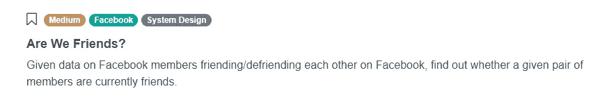

截图来自 [StrataScratch](https://www.stratascratch.com/?utm_source=blog&utm_medium=click&utm_campaign=medium)

了解系统设计对于数据科学家来说非常重要；即使你的角色不是设计一个系统，你也很可能在一个已建立的系统中扮演一个角色，并且需要知道它是如何工作的，以便履行你的日常职责。

## 概率

我们对概率问题的分类是所有只需要概率论和概念的理论知识的问题。面试官会问一些与概率相关的问题，以了解你在完成通常在工作场所执行的复杂数据任务的方法和概率使用方面的知识。

一个[概率问题](https://platform.stratascratch.com/technical/2001-different-card?utm_source=blog&utm_medium=click&utm_campaign=medium)的例子是:

*“从 52 张牌中抽出不同颜色或形状的牌的概率是多少？”*

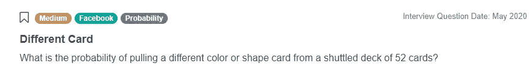

截图来自 [StrataScratch](https://www.stratascratch.com/?utm_source=blog&utm_medium=click&utm_campaign=medium)

## 商业案例

业务案例问题已被分类为涉及案例研究的问题以及与业务相关的通用问题，这些问题将测试一些数据科学技能。在脸书的面试中，他们只占所有问题的 4%;然而，它们可能非常重要，因为你可能会被问到一个与公司运营特别相关的商业案例。如果你能回答这个问题，你就能解决脸书在被雇佣前面临的问题。

下面是一个针对脸书的[商业案例问题](https://platform.stratascratch.com/technical/2057-facebook-nicknames?utm_source=blog&utm_medium=click&utm_campaign=medium)的示例:

*“你如何将脸书用户名字中使用的昵称(皮特、安迪、尼克、罗伯等)映射到真实姓名？”*

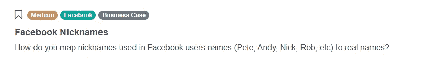

截图来自 [StrataScratch](https://www.stratascratch.com/?utm_source=blog&utm_medium=click&utm_campaign=medium)

知道如何回答这些问题的重要性是巨大的，因为大多数面试官希望候选人在雇佣他们之前知道如何应用数据科学原理来解决脸书的具体问题。

## 建模

建模类下的面试问题都是回归和机器学习相关的问题。尽管建模问题在所有问题中所占的比例最低(3%)，但根据您的角色，它们可能至关重要。事实上，对于脸书的一些职位来说，构建模型可以构成你的大部分任务。

我们平台上的一个[建模问题](https://platform.stratascratch.com/technical/2010-active-user-probability?utm_source=blog&utm_medium=click&utm_campaign=medium)的例子是:

*“你如何测试现在拥有更多朋友是否会增加脸书会员在 6 个月后仍然是活跃用户的可能性？”*

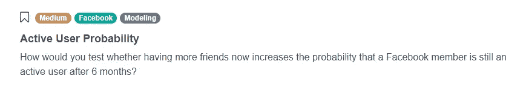

截图来自 [StrataScratch](https://www.stratascratch.com/?utm_source=blog&utm_medium=click&utm_campaign=medium)

# 在脸书数据科学访谈中测试的技术概念

在本节中，我们将讨论一些在脸书数据科学访谈中测试过的最常见的技术概念。正如我们从分析中看到的，脸书非常重视编码问题，以及通常包含编码成分的算法问题。考虑到这一点，难怪最突出的技术概念来自这些领域。

## 连接

在脸书数据科学访谈中测试的最常见的技术概念是使用连接(在 SQL 中)来合并表和列，以便对数据执行进一步的分析。下面是我们平台上这类问题的一个例子:

*“当用户尝试通过 2FA(双因素认证)登录平台时，脸书会发送短信。为了成功 2FA，他们必须确认他们收到了 SMS 文本消息。确认文本仅在发送之日有效。不幸的是，数据库存在 ETL 问题，好友请求和无效的确认记录被插入到日志中，这些日志存储在“fb_sms_sends”表中。这些消息类型不应出现在表中。幸运的是,“fb_confirmers”表包含有效的确认记录，因此您可以使用该表来识别由用户确认的 SMS 文本消息。计算 2020 年 8 月 4 日确认短信的百分比。”*

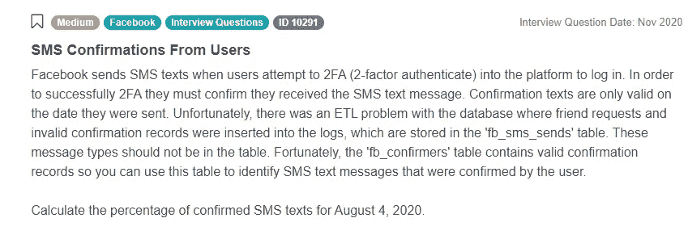

截图来自 [StrataScratch](https://www.stratascratch.com/?utm_source=blog&utm_medium=click&utm_campaign=medium)

要回答这个问题，您需要过滤掉“fb_sms_sends”表中的无效确认和好友请求记录。您将使用电话号码和日期键来连接表；需要一个左连接来保存发送的消息总数的计数。因为您正在处理整数，所以需要在 SELECT 子句中将数据类型转换为浮点数或小数。详细回答(有代码)可以在[这里](https://platform.stratascratch.com/coding/10291-sms-confirmations-from-users?python=&utm_source=blog&utm_medium=click&utm_campaign=medium)找到。

## 案例陈述

在脸书数据科学访谈中，另一个经常被提及的重要技术概念是 CASE 语句的使用(及其所有变体)。例如，你可能会被问到这样一个问题:

*“通过基于‘喜欢’倾向建立‘喜欢’分数，发现‘喜欢’的数量是如何增加的。“喜欢”倾向被定义为每个朋友在所有反应中给出喜欢的概率(即，喜欢的数量/所有反应的数量)。在相应的日期和海报旁边输出总倾向。根据喜欢分数按降序对结果进行排序。在“facebook_reactions”表中，“poster”是发布内容的用户，“friend”是看到内容并做出反应的用户。“facebook_friends”表存储了成对的好友。”*

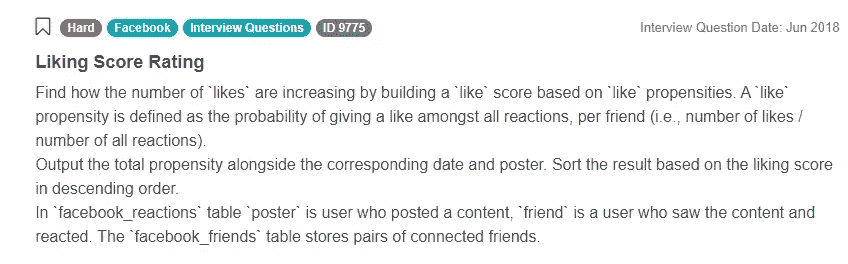

截图来自 [StrataScratch](https://www.stratascratch.com/?utm_source=blog&utm_medium=click&utm_campaign=medium)

这个问题的答案(使用 CASE WHEN 语句)可以在[这里](https://platform.stratascratch.com/coding/9775-liking-score-rating?python=&utm_source=blog&utm_medium=click&utm_campaign=medium)找到。​

## UNION ALL 运算符

我们将在本文中讨论的脸书数据科学访谈中最后一个流行的技术概念是 UNION ALL 操作符。这个概念主要用于组合某些数据集，以便同时对所有数据集进行分析。这样一个问题的例子:

*“找出脸书数据中心总能耗最高的日期。输出数据以及所有数据中心的总能耗。”*

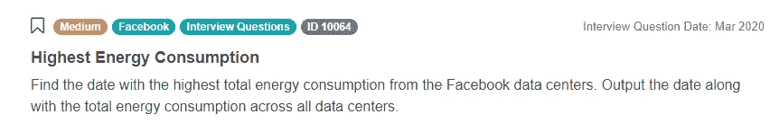

截图来自 [StrataScratch](https://www.stratascratch.com/?utm_source=blog&utm_medium=click&utm_campaign=medium)

这个问题的答案可以在我们的[平台](https://platform.stratascratch.com/coding/10064-highest-energy-consumption?python=&utm_source=blog&utm_medium=click&utm_campaign=medium)上找到。

# 结论

本文对脸书数据科学面试问题的全面分析旨在帮助你成为脸书数据科学团队的一员。我们设法将所有 193 个问题分为 8 个不同的部分，并对每个类别进行了详细的检查，同时对问题本身进行了总体分类。为了更好地理解面试过程，我们介绍了经过测试最多的技术概念，以及面试问题的具体示例。编码问题受到了特别的重视，因为它们几乎占了脸书面试中所有问题的一半。

随着脸书不断发展并保持其社交媒体市场的主导地位，可以理解为什么该公司不断扩大其在世界各地的数据科学团队，以及为什么他们通过每次招聘吸引更多的应用程序。我们希望这篇文章在你成为脸书数据科学家的过程中成为一个有价值的资源，我们祝你在未来的工作中一切顺利。

*原载于*[*https://www.stratascratch.com*](https://www.stratascratch.com/blog/facebook-data-scientist-interview-guide/?utm_source=blog&utm_medium=click&utm_campaign=medium)*。*