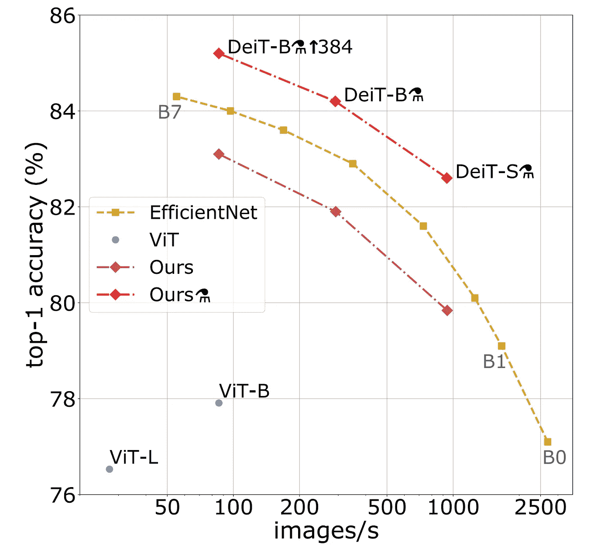

# 脸书·戴伊特:最先进的图像分类，卷积数为 0，不到最先进数据集的 1%

> 原文：<https://towardsdatascience.com/facebook-deit-a-promising-new-technique-for-image-classification-6516f039b4bb?source=collection_archive---------35----------------------->

## 一种有前途的图像分类新技术

布雷特·乔丹在 [Unsplash](https://unsplash.com?utm_source=medium&utm_medium=referral) 上的照片

几周前，脸书发布了一个新的 ML 模型(数据高效图像转换器，DeIt)，它仅使用 ImageNet 数据集(120 万张图像)就实现了最先进的图像分类性能。最先进的视觉变形金刚只有使用数亿张图像才能达到这种性能[1]。脸书如何实现这一点是最有趣的，因为他们没有使用任何卷积或大型数据集。

# 【DeIt 是如何工作的？

几乎每天都有很多很棒的机器学习论文发布。我选择这个来回顾的原因是它使用了一些有趣的技术。

其中一个技巧是注意力和变形金刚，我不想详细介绍，因为有很多关于它们的文章。然而，我将给出一个快速的概述，以便我们可以适当地探索 DeIt。

## 视觉变形金刚

在过去的几年里，变形金刚和注意力一直主导着机器学习领域。他们从 NLP 开始，现在转向图像。

视觉变形金刚使用[多头自我关注层](/intuitive-understanding-of-attention-mechanism-in-deep-learning-6c9482aecf4f)。这些层基于注意机制，该机制利用查询、键和向量来“注意”来自不同位置的不同表示的信息。

一个经典的图像变换模块从一个普通的前馈网络开始，然后是一个多头自关注层。一个有趣的地方是，前馈网络使用了一个名为**高斯误差线性单元**的激活函数，其目的是通过将一些激活随机乘以 0 来正则化模型。

本文解决了可视转换器的一些问题，例如:

*   它在 3 亿张图像上进行了训练(JFT-300M [1])
*   这 3 亿张图片是一个私人数据集
*   它不能很好地概括。

好了，现在我们已经介绍了基础知识，让我们开始看看这篇论文**的特别之处。**

## **新推出的绝招:蒸馏令牌。什么是蒸馏？**

在 [Unsplash](https://unsplash.com?utm_source=medium&utm_medium=referral) 上[科学高清](https://unsplash.com/@scienceinhd?utm_source=medium&utm_medium=referral)拍摄的照片

> 知识提炼指的是模型压缩的思想，通过一步一步地教会一个较小的网络，使用一个更大的已经训练好的网络来做什么。“软标签”指的是在每个卷积层之后由更大的网络输出的特征图。然后，较小的网络被训练来学习较大网络的确切行为，尝试在每个级别复制其输出(不仅仅是最终损失)。

来源:[普拉卡·加内什](/knowledge-distillation-simplified-dd4973dbc764)

这很有趣，就像在现实世界中我们有老师一样，在 ML 中我们有更大更小的网络模仿更大的网络向他们学习。

典型的视觉变形器使用称为**类标记的可训练向量的概念。**这种令牌试图取代卷积神经网络中的传统池层。它提高了模型的性能，并扩展了图像补片中的信息。

脸书添加了一个**提取令牌**，它在开始时与这个类令牌和其他初始嵌入进行交互，以增强模型的自我关注机制。该令牌是在训练期间学习的可训练向量。

其目标是最小化教师的 softmax 和学生模型的 softmax 之间的 **Kullback-Leibler (KL)散度**(这被称为软蒸馏)。关于 KL 散度，你需要知道的是，它衡量的是两个分布之间的差异。

所以本质上，这个蒸馏令牌试图最小化学生网络和教师网络的信息差异。这是一个相当令人印象深刻和新颖的策略！

他们还通过尝试添加一个类令牌(而不是提取令牌)来验证[1]这个新令牌的有用性。结果是更差的性能。

注意，这里的教师网络是一个卷积神经网络。

## 结果

来源: [Github](https://github.com/facebookresearch/deit?fbclid=IwAR0oSKhKyUGuJUsKA2L-R3-M7pjBbmhLJX9U2HILIysyfG641maCipY_mBU) (Apache 2.0 许可证)

这篇论文最棒的一点是，脸书发布了完整的[代码](https://github.com/facebookresearch/deit?fbclid=IwAR0oSKhKyUGuJUsKA2L-R3-M7pjBbmhLJX9U2HILIysyfG641maCipY_mBU)、[数据集](http://www.image-net.org/)、[论文](https://arxiv.org/abs/2012.12877?fbclid=IwAR23wT0xOURPoIklWM48mC2ytaw23rgGqP2GmWpTCPjRqnDGO3h2an-xiGI)，以及几乎所有的东西。他们发布了 3 种不同尺寸的不同型号。从图中可以看出，即使与最好的和最新的网络之一 EfficientNet 相比，它们的性能都相当好。

总之，我认为这是脸书成功的三大诀窍:

*   视觉变形金刚和注意力的力量
*   通过提取令牌用补丁嵌入替换单词嵌入
*   不依靠回旋

**最终想法:**

完美的模型是不存在的，我确信这个模型有一些瑕疵。然而，看看顶级人工智能研究人员在做什么还是挺有趣的。我希望你得到了蒸馏令牌技巧背后的直觉，这样你就可以在你的 ML 项目中发明你自己的技巧了！

我不想一头扎进数学(尽管我热爱数学)，这样这篇文章才能适合更多的读者。如果你对此感兴趣，并想查看他们的更多结果，我建议看一看[论文](https://arxiv.org/abs/2012.12877?fbclid=IwAR23wT0xOURPoIklWM48mC2ytaw23rgGqP2GmWpTCPjRqnDGO3h2an-xiGI)。

如果你想定期收到关于人工智能和机器学习的最新论文的评论，请在这里添加你的电子邮件并订阅！

[https://artisanal-motivator-8249.ck.page/5524b8f934](https://artisanal-motivator-8249.ck.page/5524b8f934)

**参考文献:**

[1]训练数据高效的图像转换器&通过注意力进行提炼。Hugo Touvron 和 Matthieu Cord 和 Matthijs Douze 和 Francisco Massa 和 Alexandre Sablayrolles 和 Hervé Jégou。2021 年 [arxiv](https://arxiv.org/abs/2012.12877?fbclid=IwAR23wT0xOURPoIklWM48mC2ytaw23rgGqP2GmWpTCPjRqnDGO3h2an-xiGI)