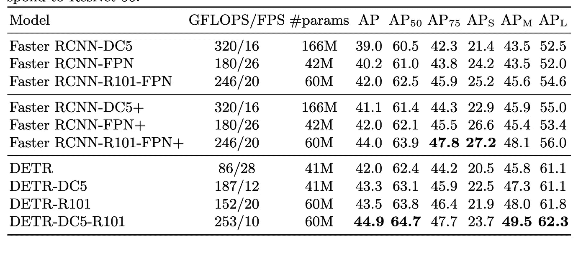

# 脸书·DETR:变形金刚潜入物体探测世界

> 原文：<https://towardsdatascience.com/facebook-detr-transformers-dive-into-the-object-detection-world-39d8422b53fa?source=collection_archive---------17----------------------->

## 变形金刚已经统治了自然语言处理和图像识别，现在又统治了物体检测

[Samule 孙](https://unsplash.com/@samule?utm_source=medium&utm_medium=referral)在 [Unsplash](https://unsplash.com?utm_source=medium&utm_medium=referral) 上的照片

最近大多数伟大的机器学习论文都是基于变形金刚。它们是强大有效的机器学习模型，已经证明它们值得花时间和精力来优化。最近，脸书发表了一篇新论文，使用变压器在对象检测方面优于最先进的更快的 RCNNs。

> 我们的方法简化了检测流程，有效地消除了对许多手工设计组件的需求。新模型在概念上很简单，不需要专门的库。我们表明，它明显优于竞争基线。训练代码和预训练模型可在 https://github.com/facebookresearch/detr.获得

来源: [arxiv](https://arxiv.org/abs/2005.12872)

本文研究了当前对象检测解决方案的弱点，如消除近似重复预测的后处理步骤[1]，并提出了使用变压器提供的注意机制的新解决方案。本文还介绍了一个端到端的框架，没有任何可定制的层，代码易于使用和复制。

我们都已经看到了变形金刚对自然语言处理和图像分类的影响，所以看到它被应用于物体检测是令人兴奋的，这通常比经典的图像识别更具挑战性。自我注意机制的力量有助于放松当前对象检测解决方案的约束。事不宜迟，让我们开始深入了解这个模型是如何工作的吧！

## 先决条件

在我们开始之前，我想介绍一些我认为非常有趣的基本思想，这些思想对于理解这个模型是必不可少的，并且通常也非常有用。

> 一个**二部图**(或**二部图**)是一个[图](https://en.wikipedia.org/wiki/Graph_(discrete_mathematics))，它的[顶点](https://en.wikipedia.org/wiki/Vertex_(graph_theory))可以分成两个[不相交的](https://en.wikipedia.org/wiki/Disjoint_sets)和[独立集合](https://en.wikipedia.org/wiki/Independent_set_(graph_theory)) U 和 V，使得每个[边](https://en.wikipedia.org/wiki/Edge_(graph_theory))将 U 中的一个顶点连接到 V .顶点集合中的一个顶点，并且通常被称为图的*部分*。

来源:[维基百科](https://en.wikipedia.org/wiki/Bipartite_graph)

第一个是**二分匹配。这源于图论，而图论是计算机科学的基础之一。二分图**匹配是指选择二分图中的一组边，使得没有两条边共享一个节点。如果你对图论不是那么感兴趣，只要理解图匹配算法在神经网络中可以是相当强大的。

第二个有趣的概念是**锚盒。在目标检测中，主要有两种类型的模型:单阶段和两阶段。两阶段模型使用称为[选择性搜索](https://sahiltinky94.medium.com/selective-search-for-object-recognitions-eca15dc9c47c)的算法从一幅图像(本质上是子图像)中产生一组提议，然后尝试使用经典 CNN 对每幅图像进行分类。然而，单级模型(更有效)使用了一个更新颖的概念，称为锚盒。**

锚框与区域提议相反，它们是一组预定义的具有一定高度和宽度的边界框，网络使用它们来逼近它正在寻找的对象。虽然这听起来可能有点受限，但事实证明锚盒比区域提议更有效、更快速。

最后一个概念是**非最大抑制(NMS)** ，这是物体检测的基础。NMS 用于从许多重叠的框中选择一个边界框。因为想想看，如果你想找一只猫，会有几个盒子从多个角度盖住那只猫。然而，高质量的对象检测模型将使用 NMS，其计算框的并集 上的 [**交集，并从定义的阈值中选择最佳框。**](https://www.pyimagesearch.com/2016/11/07/intersection-over-union-iou-for-object-detection/)

好了，现在我们已经完成了理论，让我们开始吧。

## 端到端管道

照片由 [JJ 英](https://unsplash.com/@jjying?utm_source=medium&utm_medium=referral)在 [Unsplash](https://unsplash.com?utm_source=medium&utm_medium=referral) 上拍摄

该模型从 CNN 开始提取特征，然后将这些特征馈送到转换器，然后将转换器的输出馈送到前馈网络，进行最终预测。我已经回顾了许多最近流行的论文，这条管道被频繁地修改，例如，它最近也被用在这里:

 [## 脸书和 NYU 通过自我监督学习降低 Covid 医院压力——Covid 预后

### 通过使用变形金刚和对比学习的自我监督实现令人印象深刻的绩效。

towardsdatascience.com](/facebook-nyu-reduce-covid-hospital-strain-covid-prognosis-via-self-supervised-learning-a30581b5e235) 

> 我们的损失在预测的和地面真实物体之间产生最佳的二分匹配，然后优化特定于物体(包围盒)的损失。

来源: [arxiv](https://arxiv.org/abs/2005.12872)

他们的主要损失函数是基于二分匹配，更具体地说是基于 [**匈牙利算法**](https://en.wikipedia.org/wiki/Hungarian_algorithm) ，这是一种“在多项式时间内解决分配问题的组合优化算法”[2]。我可以写一整篇关于匈牙利算法的文章(但我不会这么做)。这种方法的主要好处之一是，它只是产生一组预测而不是一个列表，这意味着产生的盒子是唯一的(这节省了大量的后期处理时间)。它还允许他们直接进行盒预测，而不是根据一些最初的猜测进行预测(当然还有一些正则化)。

至于第一步，CNN 被用来将图像的尺寸降低到最基本的尺寸，这被称为激活图。然后，1×1 卷积进一步降低这些维度，并且在折叠特征图之后，我们得到变换器期望作为输入的序列。但是在移动到转换器之前，图像还被补充了[位置编码](https://datascience.stackexchange.com/questions/51065/what-is-the-positional-encoding-in-the-transformer-model)(以保留图像的结构)。

至于变形金刚，为了提高效率，他们调整了经典的变形金刚解码器模块，将对象并行解码，而不是顺序解码。这是可能的，因为转换器是排列不变的，并且因为我们已经传递了位置编码，所以即使在并行处理流水线中也可以安全地存储图像结构。

> 使用自身和编码器-解码器对这些嵌入的关注，该模型使用所有对象之间的成对关系来整体推理所有对象，同时能够使用整个图像作为上下文。

来源: [arxiv](https://arxiv.org/abs/2005.12872)

这是本文中介绍的我最喜欢的优化之一。他们不仅使用了现代模型，如变压器，而且他们还设法改进，使他们能够分解图像，并行处理它而不丢失它的结构。

## **结果**

来源: [arxiv](https://arxiv.org/abs/2005.12872)

我不想谈论太多的结果，因为这都是数据，可以很容易地在论文中检查，但我认为可以肯定地说，结果相当好。他们还使用 Pytorch 实现了这篇论文，并在这里提供了代码。代码看起来并不冗长复杂，他们居然用不到 100 行代码在这里介绍了一个 demo [！](https://colab.research.google.com/github/facebookresearch/detr/blob/colab/notebooks/detr_demo.ipynb)

**最终想法**

最近的对象检测模型最好的一点是，它们不需要你编写代码来训练你的模型，你只需运行“python train.py <dataset>”就可以开始训练。您可能需要首先处理您的数据集，但这是非常简单的工作。你可以在这里找到他们主要的 python 训练文件[。我在考虑在一次真正的 Kaggle 挑战中使用这段代码制作一个教程(我正在进行](https://github.com/facebookresearch/detr/blob/master/main.py) [VinBiGdata x 射线物体探测挑战](https://www.kaggle.com/c/vinbigdata-chest-xray-abnormalities-detection))。如果你对此感兴趣，请在评论中告诉我。</dataset>

如果你想定期收到关于人工智能和机器学习的最新论文的评论，请在这里添加你的电子邮件并订阅！

[https://artisanal-motivator-8249.ck.page/5524b8f934](https://artisanal-motivator-8249.ck.page/5524b8f934)

**参考文献:**

[1]利用变压器进行端到端物体检测。尼古拉斯·卡里翁、弗朗西斯科·马萨、加布里埃尔·西纳伊夫、尼古拉斯·乌苏尼尔、亚历山大·基里洛夫和谢尔盖·扎戈鲁伊科。

[https://en.wikipedia.org/wiki/Hungarian_algorithm](https://en.wikipedia.org/wiki/Hungarian_algorithm)