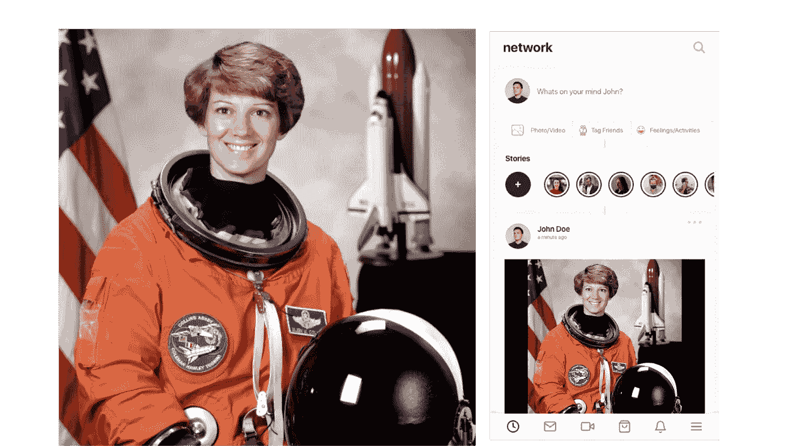
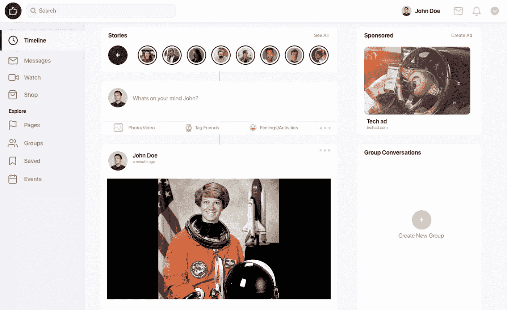

# 脸书刚刚推出了最酷的增强库:Augly

> 原文：<https://towardsdatascience.com/facebook-just-launched-the-coolest-augmentation-library-augly-3910c05db505?source=collection_archive---------11----------------------->

## 基于 Augly 的图像增强



左:原始图像，右:用 Augly 增强后(图像由作者创建)

脸书最近发布了一个增强库，在同一屋檐下结合了几种形式(音频、图像、视频和文本)。数据扩充是一种非常常见的技术，用于增加标记训练数据的大小和多样性，这也有助于建立稳健的模型。这里我只关注我在图像上测试的几个增强功能，但是这个库也可以用于文本和音频。

Augly 更致力于包括脸书在内的社交媒体平台的变革。因此，除了常见的裁剪、翻转之外，其他增强功能包括真人对图像/视频共享平台进行的非常逼真的转换，如叠加图像、表情符号、文本等。根据脸书的新闻稿，其中一个重要的应用是—

> [检测特定内容的精确副本或近似副本](https://ai.facebook.com/blog/using-ai-to-detect-covid-19-misinformation-and-exploitative-content/)。例如，同一条错误信息可能会以稍微不同的形式重复出现，例如一张被裁剪了几个像素的图像，或者用滤镜或新文本覆盖进行了增强。通过用海量数据增强人工智能模型，它们可以学习发现何时有人上传已知侵权的内容，如歌曲或视频。

Augly 是为了阻止人们通过转换(阅读“增强”)数据来逃避自动检测系统而开发的，同一库也用于评估 deepfake 检测模型。

## 使用 Augly 进行图像放大:

以下是我在 8 月份用来测试一些图像增强功能的几个例子。要在 Colab 中尝试这个，首先，我们需要安装 Libmagic 和 Augly

```
!pip install augly!apt-get install libmagic-dev!pip install python-magicimport augly.image as imaugs
```

现在，我们准备使用 Augly，但在此之前，我们需要加载一个示例图像。让我们这样做

```
from skimage import datacamera = data.astronaut()
```

因为 Augly 使用的是 PIL 格式，所以我们来转换一下

```
from PIL import Imagecamera_pil = Image.fromarray(camera)camera_pil.show()
```


图 1:使用 Skimage 加载的原始图像。[此图片可在[此处](https://www.flickr.com/photos/nasacommons/16504233985/)获得，并且没有已知的版权限制。]

这是我们最初的图像。顺便说一下，她叫艾琳·柯林斯，1992 年被选为宇航员，1995 年首次驾驶 STS-63 航天飞机。

首先让我们从一些相对简单的增强功能开始，比如改变视角

```
aug_perspective = imaugs.PerspectiveTransform(sigma=20.0)camera_pil_perspective = aug_perspective(camera_pil)camera_pil_perspective.show()
```


图 1 的透视变换(作者创建的图像)

这里的`sigma`是指目标坐标分布的标准偏差，并且`sigma` 值越高，变换越强烈。

我们也可以随机改变长宽比，如下所示—

```
aug_aspect = imaugs.RandomAspectRatio()camera_pil_aspect = aug_aspect(camera_pil)camera_pil_aspect.show()
```


在图 1 上随机改变纵横比(图片由作者创建)

我们也可以通过增加一些饱和度来增强图像

```
aug_saturation = imaugs.Saturation(factor=5.0)camera_pil_sat = aug_saturation(camera_pil)camera_pil_sat.show()
```


增加图 1 中原始图像的饱和度(由作者创建的图像)

现在让我们转向一些可以使用 Augly 添加的独特转换。首先，我试着叠加条纹，转换后的图像如下—


在原始图 1 上叠加条纹(图片由作者创建)。

用于上述转换的代码是—

```
camera_pil_overlay_stripes = imaugs.overlay_stripes(camera_pil, line_type=’dashed’, line_opacity=0.5, line_color=(120, 0, 200), line_angle=25.0)camera_pil_overlay_stripes.show()
```

叠加文字呢？这也是可能的—


在原图 1 上覆盖迷因文字(图片由作者创建)

我们也可以添加表情符号—

```
camera_pil_overlay_emoji = imaugs.overlay_emoji(camera_pil)camera_pil_overlay_emoji.show()
```


在原图 1 上叠加表情符号(图片由作者创建)。

我们还可以将图像转换成 Instagram 上的截图——


将 Instagram 截屏叠加在原始图 1 上(图片由作者创建)。

这个的代码块如下—

```
import osimport augly.utils as utilsaug_overlay = imaugs.OverlayOntoScreenshot(template_filepath=os.path.join(utils.SCREENSHOT_TEMPLATES_DIR, “mobile.png”))camera_pil_overlay = aug_overlay(camera_pil)camera_pil_overlay.show()
```

通过将叠加图像`mobile.png`更改为`web.png` ，我们可以得到另一个变换—



将 Instagram 网页的屏幕截图叠加在原始图 1 上(图片由作者创建)。

我个人认为，这种转变非常酷，正如脸书在新闻稿中提到的那样，它们有助于理解人类与社交媒体的互动。我相信对语音和语言处理感兴趣的人也会发现这个库非常有用。

感谢脸书将这个库开源，感谢[乔安娜·比顿](https://github.com/jbitton) & [佐伊·帕基波斯](https://github.com/zpapakipos)，我相信他们是这个项目背后的主脑。

你可以在我的笔记本里找到这里使用的所有代码，我把它们放在参考资料里了。保持坚强，干杯！！

页（page 的缩写）Augly library 的合著者之一 Joanna B. 在这篇文章中留下了非常友好的评论。所以，多亏了她！正如我在帖子中提到的，这里是她的 GitHub。

## 参考资料:

[1][8 月脸书新闻发布会](https://ai.facebook.com/blog/augly-a-new-data-augmentation-library-to-help-build-more-robust-ai-models/)

【2】[八月:GitHub](https://github.com/facebookresearch/AugLy)

[3] [链接到我的笔记本](https://github.com/suvoooo/Machine_Learning/blob/master/Augly_Try.ipynb)获取此处使用的代码。