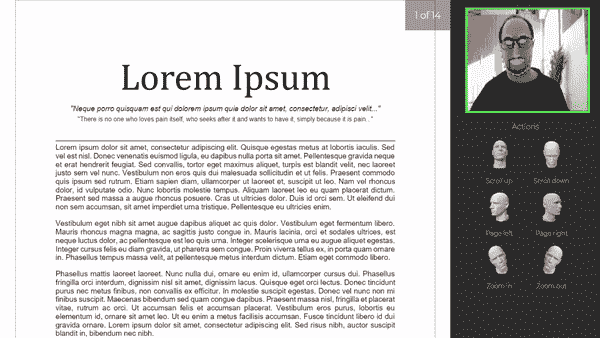
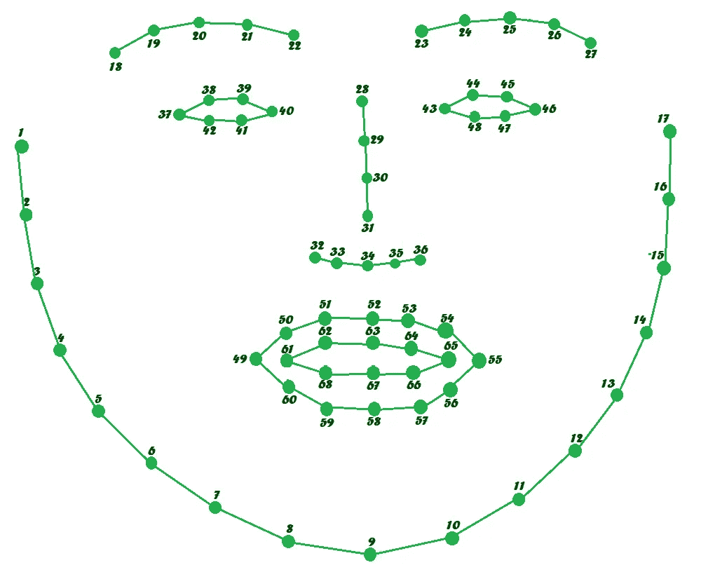
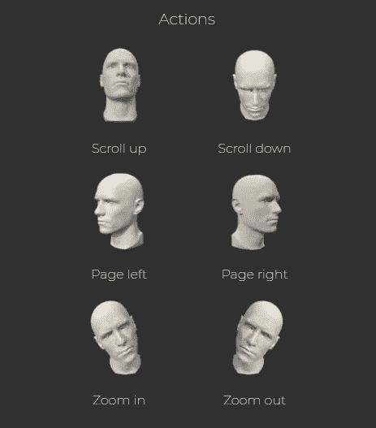
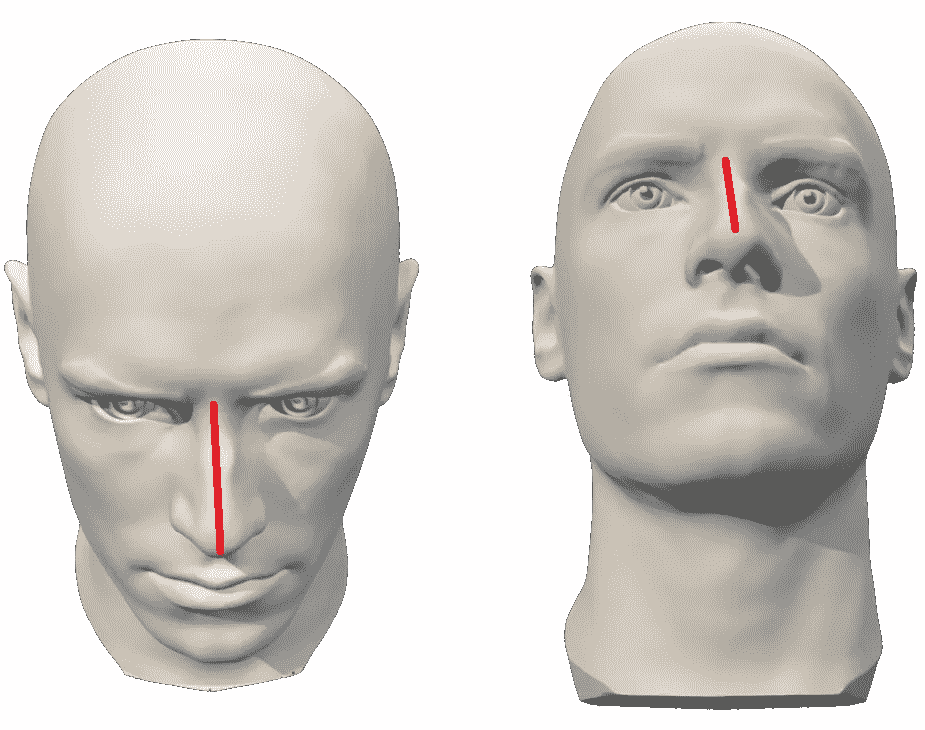
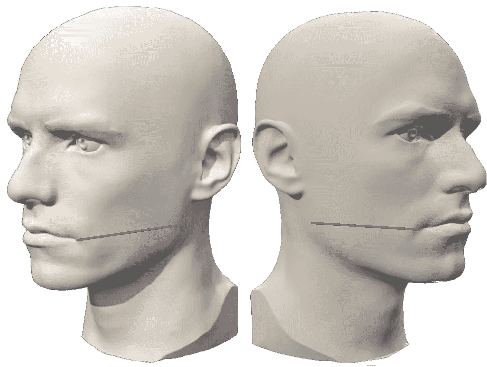
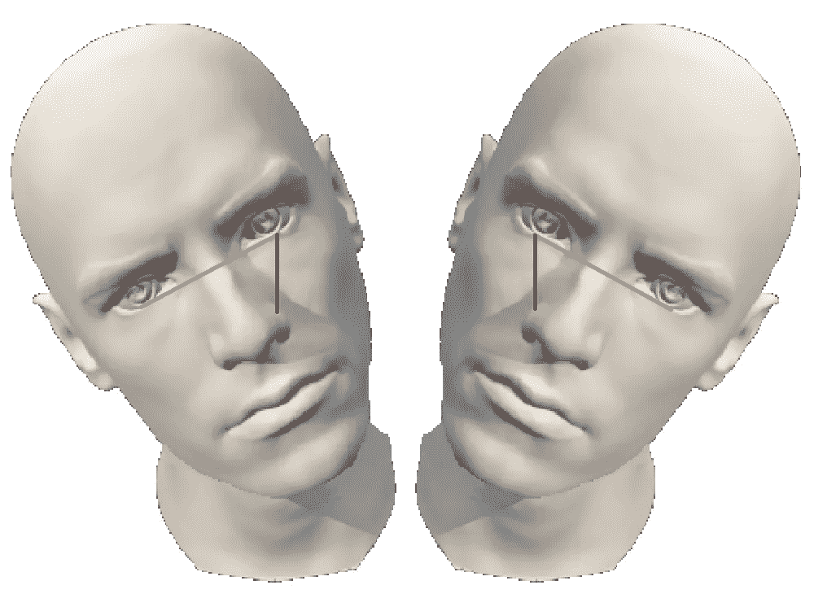
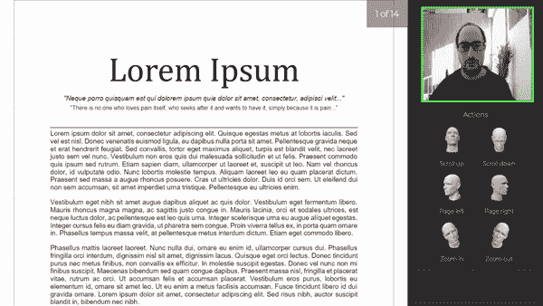

# FacePDFViewer—一种 PDF 查看器，可通过使用面部标志检测的头部运动来控制

> 原文：<https://towardsdatascience.com/facepdfviewer-a-pdf-viewer-controllable-by-head-movements-using-facial-landmark-detection-ed7a91073bd1?source=collection_archive---------23----------------------->

## 计算机视觉

## 一个使用 face-api.js 的实时 web 工具，通过头部运动在浏览器中滚动 PDF 文档。

照片由 [Cookie 在](https://unsplash.com/@cookiethepom?utm_source=medium&utm_medium=referral) [Unsplash](https://unsplash.com?utm_source=medium&utm_medium=referral) 上的 Pom 拍摄

人脸标志检测在计算机视觉中有许多有用的应用，例如人脸交换、眨眼检测、人脸对齐、情感识别和头部姿态估计。

在本文中，我将向您展示我的项目“FacePDFViewer”。我开发了一个简单的工具，可以让你在屏幕上浏览 PDF 文档，而不需要使用鼠标，只需要移动头部。
你可以在我的 [GitHub 库](https://github.com/fabridigua/FacePDFViewer)中找到带有运行指令的源代码，在 GitHub.io 的[这里](https://fabridigua.github.io/FacePDFViewer/)有一个现场演示

软件用 *Javascript* 编写，使用 [**face-api.js**](https://justadudewhohacks.github.io/face-api.js) 进行人脸地标检测，使用[**PDF js**](https://github.com/mozilla/pdf.js)**进行 PDF 文档渲染。**

****

**FacePDFViewer 在运行。作者图片**

## **项目结构**

**该软件由 3 个实时操作组成:**

1.  **人脸标志检测**
2.  **头部姿态估计**
3.  **PDF 渲染**

**PDF 渲染是使用开源的 *pdfjs* 库完成的，该库使用 html *canvas* 元素作为文档的容器。在本文中，我将讨论前两个操作，同时我会参考 [pdfjs 示例](https://mozilla.github.io/pdf.js/examples/)进行 PDF 渲染，因为我在这个项目中使用这个库是非常基本的。**

# **人脸标志检测**

**检测面部标志意味着使用*形状预测器*沿着面部图像寻找重要的*面部结构*。**

> *****注*** *:物体检测中有一个基本的经验法则:*由大到小*。这意味着，在寻找图像中的小细节之前，我们必须找到放置它们的“容器”,这既是出于性能原因，也是为了减少假阳性。在这种情况下，在检测面部标志之前，我们必须首先定位面部。***

**最准确的人脸检测器之一被认为是 **SSD** (单镜头多框检测器)，这是一种基于 MobileNetV1 的 CNN，它计算图像中每个人脸的位置，并返回每个人脸的边界框和概率；face-api.js 提供了一个预训练的模型(ssd_mobilenetv1_model)。**

**用 face-api.js 人脸检测非常容易。首先，我们必须加载模型，然后我们可以检测人脸和地标。注意，face-api.js 方法是异步的，所以它们返回一个 javascript [promise 对象](https://www.w3schools.com/js/js_promise.asp)。**

**方法 *detectSingleFace* 仅在输入图像中寻找一张脸，并接受画布元素(但也包括视频和图像)作为输入；然后使用*withfanelandmarks*返回一个带有面部边界框和一组 68 个标志点的对象。**

**为了实时获取网络摄像头图像，软件使用了 [Web API](https://developer.mozilla.org/en-US/docs/Web/API) 的 *mediaDevice* 模块的 *getUserMedia* 方法。**

**由 face-api.js 检测的面部标志存在于沿着面部的 68 个关键点中，使用仅具有 350kb 大小的模型*face _ landmark _ 68 _ model-shard 1**。*从 [face-api.js 文档](https://github.com/justadudewhohacks/face-api.js/blob/master/README.md#68-point-face-landmark-detection-models)中，作者说该模型已经在大约 35k 张人脸图像的数据集上进行了训练，这些图像标有所有 68 个人脸标志点。由于这些原因，这种检测器非常适合实时应用，因为它非常轻便、快速而又精确。**

****

**68 面地标图。作者图片**

**这个模型覆盖了最重要的面部区域:嘴、眉毛、眼睛、鼻子、下巴。我们将分析它们来进行头部姿态估计。**

# **头部姿态估计**

****

**软件提供的可能操作。图片作者。**

**该软件实现 6 种可能的动作，实时识别用户头部的 3 种运动。**

****

**移动检测基于三个*观察值*:**

1.  ****当用户向上/向下看时，鼻子长度相对于*中间*位置变化。****

****

**当用户向上/向下看时，鼻子长度改变。作者图片**

**当用户向下看时它变大，当用户向上看时它变小。因此，这个想法是实时测量点 **31** 和 **34** 之间的距离(见地标图像)，将其放入缓冲区，并在用户向上或向下看的场景超过 *n* (固定为 *n* )时进行观察。**

> *****注*** *:考虑到点* ***1*** *和* ***17*** *(颧骨)使* ***的值与网络摄像头*** *的距离无关，对距离值进行归一化。***

**2.**当用户向左/右看时，左/右颌变得非常靠近嘴，直到它消失；与此同时，从另一边看，相应的点会移开。****

> *****注*** *:地标探测器始终返回 68 个点的位置，即使它们不可见，因为能够*预测*它们的位置。***

****

**当用户向左/向右看时，嘴巴和下巴发生变化。作者图片**

**所以这里的想法是观察左侧的点 **4** 和 **49** 与右侧的点 **14** 和 **55** 之间的距离。特别是，系统仅检查 **x 轴**的距离，以使其适合任何不同的头部倾角。这次没有缓冲，动作求值一次；然而，当该事件被触发时，有一个 1 秒钟的计时器，在此期间不能更改页面。**

**3.**当用户向左/右倾斜头部时，y 方向上的距离变大。****

****

**当头部倾斜时，y 方向上两眼之间的距离增加**

**这个想法是观察眼睛的 y 坐标:通常，眼睛之间在 y 方向上的距离(点 **42** 和 **47** 被考虑)几乎为零。当头部倾斜时，两眼之间的 y 距离增加。当距离大于某个阈值时，我们可以简单地看哪只眼睛的 y 坐标更高，以了解头部倾斜的方向。**

**同样，我们必须将距离标准化，使其独立于到网络摄像头的距离。**

**重要的是要注意，软件使用许多阈值来理解用户何时真正进行头部运动。这些值是根据经验得出的，您可以尝试调整它们来改变系统的灵敏度或延迟。**

**最重要的是 FaceDetector:例如，减少 *buffer_len* 将加快系统对用户的**反应**，但也有风险要考虑非常小的移动，使文档垂直移动太多；增加太多 *buffer_thresh* 滚动*事件将需要更大的移动，但是如果你面对许多误报，这可能是一个好的解决方案。然而，我邀请你尝试不同的值，因为这些值是凭经验得出的。***

## **用小模型做实验**

**在 face-api.js 预训练模型中有*标准*和*微小*模型权重。正如你可能猜到的，微型的比标准的小，但是没有标准的精确。在这个项目中，我使用默认的标准模式，但这样一来，软件消耗了大量的 CPU 能力和内存，在一些功能不太强大的电脑可能会有延迟，错误或闪烁的影响。**

**为了解决这个问题，我试图减少场景分析的次数(现在系统每秒钟寻找 3 次运动变化)。但是仍然有大量的 CPU 消耗。所以我决定试试小模型。**

**现在加载的模型权重为 4:**

*   ***ssd_mobilenetv1_model* (人脸检测标准)**
*   ***tiny _ face _ detector _ model*(tiny 用于人脸检测)**
*   ***face_landmark_68_model* (地标检测标准)**
*   ***face _ landmark _ 68 _ tiny _ model*(tiny 用于地标检测)**

**从我的尝试来看，在我看来，准确性的降低是显著的，因为使用标准检测器，假阳性率几乎为零，而使用微型检测器，检测不那么稳定和鲁棒。**

****

**用微型探测器做实验。作者图片**

**我决定保留两种可能性，让用户根据自己的硬件做出选择；然而，默认模型是标准模型。**

## **在幕后**

**这是一个非常小的项目，但我希望它能向你展示计算机视觉的力量。所有的计算都是实时进行的，但在幕后，face-api.js 使用 [Tensorflow.js](https://www.tensorflow.org/js) 核心来运行 CNN，所获得的权重对超过 35K 的标记图像进行训练，用于地标检测，几乎 [400K 用于人脸检测](http://shuoyang1213.me/WIDERFACE/)。**

**你可以在 github.io 中找到这里的演示[。](https://fabridigua.github.io/FacePDFViewer/)**

**警告:出于安全原因，github.io 禁止上传文件，因此您不能上传自己的文档，只能从 github 存储库中加载文件([提供原始 URL](https://help.data.world/hc/en-us/articles/115006300048-GitHub-how-to-find-the-sharable-download-URL-for-files-on-GitHub) )或使用演示 PDF 文件尝试该工具。
如果你想使用自己的 PDF，你必须下载资源库并在你的电脑上本地运行该工具。**

# **参考**

**[1] Howard，Andrew G .等人，“移动网络:用于移动视觉应用的高效卷积神经网络” *arXiv 预印本 arXiv:1704.04861* (2017)。**

**[2]v .卡泽米和 j .沙利文(2014 年)。用回归树集合进行一毫秒人脸对齐。IEEE 计算机视觉和模式识别会议论文集(第 1867-1874 页)。**