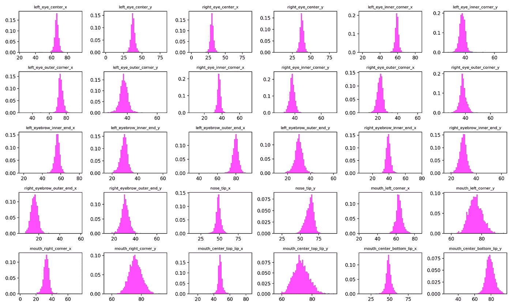
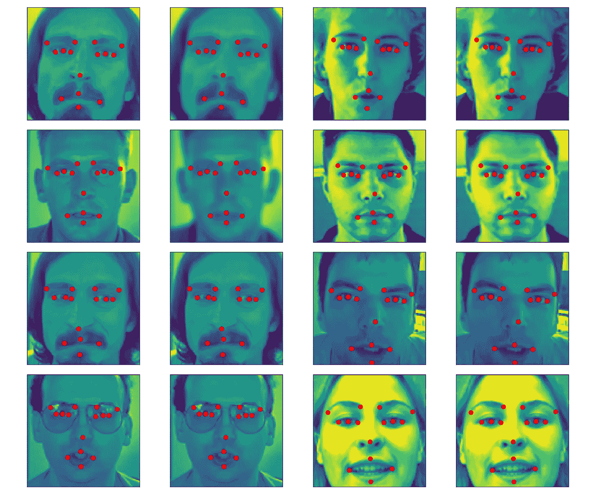
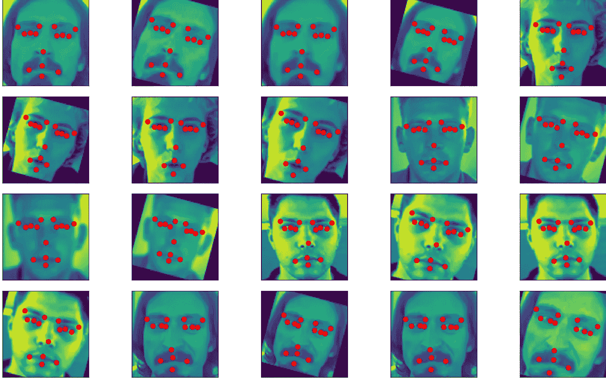
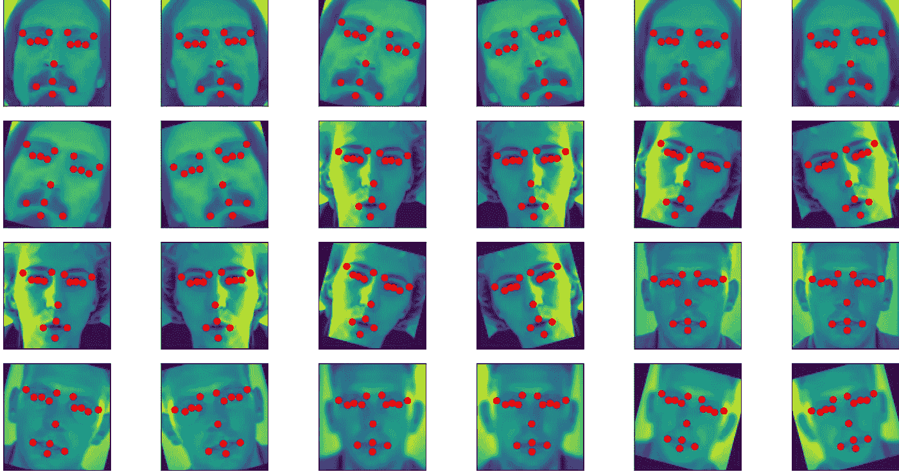
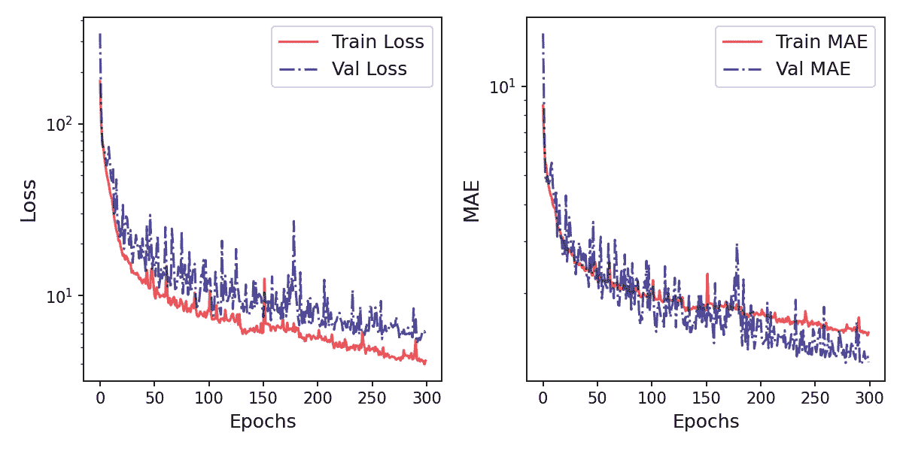
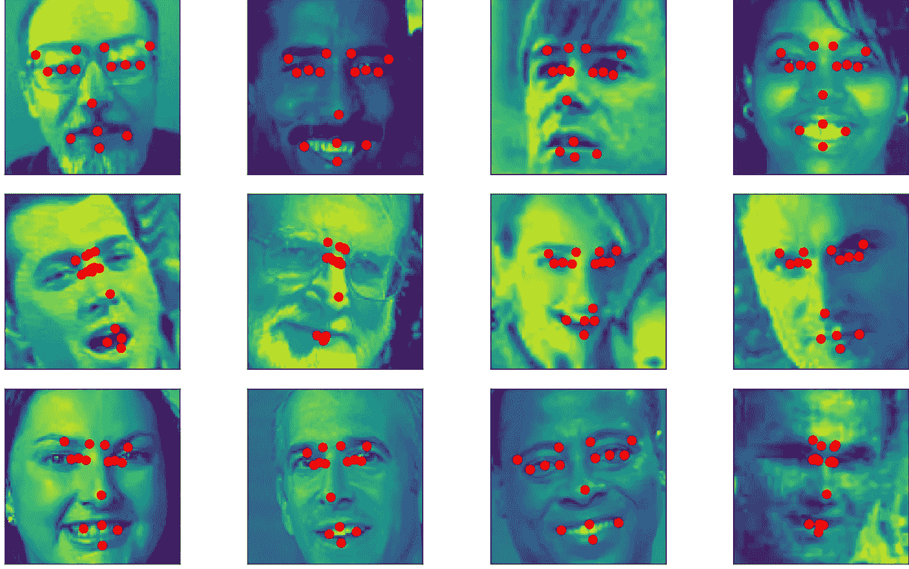

# 面部关键点检测:图像和关键点增强

> 原文：<https://towardsdatascience.com/facial-keypoints-detection-image-and-keypoints-augmentation-6c2ea824a59?source=collection_archive---------10----------------------->

## 使用 Imgaug 库进行增强


日落！图片作者[作者](https://www.flickr.com/photos/suvob/48831928047/in/dateposted-public/)

由于深度神经网络(DNN)具有大量的可学习参数，因此需要大量的标记数据，以便这些参数能够很好地推广到我们手头的任务。数据扩充是一种非常常见的技术，用于增加标记训练数据的大小和多样性。在深度学习专业化课程中，吴恩达提到，与其他领域不同，在计算机视觉中，拥有更多数据几乎总是更好。图像增强也已经成为一种常见的隐式正则化技术，以解决 DNNs 中的过拟合问题。通常在图像增强中，我们使用翻转、旋转、缩放等的组合。但是在关键点检测任务中，我们还需要随着图像增加关键点。所以这篇文章是关于如何在关键点检测任务中增加训练数据的简单描述。链接到完整的笔记本包括培训 DNN 在文章的结尾。让我们开始吧—

## 面部关键点数据:

我们将使用来自 [Kaggle](https://www.kaggle.com/c/facial-keypoints-detection/data) 的数据集，并引用那里的话——

> 每个预测的关键点由像素索引空间中的(x，y)实值对指定。共有 15 个关键点，代表面部的以下元素:
> 
> 左眼中心、右眼中心、左眼内角、左眼外角、右眼内角、右眼外角、左眼外角、左眉内端、左眉外端、右眉内端、右眉外端、右眉外端、鼻尖、嘴左角、嘴右角、嘴中上唇、嘴中下唇

让我们加载数据—

```
train_read = pd.read_csv(data_path + '/training.csv', sep=',')
print ('training data shape; ', train_read.shape)>>> training data shape;  (7049, 31)
```

在训练数据中有 7049 个图像，但是问题是在数据集中有许多空值。准确地说，在 31 列中，除了‘nose _ tip _ x’、‘nose _ tip _ y’和‘Image’列之外，所有列都有空值。让我们检查一下关键点的分布—



图一。关键点的分布(图片由作者提供)

关键点遵循正态分布，因此，数据插补的最简单策略之一是用分布平均值替换 NaN 条目。*对于数据填补，从最大似然的角度来看，有必要先将数据拆分成训练测试，然后进行转换，否则，我们很容易导致数据泄漏。*然而，用 Colab 中的 7049 幅图像+增强图像来训练一个网络是非常耗时的，所以这里我决定只使用干净的数据。

```
train_clean = train_read.dropna(axis=0, how=’any’, inplace=False)train_clean = train_clean.reset_index(drop=True)print (‘data-frame shape with no null values: ‘, train_clean.shape)>>> data-frame shape with no null values:  (2140, 31)
```

正如我们看到的，仅使用干净的数据大大减少了训练规模(从 7049 幅图像到 2140 幅)，在这里，增强将非常方便。但是在增强之前，我们需要做更多的处理。image 列包含字符串形式的像素值，字符串之间有一个空格。

```
clean_imgs = []for i in range(0, len(train_clean)):x_c = train_clean[‘Image’][i].split(‘ ‘) # split the pixel values based on the spacex_c = [y for y in x_c] # create the listed pixelsclean_imgs.append(x_c)clean_imgs_arr = np.array(clean_imgs, dtype=’float’) 
```

从 Kaggle 中的数据描述来看，图像有维度(96，96)，所以多几步—

```
clean_imgs_arr = np.reshape(clean_imgs_arr, (train_clean.shape[0], 96, 96, 1))train_ims_clean = clean_imgs_arr/255\. # scale the images
```

让我们从数据框中获取关键点—

```
clean_keypoints_df = train_clean.drop(‘Image’, axis=1)clean_keypoints_arr = clean_keypoints_df.to_numpy()
```

让我们定义一个函数来帮助我们一起可视化图像和关键点—

```
def vis_im_keypoint_notstandard(img, points, axs):   axs.imshow(img.reshape(96, 96)) xcoords = (points[0::2] + 0.) ycoords = (points[1::2] + 0.) axs.scatter(xcoords, ycoords, color=’red’, marker=’o’)
```

太好了！现在我们都准备进入扩增。

## 线性对比度和高斯模糊:

首先，我们在关键点不受影响的地方做了一些增强。使用 [Imgaug](https://imgaug.readthedocs.io/en/latest/index.html) 库，我们将在图像上添加高斯模糊和线性对比度。正如您所理解的，我们不需要单独考虑关键点，因为它们不会受到影响。让我们看看下面的代码—

添加增强:高斯模糊和噪声

`LinearContrast`修改图像的对比度，`GaussianBlur`增强器用于使用高斯内核模糊图像，`sigma`是高斯内核的标准偏差。通过`Sometimes`，模糊仅适用于所有图像中随机 80%的图像。我们可以将生成的原始和增强图像可视化如下—



图二。通过添加来自 Imgaug 库的[高斯模糊](https://imgaug.readthedocs.io/en/latest/source/api_augmenters_blur.html#imgaug.augmenters.blur.GaussianBlur)和[线性对比度](https://imgaug.readthedocs.io/en/latest/source/overview/contrast.html)进行增强。(图片由作者提供)

## 缩放和旋转图像和关键点:

为了在我们的数据集中包含旋转和缩放的图像，我们还需要相应地改变关键点。这是主要原因之一，不建议在这个问题中使用[Keras imagedata generator](https://keras.io/api/preprocessing/image/)类。在这里，Imgaug 库非常方便。与其描述如何正确地完成它的步骤，我不如分享下面的代码块—

同时旋转和缩放图像和关键点。

我们使用`Sequential`定义由旋转和缩放图像组成的增强序列。旋转角度设置为 15 度，缩放范围设置为原始图像的 80%到 120%。图像和相应的关键点将以这些范围之间的任意数量随机增加。让我们想象一下结果—



图三。通过添加旋转和缩放来增强图像和关键点。(图片由作者提供)

## 水平翻转:图像和关键点:

与之前类似，我们可以使用 Imgaug 库进行水平翻转，但是显式编写代码也相对容易。对于图像的水平翻转，我使用了`[numpy fliplr](https://numpy.org/doc/stable/reference/generated/numpy.fliplr.html)`；对于关键点，在水平翻转中，y 坐标不会改变，但 x 坐标会改变。由于图像的维数是(96，96)，我们通过做(96-x)得到翻转的 x 点。下面是代码块—

包括一切，我们现在有完整的数据集。从 2140 张图片开始，现在我们有 17120 张图片。让我们想象一下其中的一些—



图 4。通过添加水平翻转来增强图像和关键点。(图片由作者提供)

我们在扩增结束时打乱数据—

```
from sklearn.utils import shuffleaug_ims_train_final, aug_points_train_final = shuffle(aug_ims_train_clean_g3, aug_points_train_clean_g3)
```

## 训练“类似盗梦空间”的深度神经网络:

扩充之后，我们现在开始建立 DNN 模型并准备培训。下面是我使用的神经网络结构，它是从最初的 InceptionV3 结构稍微简化的。


图五。盗梦空间就像‘深度神经网络’。(图片由作者提供)

我们也添加一些`‘Callbacks’` 如下—

```
class customCallbacks(tf.keras.callbacks.Callback):
  def on_epoch_end(self, epoch, logs=None):
    self.epoch = epoch + 1
    if self.epoch % 50 == 0:
      print ('epoch num {}, train acc: {}, validation acc:                      {}'.format(epoch, logs['mae'], logs['val_mae']))reduce_lr = tf.keras.callbacks.ReduceLROnPlateau(monitor='val_mae', factor=0.8,
                              patience=25, min_lr=1e-5, verbose=1)
```

下一步是编译和训练模型—

```
face_key_model2_aug.compile(loss='mse', 
                       optimizer=Adam(learning_rate=3e-3), 
                       metrics=['mae'])face_key_model2_aug_train_clean = face_key_model2_aug.fit(aug_ims_train_final, aug_points_train_final, 
                                                  validation_split= 0.05, 
                                                  batch_size=64, epochs=300, 
                                                  callbacks=[customCallbacks(), reduce_lr], 
                                          verbose=0)
```

训练和验证曲线绘制如下，作为时期的函数—



图 6:左图:超过 300 个时期的训练和验证损失。右图:与左图相同，但平均绝对误差不同。(图片由作者提供)

下一步是预测测试图像的关键点—

```
predict_points_aug2_clean = face_key_model2_aug.predict(test_ims)

print ('check shape of predicted points: ', predict_points_aug2_clean.shape)>>> check shape of predicted points:  (1783, 30)
```

所以有 1783 张测试图像，我们可以看到下面的一些预测—

```
fig = plt.figure(figsize=(10, 8))
npics= 12
count = 1
for i in range(npics):
  # ipic = i
  ipic = np.random.choice(test_ims.shape[0])
  ax = fig.add_subplot(npics/3 , 4, count, xticks=[],yticks=[])
  vis_im_keypoint_notstandard(test_ims[ipic], predict_points_aug2_clean[ipic], ax)
  count = count + 1

plt.tight_layout()
plt.savefig(data_path+'/prediction_keypoints.png', dpi=200, bbox_inches = 'tight', pad_inches = 0)
plt.show()
```



图 7。测试图像上的预测关键点。(图片由作者提供)

## 结论:

最后，我想强调的是，这篇文章更专注于数据增强部分，而不是明确地专注于在 Kaggle 中取得更好的成绩。一篇精彩的博文可以在[这里](https://fairyonice.github.io/Achieving-top-5-in-Kaggles-facial-keypoints-detection-using-FCN.html)找到，它讨论了如何在 Kaggle 中获得高分的一步一步的方法。由于我们专注于预测图像中的所有关键点，因此有一些帖子介绍了如何针对人脸上的单个关键点训练网络，并将它们组合起来以获得更好的结果。我希望这篇文章能帮助你开始解决这类问题，然后根据资源和时间，你可以尝试各种东西。

保持坚强，干杯！！

[1] [GitHub 链接](https://github.com/suvoooo/Learn-TensorFlow/blob/master/Facial_Keypoint_Kaggle.ipynb)获取完整笔记本。