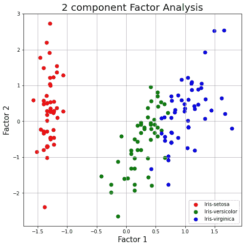

# 混合数据的因子分析

> 原文：<https://towardsdatascience.com/factor-analysis-of-mixed-data-5ad5ce98663c?source=collection_archive---------10----------------------->

## 对具有连续和分类特征的数据使用 FAMD

图片来自 [Unsplash](https://unsplash.com/photos/YeUVDKZWSZ4)

> **简介**

大型数据集对于数据分析师或数据科学家来说可能是一场噩梦，因为其中存在许多线性相关的要素。不必要的数据特征会降低 ML 模型的性能并增加训练预算。有一些技术可以用来减少能够充分解释大部分方差的重要特征的数量。在本文中，我将介绍针对数据集的因子分析技术，我们可能有兴趣减少关键要素的数量，从而使用最有效的数据成分进行建模。

> **Scikit Learn 的 PCA**

大型数据集必须使用简单的技术如主成分分析(PCA)来降低维数。这是以准确性为代价的，但增加模型训练的灵活性和数据可视化的简单性是核心目标。PCA 不是分析数据集重要特征的“特征选择”。我在下面的文章中使用 Shapash 和 Scikit-Learn 描述了特性选择。

<https://medium.com/geekculture/feature-selection-in-large-datasets-fc27a7e8e388>  

PCA 来自一个完全不同的世界，但目标是一样的:减少维数。PCA 通过标准化这些值、构建协方差矩阵并由此获得特征值和特征向量来获得分量。PCA 得出解释数据集中大多数可变性的最终成分。因此，这些新组件可以被认为是原始值的线性组合或复合。第一个成分解释了最高的可变性，第二个成分具有第二高的解释比率。我们可能非常熟悉 iris 数据集，它有四个数字列和一个花卉种类的目标列。PCA 适用于数据集的数字列，并且总是建议对连续变量执行 PCA。当进行主成分分析时，它仅在两个维度上产生物种间的明显差异。

虹膜数据集上的主成分分析

> **Scikit Learn 的因子分析**

Sci-kit-Learn 还提供了另一种与 PCA 非常相似的降维方法。如前所述，主成分分析侧重于初始数据的线性组合，新的成分非常不相关。另一方面，因子分析指导对数据潜在特征的分析，并推导出成分。假设潜在因子保留在低维空间中，并且通过添加具有潜在因子的高斯噪声来获得新的观测值。

虹膜数据集的因子分析

结果与 PCA 输出非常相似，只是 x 轴和 y 轴刻度不同。

> **Scikit Learn 的独立成分分析**

Scikit-Learn 提供了分析数据的选项，其中观察数据的潜在因素不是高斯型的。对于这种情况，我们可以使用 FastICA 模块。

虹膜数据集上的独立分量分析

这里，沿着独立组件 2 也可以清楚地区分物种。

> **如果特征是绝对的呢？**

PCA 对连续数据非常有效，但是真实世界的数据是连续数据和分类数据的混合。有时，分类数据使用一键编码方法进行编码，但不推荐使用这种方法。PCA 背后的核心思想是以一定的准确性为代价来确定解释大部分可变性的成分。当我们通过编码获得二进制数据时，可变性的概念就崩溃了。

PCA 可能对编码数据起作用，但本质上这并不能使它成为一个好的分析。例如，住房数据有几个分类特征，这些特征首先被编码、标准化并输入 PCA 分析。

分类数据的主成分分析

最初，这似乎是一个很好的分析，显示了两个最主要的组成部分，但这种编码不建议在 categorial 上使用。相反，应该利用混合数据的因子分析(FAMD)等技术。FAMD 旨在处理混合类型的数据。

> **FAMD 利用王子**

王子包有一些内置的因素分析方法，包括 FAMD。我们可以继续用同样的住房数据。

当选择“HouseStyle”作为拆分因子时，我们得到下图。

FAMD 住房数据集

显然，在数据点上有一些重叠，导致组分 1 仅解释了 8%的可变性，而组分 2 解释了约 3%的可变性。FAMD 结合主成分分析和多成分分析技术进行分析。MCA 代表多重对应分析，特别适用于多种分类因素。如果数据集按具有连续值和分类值的不同要素进行分组，则可以部署另一种称为 MFA(多因素分析)的技术。

让我们选择葡萄酒数据集，它由两个分类变量和几个数字变量组成，描述列出的葡萄酒的质量。一旦将 FAMD 应用于该数据集并在“土壤”类型上进行分割，数据点就可区分。

FAMD 数据集

土壤上的 FAMD 分析分裂

显然，按土壤划分时，有不同的群体。第一个因素解释了 26%，第二个因素解释了 22%的可变性。

> **结论**

在本文中，我讨论了使用 FAMD 技术对大型数据集进行降维。可以通过几种特征选择方法来分析数据集以提取最重要的特征，或者可以利用成分/因素分析技术。不建议对分类数据应用常规 PCA。在处理混合数据时，FAMD 是处理不必要因素和降低数据维数的推荐方法。

[Github](https://github.com/mdsohelmahmood/data-science/blob/master/_notebooks/2021-07-11-Factor_Analysis_of_Mixed_Data.ipynb)