# 基于 R 和 Python 的“女子田径记录”数据因子分析

> 原文：<https://towardsdatascience.com/factor-analysis-on-women-track-records-data-with-r-and-python-6731a73cd2e0?source=collection_archive---------6----------------------->

## [实践教程](https://towardsdatascience.com/tagged/hands-on-tutorials)

## 不仅仅是降维，而是发现潜在变量

由[尼古拉斯·霍伊泽](https://unsplash.com/@nhoizey?utm_source=unsplash&utm_medium=referral&utm_content=creditCopyText)在 [Unsplash](https://unsplash.com/s/photos/athletic-woman?utm_source=unsplash&utm_medium=referral&utm_content=creditCopyText) 上拍摄的照片

**因子分析(FA)** 和**主成分分析(PCA)** 都是降维技术。因子分析的主要目的不是降低数据的维度。因子分析是发现潜在变量的有用方法，这些潜在变量不是直接在单个变量中测量的，而是从数据集中的其他变量中推断出来的。这些潜在变量被称为 ***因素*** 。因此，因子分析是一种测量潜在变量的模型。例如，如果我们在我们的模型中发现两个潜在变量，则称之为一个 ***双因素模型*** 。FA 的主要假设是在我们的数据中存在这样的潜在变量。

今天，我们使用与主成分分析非常相似的主成分方法进行因子分析。我们在这里使用的数据是代表 55 个国家的七个不同项目的国家女子记录。你可以点击下载数据集[。数据集如下所示。](https://drive.google.com/file/d/1S3Ve0pshb-42UIcOKaZaBHHJZ7Wbo4Kx/view?usp=sharing)

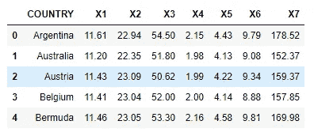

前 5 行女性跟踪记录数据

变量的描述如下。

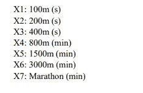

## 先决条件

本文假设你有主成分分析的知识。如果你没有，请阅读我以前的文章:

*   [用 R 和 Python 对乳腺癌数据进行主成分分析](/principal-component-analysis-for-breast-cancer-data-with-r-and-python-b312d28e911f)
*   [使用 Scikit-learn 进行主成分分析(PCA)](/principal-component-analysis-pca-with-scikit-learn-1e84a0c731b0)
*   [PCA 背后的统计和数学概念](https://medium.com/data-science-365/statistical-and-mathematical-concepts-behind-pca-a2cb25940cd4)

# 使用 R 对女性跟踪记录数据执行 FA

## 为数据集选择最佳数量的因子

这里，我们使用 **principal()** 函数对数据集应用 FA。 **principal()** 函数使用主成分方法执行因子分析。

下面的代码块对我们的数据执行 FA。

目前旋转设置为 ***无*** 。除此之外，我们要求我们的数据有 4 个因素。稍后，我们可以请求小于 4 的最佳因子数。covar 参数非常重要。通过设置 **covar = FALSE** ，FA 过程应该使用**相关矩阵**而不是协方差矩阵。从相关矩阵中导出的因子与从标准化(缩放)变量的协方差矩阵中导出的因子相同。因此，**通过设置 covar = FALSE，数据将在分析前居中并缩放，即使数据集特征之间的比例存在显著差异，我们也不需要对数据进行显式特征缩放**。

让我们通过运行 **fa$values** 得到特征值。

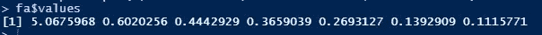

将这些值四舍五入到小数点后 3 位将得到:

因此，

*   单独用第一个因素解释的方差为:(5.068/7) x 100% = **72.4%**
*   前两个因素共同解释的方差为:((5.068+0.602)/7)x 100% =**81%**
*   前三个因素加在一起解释的方差为:((5.068+0.602+0.444)/7)x 100% =**87.34%**

诸如此类…

让我们创建 scree 图，它是特征值的可视化表示。

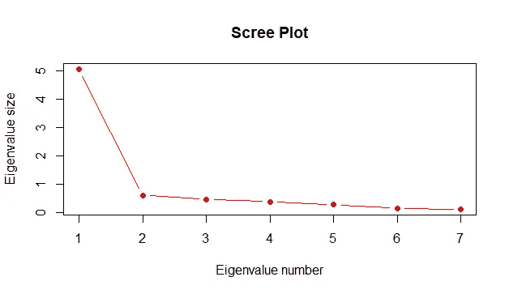

弯曲明显发生在第二特征值处。根据 ***凯泽*** 法则，建议保留特征值大于 1.0 的分量。我们得到了特征值，只有第一个大于 1.0。保持对应于特征值 5.068 的第一因子仅解释了数据中约 72.4%的方差。所以，我们也保留第二个。然后，前两个因素一起解释了数据中 81%的方差。

因此，我们为我们的数据保留两个因素。

## 找出数据是否需要因子旋转

我们用 ***nfactors = 2*** 再表演一次 FA(之前， ***nfactors = 4*** )。这是因为我们决定只保留我们数据中的两个因素。然后，我们得到以下因素载荷。

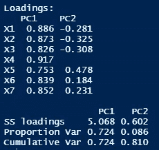

通过查看输出，我们可以确定原始因子加载没有产生可解释的因子。这是因为每个因素上的负荷分布不均匀。因此，我们尝试因子旋转，它是原始因子的正交变换。因子轮换是为了解释的目的。通过在 **principal()** 函数中设置 ***rotate = varimax*** ，我们用 ***varimax*** 因子旋转再次执行 FA。然后，我们再次得到因子载荷。

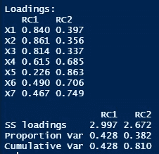

## 计算所选模型的因子载荷、公度和特定方差

运行 ***fa2*** 模型后，会得到如下输出。

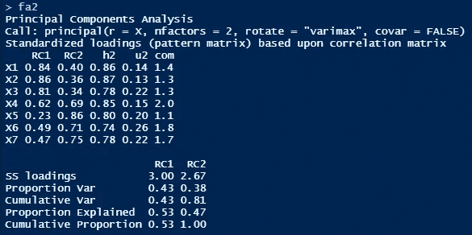

上述输出在一个表中包含旋转因子加载、公因子和特定方差。 **RC1** 和 **RC2** 列表示我们选择的两个因素的载荷。 **h2** 列代表每个变量的公因子。u2 列代表每个变量的具体方差。运行 **fa2$loadings** 和 **fa2$communality** 也将分别给出旋转因子加载和 communality。

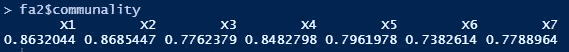

## 解释共性值和特定差异

**【社群主义】**

*   **X1:** 关于**X1 的 86%** 的变异性由我们选取的两个因子来解释。
*   **X2:** 关于**X2 87%**的变异性是由我们选取的两个因子来解释的。
*   **X3:** 关于**X3 78%**的变异性是由我们选取的两个因子来解释的。
*   **X4:** 关于**X4 的 85%** 的变异性由我们选取的两个因子来解释。
*   **X5:** 关于**X5 的 80%** 的变异性由我们选取的两个因子来解释。
*   **X6:** 关于**X6 的 74%** 的变异性由我们选取的两个因素来解释。
*   **X7:** 关于**X7 的 78%** 的变异性是由我们选取的两个因素来解释的。

**显然，我们选择的两个因素**解释了所有变量的高方差。

**【具体差异】**

*   具体因素对 **X1** 的影响约为 **14%** 。
*   特定因素对 **X2** 的影响约为 **13%** 。
*   具体因素对 **X3** 的影响约为**的 22%** 。
*   具体因素对 **X4** 的影响约为 **15%** 。
*   特定因素对 **X5** 的影响约为 **20%** 。
*   具体因素对 **X6** 的影响约为 **26%** 。
*   具体因素对 **X7** 的影响约为 **22%** 。

## 确定模型中的因素

让我们再次看看旋转因子加载。

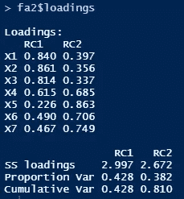

很明显，变量 **X1、X2、X3 定义了因子 1** (因子 1 的高负荷，因子 2 的相对小负荷)，而变量 **X4、X5、X6 和 X7 定义了因子 2** (因子 2 的高负荷，因子 1 的相对小负荷)。但是变量 **X4 具有由两个因子**表示的属性方面(两个因子上近似相等的负载)。

为了给这两个因素命名，让我们把重点放在该领域的领域知识上。在给定的问题中，变量 X1，X2，…，X7 具有以下含义。

给定的数据集代表了代表 55 个国家的妇女在 7 个不同事件中的国家轨迹记录。一般在短距离跑(如 100 米、200 米、400 米)中，运动员应主要关注 ***速度*** 。在长跑中(如 1500 米、3000 米、马拉松)，运动员应主要关注 ***耐力*** 或 ***耐力*** 。在我们的分析中，**因子 1 代表短途轨迹记录**(因为 X1、X2 和 X3 定义了因子 1)，而**因子 2 代表长途轨迹记录**(因为 X4、X5、X6 和 X7 定义了因子 2)。因此，我们可以给这两个因素起相应的名字如下。

*   因子 1 → **速度因子**
*   因素 2 → **公差**或**耐久性因素**

但也要注意，参加 800 米项目的运动员(以 X4 为代表)应该在速度和耐力之间保持良好的平衡。这是因为 X4 在这两个因素上的负载大致相等。

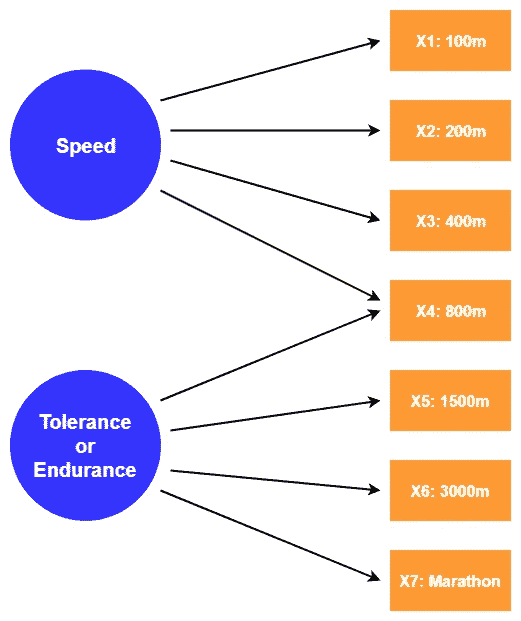

作者图片

这些是可操作的见解，可以通过对“妇女跟踪记录”数据进行因子分析(FA)来获得。

# 用 Python 对女子田径记录数据进行 FA

在 Python 中，可以使用 **factor_analyzer** 库，在 matplotlib、pandas、numpy、scikit-learn 等其他库的帮助下进行 FA。这里，我们获得了完全相同的结果，但采用了不同的方法。我们不使用相关矩阵，而是使用协方差矩阵，并在运行 FA 之前手动执行特征缩放。然后，我们向从 **FactorAnalyzer()** 类创建的对象中提供标准化(缩放)的数据。

为了执行 FA，我们首先通过指定超参数的相关值，从 **FactorAnalyzer()** 类创建一个对象(称为 ***fa*** )。然后，我们调用它的 **fit()** 方法来执行 FA。我们向 **fit()** 方法提供缩放数据。然后我们调用 ***fa*** 对象的各种方法和属性来获取我们需要的所有信息。输出是 numpy 数组的形式。我们可以使用几个 **print()** 函数来很好地格式化输出。在这里，我们还创建了碎石图。最后，我们调用 ***fa*** 对象的 **transform()** 方法来获得因子得分。然后，我们将它们存储在一个 CSV 文件和一个 excel 文件中，以备将来使用。新的(缩减的)数据集的维度是 55 x 2。只有两列。这是因为我们决定只保留两个因素，这两个因素共同解释了原始数据中约 81%的可变性。

以下 Python 代码块对我们的数据集执行 FA。

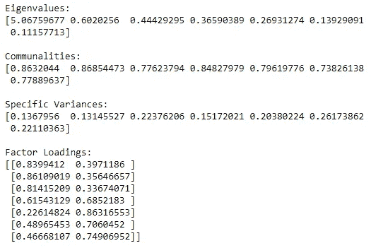

下面的代码块创建了 scree 图。

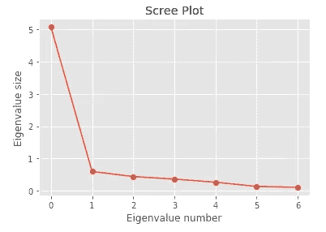

运行下面的代码块后，因子得分被存储在一个 CSV 文件([track _ records _ 81 _ var . CSV](https://drive.google.com/file/d/1BD2tm8y7BxOwfsWoRwj3haBjv2CKevtd/view?usp=sharing))和一个 excel 文件([track _ records _ 81 _ var . xlsx](https://drive.google.com/file/d/1jdMY_GUOn5bD69ZC5qkZvShbfzGgjf7L/view?usp=sharing))中，这两个文件将被保存在当前工作目录中。新的(缩减的)数据的维度是 55 x 2。这是因为我们决定只保留两个因素，这两个因素共同解释了原始数据中约 81%的可变性。

下图显示了新数据集的前 5 次观测。 **RF1** 代表**旋转因子 1** 和 **RF2** 代表**旋转因子 2** 。数据集的形状是 55 x 2。

精简数据集的前 5 个观察值

我们可以使用新的(精简的)数据集进行进一步分析。

# 摘要

因子分析不仅仅是为了降维，而是寻找潜在变量。这里，我们使用了两种不同的编程语言来执行 FA。尽管两种语言都提供了高级的内置函数，但 r 的输出格式良好。我们已经获得了完全相同的结果，但是采用了两种不同的方法。首先，我们通过在 **principal()** 函数中设置 **covar = FALSE** 来使用**相关矩阵**。作为我们的第二种方法，我们通过在 **FactorAnalyzer()** 函数中设置 **is_corr_matrix = False** ，将**协方差矩阵**用于缩放数据。

选择最佳数量的因素是主观的。这取决于数据及其领域。有时，我们不能仅通过查看 scree 图来决定最佳的因素数量。 ***凯泽的*** 法则也不是硬性规定。灵活性总是有的。总的来说，我们应该经常在因素数量和由所选因素共同解释的可变性数量之间保持良好的平衡(权衡)。

感谢阅读！

本教程由[*Rukshan Pramoditha*](https://www.linkedin.com/in/rukshan-manorathna-700a3916b/)*，[数据科学 365 博客](https://medium.com/data-science-365)作者*设计创作。

在[https://rukshanpramoditha.medium.com](https://rukshanpramoditha.medium.com/)阅读我的其他文章

## 本教程中使用的技术

*   Python & R (高级编程语言)
*   **熊猫** (Python 数据分析与操纵库)
*   **matplotlib** (Python 数据可视化库)
*   **Scikit-learn** (Python 机器学习库)
*   **Jupyter 笔记本& RStudio** (集成开发环境)

## 本教程中使用的机器学习

*   **主成分分析**
*   **因子分析**

## 本教程中使用的统计概念

*   **相关矩阵**
*   **方差-协方差矩阵**

## 本教程中使用的数学概念

*   **特征值**

2021–02–05